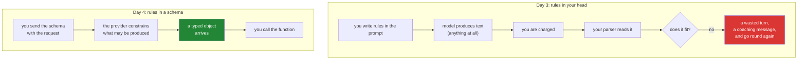

# 1.1 — The form that rejects itself: what a schema is, and who does the rejecting

## One-line answer

A schema is a machine-readable description of what a valid input looks like, and its entire value is
that **somebody other than you** enforces it — which turns yesterday's format miss from a parse
problem you discover after paying into a rejection that happens before the reply is ever produced.

---

## The story

A passport office used to hand out blank forms. People filled them in with a pen, posted them, and
waited. A clerk opened each envelope, read it, and put roughly one in six on a separate pile: a
missing date, a date in the wrong century, a phone number in the box meant for a postcode, a
signature outside the box. Each of those became a letter, a wait of several weeks, and a second
envelope.

Then the office put the form online. Not a picture of the form — a form that *checks*. Type letters
into the date box and it will not accept them. Leave the phone number blank and the Submit button
stays grey. Put a date in the future where a birth date belongs and it says so, immediately, next to
the box, while you are still sitting there.

The clerk's pile did not shrink. **It disappeared**, because the entire class of problem stopped
being something a clerk could receive.

What changed is worth being precise about. The rules did not change — the same date had to be a real
date before and after. The office did not get stricter. What changed is *where* the rules live: they
moved out of the clerk's head and into the form itself, so they are applied at the moment of writing
rather than at the moment of reading.

---

## The idea in plain language

Yesterday you built a protocol out of a paragraph of instructions and a `startswith`
([Day 3, 3.1](../../../day-03-loop-hand-rolled/parts/03-the-protocol/3.1-a-contract-enforced-by-politeness.md)).
The rules were real, and every one of them lived in your head and in your parser. When the model
wrote `**ACTION:** lookup_ticket 4521`, nothing stopped it — you found out afterwards, having already
paid for the call.

A **schema** is those rules written down in a form a machine can read. Not prose about what a valid
reply looks like; a data structure that *is* the definition. And once the rules are a data structure,
you can hand them to somebody else and ask them to enforce it.

That "somebody else" is the whole point, and it is worth being blunt about who it is: **the model
provider**. You send the schema along with your question. Their infrastructure constrains what the
model is allowed to produce. What comes back to you is either something that fits the schema or an
error — never a plausible-looking string you have to interrogate.

Three consequences, and each one deletes a row from
[Day 3's inventory of leaks](../../../day-03-loop-hand-rolled/parts/07-the-text-protocol-ceiling/7.1-what-a-schema-would-have-caught.md):

- **Validation moves upstream.** The check happens before the reply reaches you, on their side of the
  wire, which is the only place it can happen *before* you are charged for an unusable answer.
- **The result arrives typed.** Not a line of text you slice apart — an object with a name and a
  dictionary of arguments, with an integer already an integer. Your parser stops existing.
- **The rules become inspectable.** A schema can be printed, diffed, versioned, tested and reviewed.
  A paragraph of instructions can only be read and argued about.

The format Sutra uses is called **JSON Schema** — a widely-used standard for describing the shape of
JSON data, which is itself just a way of writing nested lists and dictionaries as text. You do not
have to learn all of it. You need about six keywords, and [1.2](1.2-declaring-a-tool.md) uses every
one of them.

One thing to be clear about now, because it prevents a disappointment later: a schema constrains
**shape**, not **truth**. It can guarantee that `ticket_id` is a string and that it was provided. It
cannot guarantee it is a ticket that exists, or the one the user meant, or one this user is allowed
to read. Those are [4.1](../04-the-limits/4.1-validated-is-not-correct.md) and
[5.2](../05-containment/5.2-the-argument-a-schema-cannot-check.md), and forgetting the distinction is
the most common way a team over-trusts function calling.

---

## Why Sutra needs it

- **Today**, everything after this part is a schema in some form: the tool declaration
  ([1.2](1.2-declaring-a-tool.md)), the parsed call that comes back
  ([2.2](../02-the-round-trip/2.2-the-call-comes-back-parsed.md)), and the result turn
  ([2.3](../02-the-round-trip/2.3-the-tool-result-turn.md)).
- **Day 10 (ADK-10, ADK-11)** generates the declaration from your Python function's own signature and
  docstring. That only reads as a convenience if you have written one by hand first.
- **Day 12 (ADK-13)** puts a schema on the way *out* — the model's final answer as structured data
  rather than prose. Same mechanism, other direction.
- **Day 32 onward (MCP)** is a whole protocol built on schemas: every MCP tool publishes one, and a
  server you have never seen becomes callable because of it. Schemas are what make tools portable
  between systems.
- **Day 15 (ADK-17)** wraps an OpenAPI specification — a large schema describing a whole HTTP API —
  and turns it into tools. Same idea at a different scale.

---

## The mechanism

Start with the thing you already have. Here is yesterday's contract, written as prose, which is the
only form it could take:

```text
Available tools:
  lookup_ticket <ticket_id>     the raw text of one ticket
  search_kb <query words>       the first knowledge-base article that matches

Rules:
- Exactly one ACTION per reply. Never two.
```

Every rule in there is enforced by hope. Now the same idea as data:

```json
{
  "type": "function",
  "name": "lookup_ticket",
  "description": "Fetch the full text of one support ticket by its id.",
  "parameters": {
    "type": "object",
    "properties": {
      "ticket_id": {
        "type": "string",
        "description": "The ticket's numeric id, e.g. '4521'."
      }
    },
    "required": ["ticket_id"]
  }
}
```

Read it as six claims, each of which a machine can check:

| Keyword | The claim it makes | What it prevents |
| --- | --- | --- |
| `"type": "function"` | this object describes a callable thing | the provider knowing what to do with it at all |
| `"name"` | the callable is named `lookup_ticket` | an invented tool name — the model can only choose from names you declared |
| `"description"` | here is when to use it | the model picking the wrong tool, or none |
| `"parameters"` | the arguments form an object with named fields | Day 3's single positional blob |
| `"properties"` | `ticket_id` is one of those fields, and it is a string | a number arriving where a string was expected |
| `"required"` | `ticket_id` must be present | a call with the argument missing |

**The important reading of that table is the right-hand column.** Every row is a bug you had
yesterday, and none of them is prevented by your code being better. They are prevented by the rules
being somewhere a machine reads them.

Now compare where the two enforcement mechanisms sit:



The left column has a loop in it. The right column does not. That is what "validation moved upstream"
means, in one picture.

And one small thing you can do right now, before any of today's code exists, to see that a schema is
ordinary data rather than magic:

```bash
uv run python -c "
import json
d = {'type': 'function', 'name': 'lookup_ticket',
     'description': 'Fetch the full text of one support ticket by its id.',
     'parameters': {'type': 'object',
                    'properties': {'ticket_id': {'type': 'string'}},
                    'required': ['ticket_id']}}
print(json.dumps(d, indent=2)); print(type(d), 'with', len(d), 'keys')
"
```

**Line by line:**

- `import json` — the standard library, no dependency. A schema is JSON-shaped, and JSON is a way of
  writing dicts and lists as text. Nothing about this is a framework.
- `d = {...}` — **a plain Python dictionary.** This is the entire representation. When
  [1.2](1.2-declaring-a-tool.md) puts one of these in `sutra/tools.py`, it is a module-level dict
  exactly like `TOOLS` was yesterday, and it can be printed, diffed and asserted on for free.
- `json.dumps(d, indent=2)` — prints it the way documentation shows it, which is the same thing in a
  different arrangement of whitespace. Worth doing once so the two forms stop looking like different
  species.
- `print(type(d), 'with', len(d), 'keys')` — `<class 'dict'> with 4 keys`. **Zero model calls, zero
  tokens.** The schema is data on your machine until the moment you send it, which means every check
  you write about it is free.

---

## When it breaks

**The schema that is not valid JSON Schema**, which the provider rejects before the model runs:

```text
google.genai.errors.ClientError: 400 INVALID_ARGUMENT. {'error': {'code': 400,
'message': 'Invalid JSON payload received. Unknown name "type" at
\'tools[0].parameters.properties[0].value\': Proto field is not repeating,
cannot start list.', 'status': 'INVALID_ARGUMENT'}}
```

**What it means.** Something in the nested structure is the wrong kind of thing — a list where an
object belongs, usually because `properties` was written as a list of fields instead of a dict keyed
by field name. Read the path in the message from left to right: `tools[0]`, then `parameters`, then
`properties`, then a value inside it. **The path is the debugging tool**, and it is far more useful
than the sentence after it.

Two things worth noticing about this error. It arrives **immediately**, before any tokens are
generated — so a malformed schema is a cheap failure, unlike a malformed reply. And it names your own
data structure rather than the model's behaviour, which means it is fixable by looking at code
instead of by guessing at a prompt.

**The schema that is valid and describes the wrong thing**, which nothing rejects:

```json
{
  "type": "function",
  "name": "lookup_ticket",
  "description": "Look up a ticket.",
  "parameters": {
    "type": "object",
    "properties": {"ticket_id": {"type": "integer"}},
    "required": ["ticket_id"]
  }
}
```

**What it means.** Perfectly valid JSON Schema, accepted by everyone, and it says `ticket_id` is an
**integer** while your `TICKETS` dict is keyed by strings
([Day 3, 2.1](../../../day-03-loop-hand-rolled/parts/02-tools-and-dispatch/2.1-tools-are-plain-functions.md)
chose string keys deliberately, because the model can only speak strings). The model will now
faithfully send `4521` as a number, your `TICKETS.get(4521)` will miss, and every lookup will report
that no such ticket exists. **A schema is a promise about shape that your code must also keep** —
validation on their side does not check that your side agrees.

This is the failure mode people do not expect from schemas and it is the one that costs the most: the
system is behaving exactly as specified, and the specification is wrong. Day 10's generated
declarations exist largely to close this gap, because a declaration derived from the function's own
signature cannot disagree with it.

---

## In production

**What a professional treats a schema as is an interface, with all that implies.** It gets a version,
it lives next to the code it describes, it is covered by tests, and changing it is a breaking change
for every consumer — which on Day 32 will include MCP clients you have never met. The habit to build
today is to think of the declaration as *published* rather than as configuration: renaming a
parameter is not a tidy-up, it is an API change, and the fact that the only consumer right now is a
language model does not make it less true.

**What degrades at scale is the number of them.** Two tools is a file you can read. Forty tools
across six services is a registry, and the questions become operational: which schemas is this agent
currently sending, are any two of them ambiguously described, how many tokens do they cost on every
call, and what happens when one changes under a running deployment. The last is the sharp one —
schemas are sent with **every** request
([Day 3, 5.2](../../../day-03-loop-hand-rolled/parts/05-containment/5.2-the-transcript-is-a-bill.md):
everything you send, you send repeatedly), so a tool registry is a recurring cost as well as a
capability list, and pruning it is a real optimisation rather than tidiness.

**The failure that only appears with real traffic is schema drift between the declaration and the
function.** Someone adds a parameter to the Python function with a sensible default and does not
touch the declaration. Nothing breaks; the model simply never uses the new capability, because it
cannot see it. Or worse, someone tightens the function's expectations — a field that used to accept
anything now requires a specific format — and the declaration still advertises the loose version, so
the model keeps sending inputs that are valid by the schema and rejected by the code. Both are
silent, both are found by a user, and both are why every mature system generates the schema from the
implementation rather than maintaining the two by hand.

**The review comment a senior engineer leaves:** *"This declaration is hand-maintained next to a
function it can disagree with. Generate it from the signature, or add a test that constructs the
schema from the function and asserts it matches the literal — otherwise the first person to add a
parameter will create a capability the model cannot see, and nothing will fail."*

**The interview question:** *"what does giving the model a JSON Schema actually buy you over asking
for a format in the prompt?"* The answer that shows you have shipped both: "The enforcement moves to
the provider, which changes the economics rather than just the ergonomics — a malformed request is
rejected before generation instead of discovered after I have paid for a reply I cannot parse, so my
failure mode stops being a paid retry loop. I also get a typed object instead of a string, so the
parser disappears along with every near-miss it would have had to tolerate. What I am careful about
is what it does *not* buy: it constrains shape, not meaning. The model can send me a perfectly valid
ticket id for a ticket that does not exist, or one belonging to a different customer, and the schema
is entirely happy about both. So validation of shape moves upstream and validation of authority stays
firmly on my side."

---

## Check yourself

```bash
uv run python -c "
import json, pathlib
d = json.loads(pathlib.Path('days/day-04-tools-by-hand/lab/first_schema.json').read_text())
print(sorted(d), '->', sorted(d['parameters']['properties']))
"
```

Write the `lookup_ticket` declaration above into
`days/day-04-tools-by-hand/lab/first_schema.json` by hand, then run this. It must print the four
top-level keys and the one property. If `json.loads` raises, you have a syntax error in a data
structure — which is exactly the class of problem the provider is about to start catching for you.

**Answer out loud, without scrolling up:**

> Say what changed between yesterday's prompt-enforced format and today's schema — not "it's
> stricter", but *who* enforces it and *when*. Then name one thing a schema can guarantee about
> `ticket_id` and two things it cannot.

---

**Next:** [1.2 — Declaring a tool](1.2-declaring-a-tool.md)
