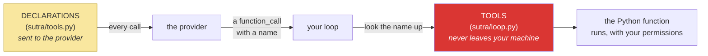

# 1.2 — Declaring a tool: the six keys that replace a paragraph

## One-line answer

A tool declaration is a plain Python dict with four top-level keys — `type`, `name`, `description`,
`parameters` — where `parameters` is JSON Schema describing named, typed, individually-required
arguments, and writing one by hand is what makes Day 10's generated version legible instead of
magical.

---

## The story

A busy kitchen used to get its orders on a pad, handwritten. *"Chicken, no onions, medium."* Most of
the time it worked. The arguments were always about the same few words: one person's *medium* was
another's *well done*, "no onions" sometimes meant no onion in the sauce either, and *chicken* on a
menu with three chicken dishes started a walk back to the floor.

The new pad is pre-printed. There is a box for the dish, and it has a printed list — you circle one
of six. There is a doneness row with exactly three ticks. There is a line for allergies, which is
free text, because allergies genuinely cannot be enumerated. And there is a rule at the bottom in
bold: *dish and doneness must be filled in; notes may be blank.*

The kitchen did not get pickier. The pad got **specific**, and the interesting part is which boxes
got a fixed list and which stayed free text. Doneness has three real answers, so a list is honest.
Allergies have an unbounded number of real answers, so a list would be a lie that loses information.
Somebody thought about each box separately, and that thinking is the whole design.

---

## The idea in plain language

A **tool declaration** is how you describe one of your Python functions to the model. It is a
dictionary. You will write two of them today, one per tool, and they are the entire replacement for
yesterday's hand-typed menu inside `SYSTEM`
([Day 3, 3.1](../../../day-03-loop-hand-rolled/parts/03-the-protocol/3.1-a-contract-enforced-by-politeness.md)).

Four keys at the top:

| Key | What it is | Who reads it |
| --- | --- | --- |
| `type` | always `"function"` for a tool you execute | the provider |
| `name` | the function's name as the model will say it | the provider, then your dispatch |
| `description` | one or two sentences on *when* to use it | **the model** |
| `parameters` | JSON Schema for the arguments | the provider, then the model |

And inside `parameters`, the handful of JSON Schema keywords you actually need:

| Keyword | Says | The kitchen pad |
| --- | --- | --- |
| `"type": "object"` | the arguments are a set of named fields | the pad has boxes |
| `properties` | here are the fields, by name | which boxes exist |
| `"type": "string"` / `"integer"` / `"boolean"` | what kind of value each box takes | numbers vs words |
| `description` (per field) | what to put in this box | the printed label |
| `enum` | this box has a fixed list of answers | circle one of six |
| `required` | these boxes must be filled | the bold rule at the bottom |

**The judgement call in every declaration is which boxes get an `enum`.** A fixed list is a promise
that you know all the answers, and it is enormously valuable when it is true: an `enum` is enforced,
so the model *cannot* invent a seventh option. It is a quiet disaster when it is false, because the
model will pick the closest listed value rather than tell you none of them fit, and you will never
find out. Doneness, yes. Allergies, no.

One thing that is *not* in a declaration and surprises people: **there is no code in it.** The
declaration describes the function; it does not contain, reference or import it. The connection
between the name `lookup_ticket` in the declaration and the Python function `lookup_ticket` is made
by **you**, in a dispatch table, exactly as it was yesterday
([Day 3, 2.2](../../../day-03-loop-hand-rolled/parts/02-tools-and-dispatch/2.2-the-dispatch-table-is-the-boundary.md)).
The declaration goes to the provider. The function stays on your machine. Nothing about that changes
today, and it is worth saying plainly because "function calling" is a name that makes people think the
model calls the function. It does not. It never has.

---

## Why Sutra needs it

- **Today**, [2.2](../02-the-round-trip/2.2-the-call-comes-back-parsed.md) receives a call shaped by
  exactly these declarations, and [3.2](../03-rebuilding-the-loop/3.2-the-loop-that-shrank.md)
  deletes the prompt paragraph they replace.
- **Day 10 (ADK-10, ADK-11)** builds this dict for you from the function's signature and docstring.
  Having typed one by hand is what turns that into "oh, it reads the annotations" instead of a black
  box you trust.
- **Day 11 (AG-06)** is tool design as a subject: naming, granularity, how many tools is too many.
  Every decision there is expressed in one of these dicts.
- **Day 32 onward (MCP)** publishes tool schemas over a protocol so a client that has never seen your
  code can call your tools. That is this dict, on the wire.

---

## The mechanism

Sutra's two tools, declared. New file, `sutra/tools.py`, so the declarations sit next to nothing else
and can be imported by both the loop and the tests:

```python
"""Tool declarations - what the model is told about Sutra's functions.

The functions themselves live in sutra.loop (Day 3). A declaration describes a
function to the provider; it never contains or imports one.

Verified against ai.google.dev/gemini-api/docs/function-calling on 2026-08-25.
"""

LOOKUP_TICKET = {
    "type": "function",
    "name": "lookup_ticket",
    "description": (
        "Fetch the full text of one support ticket by its id. Use this first "
        "whenever the user names or implies a specific ticket. Returns the "
        "ticket's title and body, or a message saying no such ticket exists."
    ),
    "parameters": {
        "type": "object",
        "properties": {
            "ticket_id": {
                "type": "string",
                "description": "The ticket's id as it appears in the request, e.g. '4521'.",
            }
        },
        "required": ["ticket_id"],
    },
}
```

**Line by line:**

- The module docstring names **the page checked and the date** (Principle 8). Re-fetch it on the day
  you write this; the note is evidence of a check, not a substitute for one.
- `LOOKUP_TICKET = {` — a **module-level constant in upper case**, matching `TOOLS` and `SYSTEM` from
  yesterday. It is configuration that a reviewer should be able to read without running anything.
- `"type": "function"` — the outer `type`, which says *this object describes a callable*. Do not
  confuse it with the `"type": "object"` further down, which is JSON Schema describing the arguments.
  Two different `type` keys at two different levels is the single most common source of confusion in
  this file, which is why they are called out here rather than left to be discovered.
- `"name": "lookup_ticket"` — **the string the model will send back**, and the key you will look up in
  your dispatch table. It is the same name as the Python function today, which is convenient and not
  required; they are separate namespaces, exactly as they were yesterday.
- `"description": (...)` — parenthesised implicit string concatenation across three lines, so it stays
  inside the line-length limit without a backslash. This text is **read by the model** and is the
  subject of [1.3](1.3-the-description-is-the-prompt.md); note already that it says *when* to use the
  tool ("whenever the user names or implies a specific ticket") and *what comes back*, including the
  miss case.
- `"...or a message saying no such ticket exists."` — **telling the model in advance what a miss looks
  like.** Yesterday the miss arrived as a surprise and the model sometimes invented around it
  ([Day 3, 4.3](../../../day-03-loop-hand-rolled/parts/04-running-the-loop/4.3-the-honest-failure.md)).
  A description that names the failure shape is the cheapest fabrication defence available.
- `"parameters": {"type": "object", ...}` — the argument set is **an object**, always, even for one
  argument. This is what makes arguments named rather than positional, which is the fix for
  [Day 3's leak 3](../../../day-03-loop-hand-rolled/parts/07-the-text-protocol-ceiling/7.1-what-a-schema-would-have-caught.md).
- `"properties": {"ticket_id": {...}}` — a **dict keyed by field name**, not a list of fields. Writing
  it as a list is the `400 INVALID_ARGUMENT` from [1.1](1.1-the-form-that-rejects-itself.md).
- `"type": "string"` — and it is `string` because `TICKETS` is keyed by strings
  ([Day 3, 2.1](../../../day-03-loop-hand-rolled/parts/02-tools-and-dispatch/2.1-tools-are-plain-functions.md)
  chose that deliberately). **The schema must agree with the code**, and nothing checks that for you
  today.
- `"description"` on the field — `"e.g. '4521'"` is doing real work. An example inside a field
  description is the most reliable way to communicate a format, far more so than describing it, and it
  costs four words.
- `"required": ["ticket_id"]` — a **list of names**, sitting beside `properties` rather than inside
  the field. That placement catches everyone once: requiredness is a property of the object, not of
  the field, because it is the object that is or is not complete.

The second tool, which is where the judgement call lives:

```python
SEARCH_KB = {
    "type": "function",
    "name": "search_kb",
    "description": (
        "Search the internal knowledge base for a known issue matching a symptom. "
        "Use this after reading a ticket, with the symptom words from the ticket "
        "body. Returns one article, or a message saying nothing matched."
    ),
    "parameters": {
        "type": "object",
        "properties": {
            "query": {
                "type": "string",
                "description": "Symptom words taken from the ticket, e.g. 'keeps getting logged out'.",
            }
        },
        "required": ["query"],
    },
}

DECLARATIONS = [LOOKUP_TICKET, SEARCH_KB]
```

**Line by line:**

- `"Use this after reading a ticket"` — **ordering guidance in the description.** There is no schema
  keyword for "call this one second"; sequencing can only be expressed in prose, which is a real limit
  worth knowing. It is also why [3.3](../03-rebuilding-the-loop/3.3-two-calls-in-one-turn.md) matters:
  with nothing enforcing order, the model may well call both at once.
- `"with the symptom words from the ticket body"` — steering the *content* of the argument, not just
  its type. Yesterday's naive substring matcher only finds an article if the query contains the right
  word, so telling the model where to get the words is the difference between a hit and a miss.
- `"query": {"type": "string"}` — and **no `enum`**, deliberately. A query is prose with an unbounded
  set of valid values, exactly like the allergies line on the kitchen pad. Adding
  `"enum": ["logout", "export"]` would technically work today and would be a lie: it would force every
  future symptom into one of two buckets, and the model would comply silently.
- `DECLARATIONS = [LOOKUP_TICKET, SEARCH_KB]` — **one list, in one place.** This is the exact
  counterpart of yesterday's `TOOLS` dict and it will be passed to every model call. Two lists that
  must agree is a drift bug waiting to happen, which is why
  [5.1](../05-containment/5.1-the-declaration-is-the-new-boundary.md) writes the test that ties them
  together.

The relationship between the three things that now exist, drawn once because people conflate them:



Yellow is what the model is *told*. Red is what can actually *happen*. They are two different objects
in two different files, and keeping them that way is what lets you change one without the other —
which is a feature on Day 11 and a hazard every day until you test that they agree.

---

## When it breaks

**`required` inside the field**, which is the placement mistake everyone makes once:

```text
google.genai.errors.ClientError: 400 INVALID_ARGUMENT. {'error': {'code': 400,
'message': 'Invalid JSON payload received. Unknown name "required" at
\'tools[0].parameters.properties[0].value\': Cannot find field.',
'status': 'INVALID_ARGUMENT'}}
```

**What it means.** `required` was written inside `{"ticket_id": {...}}` instead of beside
`properties`. Read the path again — `properties[0].value` is the field object, and `required` has no
meaning there. **The smallest fix is one level of outdenting**, and the way to remember which level is
the sentence from the mechanism: requiredness is a fact about whether the *object* is complete.

**The declaration that is never sent**, which fails in complete silence:

```text
--- step 1 ---
The model replied with plain text and no function call.
FINAL: I can help with that — could you give me the ticket number?
```

**What it means.** You wrote `DECLARATIONS` and did not pass it to the call. There is no error,
because a request with no tools is a completely valid request; the model simply has no tools and
answers conversationally, which looks like an unhelpful model rather than a missing parameter. **Check
the call before you check the prompt.** Tools are interaction-scoped and must be sent on *every*
request — [2.4](../02-the-round-trip/2.4-resend-the-steps-as-received.md) returns to this, because
the second call in a loop is where it is most often forgotten.

**The type that disagrees with your code:**

```text
FUNCTION CALL: lookup_ticket({'ticket_id': 4521})
OBSERVATION: No ticket with id 4521.
```

**What it means.** The declaration said `"type": "integer"`, so the model correctly sent the integer
`4521`, and `TICKETS.get(4521)` missed because the dict is keyed by `"4521"`. Note the observation:
the id prints **without quotes**, and that is your entire diagnostic — Day 3's `!r` formatting
([2.1](../../../day-03-loop-hand-rolled/parts/02-tools-and-dispatch/2.1-tools-are-plain-functions.md))
is what makes a type error visible instead of invisible. The smallest fix is one word in the schema;
the durable fix is generating the schema from the function, which is Day 10.

---

## In production

**What a professional writes instead of a literal is a generated declaration.** The dict above is
derived information — every field of it already exists in the Python function's name, signature,
annotations and docstring — and derived information that is maintained by hand is a drift bug with a
countdown on it. ADK's `FunctionTool` (Day 10) builds it from the function; MCP servers (Day 32)
publish it from the same source. The reason to write it by hand exactly once is that a generated
schema is completely opaque until you know what it is generating.

**What degrades at scale is the token cost of the catalogue.** Declarations are sent with every
request, so a forty-tool agent pays for forty descriptions on every step of every run, before the
conversation has started. Teams discover this when a modest tool registry turns out to be the largest
fixed cost in their prompt. The mitigations are real engineering decisions: keep descriptions tight,
split one agent's forty tools into several specialised agents with five each (Days 92–96), or select a
relevant subset per request — which is retrieval over tools, and is its own small system.

**The failure that only appears with real traffic is the `enum` that was true when you wrote it.** A
status field declared as `["open", "closed", "pending"]` is correct for a year. Then the product adds
`escalated`. The model now cannot express it — and, crucially, it does not report that it cannot; it
picks the nearest listed value, because that is what a constrained decoder does. Your data quietly
fills with tickets marked `pending` that are actually escalated, and there is no error anywhere. Any
`enum` over a business vocabulary needs to be generated from the same source the business uses, or it
needs to not be an `enum`.

**The review comment a senior engineer leaves:** *"The declaration says `ticket_id` is a string and
the store is keyed by strings — good, but nothing enforces that agreement. Add a test that calls each
declared tool with a minimal argument built from its own schema; it will catch the type drift the
first time somebody edits one side. And drop the `enum` on `status` unless it is generated from the
status table."*

**The interview question:** *"how do you decide what goes in a tool's parameter schema?"* The answer
that shows judgement: "I start from the function signature, because that is the thing that is actually
true, and I treat the declaration as a description of it rather than as an independent design. Then
two decisions matter. Types have to match the implementation exactly — a schema saying integer over a
store keyed by strings gives you a system that is valid on both sides and broken in the middle, with
no error. And `enum` is a promise that I know every legal value: I use it for genuinely closed sets
like a doneness or a priority level that comes from a table I control, and I avoid it for anything
that grows, because a constrained decoder will silently pick the nearest allowed value rather than
tell me the vocabulary is out of date. Long term I generate the declaration from the function so the
two cannot disagree."

---

## Check yourself

```bash
uv run python -c "
from sutra.tools import DECLARATIONS
from sutra.loop import TOOLS
declared = {d['name'] for d in DECLARATIONS}
print('declared:', sorted(declared)); print('dispatchable:', sorted(TOOLS))
print('agree:', declared == set(TOOLS))
"
```

`agree: True`. Two files, two lists, and nothing but this check keeping them in step — which is
exactly why [5.1](../05-containment/5.1-the-declaration-is-the-new-boundary.md) turns it into a test
rather than a command you remember to run.

**Answer out loud, without scrolling up:**

> Name the four top-level keys of a declaration and say which one the *model* reads. Then say why
> `required` sits beside `properties` rather than inside the field, and give one field where an
> `enum` would be a lie.

---

**Next:** [1.3 — The description is the prompt](1.3-the-description-is-the-prompt.md)
