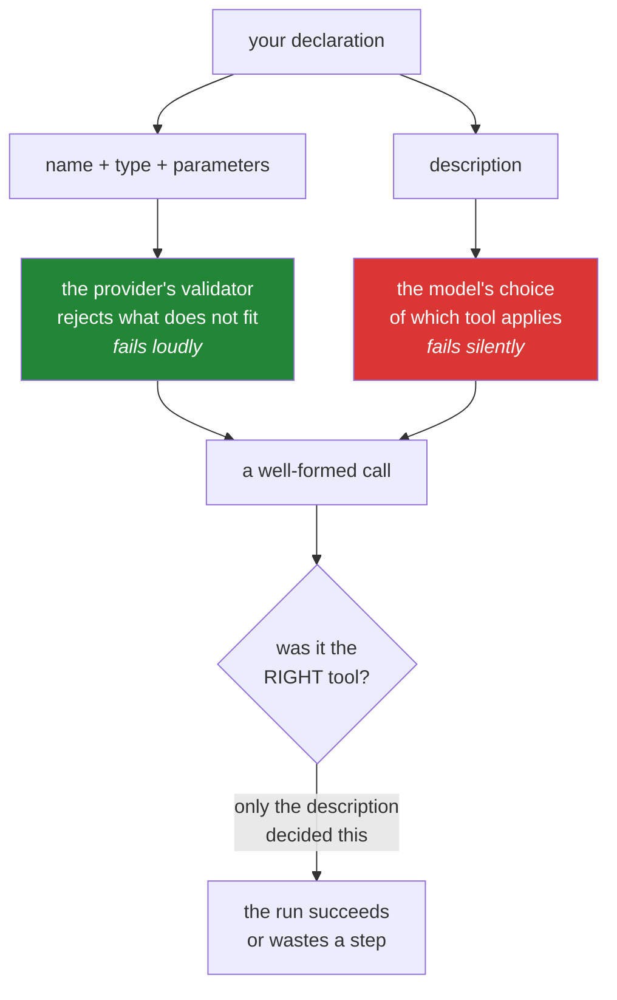

# 1.3 — The description is the prompt: the only field the model actually reads

## One-line answer

Of the whole declaration, the provider enforces `name`, `type` and `parameters` — but **`description`
is read by the model and by nothing else**, which makes it prompt engineering that happens to live in
a schema field, and the single highest-leverage sentence you will write today.

---

## The story

A workshop needs someone to repair vintage clocks and puts out an advert reading, in full:
*"Engineer wanted. Good pay. Apply within."*

Four hundred people apply. Software engineers, civil engineers, a man who services boilers, three
students, and one person who has restored clocks for twenty years and nearly did not bother because
the advert gave no reason to think it was for them. The workshop spends a fortnight reading
applications and hires on the fourteenth day, exhausted, having very nearly missed the only
qualified applicant in the pile.

The next year they need a second person. The advert reads: *"Restorer wanted for mechanical clock
movements — cleaning, pivoting, bushing. Bench work, no callouts. Not electronics; we do not repair
quartz."*

Eleven people apply. Nine of them can do the job.

Nothing about the pay changed, and nothing about the work changed. What changed is that the advert
started saying **what the job is, what comes with it, and what it is not** — and that last clause did
more filtering than the other two put together.

---

## The idea in plain language

Go back to the declaration from [1.2](1.2-declaring-a-tool.md) and split its four keys by **who
consumes them**:

| Key | Consumed by | If it is bad |
| --- | --- | --- |
| `type` | the provider's validator | your request is rejected, loudly |
| `name` | the validator, then your dispatch | the call cannot be routed, loudly |
| `parameters` | the validator, then the decoder | malformed arguments are rejected, loudly |
| **`description`** | **the model, and nothing else** | **the wrong tool is called, silently** |

Three of those fail loudly. One of them fails by producing a perfectly valid call to the wrong
function, which is not an error in any system you can instrument, and which will look to everyone
like the model being unreliable.

So the description is doing a specific job: it is the **only** information the model has when
deciding, from a list of tools it cannot see the code of, which one applies to the situation in front
of it. It is a prompt. It is subject to every rule of instruction writing you already know, and it
happens to live inside a data structure.

A description that works answers four questions, in this order:

- **What does it do?** One clause. *"Fetch the full text of one support ticket by its id."*
- **When should you reach for it?** The trigger condition, in the words of the situation rather than
  the words of the code. *"Use this first whenever the user names or implies a specific ticket."*
- **What comes back?** Including the shape of a miss, because a model that knows what a failure looks
  like is far less likely to invent around one
  ([Day 3, 4.3](../../../day-03-loop-hand-rolled/parts/04-running-the-loop/4.3-the-honest-failure.md)).
- **When should you *not*?** The clock advert's best line. This one matters most when two tools are
  close together, which is exactly when selection goes wrong.

And one rule about the whole thing: **it is re-sent on every call**, along with every other
declaration, forever
([Day 3, 5.2](../../../day-03-loop-hand-rolled/parts/05-containment/5.2-the-transcript-is-a-bill.md)).
So a description is a recurring cost. Two well-chosen sentences beat a paragraph, not because
brevity is a virtue, but because you are buying each sentence over and over.

---

## Why Sutra needs it

- **Today**, [4.2](../04-the-limits/4.2-the-tool-that-is-never-called.md) is an entire part about a
  tool the model never chooses, and the fix is almost always here rather than in the loop.
- **Day 10 (ADK-10, ADK-11)** takes this text from your function's **docstring**. That is the moment
  a docstring stops being documentation for humans and becomes runtime behaviour — and it is why
  Day 3's tools were written with unusually rich docstrings from the start.
- **Day 11 (AG-06)** is tool design: how many tools, how big, named how. Every one of those decisions
  is decided by whether the model can tell them apart, which is decided here.
- **Day 25 onward (Agent Skills)** scales the same idea up: a skill's front-matter description is what
  makes an agent load it or ignore it. Same mechanism, larger unit.
- **Day 49 (AG-33)** retrieves over documents. When you have too many tools to send, you retrieve over
  descriptions — so this text becomes an index entry as well as an instruction.

---

## The mechanism

Two descriptions for the same function. Both are valid; one of them works.

```python
# The clock advert, first version.
"description": "Searches the knowledge base."
```

**Line by line:**

- It answers *what* and nothing else. The model knows a knowledge base can be searched and has no idea
  **when** that is the right move, **what** comes back, or how a miss is reported.
- The predictable failures: the tool is called first, before the ticket has been read, with the user's
  raw question as the query — because nothing said otherwise. Or it is not called at all on a run
  where it should have been, because answering directly also seemed reasonable.
- Notice there is no way to *see* either failure from this line. It looks fine. Bad descriptions
  always do; that is what makes this the field worth spending time on.

Now the version Sutra ships:

```python
"description": (
    "Search the internal knowledge base for a known issue matching a symptom. "
    "Use this after reading a ticket, with the symptom words from the ticket "
    "body. Returns one article, or a message saying nothing matched. "
    "Do not use this to look up a ticket - use lookup_ticket for that."
),
```

**Line by line:**

- `"Search the internal knowledge base for a known issue matching a symptom."` — *what*, and note
  **"internal"** and **"known issue"**. Those two words tell the model this is a curated store of
  diagnosed problems, not a web search, which changes what it thinks a good query looks like.
- `"Use this after reading a ticket, with the symptom words from the ticket body."` — *when*, plus
  guidance on the **content** of the argument. Yesterday's matcher is a naive substring search
  ([Day 3, 2.1](../../../day-03-loop-hand-rolled/parts/02-tools-and-dispatch/2.1-tools-are-plain-functions.md)),
  so a query in the user's words often misses where a query in the ticket's words hits. That is a
  quirk of your implementation being communicated to the model, which is entirely legitimate — the
  model cannot read your code and this is the only channel you have.
- `"Returns one article, or a message saying nothing matched."` — *what comes back*, both outcomes.
  The miss is named in advance, so an empty result is a documented outcome rather than a surprise.
- `"Do not use this to look up a ticket - use lookup_ticket for that."` — **the clock advert's best
  line**, and the one people leave out. With two tools it looks like over-explaining. It stops being
  optional the moment two tools are adjacent in meaning — a `search_kb` and a `search_tickets` will be
  confused constantly unless each one says which is which.
- The parenthesised implicit concatenation keeps it inside the line-length limit without backslashes,
  and keeps each clause on its own line so a reviewer can see the four questions being answered.

The same discipline one level down, on the field description:

```python
"query": {
    "type": "string",
    "description": "Symptom words taken from the ticket, e.g. 'keeps getting logged out'.",
},
```

**Line by line:**

- `"Symptom words taken from the ticket"` — says where the value should come from, not just what it
  means. A field description is a second, narrower prompt and it is routinely left blank.
- `"e.g. 'keeps getting logged out'"` — **one example, and it is worth more than the sentence before
  it.** A model is a pattern-completer; showing the shape of a good argument is the most efficient
  instruction available. Four words of example beat two lines of description.
- What is deliberately *not* here: a list of allowed values. That would be an `enum`, and
  [1.2](1.2-declaring-a-tool.md) explained why a query field must not have one.

Where each part of the declaration is consumed, drawn once, because this is the picture that makes
the field's importance obvious:



And the check, which costs nothing and is the beginning of an eval:

```bash
uv run python -c "
from sutra.tools import DECLARATIONS
for d in DECLARATIONS:
    words = len(d['description'].split())
    print(f\"{d['name']:>14}  {words:>3} words  {'not-clause: ' + ('yes' if 'not' in d['description'].lower() else 'NO')}\")
"
```

**Line by line:**

- `len(d['description'].split())` — a word count, because this text is **re-sent on every call** and
  the number is a recurring cost you should be able to state. Somewhere between twenty and fifty words
  is where useful descriptions usually land; a five-word one is the clock advert and a two-hundred-word
  one is a paragraph you are buying repeatedly.
- `'not' in d['description'].lower()` — a crude check for a *when not to use this* clause. It is
  genuinely crude and will match the word "not" anywhere. It is here because a crude reminder that
  catches the omission nine times out of ten beats an elegant check nobody writes.
- **Zero model calls.** Every property of a description you can check mechanically is free; the one
  that matters — does the model pick the right tool? — costs a call and is
  [4.2](../04-the-limits/4.2-the-tool-that-is-never-called.md).

---

## When it breaks

**The wrong tool, called correctly**, which is this field's signature failure:

```text
--- step 1 ---
FUNCTION CALL: search_kb({'query': 'ticket 4521 status'})
OBSERVATION: No KB article matched 'ticket 4521 status'.

--- step 2 ---
FUNCTION CALL: lookup_ticket({'ticket_id': '4521'})
OBSERVATION: Title: Keeps getting logged out. Body: I keep getting logged out...
```

**What it means.** The model searched the knowledge base for a ticket. The call was perfectly
well-formed — the right shape, the right types, a valid tool name — and it was the wrong tool, so the
run costs an extra step and an extra call. **No part of this is an error**, and no metric except step
count will ever show it.

The smallest fix is the sentence that was missing: *"Do not use this to look up a ticket — use
`lookup_ticket` for that."* The general fix is to write every description with its **neighbours in
mind**, because tool selection is a comparison, not an evaluation: the model is not asking "does this
tool fit?", it is asking "which of these fits best?".

**The tool that is never chosen at all:**

```text
--- step 2 ---
The model replied with plain text and no function call.
FINAL: Based on the ticket, this looks like a session-cookie problem. I'd suggest
asking the user to clear their cookies and confirm they are on https.
```

**What it means.** The knowledge base was never searched, so the answer is ungrounded — Day 3's
[4.2](../../../day-03-loop-hand-rolled/parts/04-running-the-loop/4.2-the-first-real-run.md) called
this the plausible-sounding failure, and the citation test catches it. When it happens with function
calling available, the cause is almost always that the description did not establish a **trigger**:
it said what the tool does and never said when to reach for it, so answering directly looked equally
valid. Add the *when* clause first, before reaching for `tool_choice`
([4.2](../04-the-limits/4.2-the-tool-that-is-never-called.md)) — forcing a call is a heavier
instrument and it makes every run call a tool whether or not it should.

**The description that describes your code instead of the situation:**

```python
"description": "Performs a case-insensitive substring match over the KB dict and returns the first hit.",
```

**Line by line:**

- Every word is true and none of it helps. The model does not have a KB dict, does not know what
  "the first hit" is relative to, and cannot use "case-insensitive" to decide anything — it was
  already going to send prose.
- What is missing is the entire *when*: nothing here tells the model this is for symptoms, that it
  belongs after reading a ticket, or that a miss is possible. **A description is written for the
  caller's decision, not for the implementer's satisfaction.**
- The one implementation detail that *does* belong is the one that changes the caller's behaviour —
  "with the symptom words from the ticket body" is a leak of your matcher's naivety, and it earns its
  place because it changes what the model sends.

---

## In production

**What a professional does is treat the description as tested behaviour rather than as a comment.**
Tool-selection accuracy is measurable: a fixed set of scenarios, each with the tool that should be
called first, run against the agent, scored. That suite is what lets you change a description on
purpose — otherwise every edit to this field is an untested change to runtime behaviour that nobody
will notice until an escalation. Sutra builds the harness on Days 79–83; the habit of writing down
"scenario → expected first tool" can start the day you have two tools, which is today.

**What degrades at scale is discriminability.** Two tools are easy to tell apart. Twenty tools in one
agent contain several near-neighbours by construction — `search_tickets` and `search_kb`,
`get_user` and `get_account`, `update_status` and `escalate` — and selection accuracy falls fastest
exactly where the consequences are worst. The three real mitigations are to write mutually exclusive
descriptions that name each other, to reduce the number of tools any single agent sees (which is the
strongest argument for the multi-agent split on Days 92–96), and to measure per-tool selection
accuracy so you know *which* pair is being confused rather than that "the agent is unreliable".

**The failure that only appears with real traffic is the description that was written against one
model.** Descriptions are prompts, and prompts are tuned — implicitly — to whatever model you were
testing with. Change model for price, quota or availability, and selection behaviour shifts: a
description that was sufficiently directive for one is ambiguous for another, and the failure is a few
percent of runs choosing a neighbouring tool. It never errors. This is the concrete reason Day 9's
four-provider comparison scores tool selection and not just answer quality, and why a provider switch
should re-run the selection suite the way a deployment re-runs tests.

**The review comment a senior engineer leaves:** *"Both descriptions say what the tool does and
neither says when to use it or when not to. With two tools we'll get away with it; the moment we add
a third search-shaped tool, selection will start drifting and it'll look like model flakiness. Add
the trigger condition and a 'not this, use X' clause to each, and put three scenarios in the eval that
assert which tool is called first."*

**The interview question:** *"the model keeps calling the wrong tool. What do you change?"* The answer
that shows you have debugged it: "The description, first and almost always — it is the only thing the
model uses to choose, and the common defect is that it says what the tool does and never says when to
reach for it or what to prefer instead. I write descriptions as a set rather than individually,
because selection is a comparison between neighbours, so each one names the tool it is most likely to
be confused with. After that I look at whether I have too many tools in one agent, because
discriminability falls off faster than people expect and splitting the agent fixes what better prose
cannot. Forcing a call with a tool-choice setting is the last thing I reach for, not the first, since
it converts a selection problem into a mandatory-call problem. And I would not make any of these
changes without a small suite of scenario-to-expected-tool assertions, because otherwise I am tuning
runtime behaviour with no way to tell whether I improved it."

---

## Check yourself

```bash
uv run python -c "
from sutra.tools import DECLARATIONS
for d in DECLARATIONS:
    print('---', d['name']); print(d['description'])
"
```

Read each one aloud and ask the four questions: *what, when, what comes back, when not.* Any
description missing two of them is the clock advert, and you now know what that costs.

**Answer out loud, without scrolling up:**

> Of the four keys in a declaration, say which one the model reads and why its failure mode is worse
> than the other three. Then name the clause most people leave out, and say when it stops being
> optional.

---

**Next:** [2.1 — Two channels, not one](../02-the-round-trip/2.1-two-channels-not-one.md)
