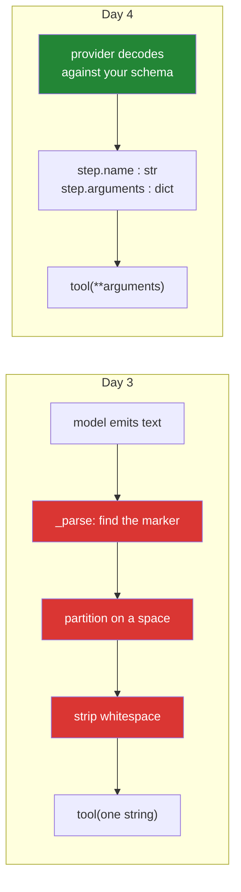

# 2.2 — The call comes back parsed: deleting the parser you wrote yesterday

## One-line answer

A `function_call` step arrives with `name` as a string and `arguments` as a **dictionary that is
already a dictionary** — so yesterday's parser is deleted, dispatch becomes one `**` unpacking, and
the schema's property names become load-bearing because they are now Python keyword arguments.

---

## The story

Before the shipping container, unloading a ship was a craft. Sacks of coffee, barrels, crates of
different sizes, machinery in crates that were not really crates — all of it stacked in the hold by
people who knew how to stack it, and taken out by people who had to work out what each thing was and
how to lift it. A ship could sit in port for a week. Every port needed its own gangs who knew the
local way of doing it.

The container did nothing clever. It is a steel box. It is not stronger than the cargo, it does not
protect it better, and it wastes space around anything that is not box-shaped.

What it did was make everything **the same shape at the outside**. A crane can lift one without
knowing what is in it. A lorry can take one without anybody opening it. The gains that followed — port
times falling from a week to hours, and the entire pattern of global trade rearranging around it — did
not come from a better way of handling cargo. They came from **nobody having to interpret the cargo
any more.**

---

## The idea in plain language

Yesterday your loop received this:

```text
THOUGHT: I need the ticket contents.
ACTION: lookup_ticket 4521
```

and had to work out, from that string, that there was a command in it, that the command was called
`lookup_ticket`, and that its argument was `4521`. That work was
[Day 3's `_parse`](../../../day-03-loop-hand-rolled/parts/03-the-protocol/3.2-parsing-a-reply-you-did-not-write.md)
and [Day 3's `partition(" ")`](../../../day-03-loop-hand-rolled/parts/02-tools-and-dispatch/2.2-the-dispatch-table-is-the-boundary.md),
and every near-miss in that file — the bolded marker, the colon inside an argument, the fence — was a
consequence of having to interpret cargo.

Today you receive an object with four attributes:

| Attribute | Type | What it holds |
| --- | --- | --- |
| `step.type` | `str` | `"function_call"` — this step is a command |
| `step.name` | `str` | `"lookup_ticket"` — which one |
| `step.arguments` | **`dict`** | `{"ticket_id": "4521"}` — already a dictionary |
| `step.id` | `str` | a handle for this specific call, used in [2.3](2.3-the-tool-result-turn.md) |

The row that changes your code most is `arguments`. It is not a JSON string you have to load; it is a
Python dict with the right types in it, because the provider decoded the model's output against the
schema you sent. `{"type": "integer"}` in the declaration means an `int` here, not the characters
`4`, `5`, `2`, `1`.

Which produces one consequence worth stating on its own line, because it is the thing people trip on:
**the keys of `properties` in your declaration are now Python keyword argument names.** Dispatch is
`tool(**step.arguments)`, so the schema and the function signature have to agree letter for letter. A
declaration saying `ticketId` and a function taking `ticket_id` is a `TypeError`, not a mismatch you
can shrug off.

And one thing that does **not** change: the dispatch table. `step.name` is a string, you look it up in
a dict you wrote, and only names in that dict can run
([Day 3, 2.2](../../../day-03-loop-hand-rolled/parts/02-tools-and-dispatch/2.2-the-dispatch-table-is-the-boundary.md)).
The provider constrains the model to names you declared, which is a real improvement — but you keep
your own check anyway, because `DECLARATIONS` and `TOOLS` are two different objects in two different
files and nothing but a test keeps them in step
([5.1](../05-containment/5.1-the-declaration-is-the-new-boundary.md)).

---

## Why Sutra needs it

- **Today**, [3.2](../03-rebuilding-the-loop/3.2-the-loop-that-shrank.md) deletes `_parse` and the
  format block from `SYSTEM` because of this part, and [2.3](2.3-the-tool-result-turn.md) uses
  `step.id` to send the answer back.
- **Day 10 (ADK-10, ADK-11)** does the unpacking for you: `FunctionTool` receives the arguments and
  calls your Python function. Knowing it is a `**` on a dict is the difference between using that and
  trusting it.
- **Day 11 (AG-06)** designs tool signatures. The fact that parameter names are part of the model-facing
  contract — not an implementation detail — is a constraint that starts today.
- **Day 32 onward (MCP)** carries arguments as a JSON object over the wire and unpacks them the same
  way on the server side. Same shape, different transport.

---

## The mechanism

First, look at one. Take the interaction from [2.1](2.1-two-channels-not-one.md) and read the step
properly instead of printing its type:

```python
fc = next(s for s in interaction.steps if s.type == "function_call")

print("name      :", fc.name)
print("arguments :", fc.arguments, type(fc.arguments))
print("id        :", fc.id)
```

**Line by line:**

- `next(s for s in interaction.steps if s.type == "function_call")` — **filter by type, take the
  first.** A generator expression inside `next` rather than a list comprehension: it stops at the
  first match instead of building a list of all of them. It raises `StopIteration` if there is no
  function call, which is a real case ([3.2](../03-rebuilding-the-loop/3.2-the-loop-that-shrank.md)
  handles it with a default) and is deliberately left raw here so you see it.
- **Not `interaction.steps[0]`.** The first step is not guaranteed to be the call — a thinking model
  may emit a `thought` step first — and position-based reading is the habit that breaks silently the
  day a model's step order changes.
- `print("arguments :", fc.arguments, type(fc.arguments))` — printing the **type** alongside the
  value, because that is the whole point of this part. You are looking for `<class 'dict'>`, not
  `<class 'str'>`.
- `fc.id` — printed now, used in [2.3](2.3-the-tool-result-turn.md). Note it exists before you need
  it, so that when the next part says "echo the id back", it is not a new concept.
- Verified against `ai.google.dev/gemini-api/docs/function-calling` on 2026-08-25:
  `step.type`, `step.name`, `step.arguments`, `step.id`. **Re-read your own object** rather than
  trusting the list — Day 2's rule, and it costs one call you have already made.

What prints:

```text
name      : lookup_ticket
arguments : {'ticket_id': '4521'} <class 'dict'>
id        : fc_a1b2c3d4
```

That middle line is Day 4 in one line of output. There is no string to slice, no delimiter to choose,
no trailing space to strip, and no colon to worry about. **Every failure mode in Day 3's
[3.2](../../../day-03-loop-hand-rolled/parts/03-the-protocol/3.2-parsing-a-reply-you-did-not-write.md)
is gone**, not fixed — gone, because the work that produced them is not being done any more.

Now the dispatcher, rewritten. Compare it against yesterday's, which took a string:

```python
def _dispatch(call: object) -> str:
    """Execute one function_call step; errors the model can act on come back as text.

    Example:
        a step with name='lookup_ticket', arguments={'ticket_id': '4521'}
        -> "Title: Keeps getting logged out. ..."
    """
    tool = TOOLS.get(call.name)
    if tool is None:
        return f"Unknown tool {call.name!r}. Available: {', '.join(TOOLS)}."
    return tool(**call.arguments)
```

**Line by line:**

- `def _dispatch(call: object) -> str:` — takes **the step**, not a string. `object` as the annotation
  rather than a precise SDK type, because you have not verified the class name and
  **naming a type you have not checked is inventing an API** (Principle 8). The attributes are
  verified; the class is not.
- `tool = TOOLS.get(call.name)` — **unchanged from yesterday**, deliberately. The provider will only
  emit names you declared, so this check is now belt-and-braces — and it stays, because `TOOLS` and
  `DECLARATIONS` live in different files and can drift. Defence that costs one line and survives a
  refactor is worth keeping.
- `if tool is None: return f"Unknown tool ..."` — still a **return, not a raise**
  ([Day 3, 2.3](../../../day-03-loop-hand-rolled/parts/02-tools-and-dispatch/2.3-a-failed-tool-is-an-observation.md)).
  The two species of error are unchanged by today: a name your table does not know is something the
  model can act on, so it goes back as text.
- `return tool(**call.arguments)` — **the whole of today's dispatch, in one line.** The `**` unpacks
  `{"ticket_id": "4521"}` into `lookup_ticket(ticket_id="4521")`. Compare yesterday's
  `tool(argument.strip())`: one positional string, one argument only, forever. This line supports any
  number of named arguments of any declared type, and it did not get longer.
- **What is gone:** `action.partition(" ")`, `name.strip()`, `argument.strip()`. Three lines of string
  handling deleted, and with them the entire class of near-miss they existed to absorb.
- **What `**` demands in exchange:** the keys of `arguments` must be valid Python parameter names for
  this function. That is a new coupling between `sutra/tools.py` and `sutra/loop.py`, and it is
  checked by nothing until the call happens. See *When it breaks*.

Where the parsing work went:



Three red boxes became somebody else's problem. That is the container.

---

## When it breaks

**The name mismatch between schema and signature** — the new failure this part introduces, and the one
worth meeting on purpose:

```text
Traceback (most recent call last):
  File "sutra/agent.py", line 58, in _dispatch
    return tool(**call.arguments)
           ^^^^^^^^^^^^^^^^^^^^^^
TypeError: lookup_ticket() got an unexpected keyword argument 'ticketId'
```

**What it means.** The declaration says `"ticketId"` and the Python function takes `ticket_id`. The
model did exactly what it was told, the provider validated it against exactly the schema you sent, and
the two correct halves do not fit. **The smallest fix is one string in `sutra/tools.py`.**

Note which species of error this is
([Day 3, 2.3](../../../day-03-loop-hand-rolled/parts/02-tools-and-dispatch/2.3-a-failed-tool-is-an-observation.md)):
it is **yours**, so it raises and stops the run, which is correct. There is nothing the model could do
about it. And note that yesterday's protocol could not produce this error at all — a positional string
has no name to get wrong — so this is a cost of the new design, paid once, in exchange for named
arguments.

**The missing required argument**, which now fails on the *provider's* side rather than yours:

```text
google.genai.errors.ClientError: 400 INVALID_ARGUMENT. {'error': {'code': 400,
'message': 'Invalid value at \'tools[0].parameters\': required field
"ticket_id" is not present in properties', 'status': 'INVALID_ARGUMENT'}}
```

**What it means.** `required` names a field that `properties` does not define — a schema that
contradicts itself. It is rejected before the model runs, which is
[1.1](../01-the-schema/1.1-the-form-that-rejects-itself.md)'s promise arriving: a malformed contract
is now a cheap, immediate, pre-generation failure rather than an expensive one.

**No function call at all**, which is not an error and needs handling:

```text
Traceback (most recent call last):
  File "sutra/agent.py", line 44, in run_loop
    fc = next(s for s in interaction.steps if s.type == "function_call")
         ^^^^^^^^^^^^^^^^^^^^^^^^^^^^^^^^^^^^^^^^^^^^^^^^^^^^^^^^^^^^^^
StopIteration
```

**What it means.** The model answered in prose instead of calling a tool — which is exactly what it
should do on the turn where it has finished. `next(...)` with no default raises when the generator is
empty. **The fix is a default:** `next((s for s in ... ), None)`, and then `None` means *the model is
talking, not asking*. That is the branch that replaces yesterday's `FINAL:` check, and
[3.2](../03-rebuilding-the-loop/3.2-the-loop-that-shrank.md) writes it properly. Meeting the raw
`StopIteration` once is worth it, because it is a name that tells you nothing on its own.

**The argument that is the right type and the wrong value:**

```text
FUNCTION CALL: lookup_ticket({'ticket_id': 'the ticket the user mentioned'})
OBSERVATION: No ticket with id 'the ticket the user mentioned'.
```

**What it means.** A perfectly valid string. The schema is satisfied, the dispatch works, the tool
returns an honest miss, and the model failed to extract an id. **No layer of today's machinery
catches this**, which is [4.1](../04-the-limits/4.1-validated-is-not-correct.md)'s entire subject —
and the first defence is the field description's example
([1.3](../01-the-schema/1.3-the-description-is-the-prompt.md): `"e.g. '4521'"`), not a type.

---

## In production

**What a professional writes instead of `tool(**args)` is a validated call.** Unpacking arbitrary
keys from a remote source straight into a function signature is fine when both sides are yours and the
schema is generated from the function — which is Day 10 — and is a sharp edge when they are
hand-maintained, as today. The production shape is either generation (the schema cannot disagree with
the signature) or an explicit adapter per tool that names the arguments it passes. The habit worth
carrying: **`**` on data you did not construct is a coupling you should be able to point at a test
for.**

**What degrades at scale is nothing about this line, which is the interesting part.** Dispatch is one
dict lookup and one call, and it stays that way at any volume. What grows is everything around it:
per-call authorisation ([5.2](../05-containment/5.2-the-argument-a-schema-cannot-check.md)), timeouts,
retries, idempotency keys, a span per invocation, and a concurrency limit when
[3.3](../03-rebuilding-the-loop/3.3-two-calls-in-one-turn.md)'s parallel calls become real parallel
I/O. Every one of those wraps this single line, which is exactly why Day 3 insisted there be only one
of it.

**The failure that only appears with real traffic is the argument that is valid, typed, and enormous.**
Nothing in a JSON Schema `"type": "string"` bounds a string's length. A model that has been handed a
long document and asked to summarise it into a query will occasionally pass several thousand tokens as
an argument — which your tool then processes, and which then enters the transcript twice, once in the
call and once in the result
([Day 3, 5.2](../../../day-03-loop-hand-rolled/parts/05-containment/5.2-the-transcript-is-a-bill.md)).
JSON Schema has `maxLength`; almost nobody uses it; the teams that get bitten add it afterwards. Bound
your strings the way you would bound an upload.

**The review comment a senior engineer leaves:** *"`tool(**call.arguments)` couples the declaration's
property names to the function's parameter names with nothing checking it. Add a test that binds each
declaration's properties against its function's signature with `inspect.signature().bind()` — that
catches the rename at commit time instead of at runtime on a paid call. And put `maxLength` on the
free-text fields."*

**The interview question:** *"what actually changes in your code when you move from a text protocol to
function calling?"* The answer that shows you have done both: "The parser disappears, and everything
that lived in it disappears with it — the marker matching, the splitting, the whitespace tolerance,
and every near-miss those existed to absorb. What arrives is a step with a name and an arguments dict
that is already typed, so dispatch collapses to a table lookup and a keyword unpack. Two things I
watch. The unpack makes my schema's property names into Python parameter names, so a rename on either
side is now a runtime `TypeError` on a paid call — I test that binding, or better, generate the schema
from the signature. And I keep my own dispatch table check even though the provider constrains the
name, because the declaration list and the executable list are separate objects and only a test keeps
them honest."

---

## Check yourself

```bash
uv run python -c "
import inspect
from sutra.tools import DECLARATIONS
from sutra.loop import TOOLS
for d in DECLARATIONS:
    props = list(d['parameters']['properties'])
    sig = inspect.signature(TOOLS[d['name']])
    sig.bind(**dict.fromkeys(props, 'x'))
    print(d['name'], props, '-> binds cleanly')
"
```

**Zero model calls.** `sig.bind(...)` raises `TypeError` if the declared property names do not fit the
function's signature — the exact failure from *When it breaks*, caught for free, before anything is
sent. Make this a test today; it is one of the two in the hub's §5.

**Answer out loud, without scrolling up:**

> Name the four attributes of a `function_call` step and say which one deleted the most code. Then say
> what new coupling `tool(**call.arguments)` creates, what error it produces when it is wrong, and
> whose bug that is.

---

**Next:** [2.3 — The tool-result turn](2.3-the-tool-result-turn.md)
