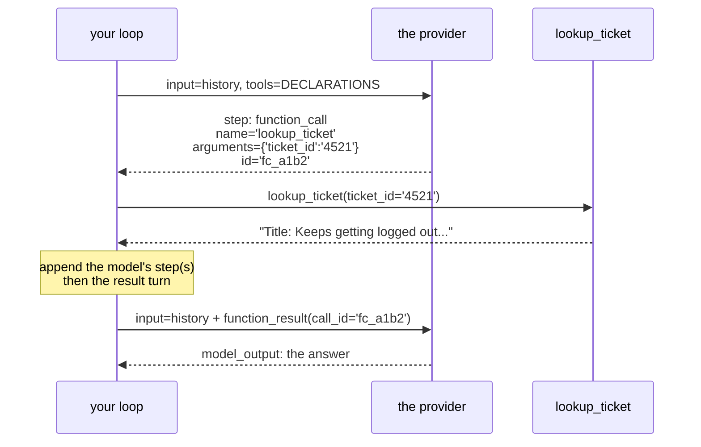

# 2.3 — The tool-result turn: and the id that says which question you answered

## One-line answer

A tool's result goes back as a `function_result` turn carrying the tool's name, the **`call_id` of
the call it answers**, and the output as a list of content blocks — and the id is the field people
skip, because with one tool in flight it looks redundant and with two it is the only thing that makes
the exchange unambiguous.

---

## The story

A café at half past eight in the morning. Six people waiting, four drinks on the counter, one
barista.

The old way was to call the drink. *"Flat white!"* Two people step forward. One of them is confident,
takes it, and leaves. The other waits, gets the next flat white, and never knows anything happened.
Most mornings this is fine — the drinks are identical, nobody is harmed, and the system appears to
work.

It appears to work right up until one of those flat whites was the decaf, or the oat milk, or the one
somebody asked for extra hot because they are walking to a station. Then a person who ordered
carefully gets a drink that is wrong in a way they may not notice for several streets, and there is no
possible way to trace it, because at no point did anything connect *this cup* to *that order*.

So the café gives out numbers. The number is not for the customer's benefit and it is not for the
drink's. It exists so that the pairing between a request and its answer is **stated** rather than
inferred from the two of them looking like they go together.

---

## The idea in plain language

You have run the tool. `_dispatch` handed you a string. Now that string has to get back to the model,
and yesterday you did it by making up a sentence:

```text
OBSERVATION: Title: Keeps getting logged out. Body: I keep getting...
```

sent as an ordinary `user_input` turn, because that was the only kind of turn there was
([Day 3, 1.2](../../../day-03-loop-hand-rolled/parts/01-loop-anatomy/1.2-the-transcript-is-the-world.md)).
The word `OBSERVATION` was a convention you invented, and the link between that result and the request
that caused it was **adjacency**: it came next, so it must be the answer.

Today there is a turn type for exactly this, with four fields:

| Field | What goes in it | Why it exists |
| --- | --- | --- |
| `"type": "function_result"` | the literal string | this turn is a tool's output, not a user speaking |
| `"name"` | the tool that ran | readable, and it lets a reader check the pairing |
| `"call_id"` | **the `id` of the `function_call` you are answering** | the café's number |
| `"result"` | a list of content blocks | the output itself, in the same nested shape as a user turn's `content` |

`call_id` is the one to slow down on. With a single tool call per turn it looks like ceremony — there
is only one outstanding question, so what could the answer possibly be attached to? The reason it is
not ceremony is [3.3](../03-rebuilding-the-loop/3.3-two-calls-in-one-turn.md): a model can ask for
two tools in one turn, and then there are two flat whites on the counter. Adjacency stops being an
answer, and the id is the only thing that says which result belongs to which call.

The `result` field is a **list**, and the list holds typed content blocks —
`[{"type": "text", "text": "..."}]` — which is the same nesting you have used for user turns since
Day 2. It is a list because a tool result is not always one string: an image, several blocks, or
structured data can come back through the same door. Today Sutra's tools return one string, so the
list has one element, and the shape is worth understanding rather than copying.

One thing that does **not** change today, and it is the day's most important continuity: **a tool
failure is still a result, not an exception**
([Day 3, 2.3](../../../day-03-loop-hand-rolled/parts/02-tools-and-dispatch/2.3-a-failed-tool-is-an-observation.md)).
`No ticket with id '9999'.` goes back as an ordinary `function_result`. There is no error field, no
special failure turn, and there should not be — the model has to read the miss and react to it. The
two species of error are a design decision you made yesterday and the new turn type does not touch it.

---

## Why Sutra needs it

- **Today**, [3.2](../03-rebuilding-the-loop/3.2-the-loop-that-shrank.md) appends one of these per
  step, and [6.1](../06-failure-lab/6.1-the-call-id-you-did-not-echo.md) breaks the `call_id` on
  purpose to show what it is holding up.
- **[3.3](../03-rebuilding-the-loop/3.3-two-calls-in-one-turn.md)** is where the id stops being
  optional, because two results go back for two calls in one turn.
- **Day 7 (ADK-04, ADK-05)** has an event for exactly this in ADK's own model. The mapping is
  one-to-one, and recognising it there is free if you have written one here.
- **Day 32 onward (MCP)** carries tool results as typed content blocks over JSON-RPC — the same
  `[{"type": "text", ...}]` idea, standardised across servers you did not write.
- **Day 18 (ADK-21)** is artifacts: results too big to inline. The fact that `result` is a *list of
  blocks* rather than a string is what makes that possible without changing the protocol.

---

## The mechanism

One helper, in `sutra/agent.py` beside the loop:

```python
def _result_turn(call: object, output: str) -> dict:
    """The turn that carries one tool's output back to the model.

    Example:
        >>> _result_turn(fc, "Title: Keeps getting logged out. ...")
        {'type': 'function_result', 'name': 'lookup_ticket', 'call_id': 'fc_a1b2',
         'result': [{'type': 'text', 'text': 'Title: Keeps getting logged out. ...'}]}
    """
    return {
        "type": "function_result",
        "name": call.name,
        "call_id": call.id,
        "result": [{"type": "text", "text": output}],
    }
```

**Line by line:**

- `def _result_turn(call: object, output: str) -> dict:` — takes **the call step itself**, not its id
  and name as separate arguments. That is deliberate: passing the step means the two fields can never
  be sourced from different places, which is the exact bug
  [6.1](../06-failure-lab/6.1-the-call-id-you-did-not-echo.md) stages. **Make the pairing structural
  rather than remembered.**
- `"type": "function_result"` — the literal, verified against
  `ai.google.dev/gemini-api/docs/function-calling` on 2026-08-25. Note it is a *turn you construct*,
  whereas `function_call` was a *step you received*: the two directions of the same channel.
- `"name": call.name` — echoing the tool's name back. Strictly it is derivable from the `call_id`, and
  it is sent anyway because it makes the history readable by a human without cross-referencing —
  which matters more than it sounds when you are staring at a printed transcript at the wrong end of a
  bug.
- `"call_id": call.id` — **the café's number.** Read straight off the step you are answering, in the
  same expression that reads its name, so the two cannot come apart.
- `"result": [{"type": "text", "text": output}]` — a **list of one block**. The list is the protocol's
  shape, not a Python convenience; keeping it visible is what makes an image or a second block a
  change of *content* rather than a change of *code* later.
- `"text": output` — and `output` is already a `str`, because
  [Day 3's tools](../../../day-03-loop-hand-rolled/parts/02-tools-and-dispatch/2.1-tools-are-plain-functions.md)
  are `str -> str`. **Do not `json.dumps` a string** — that would wrap it in quotes and escape it, and
  the model would read `"Title: Keeps getting..."` complete with the quotation marks. Serialise only
  when your tool returns a structure; the documentation's example does because its tool returns a dict.
- `-> dict` — a plain dictionary, like every other turn Sutra builds. Nothing here is an SDK object.

Now the round trip, end to end, with the two halves adjacent so the pairing is visible:

```python
        # the model asked
        call = next((s for s in interaction.steps if s.type == "function_call"), None)

        # you ran it
        output = _dispatch(call)

        # you answer THAT call, by id
        history.append(_result_turn(call, output))
```

**Line by line:**

- `next((s for s in ...), None)` — the generator in parentheses with a **default of `None`**, which is
  the fix for the raw `StopIteration` from [2.2](2.2-the-call-comes-back-parsed.md). `None` here means
  *the model is answering, not asking*, and that becomes the loop's exit branch in
  [3.2](../03-rebuilding-the-loop/3.2-the-loop-that-shrank.md).
- `output = _dispatch(call)` — unchanged from [2.2](2.2-the-call-comes-back-parsed.md), and note there
  is still **no `try`** around it. Trap #4 and Principle 10 are not affected by the protocol changing.
- `history.append(_result_turn(call, output))` — **one variable, `call`, used for both the dispatch
  and the reply.** Read those three lines as a unit: the thing you executed and the thing you are
  answering are the same object, and there is no opportunity to answer a different one.
- Compare yesterday's two appends
  ([Day 3, 4.1](../../../day-03-loop-hand-rolled/parts/04-running-the-loop/4.1-assembling-the-loop.md)):
  the model's own turn also had to go in. It still does, and it is now
  [2.4](2.4-resend-the-steps-as-received.md)'s subject, because *how* you re-add the model's turn
  changed completely.

The full exchange, drawn with the id on it:



Follow `fc_a1b2` across the diagram. It is created by the provider, it identifies the request, and it
comes back attached to the answer. Nothing else in the exchange states that pairing.

---

## When it breaks

**The id that does not match anything:**

```text
google.genai.errors.ClientError: 400 INVALID_ARGUMENT. {'error': {'code': 400,
'message': 'function_result at input[2] has call_id "fc_zzzz" which does not
match any function_call in the conversation.', 'status': 'INVALID_ARGUMENT'}}
```

**What it means.** You answered a question nobody asked. Usually because the id was typed, cached from
a previous turn, or taken from the wrong step. **This is a good error** — loud, immediate, and it
names the input index. It is also the *lucky* version; [6.1](../06-failure-lab/6.1-the-call-id-you-did-not-echo.md)
stages the unlucky one, where the id is real and belongs to a different call.

**The result sent as text, which is yesterday's habit surviving one day:**

```python
history.append(_user_turn(f"OBSERVATION: {output}"))  # 💥 the old way
```

**Line by line:**

- It **works**. The model reads the text, understands it is a tool result because the word
  `OBSERVATION` is there, and carries on. This is why the mistake survives review.
- What is lost is everything the new turn type bought: the provider no longer knows this is a result,
  the pairing with the call is back to adjacency, the timeline is no longer a clean audit record, and
  the model's `function_call` step is now dangling — answered by prose rather than by a result.
- On some turns it produces the outright error below, because the provider is entitled to expect a
  call to be answered by a result. **The dangerous case is when it does not error**, and you have
  quietly reverted to Day 3 with Day 4's ceremony on top.

**The unanswered call:**

```text
google.genai.errors.ClientError: 400 INVALID_ARGUMENT. {'error': {'code': 400,
'message': 'Conversation contains a function_call with id "fc_a1b2" that is not
followed by a matching function_result.', 'status': 'INVALID_ARGUMENT'}}
```

**What it means.** The model asked for a tool and the next thing you sent was not the answer — most
often because the tool raised and someone caught it, appended nothing, and looped. The protocol is
strict about this and it is right to be: an unanswered call is a conversation with a hole in it.
**The smallest fix is to always append a result, including for failures** — which is exactly the
policy [Day 3, 2.3](../../../day-03-loop-hand-rolled/parts/02-tools-and-dispatch/2.3-a-failed-tool-is-an-observation.md)
already established, now enforced by somebody other than you.

**The double-serialised string:**

```text
FUNCTION RESULT: "\"Title: Keeps getting logged out. Body: I keep getting logged out\\nof the dashboard...\""
```

**What it means.** Somebody wrapped an already-`str` output in `json.dumps`. The model now reads a
quoted, escaped string and will sometimes reproduce the escapes in its answer, which looks like a
model bug and is a serialisation bug. **`json.dumps` when your tool returns a structure; never when it
returns text.**

---

## In production

**What a professional puts in `result` is not the tool's raw output.** It is a deliberately shaped
payload: bounded in size, stripped of anything that should not be in a transcript, and structured if
the model needs to reason over parts of it. The reason is
[Day 3, 5.2](../../../day-03-loop-hand-rolled/parts/05-containment/5.2-the-transcript-is-a-bill.md) —
whatever goes in here is re-sent on every subsequent step — plus a second reason that starts today:
this content will be persisted in a timeline, and a tool that returns a customer's email address has
now put it in your trace store. Redact on the way in, not on the way out.

**What degrades at scale is the pairing discipline once calls go parallel and asynchronous.** With one
call per turn, the id is bookkeeping. With several in flight, resolved by concurrent I/O with
different latencies, the results come back **out of order** — and the code that appends them must
carry each call object through to its own result rather than zipping two lists together. Zipping works
in tests, where everything resolves instantly and in order, and mismatches under load. That is the
café at half past eight, and it is why [3.3](../03-rebuilding-the-loop/3.3-two-calls-in-one-turn.md)
is a separate part.

**The failure that only appears with real traffic is the retry that duplicates a result.** A network
blip, your client retries the request, and now the same `function_result` appears twice for one
`call_id` — or the tool ran twice because the retry happened around the dispatch rather than around
the call. For a read-only tool this is a wasted call. For a tool that writes, it is a double refund
with an audit trail that shows one request. The defences are the standard ones and they attach here:
make tools idempotent, key them on the `call_id` you were given, and make the retry boundary explicit
rather than incidental.

**The review comment a senior engineer leaves:** *"`_result_turn` takes the call object, which is
right — but the loop zips calls and results together by index further down. Carry the call object
through to its result instead; the moment tool execution becomes concurrent, index-pairing will
mismatch under load and the model will be told the wrong thing with no error anywhere."*

**The interview question:** *"why does a tool result carry the id of the call it answers?"* The answer
that shows you have run one with parallel tools: "Because adjacency stops being sufficient the moment
more than one call is outstanding. With a single call per turn the id looks redundant and you can get
away with pairing by position — but a model can request several tools in one turn, and if those
execute concurrently the results come back in whatever order the I/O finishes. The id is what makes
the pairing stated rather than inferred, so the mismatch becomes impossible instead of merely
unlikely. The related thing I'd mention is that the protocol enforces the pairing in both directions:
an unanswered call is rejected, which pushes you towards always appending a result even for failures —
which happens to be the policy you want anyway, because a tool failure is something the model needs to
read."

---

## Check yourself

```bash
uv run python -m pytest tests/test_agent.py -q -k result_turn
```

**Zero model calls.** The test builds a fake call object with a known `id` and asserts that
`_result_turn` echoes it — the smallest possible statement of what this part is about. Then open the
test and check it also asserts `result` is a **list**; a passing test on a string would hide the shape.

**Answer out loud, without scrolling up:**

> Name the four fields of a `function_result` turn. Then say why `call_id` looks redundant today, and
> the exact circumstance that makes it the only thing preventing a wrong answer.

---

**Next:** [2.4 — Re-send the steps as received](2.4-resend-the-steps-as-received.md)
