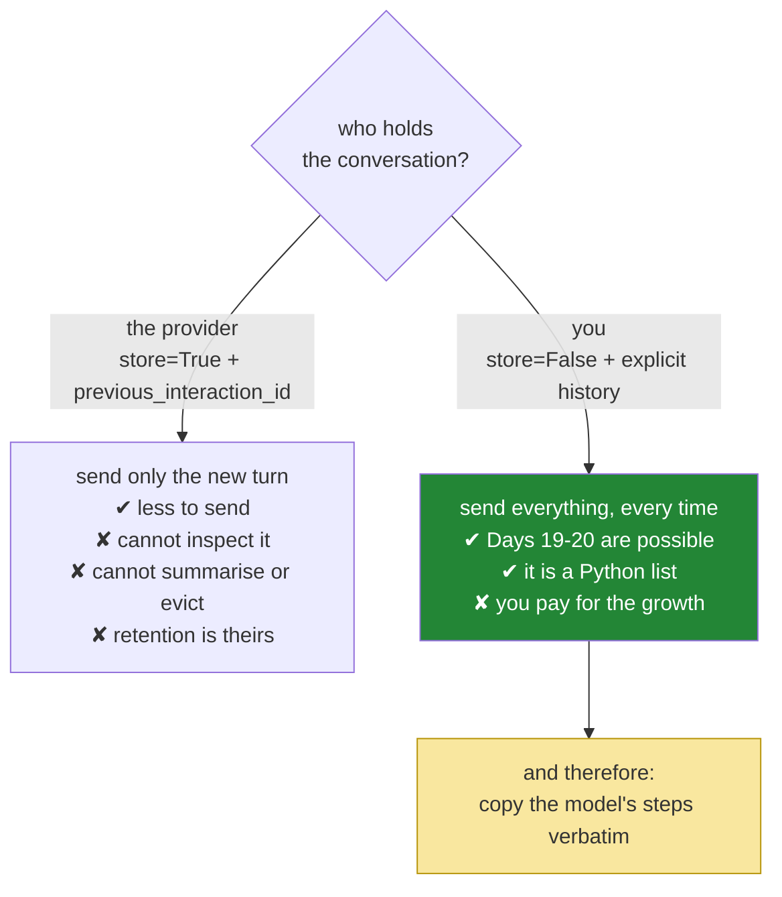

# 2.4 — Re-send the steps as received: stop reconstructing the model's turn

## One-line answer

With `store=False` you hold the whole conversation, and the model's own turns must go back **exactly
as they arrived** — copied, not rebuilt — because a step carries fields you did not put there and do
not need to understand, and a faithful copy is the only version that stays correct when they change.

---

## The story

A cake recipe gets passed around an office. Not photocopied — re-typed, each time, by the next person
who wants it.

Every re-typist is competent and each makes one small, sensible improvement. One rounds 185 degrees to
180, because ovens have round numbers. One writes "butter" where it said "unsalted butter", because
that is obviously what was meant. One drops the line "rest the batter for half an hour", because it
looked like a note to the author rather than a step. One converts the grams to cups.

By the tenth copy the cake does not work. It is not terrible; it is flat and slightly dry, and it is
recognisably the same cake, which is worse than if it had failed outright. Nobody can say which change
did it, because every change was defensible and no two people made the same one. Going back is
impossible — there is no original in the building.

The fix was never better typists. The fix is a photocopier, and the reason a photocopier is better is
precisely that it has **no judgement at all**.

---

## The idea in plain language

Yesterday your loop appended the model's reply to the history by building a turn out of the reply's
text — `history.append(_model_turn(reply))`, where the turn was a dict you constructed. And
`_model_turn` was a `TODO(me)` where you looked up the right shape and typed it in
([Day 3, 4.1](../../../day-03-loop-hand-rolled/parts/04-running-the-loop/4.1-assembling-the-loop.md)).
That worked because yesterday a model turn was one string in one field. There was nothing else in it
to lose.

Today there is. A turn can be several steps; a step may be a `function_call` with a name, an argument
dict and an id; a thinking model emits `thought` steps; and steps carry bookkeeping fields that belong
to the provider and are none of your business. Reconstructing that from the parts you happen to care
about is the re-typed recipe: everything you keep will be right, and everything you did not think to
keep is gone.

So the rule, which is the documented requirement for stateless mode rather than a style preference:

> With `store=False`, preserve and re-send **all** model-generated steps **exactly as received**.

Mechanically that is one line — a loop over `interaction.steps` appending `step.model_dump()` to the
history, written out properly in *The mechanism* below.

`model_dump()` turns the SDK's step object into a plain dictionary — all of it, including the fields
you have never heard of — which is exactly what you want to hand back. It is the photocopier.

Two more things follow from `store=False`, and both are easy to forget:

- **`tools` must be sent on every call.** Tool declarations are interaction-scoped: they apply to the
  request you are making and do not persist. Forgetting them on the second call gives you a model that
  had tools a moment ago and does not now — [1.2](../01-the-schema/1.2-declaring-a-tool.md) noted the
  silent version of this, and the loop is where it actually bites.
- **You are declining the alternative.** The provider offers to hold the conversation for you: send
  `previous_interaction_id` and only the new turn, and their side does the accumulating. Sutra says no,
  for the reasons recorded in ADR-0006 and taught on
  [Day 2, 3.3](../../../day-02-llm-mechanics/parts/03-context-and-memory/3.3-the-server-will-remember.md).
  The point worth restating: holding it yourself is what makes Days 19–20's context engineering
  possible at all. You cannot summarise, evict or inspect a list somebody else is keeping.

---

## Why Sutra needs it

- **Today**, [3.2](../03-rebuilding-the-loop/3.2-the-loop-that-shrank.md) contains this loop-inside-a-loop
  and it is the line that replaces Day 3's `_model_turn` entirely — the `TODO(me)` you solved yesterday
  is deleted rather than upgraded.
- **[3.3](../03-rebuilding-the-loop/3.3-two-calls-in-one-turn.md)** depends on it: when a turn holds two
  `function_call` steps, appending "the model's reply" as one reconstructed thing loses one of them.
- **Day 8 (ADK-06, ADK-07)** hands the history to a session service, and the comparison it makes is
  exactly this trade — who holds the conversation, and what you can and cannot do to it once they do.
- **Days 19–20 (AG-08..10)** edit the history deliberately: summarise the old, keep the recent, drop
  the stale. Every one of those techniques requires possession, and possession requires this line.

---

## The mechanism

The append, in full, with its counterpart from yesterday next to it:

```python
        # Day 3: reconstruct the model's turn from its text.
        # history.append(_model_turn(reply))

        # Day 4: copy every step the model produced, verbatim.
        for step in interaction.steps:
            history.append(step.model_dump())
```

**Line by line:**

- `for step in interaction.steps:` — **every step, not the one you care about.** A turn may hold a
  `thought`, a `function_call`, and a `model_output`; taking only the call would hand back a
  conversation the model does not recognise as its own.
- `step.model_dump()` — the SDK's method for turning one of its objects into a plain `dict`. It gives
  you **all** the fields, including ones this document has never named, which is the entire point:
  you are copying, and a copier that understood the content would be a re-typist. Verified against
  `ai.google.dev/gemini-api/docs/function-calling` on 2026-08-25, where the stateless example uses
  exactly this call.
- **A dict, not the object.** `history` stays a list of plain dictionaries, exactly as it has been
  since Day 2, so it can be printed, diffed, pickled, logged and asserted on with no SDK types
  involved. That property is worth protecting.
- `history.append(...)` inside the `for` — the appends happen in **step order**, so the history's
  ordering mirrors the interaction's. Ordering is the one thing a copy can still get wrong, and a
  `for` in the natural order cannot.
- **What is gone:** `_model_turn`, and Day 3's `TODO(me)` with it. You will never again construct a
  model turn by hand, on any day of this project. Note the shape of that improvement — it is not that
  the code got shorter, it is that a whole category of *your judgement* was removed from the path.

Now the surrounding call, so the `tools` requirement is visible in context:

```python
        interaction = ask(
            client,
            history,
            tools=DECLARATIONS,
            config={"temperature": 0.0},
        )
```

**Line by line:**

- `tools=DECLARATIONS` — **on every call, inside the loop.** Not set once before it, not attached to
  the client. Tools are scoped to the interaction, so the second and third calls need them exactly as
  much as the first. This is the parameter [3.1](../03-rebuilding-the-loop/3.1-one-door-one-new-parameter.md)
  adds to `ask`.
- `history` — the accumulating list, growing by the model's steps plus your result turn on every pass.
  It is the same list-you-own that Day 2 built and Day 3 iterated; today its *contents* got richer and
  its *ownership* did not change.
- `config={"temperature": 0.0}` — unchanged. Greedy decoding still matters: it makes tool selection
  stable enough to debug, even though format compliance is no longer your problem.
- `store=False` is set inside `ask` and is not repeated here — Day 2 made it the default of the door
  precisely so that this decision is made in one place
  ([Day 2, 1.5](../../../day-02-llm-mechanics/parts/01-first-contact/1.5-the-only-door-429.md)).

What the history actually looks like after one tool call, which is worth printing once:

```text
[
  {'type': 'user_input',      'content': [{'type': 'text', 'text': 'SYSTEM...  ticket 4521?'}]},
  {'type': 'function_call',   'name': 'lookup_ticket', 'arguments': {'ticket_id': '4521'},
                              'id': 'fc_a1b2', ...},
  {'type': 'function_result', 'name': 'lookup_ticket', 'call_id': 'fc_a1b2',
                              'result': [{'type': 'text', 'text': 'Title: Keeps getting...'}]},
]
```

Three turns, three different `type` values, and the pairing between turns two and three stated by
`fc_a1b2` rather than by them being next to each other. The `...` in turn two is real — there are
fields in there you did not write and do not need to read, and `model_dump()` carried them because you
did not ask it to be clever.

The two ways to hold a conversation, and which one Sutra chose:



The yellow box is not a separate decision. It is the **cost** of the green one: the moment you take
possession of the conversation, faithfully reproducing the parts you did not author becomes your job.

---

## When it breaks

**The reconstructed turn**, which is Day 3's habit surviving one day too long:

```text
google.genai.errors.ClientError: 400 INVALID_ARGUMENT. {'error': {'code': 400,
'message': 'Conversation contains a function_call with id "fc_a1b2" that is not
followed by a matching function_result.', 'status': 'INVALID_ARGUMENT'}}
```

**What it means.** You built a model turn out of `interaction.output_text` — which on a tool-calling
turn is usually empty — so the `function_call` step never made it into the history at all. Your
`function_result` then answers a call that, as far as the conversation is concerned, was never made.
**The smallest fix is the two-line `for` loop above**, and the reason this error is confusing the first
time is that it names the *result* as the problem when the missing thing is the call.

**The tools that were sent once:**

```text
--- step 2 ---
The model replied with plain text and no function call.
FINAL: I'd need to look up that ticket to say more — could you paste the details?
```

**What it means.** `tools=DECLARATIONS` was passed on the first call and not inside the loop, so on
step 2 the model has a conversation full of tool calls and **no tools**. It behaves exactly as you
would: it talks about the thing it can no longer do. There is no error, because a request without
tools is perfectly valid. **Check the call, not the prompt** — this is the loop version of the silent
failure [1.2](../01-the-schema/1.2-declaring-a-tool.md) warned about, and it is the single most common
mistake on this day.

**The step object appended without dumping:**

```text
Traceback (most recent call last):
  File "sutra/agent.py", line 71, in run_loop
    interaction = ask(client, history, tools=DECLARATIONS, config={"temperature": 0.0})
TypeError: Object of type FunctionCallStep is not JSON serializable
```

**What it means.** `history.append(step)` instead of `history.append(step.model_dump())`. The SDK
object cannot be serialised for the request. **This is the good failure** — loud, immediate, and it
names the type — and it is worth contrasting with the recipe: an error here is far better than a copy
that silently kept nine fields out of eleven.

**The tidied-up copy**, which is the failure the story is actually about:

```python
for step in interaction.steps:
    history.append(
        {"type": step.type, "name": step.name, "arguments": step.arguments}
    )  # 💥 "the fields we need"
```

**Line by line:**

- Every field named here is a field that matters, which is what makes it convincing. It will run.
- `id` is missing, so [2.3](2.3-the-tool-result-turn.md)'s `call_id` has nothing to match and the
  conversation is rejected — if you are lucky. Any field the provider uses that this document has
  never named is also gone, and *those* failures are the flat, slightly-dry cake: the model behaves a
  little worse and nothing points at why.
- **The rule that prevents it:** if you did not author a field, you are not entitled to decide it is
  unimportant. Copy the whole step.

---

## In production

**What a professional treats the history as is an opaque append-only log with a schema they do not
own.** The parts you author — user turns, tool results — you construct and are responsible for. The
parts the model authored you carry, verbatim, and never edit. That division is what lets a provider
add a field, or a new step type, without breaking you: a copier keeps working, a re-typist breaks on
the day the format grows. It is also what makes the history safely storable, because a faithful record
can be replayed and a lossy one cannot.

**What degrades at scale is the size of what you are now carrying.** Steps are larger than the text
they contain, and a thinking model's `thought` steps can be substantial — all of it re-sent on every
subsequent call, at the square-law cost
[Day 3, 5.2](../../../day-03-loop-hand-rolled/parts/05-containment/5.2-the-transcript-is-a-bill.md)
described. The tempting optimisation is to strip the steps you think are not needed, which is the
re-typist wearing a performance argument. The legitimate version is to **drop whole older turns** under
a policy — summarise the first ten exchanges into one, keep the last three verbatim — because dropping
a complete unit is a decision you can reason about, while editing inside a unit is a decision you
cannot. Days 19–20 build the policy.

**The failure that only appears with real traffic is history divergence across a deployment.** Two
versions of your service run at once during a rollout. One copies steps faithfully; the new one
"improves" the copy. A conversation started on one and continued on the other is now internally
inconsistent, and the errors appear only for users whose requests happened to land on both — a small
percentage, correlated with nothing, impossible to reproduce locally. Anything that touches the shape
of persisted history is a migration, not a refactor, and needs to be treated as one.

**The review comment a senior engineer leaves:** *"We're rebuilding the model's turn from the fields
we currently use. That will silently drop anything the provider adds, and it already drops the call id
on turns where we take a shortcut. Copy the steps with `model_dump()` and treat model-authored content
as opaque — we construct our turns, we carry theirs."*

**The interview question:** *"you're managing conversation history client-side. What do you send back
for the model's own turns?"* The answer that shows you have been bitten: "Exactly what I received, as
a verbatim copy. The temptation is to rebuild the turn from the fields I actually use, and it works
until the provider's step shape grows or until there's a field I didn't realise was load-bearing —
tool call ids being the obvious one, but thought steps and internal bookkeeping matter too. So I dump
the step to a dict and append it whole. The general division I hold to is that I author my turns —
user input and tool results — and I *carry* the model's, without editing them. When history gets too
long I drop entire older turns under a policy rather than trimming inside them, because dropping a
whole unit is a decision I can reason about and editing inside one is a decision I can't."

---

## Check yourself

```bash
uv run python -m pytest tests/test_agent.py -q -k history
```

**Zero model calls.** The test drives the loop with a fake client that returns a `function_call` step,
then asserts that the history contains a turn whose `id` matches the result turn's `call_id` — which
is only true if the step was copied rather than rebuilt. Then run the real thing once and print
`history` after a tool call; look for a field in the copied step that this document never mentioned,
and note that you would have dropped it.

**Answer out loud, without scrolling up:**

> Say what `store=False` obliges you to send, and why the model's turn is copied rather than
> constructed. Then name the one parameter that must be repeated on every call inside the loop, and
> describe exactly what the run looks like when you forget it.

---

**Next:** [3.1 — One door, one new parameter](../03-rebuilding-the-loop/3.1-one-door-one-new-parameter.md)
