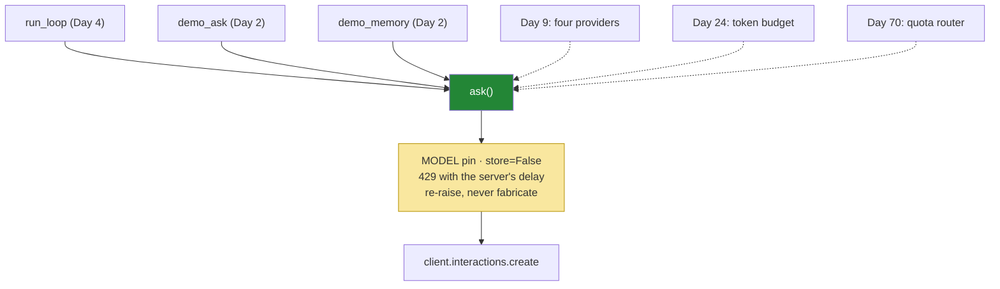

# 3.1 — One door, one new parameter: why tools go through `ask` and not around it

## One-line answer

`ask` gains one optional parameter and stays the only place in Sutra that touches the SDK — because
every safety property this project has (the model pin, `store=False`, 429 handling, honest failure)
lives at that door, and a second call site would have to rebuild all four, which nobody ever does.

---

## The story

A factory has one loading bay. Everything that arrives goes through it: weighed, photographed,
checked against a delivery note, logged with a time and a signature. It is slightly annoying and
completely non-negotiable, and the reason it works is that there is only one of them — a fact about
the building, not a rule somebody has to remember.

Then the factory starts taking a new kind of delivery that needs refrigeration.

There is an obvious quick fix. Put a chiller by the side door round the back, and route the cold stuff
through there. It takes an afternoon. The loading bay does not have to change at all.

Eighteen months later, the audit. Every cold delivery for a year and a half is unweighed,
unphotographed, unsigned for, and missing from the log — not because anybody decided that was
acceptable, but because the side door was a door, and doors do not come with the loading bay's
procedures attached. Nobody rebuilt the checks there. Nobody ever does; that is what makes the side
door quick.

The correct afternoon's work was to put the chiller **at the loading bay**.

---

## The idea in plain language

Since Day 2, exactly one function in Sutra calls the model
([1.5](../../../day-02-llm-mechanics/parts/01-first-contact/1.5-the-only-door-429.md)), and four
decisions live inside it:

| What `ask` guarantees | Established | What a second call site would lose |
| --- | --- | --- |
| the explicit model pin | Day 2, 1.3 | a floating alias, or a different model than your evals ran on |
| `store=False` | Day 2, 3.3 · ADR-0006 | the provider silently retaining conversations |
| 429 retry that reads the server's stated delay | Day 2, 1.5 | textbook backoff, which is worse than none |
| re-raise rather than fabricate | Day 2, 1.5 · trap #4 | a `None` travelling into your loop |

Today the loop needs to send `tools`. There are two ways to do that, and one of them takes an
afternoon:

- **The side door.** Call `client.interactions.create(...)` directly from the loop, because you need a
  parameter `ask` does not have. Fast, obvious, and it silently opts that call path out of all four
  rows above.
- **The loading bay.** Add one optional parameter to `ask`. Also fast. Every existing caller is
  unaffected because it defaults to `None`, and the new call path inherits everything.

This is not a close decision, and the only reason it is worth a part of its own is that the side door
is genuinely tempting in the moment — you are mid-loop, you know exactly which parameter you need, and
`ask` is somebody else's file. The habit worth building is to notice that feeling and treat it as the
signal it is: **"I need a parameter the wrapper does not have" is a reason to change the wrapper.**

---

## Why Sutra needs it

- **Today**, [3.2](3.2-the-loop-that-shrank.md) calls `ask(..., tools=DECLARATIONS)` inside the loop,
  on every pass ([2.4](../02-the-round-trip/2.4-resend-the-steps-as-received.md): tools are
  interaction-scoped).
- **Day 5 (ADK-01, ADK-02)** hands the call to ADK's runner, and the first question you will ask of it
  is where these four guarantees now live. A framework that owns the call also owns the retry policy,
  and knowing which four things you are handing over is the whole of that day's comparison.
- **Day 9 (ADK-08, ADK-09)** puts four providers behind one interface. Sutra can do that at all
  because there is one place a provider is chosen.
- **Day 70 (Quota-Router)** routes between providers by remaining quota. It is a change to one
  function, and it is only a change to one function because of the rule this part is about.
- **Day 24 (OPS-07)** counts tokens per run against a budget. Same argument: one door, one counter.

---

## The mechanism

The change is one parameter and one line of body. Here is `ask` with the diff visible:

```python
def ask(
    client: genai.Client,
    prompt: object,
    *,
    tools: list[dict] | None = None,
    config: dict | None = None,
    store: bool = False,
) -> object:
    """The ONLY way Sutra calls a model: retry on 429, then fail honestly.

    Args:
        client: an authenticated genai.Client.
        prompt: a string, or a structured history list (Day 2, 3.2).
        tools: function declarations for this interaction (Day 4, 1.2). Tools are
            interaction-scoped, so they must be passed on every call that needs them.
        config: generation settings - temperature, thinking_level, tool_choice.
        store: whether the provider persists this interaction (Day 2, 3.3).

    Raises:
        errors.APIError: on any non-429 error, and on 429 after MAX_TRIES.
    """
    for attempt in range(MAX_TRIES):
        try:
            return client.interactions.create(
                model=MODEL,
                input=prompt,
                tools=tools,
                generation_config=config,
                store=store,
            )
        except errors.APIError as error:
            if error.code != 429 or attempt == MAX_TRIES - 1:
                raise
            wait = _retry_wait(error, attempt)
            print(f"429: quota hit — waiting {wait:.0f}s (attempt {attempt + 1}/{MAX_TRIES})")
            time.sleep(wait)
    raise AssertionError("unreachable: the loop always returns or raises")
```

**Line by line:**

- `tools: list[dict] | None = None` — **keyword-only** (it is after the `*`) and **defaulting to
  `None`**. The default is what makes this a non-breaking change: `demo_ask`, `demo_memory`,
  `demo_sampling` and every other Day 2 caller keeps working untouched, because a caller that does not
  mention tools gets exactly the behaviour it had yesterday.
- `list[dict]` — the declarations are plain dicts
  ([1.2](../01-the-schema/1.2-declaring-a-tool.md)), so the annotation can be precise here in a way it
  could not be for the interaction object. **Annotate what you have actually verified**, and nothing
  more.
- The `Args:` entry says **"tools are interaction-scoped, so they must be passed on every call"** —
  the trap from [2.4](../02-the-round-trip/2.4-resend-the-steps-as-received.md), recorded at the place
  a reader will be when they need it. A docstring that carries the one non-obvious constraint of a
  parameter is worth more than one that restates the parameter's name.
- `tools=tools` inside `create(...)` — **passing `None` is the same as not passing it.** That is worth
  checking rather than assuming, and it is the check in *Check yourself*; if a provider ever
  distinguished the two, this line is where you would find out.
- **Everything else is byte-for-byte Day 2.** The retry ladder, the `error.code != 429` honesty line,
  the announced wait, the unreachable guard. Read that as the argument for the whole part: adding a
  capability cost one parameter and zero changes to any safety property.
- `config` now also carries `tool_choice` ([4.2](../04-the-limits/4.2-the-tool-that-is-never-called.md)),
  which is another thing you did not have to widen the door for — a dict-shaped parameter absorbs new
  settings without a signature change.

And the one-line check that keeps the rule true, which matters more than the change:

```bash
grep -rn "interactions.create" sutra/ | wc -l
```

**Line by line:**

- `grep -rn` — recursive, with line numbers, over the package only. Not `days/`, which is full of
  example code, and not the tests, which legitimately fake it.
- `wc -l` — **it must print `1`.** One call site. This is a structural property of the codebase, not a
  convention, and the moment it prints `2` somebody has built the side door.
- This is a good candidate for a test rather than a command, and it is one of the two structural
  assertions in the hub's §5. A rule that is only in a document is a rule that survives until the first
  hurried afternoon.

The shape being protected:



The dotted arrows are days that have not happened yet. Every one of them is a change to the green box
and to nothing else, and that is the return on today's one parameter.

---

## When it breaks

**The side door, working perfectly**, which is why it survives:

```python
        # in run_loop, because ask() didn't take tools yet
        interaction = client.interactions.create(
            model="gemini-3.7-flash", input=history, tools=DECLARATIONS
        )
```

**Line by line:**

- It runs. The loop works. Today's demo passes and the tests are green, which is exactly the problem —
  there is no failure to point at.
- `store` is **not** passed, so it takes the SDK's default of `True`, and Sutra is now quietly
  persisting conversations on the provider's servers — the decision ADR-0006 made, undone by omission
  in a line nobody will re-read.
- `model="gemini-3.7-flash"` is **hard-coded here as well as in `MODEL`**, so there are now two places
  to change and one of them will be missed. That is the drift that makes an eval score move with no
  commit explaining it.
- There is **no retry**, so the first 429 in a multi-step run raises out of the loop instead of waiting
  the server's stated delay — and a loop makes several calls in quick succession, which is precisely
  when 429s happen.
- Four regressions, none of which produces an error today. **This is the audit eighteen months later.**

**The tools that were never passed on**, which is the first real failure of the new parameter:

```text
--- step 2 ---
The model replied with plain text and no function call.
FINAL: I'd need to look at that ticket to say more.
```

**What it means.** `ask` accepts `tools` and the loop forgot to pass it on the second call — or passed
it before the loop rather than inside it. There is no error because a request without tools is valid.
Covered at length in [2.4](../02-the-round-trip/2.4-resend-the-steps-as-received.md); it is repeated
here because the *new* way to cause it is to widen the door and then not walk through it.

**The parameter added to the wrong layer:**

```python
client = genai.Client(tools=DECLARATIONS)  # 💥 not a client-level setting
```

**What it means.** Tools belong to an interaction, not to a client. This is the mental model of a
session or a connection leaking in from other APIs, and it is worth naming because it produces a
`TypeError` about an unexpected keyword argument that reads like an SDK problem rather than a modelling
mistake. **Scope is the thing to get right first:** the model pin is per-call, the key is per-client,
and the tools are per-interaction.

---

## In production

**What a professional builds at this door is everything cross-cutting**, and it accumulates fast: a
timeout, a circuit breaker, a token counter, a trace span, a request id, a redaction pass, provider
selection, and a cache lookup. All of it lands on the one function, which is precisely why it must
stay one function — the value of the door is not that it is elegant, it is that each of those is added
once instead of at every call site, including the call sites written by people who have never read
this file.

**What degrades at scale is the door becoming a bottleneck of a different kind**: a single synchronous
function that blocks on `time.sleep` serialises everything behind it. The production shape is the same
single door made async, with the retry as `await asyncio.sleep`, and concurrency limits per provider
enforced there rather than by callers. The architectural point survives the rewrite — one place — and
only the mechanics change.

**The failure that only appears with real traffic is the second call site somebody adds under
pressure.** It is never a bad engineer and never a design decision; it is an incident at eleven at
night, a script that needs to reach the model once, and a copy-paste from the docs. The defences that
actually work are structural: a lint rule or a test that fails on a second `interactions.create` in
the package, so the side door cannot be built quietly. That is why the `grep` above becomes a test
today rather than a paragraph in a README.

**The review comment a senior engineer leaves:** *"This calls the SDK directly because the wrapper
didn't take `tools`. Add the parameter to the wrapper — as written, this path has no retry, no model
pin and no `store=False`, and none of that will show up until the first rate limit or the first
privacy review. And add a test that asserts exactly one call site, or we'll be back here."*

**The interview question:** *"you wrap your LLM provider in a single function. What actually goes in
there, and when do you break the rule?"* The answer that shows you have maintained one: "The wrapper
owns everything that must be true of every call: the model pin, retry with the server's own stated
delay rather than blind backoff, the decision about whether the provider stores the conversation, and
the rule that errors propagate instead of becoming a placeholder result. When I need a new capability
I widen the wrapper rather than calling the SDK directly, because a second call site inherits none of
those and the regression is silent — it works fine right up until the first rate limit or the first
audit. I break the rule for exactly one thing: tests, which fake the client deliberately. And I keep
it honest with a test that counts call sites, because this is a rule that gets broken at eleven at
night by someone who has never read the wrapper."

---

## Check yourself

```bash
grep -rn "interactions.create" sutra/ | wc -l
uv run python -c "
from sutra.mechanics import ask
import inspect
p = inspect.signature(ask).parameters['tools']
print('tools param:', p.kind.name, '| default:', p.default)
"
```

The first must print `1`. The second must print `KEYWORD_ONLY | default: None` — keyword-only so a
call site cannot pass it positionally, and defaulting to `None` so every Day 2 caller is untouched.

**Answer out loud, without scrolling up:**

> Name the four guarantees that live inside `ask`, and say which one a direct `interactions.create`
> call in the loop would break *without producing any error at all*. Then say what makes the side door
> tempting, and what structural thing stops it.

---

**Next:** [3.2 — The loop that shrank](3.2-the-loop-that-shrank.md)
