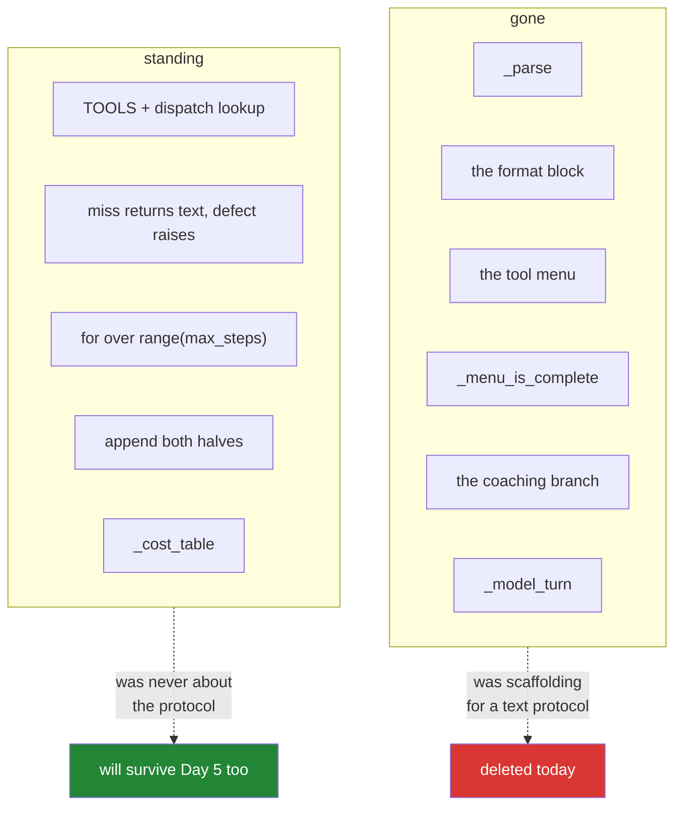

# 3.2 — The loop that shrank: what the scaffolding was holding up

## One-line answer

Assembling the new loop is mostly deletion — the parser, the format block, the tool menu and the
coaching branch all go — and what survives untouched is the part that was never about the protocol:
the dispatch table, the step budget, the two species of error, and the two appends.

---

## The story

A building goes up behind scaffolding. For most of a year that is what everyone sees: the poles, the
boarded walkways, the netting, the hoist on one corner, the stair tower bolted to the side. People
walking past form a picture of the building from its outline, and the outline is mostly scaffold.

Then one week it comes down, and everybody is surprised. The building is **smaller** than it looked.
It is also a different shape — the stair tower was not a wing, the hoist corner was not a tower, and
the netting was hiding the fact that the whole thing is quite plain.

Nobody was fooled exactly. It is simply that the scaffolding was up for so long that it was hard to
remember it was not part of the building. It was there to hold up work in progress, and the moment the
work could stand on its own, all of it came off in a week.

The building was never the scaffold. But you could not have built it without one.

---

## The idea in plain language

Yesterday's `sutra/loop.py` is about a hundred lines. A large part of it exists to hold up a protocol
that no longer exists, and today you find out which part.

**Comes down:**

| What | Why it can go |
| --- | --- |
| `_parse` | the call arrives parsed ([2.2](../02-the-round-trip/2.2-the-call-comes-back-parsed.md)) |
| the format block in `SYSTEM` | the schema is the format ([1.1](../01-the-schema/1.1-the-form-that-rejects-itself.md)) |
| the tool menu in `SYSTEM` | `tools=DECLARATIONS` is the menu ([1.2](../01-the-schema/1.2-declaring-a-tool.md)) |
| `_menu_is_complete` | there is no second copy of the menu to drift from |
| the coaching branch | a format miss cannot happen; the provider validates |
| `_model_turn` | steps are copied, never constructed ([2.4](../02-the-round-trip/2.4-resend-the-steps-as-received.md)) |

**Stays standing, unchanged:**

| What | Why the protocol never touched it |
| --- | --- |
| `TOOLS` and the dispatch lookup | capability is what your table permits, not what the model can name |
| a miss returns text, a defect raises | the two species of error are a design decision, not a format |
| the `for` over `range(max_steps)` | the bound belongs to your code whoever is parsing |
| appending both halves of the exchange | the transcript is still the world |
| `_cost_table` | the transcript is still a bill, and now it carries steps as well as text |

Read those two tables together and you have the honest answer to "what did the framework do for me?",
one day before a framework arrives. **The protocol was scaffolding. The loop is the building.** That
is Principle 4 — build first, compare after — arriving as a diff you can run `git diff` on rather than
as a slogan.

One structural decision before the code: today's work goes in a **new file**, `sutra/agent.py`, and
`sutra/loop.py` stays exactly as it is. Day 3 argued for keeping it
([7.1](../../../day-03-loop-hand-rolled/parts/07-the-text-protocol-ceiling/7.1-what-a-schema-would-have-caught.md):
a text protocol is a real fallback lane on providers with no structured surface), and there is a
second reason today: two files side by side make the deletion **visible and permanent**, where an
edit-in-place would leave you with only the new version and a vague memory of what changed.

---

## Why Sutra needs it

- **Today**, this is the file [3.3](3.3-two-calls-in-one-turn.md) extends and
  [6.1](../06-failure-lab/6.1-the-call-id-you-did-not-echo.md) breaks on purpose.
- **Tomorrow (Day 5, ADK-01, ADK-02)** replaces this function with ADK's runner. The comparison is
  only meaningful because you can point at each line and ask what the framework does at that point —
  and because you know which lines are protocol and which are agent.
- **Day 13 (ADK-14, ADK-15)** adds callbacks at exactly the moments this function already has:
  before the model call, after it, before the tool, after the tool.
- **Days 62–65** insert an approval gate. It is still one `if`, on one line, and today that line has a
  better shape than yesterday's: you are pausing on a **typed call with named arguments** rather than
  on a sentence.

---

## The mechanism

The new system prompt first, because the shrinkage is most obvious there:

```python
SYSTEM = (
    "You are Sutra, a support-ticket triage assistant. "
    "Read the ticket before diagnosing it, and check the knowledge base for a "
    "known issue before answering. "
    "Never state a fact that no tool result gave you; if a lookup found nothing, "
    "say so plainly rather than filling the gap."
)
```

**Line by line:**

- Three sentences, from about twenty. **Everything that was mechanism is gone** — the two shapes, the
  `EXACTLY`, the tool menu, the "one ACTION per reply", the "no backticks". Every one of those was a
  workaround for the absence of a schema.
- `"Read the ticket before diagnosing it, and check the knowledge base before answering."` —
  **sequencing**, which survives because no schema can express it
  ([1.2](../01-the-schema/1.2-declaring-a-tool.md) noted that ordering can only be prose). This is now
  one of the few jobs left for the system prompt.
- `"Never state a fact that no tool result gave you..."` — **honesty**, which also survives, for the
  same reason it did yesterday: it is a request, not a mechanism, and
  [Day 3, 4.3](../../../day-03-loop-hand-rolled/parts/04-running-the-loop/4.3-the-honest-failure.md)
  is unchanged by anything today. Function calling does not reduce fabrication on a miss by one
  percent.
- What is left is a useful definition of what a system prompt is *for* once the protocol is handled
  elsewhere: **role, sequencing, and standing constraints.** That is Day 6's subject (ADK-03, AG-05),
  and it is a much smaller subject than it looked yesterday.

Now the loop. New file, `sutra/agent.py`:

```python
"""Sutra's agent loop over native function calling (Day 4).

sutra/loop.py keeps Day 3's hand-rolled text protocol, deliberately: it is the
fallback lane for providers with no structured tool surface (Day 9), and the
comparison this file exists to make.

Verified against ai.google.dev/gemini-api/docs/function-calling on 2026-08-25.
"""

from google import genai

from sutra.loop import TOOLS, _cost_table, _user_turn
from sutra.mechanics import ask
from sutra.tools import DECLARATIONS


def run_loop(client: genai.Client, question: str, *, max_steps: int = 6) -> str:
    """Think -> act -> observe over function calling, bounded by max_steps.

    Usage:  uv run python -m sutra.agent "why does ticket 4521 log people out?"
    """
    history = [_user_turn(f"{SYSTEM}\n\nUser question: {question}")]
    spent: list[object] = []
    result = "(the loop never ran)"

    for step in range(1, max_steps + 1):
        interaction = ask(client, history, tools=DECLARATIONS, config={"temperature": 0.0})
        spent.append(interaction.usage)

        for produced in interaction.steps:
            history.append(produced.model_dump())

        call = next((s for s in interaction.steps if s.type == "function_call"), None)
        if call is None:
            print(f"\n--- step {step} ---\n{interaction.output_text}")
            print(f"\n{_cost_table(spent)}")
            return interaction.output_text or "(the model produced no text)"

        print(f"\n--- step {step} ---\nCALL  : {call.name}({call.arguments})")
        result = _dispatch(call)
        print(f"RESULT: {result}")
        history.append(_result_turn(call, result))

    print(f"\n{_cost_table(spent)}")
    return f"Stopped after {max_steps} steps without an answer. Last result: {result}"
```

**Line by line:**

- `from sutra.loop import TOOLS, _cost_table, _user_turn` — **importing three things from yesterday,
  including two with a leading underscore.** The underscore means private to the *package's users*,
  not private to the module, and a sibling in the same package is entitled to reach for them. What it
  does signal is a refactor waiting to happen: three shared helpers across two files is the point at
  which a `sutra/turns.py` starts to make sense. Note it, do not do it today
  ("clean up only the mess you personally made").
- `history = [_user_turn(f"{SYSTEM}\n\nUser question: {question}")]` — **byte-for-byte yesterday's
  opening line.** The transcript's first turn did not change at all; only what goes in after it did.
- `spent: list[object] = []` and `result = "(the loop never ran)"` — both carried over from Day 3
  ([5.2](../../../day-03-loop-hand-rolled/parts/05-containment/5.2-the-transcript-is-a-bill.md) and
  [4.1](../../../day-03-loop-hand-rolled/parts/04-running-the-loop/4.1-assembling-the-loop.md)'s
  `UnboundLocalError` guard). The pre-binding is still needed for exactly the same reason: `max_steps=0`.
- `ask(client, history, tools=DECLARATIONS, config={"temperature": 0.0})` — **inside** the loop, tools
  on every pass ([2.4](../02-the-round-trip/2.4-resend-the-steps-as-received.md)), through the one door
  ([3.1](3.1-one-door-one-new-parameter.md)).
- `interaction = ...` bound to a name rather than chained, so `interaction.usage` survives — the habit
  Day 3's [5.2](../../../day-03-loop-hand-rolled/parts/05-containment/5.2-the-transcript-is-a-bill.md)
  installed, and it pays again today because you also need `.steps` and `.output_text` from the same
  object.
- `for produced in interaction.steps: history.append(produced.model_dump())` — the copy
  ([2.4](../02-the-round-trip/2.4-resend-the-steps-as-received.md)). Named `produced` rather than
  `step` because `step` is already the loop counter; shadowing it here would compile and would make the
  cost table's step numbers a puzzle.
- **The copy happens before the branch.** Whether the model called a tool or answered, its steps go
  into the history first. That ordering is deliberate: it means the history is complete at the moment
  you return, which matters the day this becomes a multi-question conversation (Day 8) — and it is
  precisely the omission Day 3's early `return final` had.
- `call = next((s for s in interaction.steps if s.type == "function_call"), None)` — **filter by type,
  default `None`.** `None` means the model is talking, not asking, and it is the branch that replaces
  yesterday's `FINAL:` check. Note there is no third case: a format miss is not possible, so the
  coaching branch has nothing to coach.
- `if call is None:` — the exit. Prints the answer, prints the bill, returns. `interaction.output_text
  or "(the model produced no text)"` keeps Day 2's guard, because a token cap can still eat an answer.
- `print(f"CALL  : {call.name}({call.arguments})")` — the trace, and it reads better than yesterday's:
  `lookup_ticket({'ticket_id': '4521'})` is a **call signature**, not a line of prose you have to
  interpret. The two-space padding in `"CALL  :"` aligns it with `"RESULT:"` so the trace is scannable
  in a column.
- `result = _dispatch(call)` — **still no `try`.** The two species of error
  ([Day 3, 2.3](../../../day-03-loop-hand-rolled/parts/02-tools-and-dispatch/2.3-a-failed-tool-is-an-observation.md))
  are untouched by the protocol change, and trap #4 is exactly as live today as yesterday.
- `history.append(_result_turn(call, result))` — the second append
  ([2.3](../02-the-round-trip/2.3-the-tool-result-turn.md)), answering *that* call by id.
- `for step in range(1, max_steps + 1):` and the fall-through return — **the brake, unchanged**
  ([Day 3, 5.1](../../../day-03-loop-hand-rolled/parts/05-containment/5.1-the-step-budget.md)). The
  stop condition still belongs to your code and not to the model.
- **One known limitation, with an address:** `next(...)` takes the *first* function call and ignores
  any others. A model can ask for two tools in one turn, and this version silently drops the second —
  which is exactly the bug Day 3's parser had. [3.3](3.3-two-calls-in-one-turn.md) fixes it, and it is
  written as a separate part because handling several calls is a genuinely different shape rather than
  a bigger version of this one.

The diff, as a picture:



Look at the green column and note something for tomorrow: **ADK will take over parts of it.** The
dispatch, the appends and the step bound all move inside the runner on Day 5. The two species of error
do not — that stays a decision you make per tool, forever.

---

## When it breaks

**A healthy run, which is shorter than yesterday's:**

```text
--- step 1 ---
CALL  : lookup_ticket({'ticket_id': '4521'})
RESULT: Title: Keeps getting logged out. Body: I keep getting logged out of the
dashboard every few minutes. Started yesterday. Plan: Pro.

--- step 2 ---
CALL  : search_kb({'query': 'keeps getting logged out of the dashboard'})
RESULT: KB-104 'Unexpected logouts': cookies set with SameSite=Strict plus an
http:// dashboard URL end sessions early; fix is forcing https.

--- step 3 ---
This matches KB-104. The dashboard sets session cookies with SameSite=Strict while
being served over http://, so the browser drops the session early...
```

**What it means.** The same three steps as
[Day 3, 4.2](../../../day-03-loop-hand-rolled/parts/04-running-the-loop/4.2-the-first-real-run.md),
and note what is missing from the trace: no `THOUGHT:` lines. You stopped asking for them when the
format block went, and you have lost the readable reasoning that made yesterday's trace so easy to
debug. That is a real loss and it is worth feeling: Day 3's
[7.1](../../../day-03-loop-hand-rolled/parts/07-the-text-protocol-ceiling/7.1-what-a-schema-would-have-caught.md)
predicted that the `THOUGHT:` habit would outlive the protocol. Getting it back is a `thinking_level`
setting and reading the `thought` steps — worth an experiment in the lab folder.

**The shadowed loop variable**, if you named the copy loop's variable `step`:

```text
step   input  output  thought   total
   1     412      28      196     636
```

**What it means.** The cost table prints one row for a three-step run, or the trace prints
`--- step function_call ---`, depending on where the shadowing bit. Python will not warn you: the
inner `for step in interaction.steps` rebinds the outer counter, and after the inner loop `step` is
whatever the last produced step was. **Name inner loop variables for what they hold**, which is why the
mechanism uses `produced`.

**Both files edited into one**, which is the mistake to avoid rather than a runtime error:

```text
$ git diff --stat
 sutra/loop.py | 62 +++++++-----------------------------------------
```

**What it means.** You edited Day 3's file instead of writing a new one. Nothing is broken and
something is lost: the fallback lane Day 9 will want, and the side-by-side comparison that makes this
part's two tables checkable rather than assertions. **The smallest fix is `git checkout sutra/loop.py`
and start `sutra/agent.py`** — assuming Day 3 was committed, which is what Principle 2 is for.

---

## In production

**What a professional notices about that deletion is that the surviving list is the actual system.**
Protocol code churns — it changed completely between yesterday and today and will change again on
Day 5 — while the dispatch boundary, the error policy, the step bound and the transcript discipline
have now survived two complete rewrites of everything around them. That is a reliable signal about
where to spend design effort: the things that survive a protocol change are the things worth getting
right, and the things that vanish were never load-bearing however much of the file they occupied.

**What degrades at scale is the assumption of one call per turn**, which this version bakes in with
`next(...)`. It is fine today and it is a latent bug the moment tool count grows, because a model with
five tools and an obvious two-step task will start requesting both at once. The failure is silent —
the second call is dropped and the model reasons as if it ran
([Day 3, 3.2](../../../day-03-loop-hand-rolled/parts/03-the-protocol/3.2-parsing-a-reply-you-did-not-write.md)
had exactly this bug in a different costume). [3.3](3.3-two-calls-in-one-turn.md) is the fix, and the
general lesson is that "take the first one" is a decision, not a default, and it should be written
down as one.

**The failure that only appears with real traffic is the lost reasoning trace.** With a text protocol
you had the model's stated reason for every action, free, in the transcript. With function calling you
have a call signature and nothing about *why*. That is invisible until the first time an agent does
something baffling in production and the trace shows what it did with no hint of what it thought it was
doing. Teams rediscover this and add reasoning back — as a thinking-level setting, a required
`reason` parameter on sensitive tools, or a logged thought step. Decide deliberately rather than
losing it by accident, which is what happened in the code above.

**The review comment a senior engineer leaves:** *"`next(...)` silently takes the first call and drops
the rest. Handle all of them or fail loudly on the second — a dropped call is invisible to us and
invisible to the model, which will assume it ran. Also, we lost the reasoning trace when the format
block went; add a `reason` field to the tools that matter, or we'll be debugging call sequences with
no idea what the agent was trying to do."*

**The interview question:** *"you moved an agent from a text protocol to native function calling. What
got simpler and what got worse?"* The answer that shows you have done the migration: "Most of the
protocol code disappeared — the parser, the format instructions, the tool menu in the prompt, the
retry-with-coaching branch, and every near-miss those existed to absorb. What did not change at all
was the part I thought of as the agent: the dispatch table that decides what may run, the rule that a
domain miss returns text and a defect raises, the step budget, and appending both halves of every
exchange. That split was the useful lesson. Two things got worse. I lost the free reasoning trace,
because the model no longer has to say why it is doing something, and that hurts the first time
something baffling happens in production. And I quietly introduced a one-call-per-turn assumption by
taking the first function call, which is fine until the model starts requesting two and the second is
dropped silently — the model then reasons as if it ran, which is the same bug I'd just deleted from
the parser, in a new costume."

---

## Check yourself

```bash
uv run python -m sutra.agent "Ticket 4521 says the user keeps getting logged out. What should we tell them?"
wc -l sutra/loop.py sutra/agent.py
```

Three steps, a cited `KB-104`, and a cost table. Then read the two line counts and say out loud which
of the two files is the agent and which is the protocol.

**Answer out loud, without scrolling up:**

> Name three things this loop deleted today and three that survived untouched. Then say what the
> surviving list tells you about where design effort belongs, and name the one limitation this version
> has that [3.3](3.3-two-calls-in-one-turn.md) exists to fix.

---

**Next:** [3.3 — Two calls in one turn](3.3-two-calls-in-one-turn.md)
