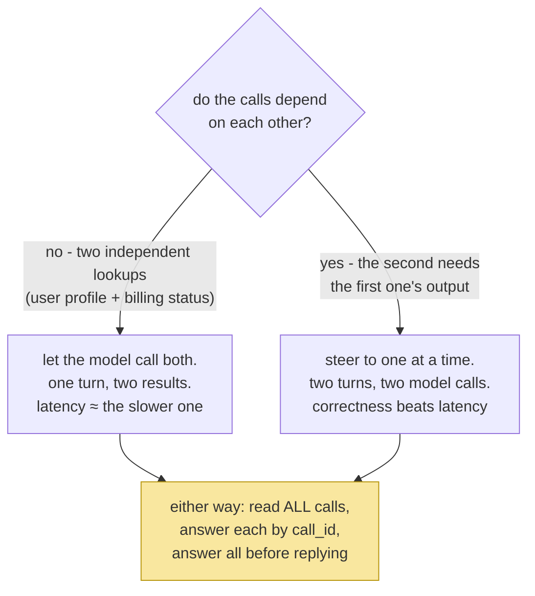

# 3.3 — Two calls in one turn: every call gets an answer, and nobody is served early

## One-line answer

A model can request several tools in a single turn, so the loop reads **every** `function_call` step,
executes each, appends one `function_result` per call carrying its own `call_id`, and does not go back
to the model until all of them are answered — and Sutra's own two tools are a case where you mostly
want to talk the model *out* of doing this.

---

## The story

A table orders a soup, a steak and a salad.

The kitchen does not make them in order. Soup is at one station, the grill is another, and the cold
section is a third, and all three start at once — that is the entire reason a kitchen is arranged in
stations rather than as one long queue. Three dishes take about as long as the slowest of them instead
of as long as all three added up.

Two rules make it work, and both are about the pass, not the cooking.

The first is that every plate carries its ticket. Not because anyone is confused about which is the
soup, but because at half past eight there are four steaks up and they belong to four different
tables, and "it looks like the right one" is how a table with an allergy gets somebody else's plate.

The second rule is the one that looks like inefficiency: **nothing leaves the pass until the whole
table is up.** The salad has been ready for a while. It sits there. Serving it now means one person
eating while two watch, which is not a table being served, it is a table being interrupted.

And there is a third thing, which is not a rule but a fact about menus: some dishes genuinely cannot
start until another finishes. If the sauce is made from the pan the steak came out of, no amount of
station design parallelises it. A kitchen that tries will produce the sauce first and the steak
second, and it will be wrong in a way that no ticket system can fix.

---

## The idea in plain language

[3.2](3.2-the-loop-that-shrank.md) took the **first** function call and ignored the rest — it filtered
the steps for a `function_call` and pulled out one with `next`, defaulting to `None`.

That is a decision, and it is the same decision Day 3's parser made when it took the first `ACTION:`
line and silently dropped the second
([Day 3, 3.2](../../../day-03-loop-hand-rolled/parts/03-the-protocol/3.2-parsing-a-reply-you-did-not-write.md)).
The consequence was ugly then and is identical now: the model asked for two things, one happened, and
**nothing tells it the other did not** — so it reasons as if both ran.

The fix is small and has three parts, one for each of the kitchen's rules:

- **Read all of them.** A list comprehension instead of `next`. The steps are a timeline and there may
  be several calls in it.
- **One result per call, each carrying its own `call_id`.** This is the plate's ticket
  ([2.3](../02-the-round-trip/2.3-the-tool-result-turn.md)), and it stops being bookkeeping the moment
  there are two.
- **Answer all of them before the next model call.** Every `function_call` must be followed by a
  matching `function_result` or the conversation is rejected
  ([2.3](../02-the-round-trip/2.3-the-tool-result-turn.md)'s unanswered-call error). Nothing leaves the
  pass until the table is up.

And then the honest part, which is the third thing in the story. **Sutra's two tools are the pan
sauce.** `search_kb` should be called with the symptom words *from the ticket body*
([1.2](../01-the-schema/1.2-declaring-a-tool.md)), which do not exist until `lookup_ticket` has
returned. A model that calls both at once will search the knowledge base with the user's phrasing
instead of the ticket's, and today's naive substring matcher will often miss.

So this part is two things at once, and it is worth being clear about which is which: **handling
parallel calls correctly is not optional** — the model may do it whatever you prefer, and dropping a
call is a silent bug. **Encouraging parallel calls is a design decision**, and for these two tools the
answer is no.

---

## Why Sutra needs it

- **Today**, [6.1](../06-failure-lab/6.1-the-call-id-you-did-not-echo.md) is a failure that is
  impossible to see with one call in flight and obvious with two.
- **Day 11 (AG-06)** is tool design, where "can these two run independently?" becomes a question you
  ask of every pair of tools you write.
- **Day 16 (ADK-18, SEC-01)** adds tools that make real network calls. Parallel execution stops being
  a correctness question and becomes a latency argument — and a concurrency-limit argument.
- **Days 92–96 (multi-agent)** are this idea one level up: several agents working at once, each
  needing its results routed back to the right place. The `call_id` discipline is the small version of
  a correlation id.

---

## The mechanism

Three lines change in `run_loop`. Here is the section, with the `next(...)` replaced:

```python
        calls = [s for s in interaction.steps if s.type == "function_call"]
        if not calls:
            print(f"\n--- step {step} ---\n{interaction.output_text}")
            print(f"\n{_cost_table(spent)}")
            return interaction.output_text or "(the model produced no text)"

        print(f"\n--- step {step} ---")
        for call in calls:
            print(f"CALL  : {call.name}({call.arguments})")
            result = _dispatch(call)
            print(f"RESULT: {result}")
            history.append(_result_turn(call, result))
```

**Line by line:**

- `calls = [s for s in interaction.steps if s.type == "function_call"]` — **a list, not a `next`.**
  The change from "the first one" to "all of them" is one character of syntax and a different
  guarantee: nothing is dropped.
- `if not calls:` — the empty list is the exit branch, replacing `if call is None:`. `not calls` rather
  than `len(calls) == 0` because an empty list is already falsy and the idiom reads as the question
  being asked.
- `for call in calls:` — execute in the order the model listed them. That order is the model's stated
  intention and honouring it costs nothing, even though nothing requires it.
- `result = _dispatch(call)` then `history.append(_result_turn(call, result))` — **the dispatch and the
  reply are adjacent, using the same `call` object.** This is the plate carrying its own ticket, made
  structural: there is no list of results to pair up with a list of calls afterwards, so there is no
  opportunity to pair them wrongly. Compare the version that looks tidier and is a trap:

```python
results = [_dispatch(c) for c in calls]  # 💥 two lists to keep in step
for call, result in zip(calls, results):
    history.append(_result_turn(call, result))
```

**Line by line:**

- It is correct **today**, because `_dispatch` is synchronous and `zip` pairs by position, and position
  happens to be right when everything runs in order.
- It stops being correct the moment tool execution is concurrent — results arrive as they finish, and
  the results list is no longer in call order unless somebody remembered to keep it so. The failure is
  a model told that `lookup_ticket` returned a KB article, with no error anywhere.
- **The general rule:** when two things must correspond, carry them together rather than reconstructing
  the correspondence. A `zip` over two lists is a correspondence you are asserting; a loop over pairs
  is one you are holding.
- Sutra keeps the simple version because its tools are dict lookups with no I/O. When a tool makes a
  network call — Day 16 — this becomes `asyncio.gather` over `(call, coroutine)` pairs, and the pairing
  discipline is what makes that a small change.
- The `print` of the step header moved **outside** the loop, so two calls in one turn appear under one
  `--- step N ---` heading. That is not cosmetic: the trace should show that these happened in the same
  turn, because "two calls in one step" and "two steps" are different behaviours and you want to be
  able to tell them apart at a glance.

Now the steering, which is the other half. Two places say "one at a time" for these two tools:

```python
SYSTEM = (
    "You are Sutra, a support-ticket triage assistant. "
    "Read the ticket before diagnosing it, then search the knowledge base using "
    "the symptom words from the ticket body - not the user's phrasing. "
    "Never state a fact that no tool result gave you; if a lookup found nothing, "
    "say so plainly rather than filling the gap."
)
```

**Line by line:**

- `"Read the ticket before diagnosing it, then search..."` — **"then"** is the whole edit. It states a
  dependency, which is the one thing a schema cannot express
  ([1.2](../01-the-schema/1.2-declaring-a-tool.md)) and therefore the one thing left for prose.
- `"using the symptom words from the ticket body - not the user's phrasing"` — says *why* the order
  matters, which is far more effective than asserting the order alone. A model given a reason
  generalises it; a model given a rule follows it until something else looks more important.
- The same sentence already sits in `search_kb`'s description
  ([1.3](../01-the-schema/1.3-the-description-is-the-prompt.md)). **Saying it in both places is
  deliberate**, not duplication: the description is read while choosing a tool, and the system prompt
  is read while planning the turn. They are consulted at different moments.

The two shapes, and when each is right:



The yellow box is not a branch. **Handling is unconditional; encouraging is a choice.**

---

## When it breaks

**The dropped call**, which is what [3.2](3.2-the-loop-that-shrank.md)'s version does:

```text
--- step 1 ---
CALL  : lookup_ticket({'ticket_id': '4521'})
RESULT: Title: Keeps getting logged out. Body: I keep getting logged out...

--- step 2 ---
This matches KB-104. The dashboard sets session cookies with SameSite=Strict...
```

**What it means.** The model requested `lookup_ticket` **and** `search_kb` in step 1. Only the first
ran. And then look at step 2: the model cited `KB-104` — an article it never received — because it
believed its search had happened and reconstructed a plausible result. The answer is correct, which
makes it worse
([Day 3, 4.2](../../../day-03-loop-hand-rolled/parts/04-running-the-loop/4.2-the-first-real-run.md):
the citation must appear in a result *before* it appears in the answer). **The smallest fix is the list
comprehension.**

**The unanswered call**, which is the loud version and therefore the kind one:

```text
google.genai.errors.ClientError: 400 INVALID_ARGUMENT. {'error': {'code': 400,
'message': 'Conversation contains a function_call with id "fc_b2c3" that is not
followed by a matching function_result.', 'status': 'INVALID_ARGUMENT'}}
```

**What it means.** You read all the calls and answered only some — usually by `break`ing out of the
loop on the first failure, or by returning early when one tool produced something that looked final.
The protocol will not let you serve half the table. **Append a result for every call, including
failures**, which is the policy
[Day 3, 2.3](../../../day-03-loop-hand-rolled/parts/02-tools-and-dispatch/2.3-a-failed-tool-is-an-observation.md)
already required for its own reasons and which the provider now enforces for you.

**The parallel call that was the wrong idea:**

```text
--- step 1 ---
CALL  : lookup_ticket({'ticket_id': '4522'})
RESULT: Title: CSV export empty. Body: Exporting my project as CSV gives an empty file...
CALL  : search_kb({'query': 'CSV export is empty for ticket 4522'})
RESULT: No KB article matched 'CSV export is empty for ticket 4522'.

--- step 2 ---
I could not find a known issue matching this ticket. The user reports an empty CSV export...
```

**What it means.** Both calls ran, both were answered correctly, and the run is **worse** than the
sequential version. The knowledge base holds `KB-201` about large exports timing out, keyed on the
word `export` — and the query contained it, so why the miss? Because the matcher checks whether the
*keyword* is a substring of the *query*, and `"export"` is in `"CSV export is empty for ticket 4522"`.
Run it yourself: if it hits, you have found the case where parallelism is harmless here; if it misses,
the query drifted further from the ticket's words than this example.

Either way the general point stands and is the reason for the `then` in `SYSTEM`: **a query built
before reading the ticket is built from the user's phrasing, and a naive matcher is sensitive to
phrasing.** The fix is steering, not code — and the deeper fix is a matcher that is not
phrasing-sensitive, which is embeddings on Day 49.

**Two results, one id:**

```text
--- step 1 ---
CALL  : lookup_ticket({'ticket_id': '4521'})
RESULT: Title: Keeps getting logged out...
CALL  : search_kb({'query': 'logged out'})
RESULT: KB-104 'Unexpected logouts'...

--- step 2 ---
The ticket says the user keeps getting logged out. I searched the knowledge base
and it returned the ticket text again, which I cannot interpret.
```

**What it means.** Both results were appended with the **same** `call_id` — the classic outcome of
building the result turn from a variable that was assigned outside the loop, or of `zip`ping two lists
that got out of step. The model is now looking at two answers to one question and no answer to the
other. This is [6.1](../06-failure-lab/6.1-the-call-id-you-did-not-echo.md), staged deliberately,
because reading a model's confusion here teaches more than reading an error would.

---

## In production

**What a professional does with independent calls is run them concurrently and bound the concurrency.**
Two independent lookups executed in sequence waste the slower one's latency for no reason; executed
with no limit, forty of them will exhaust a connection pool or trip a downstream rate limit. The
production shape is `asyncio.gather` over `(call, coroutine)` pairs with a semaphore, a per-tool
timeout, and a result for every call including the ones that timed out — because a timeout is still an
answer the model needs, and an unanswered call is a rejected conversation.

**What degrades at scale is the blast radius of a single turn.** One call per turn means one thing
happens before the model reconsiders. Parallel calls mean *n* things happen with no intervening
judgement, which is fine for reads and is a genuinely different risk for writes: an approval gate
(Days 62–65) that pauses on a turn now has to present a **set** of proposed actions, and a human
approving "the batch" is a weaker control than a human approving each one. Systems that allow parallel
writes generally end up disallowing them for the sensitive tools, using the tool-choice controls from
[4.2](../04-the-limits/4.2-the-tool-that-is-never-called.md) rather than hoping.

**The failure that only appears with real traffic is the partial batch.** Three calls go out, two
succeed, one throws — and the process dies, or the code returns early, before the results are appended.
On retry the model re-requests all three, and the two that already ran run again. Read-only, that is
wasted quota. For anything that writes, it is a duplicated action with an audit trail showing one
request. The defences are the ones [2.3](../02-the-round-trip/2.3-the-tool-result-turn.md) named:
idempotency keyed on the `call_id` you were given, and the intent written down before dispatch rather
than after.

**The review comment a senior engineer leaves:** *"This zips calls and results by index. It's correct
while dispatch is synchronous and it will mismatch the day we make these concurrent — carry the call
object through to its result. And we're appending results only on the success path; a tool that raises
leaves the call unanswered, which the API rejects. Every call gets a result, including failures."*

**The interview question:** *"the model requests three tools in one turn. What does your loop do?"* The
answer that shows you have run one: "It executes all three and appends one result per call, each
carrying the id of the call it answers, and it does not go back to the model until every call has an
answer — including the ones that failed or timed out, because an unanswered call is a conversation
with a hole in it and most APIs reject it outright. The subtle part is the pairing: I carry each call
object through to its own result rather than zipping a list of calls against a list of results, because
the moment execution goes concurrent the results come back in completion order and index-pairing
mismatches silently. Separately from handling it, I decide whether I *want* it: parallel calls are a
latency win for genuinely independent reads and a correctness hazard when one tool's argument should
come from another's output — that dependency can only be expressed in prose, so it goes in the system
prompt and in the tool description, with the reason attached."

---

## Check yourself

```bash
uv run python -m pytest tests/test_agent.py -q -k parallel
```

**Zero model calls.** The test feeds the loop a fake interaction holding **two** `function_call` steps
with different ids and asserts that the history gains two `function_result` turns whose `call_id`s
match, one each. Change the loop back to `next(...)` and watch it go red — that is the dropped call,
caught.

**Answer out loud, without scrolling up:**

> Say what your loop must do when the model requests two tools in one turn, and name the one thing
> that must be true of every call before you go back to the model. Then say why `zip(calls, results)`
> is correct today and wrong later, and why Sutra steers *against* parallel calls for its own two
> tools.

---

**Next:** [4.1 — Validated is not correct](../04-the-limits/4.1-validated-is-not-correct.md)
