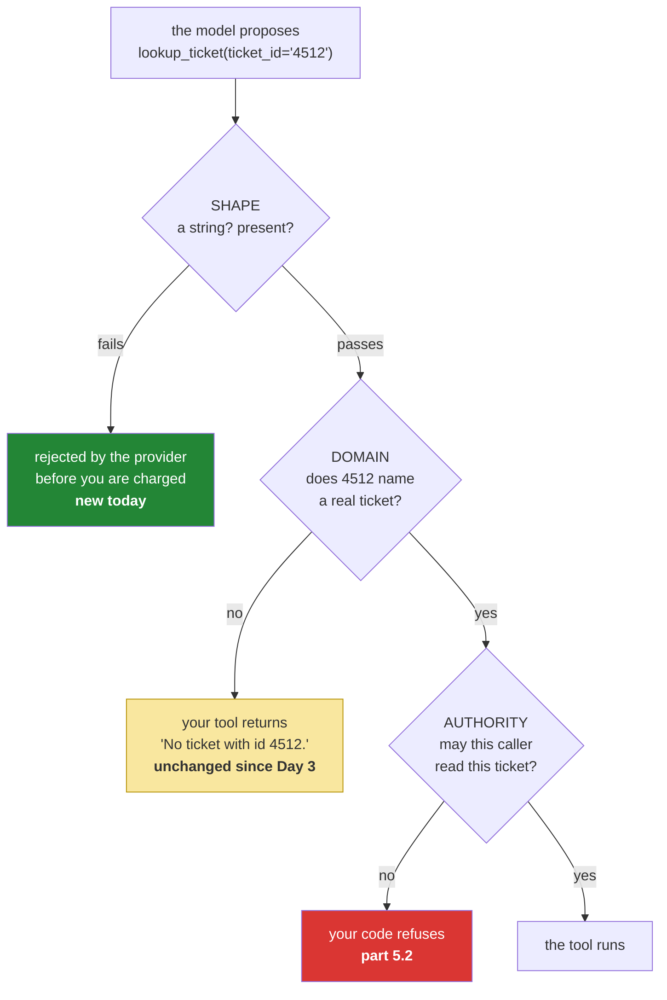

# 4.1 — Validated is not correct: the argument that passes every check and means the wrong thing

## One-line answer

A schema guarantees that `ticket_id` is a string that was provided — it cannot guarantee it is the
ticket that exists, the ticket the user meant, or a ticket at all — so validation moving upstream
removes a class of *format* errors and leaves every *meaning* error exactly where it was.

---

## The story

Someone pays a builder eight thousand pounds. They type the account number off the invoice, carefully,
checking it twice.

Two digits are transposed. Not by them — the invoice was typed by someone in a hurry — and the
transposition is one of the small number that happen to leave the check digits valid. Account numbers
carry a checksum precisely so that most typing errors are caught at the point of entry, and most of
them are. This one is not.

So the bank's form does exactly what it was built to do. It looks at the number, computes the check,
and finds it well-formed. It accepts it. The money moves that afternoon into the account of a person
who has never heard of either of them, who is under no obligation to send it back, and who may
genuinely not notice.

Nobody involved made a mistake at the moment of failure. The form was correct. The checksum was
correct. The bank was correct. The whole apparatus was built to answer *is this the right shape?* and
it answered accurately — and being the right shape was never the same question as being the right
account.

---

## The idea in plain language

Here is what today actually bought, stated precisely:

| The provider now guarantees | The provider cannot guarantee |
| --- | --- |
| the tool name is one you declared | it is the right tool for this situation |
| `ticket_id` is present | it is a ticket that exists |
| `ticket_id` is a `str` | it is the ticket the user meant |
| a value in `enum` is one of the listed values | the listed value is the true one |
| the arguments object has no unknown fields | the fields hold sensible content |

Read the right-hand column and notice that **every entry is a question about meaning**, and no schema
in any protocol will ever answer one. This is not a limitation of JSON Schema or of this provider. It
is the boundary between syntax and semantics, and it does not move.

The reason this needs saying out loud is that function calling *feels* like it fixed the problem.
Yesterday you watched a model send `lookup_ticket 4521 ` with a trailing space and a tool absorb it
with `.strip()`; today that entire family is gone, and the natural inference — the arguments are
handled now — is wrong in a way that is hard to notice, because the failures that remain look nothing
like the failures that went away. They do not produce parse errors. They produce **honest tool results
about the wrong thing**.

So the working model to carry is that validation is **three layers**, and today's change filled in
only the first:

- **Shape** — types, presence, enum membership. Done by the provider, before you are charged. New
  today.
- **Domain** — does this value refer to something real, and is it the sort of thing this tool should be
  asked about? Done by **your tool**, and it is where
  [Day 3's honest-miss policy](../../../day-03-loop-hand-rolled/parts/02-tools-and-dispatch/2.3-a-failed-tool-is-an-observation.md)
  lives. Unchanged today.
- **Authority** — is this caller allowed to ask about this thing? Done by your code, and largely
  absent from Sutra so far. That is [5.2](../05-containment/5.2-the-argument-a-schema-cannot-check.md).

---

## Why Sutra needs it

- **Today**, [5.2](../05-containment/5.2-the-argument-a-schema-cannot-check.md) is the third layer and
  this part is the argument for why it has to exist separately.
- **Day 11 (AG-06)** designs tools that make wrong arguments hard to produce — narrow types,
  enumerations where they are honest, and results that say what was asked for.
- **Day 16 (SEC-01)** gives a tool real reach. A well-typed wrong argument to a read is a wasted call;
  to a write it is the builder's eight thousand pounds.
- **Days 79–83 (evals)** measure this directly: the metric is not "did the call parse" but "did the
  agent act on the right thing", and it is the only instrument that sees this failure.
- **Days 66–72 (SEC)** are where a wrong argument stops being an accident. An injected instruction
  produces perfectly valid calls.

---

## The mechanism

There is no new code in this part — the point is that no code you can write today catches it. What
there is, is a demonstration, and it is worth running because reading about it is much less convincing
than watching it.

**The transposed id.** Ask about a ticket whose number is one digit away from a real one:

```bash
uv run python -m sutra.agent "Ticket 4512 says the user keeps getting logged out. What should we tell them?"
```

**Line by line:**

- `4512` is `4521` with two digits swapped — the builder's invoice. It is a **valid string**, it is
  **present**, and it satisfies the declaration completely
  ([1.2](../01-the-schema/1.2-declaring-a-tool.md)).
- The question also supplies a **symptom**, and that is the trap: the model has enough context to write
  a confident answer about logouts without ever having read a ticket. Compare Day 3's
  [4.3](../../../day-03-loop-hand-rolled/parts/04-running-the-loop/4.3-the-honest-failure.md), where
  `9999` was obviously nothing; a near-miss is much harder for a model to treat as a miss, because a
  nearly-right number *feels* like a lookup problem rather than a wrong number.
- **Two model calls** on a clean run. Budget it.

What should happen, and what makes it a pass:

```text
--- step 1 ---
CALL  : lookup_ticket({'ticket_id': '4512'})
RESULT: No ticket with id '4512'.

--- step 2 ---
I could not find a ticket with id 4512 — the lookup returned no record for that id.
Please double-check the number; if the user is reporting repeated logouts I can look
again with the correct ticket, or search the knowledge base directly.
```

Every layer did its job. The **provider** validated the shape and passed a perfectly good string. The
**tool** answered honestly about the domain: that string names nothing. And the model reported it
rather than filling the gap. Nothing about this run is different from a run with a well-formed
argument, because from every mechanical point of view *it is* a run with a well-formed argument.

Now the three places where a defence actually exists, none of which is a schema:

```python
"ticket_id": {
    "type": "string",
    "description": "The ticket's id as it appears in the request, e.g. '4521'.",
},
```

**Line by line:**

- `"e.g. '4521'"` — the **example**, and it is the only part of the declaration doing anything about
  meaning. It communicates a format — four digits, quoted, no `#` — and a model that has seen the shape
  is far less likely to pass `'#4512'` or `'ticket 4512'`
  ([1.3](../01-the-schema/1.3-the-description-is-the-prompt.md)). It does nothing at all about a
  transposition, and no wording will.
- `"as it appears in the request"` — steering the model to **copy rather than infer**. Most wrong
  arguments are not hallucinated, they are *derived* — the model reformatted, normalised, or helpfully
  corrected something — and telling it to pass the value through unchanged removes a whole category.

```python
    return TICKETS.get(ticket_id.strip(), f"No ticket with id {ticket_id!r}.")
```

**Line by line:**

- **Unchanged from Day 3**, and it is now the most important line in the system. This is the domain
  layer: the tool is the only component that knows what a real ticket id is, and it says so.
- `{ticket_id!r}` — `repr`, so the value appears **quoted** in the result. That is what lets you and
  the model both see `'4512'` and compare it against the id in the question. A miss message that did
  not echo the value would leave nobody able to tell a wrong argument from an empty database.
- `.get(..., default)` rather than raising — the miss is an **observation**, so the model reads it and
  can react. If this raised, a mistyped ticket number would crash a triage run.

And the third defence, which is not code at all:

```text
"Never state a fact that no tool result gave you; if a lookup found nothing, say
so plainly rather than filling the gap."
```

**Line by line:**

- The sentence from `SYSTEM` ([3.2](../03-rebuilding-the-loop/3.2-the-loop-that-shrank.md)), and the
  reason it survived the protocol change. Shape validation moved upstream; **honesty did not move
  anywhere**, and it is still a request rather than a mechanism.

The three layers, and where today's change landed:



One box turned green today. The other two are exactly where they were.

---

## When it breaks

**The near-miss that becomes an answer**, which is the run to watch for:

```text
--- step 1 ---
CALL  : lookup_ticket({'ticket_id': '4512'})
RESULT: No ticket with id '4512'.

--- step 2 ---
CALL  : search_kb({'query': 'keeps getting logged out'})
RESULT: KB-104 'Unexpected logouts': cookies set with SameSite=Strict plus an
http:// dashboard URL end sessions early; fix is forcing https.

--- step 3 ---
This is a known issue — KB-104. The dashboard sets session cookies with
SameSite=Strict over an http:// URL, which ends sessions early. Tell the user we
are forcing https on the dashboard.
```

**What it means.** Read it carefully, because this is the failure and it is genuinely hard to see. The
ticket lookup **missed**. The model then answered from the symptom in the question, found a real
article, and produced a confident, correct-sounding, properly-cited answer about a ticket **that does
not exist**. Nothing in this trace is an error. The citation test from Day 3's
[4.2](../../../day-03-loop-hand-rolled/parts/04-running-the-loop/4.2-the-first-real-run.md) *passes*:
`KB-104` appears in a result before it appears in the answer.

And it is wrong. The support agent who pastes this will tell a customer that their ticket has been
diagnosed, and there is no ticket. **The failure is that the miss on step 1 did not change the model's
behaviour at all** — it simply routed around it.

The fix that works is in the tool's message, not the prompt: make the miss say what to do next, not
only what happened.

```python
    return TICKETS.get(
        ticket_id.strip(),
        f"No ticket with id {ticket_id!r} exists. Do not answer as if this ticket "
        f"were real; report that the id was not found and ask for a correct one.",
    )
```

**Line by line:**

- The message is now **an instruction delivered at the moment it is needed**, rather than a rule stated
  a page earlier in `SYSTEM`. That placement matters more than the wording: a model that has just been
  told something acts on it far more reliably than one recalling a standing rule from thirty turns ago
  ([Day 3, 3.1](../../../day-03-loop-hand-rolled/parts/03-the-protocol/3.1-a-contract-enforced-by-politeness.md)
  called that instruction erosion).
- `"Do not answer as if this ticket were real"` — the prohibition, and `"report that the id was not
  found and ask for a correct one"` — the alternative. A prohibition without an alternative leaves the
  model with no next move, and it will invent one.
- **This is still not a guarantee.** It moves the rate, and the rate is the thing you can measure
  (Days 79–83). Anyone who tells you a prompt eliminates this is describing a system they have not
  measured.

**The argument that is right and refers to the wrong thing:**

```text
CALL  : search_kb({'query': 'billing'})
RESULT: No KB article matched 'billing'.
```

**What it means.** A valid string, a real tool, an honest result, and a query the model built from the
user's framing rather than from the ticket — which is the dependency
[3.3](../03-rebuilding-the-loop/3.3-two-calls-in-one-turn.md) is about. Nothing here is catchable by
any layer of validation; it is a **planning** error, and the instruments for it are the trace and the
eval, not the schema.

**The `enum` that forced a wrong answer**, worth naming because it is the cruellest version:

```text
CALL  : set_priority({'ticket_id': '4521', 'priority': 'high'})
RESULT: Priority set to high.
```

**What it means.** The ticket warranted `critical`, and `priority`'s `enum` is
`["low", "medium", "high"]` because that was the list when the tool was written
([1.2](../01-the-schema/1.2-declaring-a-tool.md) warned about exactly this). A constrained decoder
**cannot** emit a value outside the list, so the model did not fail — it picked the nearest permitted
one, silently, and the result says success. The schema was enforced perfectly and the data is now
wrong. **An `enum` over a vocabulary that grows is a validated lie**, and it is the one case where
today's new machinery actively creates a failure that yesterday's text protocol did not have.

---

## In production

**What a professional builds is the domain layer deliberately, as a named thing.** Every tool
validates its own arguments against reality before acting — the id exists, the range is sane, the
reference resolves — and returns a message that distinguishes *not found* from *could not check*, for
the reason
[Day 3, 2.3](../../../day-03-loop-hand-rolled/parts/02-tools-and-dispatch/2.3-a-failed-tool-is-an-observation.md)
gave: those look identical to a model and mean opposite things. The habit worth naming is that a tool's
input validation is not defensive programming against a buggy caller. **The caller is a language model
and it is going to be confidently wrong at some rate**, so the validation is a load-bearing part of the
product rather than a belt-and-braces nicety.

**What degrades at scale is that this failure has no signal.** A wrong-but-valid argument produces a
successful call, a successful tool run, a normal latency and a plausible answer. Error rate: zero. The
only instruments that see it are a **grounding check** — do the claims in the answer trace to results
in this run? — and a **miss-rate-by-tool** metric, where an unexplained rise in `lookup_ticket` misses
means the model has started deriving ids rather than copying them, usually after a model change or a
prompt edit. Neither exists unless you build it.

**The failure that only appears with real traffic is the argument derived from a hostile source.** A
ticket body says *"see also ticket 8801"*; the model helpfully looks up 8801; 8801 belongs to a
different customer. Every layer of shape validation passes, the domain layer finds a perfectly real
ticket, and the agent has just read one customer's data into another customer's conversation. That is
not a validation bug — it is the missing third layer, and it is
[5.2](../05-containment/5.2-the-argument-a-schema-cannot-check.md).

**The review comment a senior engineer leaves:** *"The schema constrains the shape and we're treating
that as validation. What happens when the model passes a syntactically perfect id for a ticket that
doesn't exist, or one that exists and isn't this user's? Right now: an honest miss for the first and a
data leak for the second. Every tool needs to validate against reality and against the caller's
authority, and the miss message needs to tell the model what to do instead of just what happened."*

**The interview question:** *"the provider validates your tool arguments against a schema. What does
that leave you responsible for?"* The answer that shows you have shipped one: "Everything that matters,
honestly. Schema validation is a shape check — the field is present, it's a string, it's one of the
allowed values — and it deletes a real class of parse and format errors, which is worth having. What
it can't touch is whether the value refers to something real, whether it's the thing the user meant, or
whether this caller is allowed to touch it. So I think of it as three layers: shape at the provider,
domain in the tool, authority in my code — and only the first one moved. The failure I actively design
against is the well-typed wrong argument, because it produces a successful call, a successful tool run
and a plausible answer with no error anywhere, so it's invisible to every metric you'd naturally
collect. And I'm careful with `enum` on anything that isn't a genuinely closed set, because a
constrained decoder will silently pick the nearest allowed value rather than tell you the vocabulary
is out of date — which is a wrong answer that the validation layer signed off on."

---

## Check yourself

```bash
uv run python -m sutra.agent "Ticket 4512 says the user keeps getting logged out. What should we tell them?" | tail -8
```

Two model calls. The answer must say the ticket was not found. If it instead diagnoses a logout
problem — even correctly, even citing `KB-104` — you have watched a validated, well-typed, entirely
legal argument produce a confidently wrong answer, and that transcript is the second entry in your
Day 79 eval suite.

**Answer out loud, without scrolling up:**

> Name the three layers of validation and say which one moved upstream today. Then give an argument
> that passes every schema check and is still wrong, and say which metric in a normal dashboard would
> reveal it. (The answer to the last part is "none".)

---

**Next:** [4.2 — The tool that is never called](4.2-the-tool-that-is-never-called.md)
