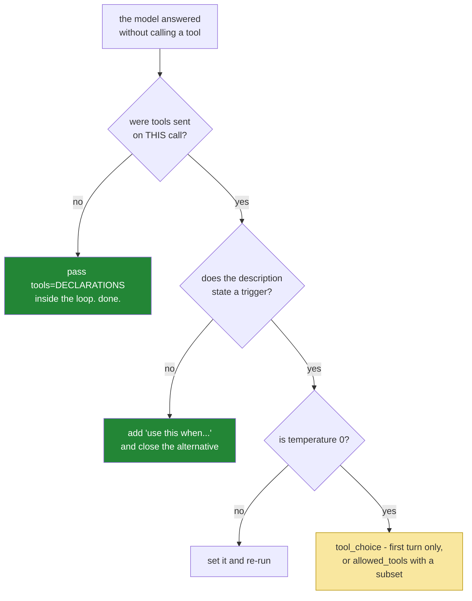

# 4.2 — The tool that is never called: and why forcing it is the last thing you try

## One-line answer

A model that answers in prose instead of calling your tool is almost never fixed by forcing a call —
`tool_choice: "any"` turns *never* into *always*, which in a loop means the model can no longer say it
is finished — and the fix is usually a description that states a trigger.

---

## The story

An electronics shop found that its extended warranty was barely selling. Some assistants offered it
when it made sense — a washing machine, a laptop — and some never mentioned it at all, and nobody
could say which was which.

So a rule went up in the staff room: **always offer the warranty.** No exceptions, no judgement.

Attach rates went up that month and everybody was pleased. Complaints went up too, and it took longer
for anyone to connect the two. People buying a six-pound cable were being asked whether they wanted
three years of accidental damage cover on it. Customers who had said no to the warranty on the way in
were asked again at the till. One assistant, who was following the rule exactly, offered it on a
replacement fuse.

The rule fixed *never* by installing *always*. What the shop actually wanted was **when it is
appropriate**, and a rule cannot express that — a rule can only be on or off. What did work, eventually,
was three lines on the same noticeboard: *offer it on anything over fifty pounds, on anything with a
motor, and on anything a customer says they will be travelling with.* Not a rule about frequency. A
description of the situation.

---

## The idea in plain language

You will meet this run today:

```text
--- step 1 ---
I'd be happy to help with that. Based on what you've described, repeated logouts
are usually a session-cookie issue — I'd suggest asking the user to clear cookies
and confirm they're on https.
```

No call. The tools were available, the model had a question it could obviously have used them for,
and it answered from its own knowledge instead. Day 3's
[4.2](../../../day-03-loop-hand-rolled/parts/04-running-the-loop/4.2-the-first-real-run.md) called this
the plausible-sounding failure and it is unchanged by function calling — the schema controls the
*shape* of a call, not whether one happens.

There is a control that forces one. It is `tool_choice`, it has three settings, and reaching for it
first is the staff-room rule:

| `tool_choice` | What it does | When it is right |
| --- | --- | --- |
| `"auto"` | the default — the model decides | almost always |
| `"any"` | the model **must** call a tool this turn | a first turn that cannot sensibly be answered without data |
| `"none"` | the model **must not** call a tool this turn | a final turn where you want prose, and nothing else |

And here is the thing that makes `"any"` genuinely dangerous inside a loop rather than merely blunt.
Your loop's exit is *the model replying without a call*
([3.2](../03-rebuilding-the-loop/3.2-the-loop-that-shrank.md): `if not calls: return`). Set
`"any"` on every call and you have removed the exit. The model is required to call a tool on the turn
where it has everything it needs and just wants to answer — so it calls something, anything, again,
until [Day 3, 5.1](../../../day-03-loop-hand-rolled/parts/05-containment/5.1-the-step-budget.md)'s step
budget stops the run. **You will have converted "sometimes does not use tools" into "can never
finish".**

So the diagnosis order matters, and it is worth memorising because the tempting move is fourth:

1. **Were tools actually sent?** `tools=DECLARATIONS`, inside the loop, on every call
   ([2.4](../02-the-round-trip/2.4-resend-the-steps-as-received.md)). A missing parameter produces
   exactly this symptom and no error. Check this first, every time.
2. **Does the description state a trigger?** Most descriptions say what a tool does and never say when
   to reach for it ([1.3](../01-the-schema/1.3-the-description-is-the-prompt.md)). Answering directly
   looked equally valid because nothing said otherwise.
3. **Is the temperature low?** A warm model paraphrases its way past instructions it would otherwise
   follow (Day 2, [4.2](../../../day-02-llm-mechanics/parts/04-sampling-the-dial/4.2-turning-the-dial.md)).
4. **Only then `tool_choice`**, and scoped to a turn rather than to the loop.

---

## Why Sutra needs it

- **Today**, this is the failure most likely to make your first function-calling run look worse than
  yesterday's text-protocol run — which is confusing, and is almost always item 1 on that list.
- **[5.1](../05-containment/5.1-the-declaration-is-the-new-boundary.md)** uses the `allowed_tools`
  form of `tool_choice` for containment rather than for encouragement — the same control, doing the
  job it is actually good at.
- **Day 6 (ADK-03, AG-05)** is instruction design, where "describe the situation, do not assert a
  rule" is the general form of this part's lesson.
- **Day 16 (ADK-18, AG-07)** adds search grounding, where the decision of *when* to retrieve is the
  entire design of the day.
- **Days 79–83 (evals)** score tool selection. Zero-tool runs are a tracked condition there because of
  what you see here.

---

## The mechanism

Start with the diagnosis, not the cure. The first check is free and catches most of it:

```bash
uv run python -c "
import inspect, sutra.agent as A
src = inspect.getsource(A.run_loop)
print('tools= passed:', src.count('tools=DECLARATIONS'))
print('inside the loop:', 'for step in' in src.split('tools=DECLARATIONS')[0])
"
```

**Line by line:**

- `src.count('tools=DECLARATIONS')` — **must be `1`, and it must be the call inside the loop.** Zero is
  the silent failure; the count alone catches the most common cause of this whole part.
- `'for step in' in src.split('tools=DECLARATIONS')[0]` — is the `for` statement *before* the call? If
  this prints `False`, the tools are being passed once, outside the loop, and step 2 onward has none.
- **Zero model calls.** Structural checks on your own source are free; run them before spending quota
  on a hypothesis.

If the tools are being sent, the second fix is the noticeboard rather than the rule:

```python
    "description": (
        "Fetch the full text of one support ticket by its id. "
        "Use this first whenever the user names or implies a specific ticket, "
        "before offering any diagnosis. "
        "Returns the ticket's title and body, or a message saying no such ticket exists."
    ),
```

**Line by line:**

- `"Use this first whenever the user names or implies a specific ticket"` — **the trigger**, stated as
  a situation. "Whenever the user names or implies" is a description of circumstances, which a model
  can match against what is in front of it; "always call this tool" is a rule, which it can only obey
  or not.
- `"before offering any diagnosis"` — closing the alternative. The failure above is not the model
  forgetting the tool exists; it is the model choosing to answer, and this clause says that answering
  is not available yet.
- `"or a message saying no such ticket exists"` — naming the miss, which does double duty here: it
  makes the tool feel safe to call. A model that does not know what failure looks like will sometimes
  avoid a tool rather than risk an unrecoverable outcome.
- **This is prompt engineering inside a schema field**, and it is the fix in perhaps four cases out of
  five ([1.3](../01-the-schema/1.3-the-description-is-the-prompt.md)).

Only if that is not enough, the control — and note carefully where it is applied:

```python
        forced = {"temperature": 0.0, "tool_choice": "any"} if step == 1 else {"temperature": 0.0}
        interaction = ask(client, history, tools=DECLARATIONS, config=forced)
```

**Line by line:**

- `if step == 1 else` — **the first turn only.** On step 1 the model has a question and no data, so
  requiring a tool call is honest: there is nothing it could legitimately answer yet. From step 2
  onward it must be free to stop, or the loop has no exit.
- `"tool_choice": "any"` — inside `generation_config`, which `ask` passes through as `config`
  ([3.1](../03-rebuilding-the-loop/3.1-one-door-one-new-parameter.md): a dict-shaped parameter absorbs
  new settings without a signature change). Verified against
  `ai.google.dev/gemini-api/docs/function-calling` on 2026-08-25; the three modes are `auto` (the
  default), `any`, and `none`.
- `"temperature": 0.0` in **both** branches — the setting that is not conditional stays in both, rather
  than being merged in afterwards, because a config assembled in two places is a config that will
  eventually disagree with itself.
- **What this does not do:** it does not make the model call the *right* tool. `"any"` requires a call
  and says nothing about which — so a badly-described tool set will now produce a confident call to the
  wrong tool instead of a confident answer with no call. You have moved the failure, and
  [4.1](4.1-validated-is-not-correct.md) is where it landed.

The narrower form, which is the one worth remembering:

```python
        config = {
            "temperature": 0.0,
            "tool_choice": {"allowed_tools": {"mode": "any", "tools": ["lookup_ticket"]}},
        }
```

**Line by line:**

- `"allowed_tools"` — restricts the choice to a named subset **and** applies a mode to it. Here: this
  turn must call a tool, and the only tool it may call is `lookup_ticket`.
- `"tools": ["lookup_ticket"]` — a list of names, from the declarations you sent. This is a much
  sharper instrument than `"any"`: it expresses *"the next thing that happens is a ticket lookup"*,
  which is a plan, rather than *"do something"*, which is a rule.
- Its real use is not encouragement but **containment**: with `mode: "any"` and a one-tool list, or
  with the same structure used to exclude a dangerous tool on a turn where it must not fire, this
  becomes a per-turn capability gate. That is
  [5.1](../05-containment/5.1-the-declaration-is-the-new-boundary.md)'s subject.

The decision, drawn:



The yellow box is last for a reason, and the reason is the next section.

---

## When it breaks

**`tool_choice: "any"` applied to every call in the loop** — the staff-room rule, in a trace:

```text
--- step 4 ---
CALL  : search_kb({'query': 'logged out dashboard session'})
RESULT: KB-104 'Unexpected logouts': cookies set with SameSite=Strict...

--- step 5 ---
CALL  : search_kb({'query': 'unexpected logouts SameSite'})
RESULT: KB-104 'Unexpected logouts': cookies set with SameSite=Strict...

--- step 6 ---
CALL  : lookup_ticket({'ticket_id': '4521'})
RESULT: Title: Keeps getting logged out. Body: I keep getting logged out...

=== ANSWER ===
Stopped after 6 steps without an answer. Last result: Title: Keeps getting...
```

**What it means.** The model had everything it needed by step 2 and was **required to call a tool** on
every turn after it, so it called things it had already called, with slightly different queries,
because that was the only legal move available. It never answered because answering was not permitted.

The run costs six calls and produces nothing, and note the shape of the failure: it looks exactly like
a confused model, and it is a configuration that removed the exit. **The smallest fix is
`if step == 1`.** The broader lesson is that any setting which constrains what the model may do on a
turn has to be reasoned about against *every* turn of the loop, not just the one you were thinking
about.

**The forced call to the wrong tool:**

```text
--- step 1 ---
CALL  : search_kb({'query': 'ticket 4521 status'})
RESULT: No KB article matched 'ticket 4521 status'.
```

**What it means.** `"any"` was set on the first turn, so a call happened; nothing said *which*, and the
descriptions did not distinguish the two tools clearly enough
([1.3](../01-the-schema/1.3-the-description-is-the-prompt.md)). You forced an action without supplying
a plan. The `allowed_tools` form is the fix if you genuinely know what the first call should be — and
if you do know, that is a strong hint that this turn should not have been the model's decision at all.

**`tool_choice: "none"` left set:**

```text
--- step 1 ---
I can help with that. I'd need to look up ticket 4521 to say anything specific —
could you paste the ticket contents?
```

**What it means.** Identical to the symptom this whole part started with, from the opposite cause: the
model is **forbidden** to call tools and is politely explaining what it would need. Worth knowing
because the trace is indistinguishable from the "tools were never sent" case, and the two are debugged
in completely different places. Print the config alongside the trace when this is ambiguous.

**The description that got longer instead of clearer:**

```python
    "description": (
        "IMPORTANT: You MUST use this tool. Always call lookup_ticket. Do not "
        "answer without calling lookup_ticket first. This is required."
    ),
```

**Line by line:**

- Four sentences that assert frequency and never describe a situation. This is the staff-room rule
  again, written into the field that was supposed to be the noticeboard.
- It also **deleted the useful content**: no statement of what the tool returns, no mention of the miss
  case, nothing to help the model choose between this tool and its neighbour. Emphasis crowded out
  information.
- It costs more tokens on every call, forever
  ([Day 3, 5.2](../../../day-03-loop-hand-rolled/parts/05-containment/5.2-the-transcript-is-a-bill.md)),
  to be less useful. **When a description is not working, the first question is what situation it
  fails to describe — not how loudly it fails to describe it.**

---

## In production

**What a professional does with `tool_choice` is treat it as a per-turn capability control, not as a
persuasion tool.** Its good uses are all structural: force a call on a first turn that cannot be
answered without data; restrict a turn to a named subset when the plan is known; forbid tools entirely
on a final summarisation turn so the model cannot wander off and start working again. All three are
statements about *what this turn is for*, which the loop knows and the model does not. Using it to
compensate for a description that does not describe anything is where it goes wrong, because it
converts a selection problem into a mandatory-call problem and those are harder.

**What degrades at scale is that "the agent didn't use the tool" is not one failure.** At volume it
splits into several with different causes and different fixes: tools not sent on later turns
(a code bug, usually in a refactor), descriptions that lost their trigger clause (a prompt edit),
selection drift after a model change ([1.3](../01-the-schema/1.3-the-description-is-the-prompt.md):
descriptions are tuned to a model, implicitly), and genuine cases where answering directly was correct.
The metric that separates them is **tool calls per run, bucketed** — not the mean, which hides
everything, but the count of zero-tool runs as its own tracked series. A step change in that series
after a deployment is one of the highest-signal alerts an agent system has.

**The failure that only appears with real traffic is the forced call on a turn that should have
refused.** You set `"any"` on the first turn because a first turn always needs data. Then a user sends
something the agent should decline — out of scope, abusive, a request it has no business acting on —
and the model, required to call a tool, calls one. It has been denied the option of simply saying no.
For read-only tools that is a wasted call; for anything with reach it is an action taken on a request
that should have been refused at the door. Anywhere `tool_choice: "any"` is set, there must be a path
by which the model can still decline, which usually means the forcing is conditional on something your
code has already checked.

**The review comment a senior engineer leaves:** *"`tool_choice: "any"` is set for every call in the
loop, which means the model can never produce a final answer — every run will terminate on the step
budget. Scope it to the first turn, and fix the description instead: it says what the tool does and
never says when to use it, which is why it wasn't being called."*

**The interview question:** *"your agent has a tool and doesn't use it. Walk me through what you
check."* The answer that shows you have debugged it rather than read about it: "First, whether the
tools are actually being sent on that call — in a loop it's easy to pass them on the first request and
not the rest, and there's no error, just a model that suddenly talks about what it can't do. Second,
the description: nine times out of ten it says what the tool does and never says when to reach for it,
so answering directly looked equally reasonable. Third, temperature, because a warm model paraphrases
past instructions. Forcing a call with a tool-choice setting is last, and scoped to a single turn —
if I set it for every turn in the loop I've removed the model's ability to say it's finished, so every
run ends on the step budget instead of with an answer. And forcing a call doesn't make it the right
call; it converts 'answered without a tool' into 'called something', which is a worse failure because
it looks like work."

---

## Check yourself

```bash
uv run python -m sutra.agent "Ticket 4521 says the user keeps getting logged out. What should we tell them?" 2>&1 | grep -c "^CALL  :"
```

It must print `2`. If it prints `0`, work the diagnosis list from the top — tools sent, then trigger,
then temperature — and **do not** reach for `tool_choice` until you have checked all three and can say
which one you ruled out and how.

**Answer out loud, without scrolling up:**

> Give the four things you check, in order, when a tool is never called. Then say exactly what happens
> to a loop when `tool_choice: "any"` is set on every call, and why that failure looks like a confused
> model rather than a configuration mistake.

---

**Next:** [5.1 — The declaration is the new boundary](../05-containment/5.1-the-declaration-is-the-new-boundary.md)
