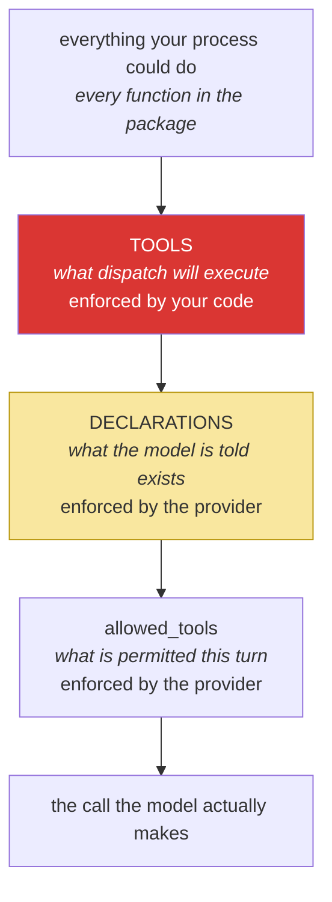

# 5.1 — The declaration is the new boundary: two lists that must never drift

## One-line answer

Yesterday one dict answered *"what can this agent do?"*; today there are two lists in two files —
what the model is told exists, and what your code will actually run — and the security question is no
longer "what is in the table" but "do the two lists agree, and who would notice if they stopped".

---

## The story

A hotel gives every guest a keycard. Yours opens your room, the gym, and the pool, and nothing else.

Behind that are two completely separate things, maintained by two completely separate groups of
people. There is a **door system** — every lockable door in the building, including the plant room,
the linen store, the wine cellar and the manager's office, each with a reader on it. And there is a
**card profile** — a list saying which door groups a guest card belongs to.

Nobody guarding the front desk thinks about the door system. Nobody wiring a new reader thinks about
card profiles. For years this works, because the two lists were set up together by someone who
understood both.

Then a refurbishment adds a door to the wine cellar and, for convenience during the works, the
contractor puts it in the same door group as the linen store. The linen store is on the housekeeping
profile. Nothing is announced, nothing is broken, and every card check still passes exactly as
designed — for eight months, until a stock count finds the cellar several hundred bottles light.

The lock worked. The card worked. **The two lists stopped agreeing and there was nothing whose job it
was to notice.**

---

## The idea in plain language

[Day 3, 2.2](../../../day-03-loop-hand-rolled/parts/02-tools-and-dispatch/2.2-the-dispatch-table-is-the-boundary.md)
made a strong claim: the set of things an agent can do is exactly the set of keys in `TOOLS`. It was
true, and it was easy to check, because there was one list and it was six words long.

Today there are two:

| List | Lives in | What it controls | Read by |
| --- | --- | --- | --- |
| `DECLARATIONS` | `sutra/tools.py` | what the model is **told** exists — and, at the provider, what names it may emit | the provider, the model |
| `TOOLS` | `sutra/loop.py` | what your code will actually **execute** | your dispatch |

Both are real boundaries and they do different jobs. `DECLARATIONS` is the **advertisement**:
constrained decoding means the model cannot emit a name that is not in it, so it bounds what can be
*asked for*. `TOOLS` is the **gate**: it bounds what can be *done*, and it is the one that still holds
if the provider changes, if the constraint is loose, or if you move to a model whose tool support is
weaker (Day 9 makes that concrete).

So the capability set is the **intersection**, and the two ways they can drift are not symmetrical:

- **Declared but not dispatchable.** The model asks for a tool your table does not have, and
  `_dispatch` returns `Unknown tool ...` as an observation
  ([2.2](../02-the-round-trip/2.2-the-call-comes-back-parsed.md)). Wasteful, visible in a trace,
  harmless.
- **Dispatchable but not declared.** The model is never told the tool exists, so it never asks. This is
  the wine cellar. The capability is **live in your process, reachable by one line in another file**,
  and it is invisible to anyone reviewing `sutra/tools.py` to answer "what can this agent do?" A future
  edit — a new declaration, a copy-paste, an experiment on a branch — turns it on with no review of the
  thing being turned on.

The second is the one worth building a habit against, and the habit is simple: **the two lists are
asserted equal by a test.** Not documented as equal, not reviewed as equal. Asserted, in `./m check`,
so drift is a red test rather than a stock count.

---

## Why Sutra needs it

- **Today**, [5.2](5.2-the-argument-a-schema-cannot-check.md) adds the layer this one does not cover:
  a declared, dispatchable tool called with an argument the caller has no right to.
- **Day 11 (AG-06)** and **Day 15 (ADK-17)** grow the tool set. An OpenAPI wrapper can generate dozens
  of declarations from a spec, and "what can this agent do" stops being answerable by reading a file at
  all unless you have kept it answerable.
- **Days 62–65** put a human between the proposal and the execution. That gate attaches to `TOOLS`, not
  to `DECLARATIONS` — you approve what will *run*.
- **Day 16 (SEC-01)** and **Day 71 (AG-31)** give tools genuine reach: code execution, a browser. The
  discipline has to already exist before the capability arrives, which is Principle 13 in one sentence.
- **Day 32 onward (MCP)** publishes declarations to clients you did not write, at which point the
  advertisement is genuinely public.

---

## The mechanism

The test, which is the whole part. Put it in `tests/test_agent.py` and in `./m check`:

```python
def test_declared_and_dispatchable_are_the_same_set() -> None:
    """The advertisement and the gate must never drift (Principle 13)."""
    declared = {d["name"] for d in DECLARATIONS}
    dispatchable = set(TOOLS)
    assert declared == dispatchable, (
        f"declared but not dispatchable: {declared - dispatchable}; "
        f"dispatchable but not declared: {dispatchable - declared}"
    )
```

**Line by line:**

- `{d["name"] for d in DECLARATIONS}` — a **set comprehension**, so the comparison is about membership
  rather than order. Two lists in different orders are the same capability set and should not fail a
  test.
- `set(TOOLS)` — iterating a dict yields its keys, so this is the dispatchable names. Same idiom as
  Day 3's `_menu_is_complete`
  ([3.1](../../../day-03-loop-hand-rolled/parts/03-the-protocol/3.1-a-contract-enforced-by-politeness.md)),
  which this test replaces — that one checked a hand-typed menu against the table, and today's menu is
  the declarations.
- `assert declared == dispatchable` — **equality, in both directions.** A subset check would pass the
  wine cellar. This is the one assertion in the file where the direction of the comparison is the
  entire point.
- The message computes **both difference sets and names them separately**, because the two failures
  have different severities and different fixes. A test that fails with `assert False` tells you
  something is wrong; this one tells you which of two problems you have.
- **Zero model calls, runs in milliseconds, and it is the most valuable test on this day.** Cheap
  structural assertions about capability are worth more than elaborate behavioural ones, because they
  hold whatever the model does.

Then the second control, which is per-turn rather than per-deployment
([4.2](../04-the-limits/4.2-the-tool-that-is-never-called.md) introduced the syntax for a different
purpose):

```python
        config = {
            "temperature": 0.0,
            "tool_choice": {"allowed_tools": {"mode": "auto", "tools": ["lookup_ticket", "search_kb"]}},
        }
```

**Line by line:**

- `"allowed_tools"` with `"mode": "auto"` — narrows *which* tools may be chosen on this turn while
  leaving the model free to call none. Compare `"mode": "any"`, which also forces a call and removes
  the loop's exit.
- `"tools": [...]` — a **per-turn subset** of what was declared. Today it is the whole set and buys
  nothing, and it is written out because of what it becomes: when Sutra has a tool that writes, the
  turn after an approval can permit exactly that one tool and nothing else, which is a much stronger
  statement than "the model was asked nicely to do only that".
- The general shape worth naming: `DECLARATIONS` is what exists, `allowed_tools` is what is permitted
  *now*, and `TOOLS` is what can actually run. **Three narrowing rings**, and only the innermost one is
  enforced by your own code.

The rings, drawn once:



Read the red box's position. It is **outside** the yellow one, which is the uncomfortable and important
fact: your executable capability is broader than what you advertise, and the gap is where the wine
cellar lives. The test above is what keeps the gap at zero.

And the question to be able to answer in one command, because a boundary you cannot inspect is not
one:

```bash
uv run python -c "
from sutra.tools import DECLARATIONS
from sutra.loop import TOOLS
print('advertised :', sorted(d['name'] for d in DECLARATIONS))
print('executable :', sorted(TOOLS))
print('writes     :', 'none - both tools are reads over synthetic dicts')
"
```

**Line by line:**

- Two lists printed side by side, so drift is visible to a human as well as to a test. **A capability
  audit should be one command**, and the day it takes three files and a conversation is the day nobody
  runs it.
- `'writes'` printed as a literal string with the honest answer — Sutra has no tool that changes
  anything, and saying so out loud is the containment story
  ([Day 3, 1.1](../../../day-03-loop-hand-rolled/parts/01-loop-anatomy/1.1-the-navigator-and-the-driver.md):
  "what may the loop execute?"). The line becomes a real check the day a write tool exists, and until
  then it is a statement you should be able to make without hedging.

---

## When it breaks

**The declaration added without the function**, which is the harmless direction:

```text
--- step 1 ---
CALL  : escalate_ticket({'ticket_id': '4521', 'reason': 'known issue'})
RESULT: Unknown tool 'escalate_ticket'. Available: lookup_ticket, search_kb.

--- step 2 ---
I could not escalate the ticket — that action is not available to me. Based on the
ticket and KB-104, I'd suggest...
```

**What it means.** Somebody declared a tool and did not write it, or wrote it in a module that is not
imported. The model asked, the gate refused, the denial went back as an observation, and the model
adapted — the exact behaviour Day 3's
[2.2](../../../day-03-loop-hand-rolled/parts/02-tools-and-dispatch/2.2-the-dispatch-table-is-the-boundary.md)
designed for. **Nothing bad happened**; a call and a step were wasted, and the test above turns it into
a red build instead of a puzzle in a trace.

**The function added without the declaration** — the wine cellar, and note that there is no output to
show:

```text
(nothing. the tool is never called, so there is no trace, no error, and no line
in any log. it simply sits in TOOLS.)
```

**What it means.** A capability is live in the process and undeclared. Everything works. The tool might
be a leftover from an experiment, a helper someone added to the dict "so it's ready", or a genuinely
dangerous function that was never meant to be reachable. The risk is not today's behaviour — it is
that the distance between *not exposed* and *exposed* is one line in a different file, added by
somebody who is thinking about a feature rather than about a boundary, and reviewed by somebody
reading a diff to `tools.py` that contains a plausible-looking declaration.

**The smallest fix is the equality assertion.** The habit that goes with it: **`TOOLS` is not a
convenience registry.** Nothing goes in it speculatively, and a function that is not meant to be
reachable does not get a key.

**The test that was written as a subset:**

```python
assert declared <= dispatchable  # 💥 passes the wine cellar
```

**Line by line:**

- It expresses "everything we advertise can actually run", which is a real and reasonable property, and
  it is the *other* direction from the one that matters.
- It passes with a hundred undeclared executable tools in `TOOLS`. The failure it catches is the
  visible one; the failure it misses is the invisible one.
- **When both directions are checkable, check both.** The asymmetry in what they cost you is exactly
  the asymmetry a subset check throws away.

---

## In production

**What a professional treats the capability list as is a reviewed artifact with its own approval
path.** Adding a tool to an agent is not the same kind of change as fixing a bug in one, and mature
systems make it a different kind of change: a separate file, a required reviewer, sometimes an
explicit allowlist in configuration that must be updated in a different repository. The reason is not
ceremony. It is that everything else — approval gates, audit, rate limits, blast-radius reasoning — is
derived from this list, so a quiet addition invalidates every one of those conclusions at once.

**What degrades at scale is answerability.** Two hand-written declarations are a file you read. Forty
declarations generated from an OpenAPI spec (Day 15), plus tools discovered from MCP servers at
runtime (Day 32), plus other agents exposed as tools (Day 42), and "what can this agent do?" becomes a
question you can only answer by running something. That is survivable and it changes what you must
build: an endpoint or a command that **enumerates the live capability set**, snapshotted into your
deploy artifacts, so a change in what an agent can do shows up as a diff somebody sees. Systems that
skip this discover their capability surface during an incident.

**The failure that only appears with real traffic is the dynamically-discovered tool.** From Day 32,
some declarations will not be written by you at all — they arrive from an MCP server at connection
time. The server's operator can add a tool, and your agent acquires a capability between one deploy
and the next, with no diff in your repository. Every serious MCP deployment ends up pinning or
allowlisting the tool names it will accept from a server, for precisely this reason, and the instinct
to do that comes from having once maintained two lists by hand and watched them drift.

**The review comment a senior engineer leaves:** *"There's a function in `TOOLS` with no declaration.
Either declare it, in a change that gets reviewed as a capability addition, or take it out of the
table — a callable that only needs one line elsewhere to become reachable is not 'not exposed', it's
'exposed pending a typo'. And make the set equality a test, both directions, in `./m check`."*

**The interview question:** *"with function calling, what actually limits what your agent can do?"* The
answer that shows you have thought past the happy path: "Two things, and they're in different places
with different enforcement. The declarations bound what the model can *ask* for, because constrained
decoding won't emit a name I didn't declare — that's enforced by the provider. My dispatch table bounds
what can actually *run*, and that's the one I control and the one that still holds if I change provider
or if the constraint is looser than I think. The security question is whether those two agree, and the
dangerous drift is one-directional: something executable but undeclared is invisible in review and one
line away from live. So I assert set equality in CI, in both directions, and I keep the declaration
file as a reviewed artifact rather than a registry people add to speculatively. Per-turn I'll also use
allowed-tools to narrow what's permitted on a given turn — that's how an approval gate can permit
exactly one action and nothing else."

---

## Check yourself

```bash
uv run python -m pytest tests/test_agent.py -q -k same_set
```

Green. Now break it both ways and watch what each costs you: add a name to `TOOLS` with a stub
function and re-run the test — red, and note that **nothing else in the project would have told you**.
Then remove it, add a bogus declaration instead, and run the agent — you get an `Unknown tool`
observation in the trace, visible and harmless. **The asymmetry between those two experiments is the
whole part.**

**Answer out loud, without scrolling up:**

> Name the two lists and say which one the provider enforces and which one you do. Then say which
> direction of drift is dangerous and why it produces no output at all, and why a subset assertion is
> the wrong test.

---

**Next:** [5.2 — The argument a schema cannot check](5.2-the-argument-a-schema-cannot-check.md)
