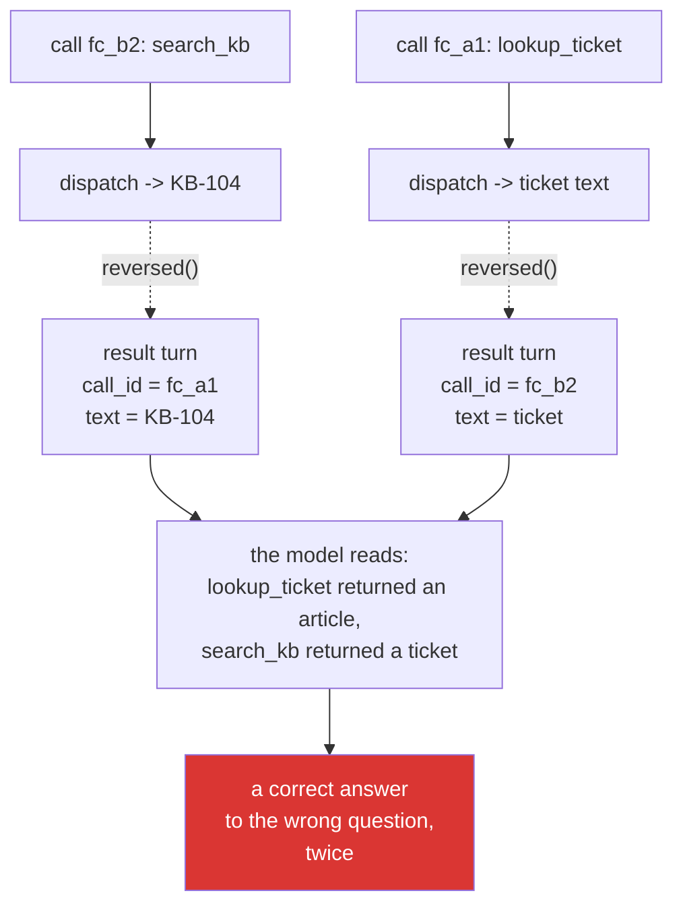

# 6.1 — 💥 The call id you did not echo: a perfect answer, filed against the wrong question

## One-line answer

Break the `call_id` pairing and the model receives two flawless tool results attached to the wrong
questions — and because every individual piece of the system is working correctly, the failure
presents as a confused model rather than as a bug in three lines of your code.

---

## The story

A translation agency takes two jobs on the same afternoon. A supplier contract, and a set of technical
specifications. Both go out to translators; both come back the next morning, excellent work, on time.

Somewhere between the inbox and the filing, the two completed files are attached to the wrong jobs.

Nobody notices, because there is nothing to notice. Each translation is fluent, accurate and
professionally formatted. The invoices are right. The turnaround was good. Both clients receive a
superb translation of a document they did not send.

The client with the specifications reads a contract and assumes there has been a mix-up at their end —
maybe they attached the wrong file. They apologise, and re-send. The client with the contract is on
holiday and does not open it for a fortnight, by which point a deal has moved on without it.

The agency's post-mortem finds no fault anywhere. The translators were excellent. The project managers
followed the process. The files were not corrupted. **Nothing failed except the correspondence between
a piece of work and the request it answered**, and there was no step in the process whose job was to
check that.

---

## The idea in plain language

[2.3](../02-the-round-trip/2.3-the-tool-result-turn.md) introduced `call_id` and admitted it looks
redundant when one call is in flight. This part is the demonstration that it is not, and the way to
run it is to break it deliberately and read what the model does.

Three ways to break it, in increasing order of nastiness:

- **An id that matches nothing.** The provider rejects the conversation with a `400`. Loud, immediate,
  fixed in a minute. This is the lucky one.
- **The same id on two results.** One call is answered twice and one is not answered at all. Usually a
  `400` about the unanswered call — but if both results carry the id of a call that *was* made, the
  model sees two contradictory answers to one question and no answer to the other.
- **Two results, swapped.** Both ids are real, both calls were made, both results are genuine. The
  conversation is structurally perfect. **The model is told that `lookup_ticket` returned a knowledge
  base article and that `search_kb` returned a ticket body.** This is the translation agency, and there
  is no error anywhere.

The third is the one to sit with, because of what the model does next. It does not crash and it does
not say "these results look swapped". It **reasons around it** — treats the ticket text as if it were
an article, or decides the knowledge base is returning nonsense and answers from the ticket alone, or
apologises for confusion it cannot account for. Every one of those is a sensible response to the
information it was given, and every one of them looks like model unreliability to whoever reads the
trace.

The reason this happens at all is worth naming, because it is not carelessness. It happens when the
correspondence between a call and its result is **reconstructed** rather than **carried** — a `zip`
over two lists, an index into a results array, a variable assigned outside the loop.
[3.3](../03-rebuilding-the-loop/3.3-two-calls-in-one-turn.md) made the point in advance; this part is
what it costs.

---

## Why Sutra needs it

- **Today**, it is the proof that [2.3](../02-the-round-trip/2.3-the-tool-result-turn.md)'s fourth
  field is load-bearing, and the argument for
  [3.3](../03-rebuilding-the-loop/3.3-two-calls-in-one-turn.md)'s "carry, do not zip".
- **Day 16 (ADK-18)** makes tools do real I/O, at which point results genuinely arrive out of order and
  this failure stops needing to be staged.
- **Day 7 (ADK-04, ADK-05)** and **Day 13 (ADK-14, ADK-15)** hand event and tool plumbing to ADK. You
  will trust it, correctly — and you will be able to *check* it, because you know what the failure
  looks like from the model's side.
- **Days 92–96 (multi-agent)** are this problem at a larger scale: responses routed back to the wrong
  requester, with no error, in a system where several things are in flight by design.

---

## The mechanism

Break it. In `sutra/agent.py`, in the loop from
[3.3](../03-rebuilding-the-loop/3.3-two-calls-in-one-turn.md):

```python
print(f"\n--- step {step} ---")
results = [_dispatch(c) for c in calls]
for call, result in zip(calls, reversed(results)):  # 💥 the failure lab
    print(f"CALL  : {call.name}({call.arguments})")
    print(f"RESULT: {result}")
    history.append(_result_turn(call, result))
```

**Line by line:**

- `results = [_dispatch(c) for c in calls]` — dispatch all of them first, into a **second list**. This
  is the tidier-looking shape [3.3](../03-rebuilding-the-loop/3.3-two-calls-in-one-turn.md) warned
  about, and it is written here on purpose: the bug needs two lists to exist before it can pair them
  wrongly.
- `zip(calls, reversed(results))` — the swap, done in one word. `reversed` stands in for what actually
  happens in production, which is not a deliberate reversal but **completion order**: two concurrent
  tools finish in whatever order their I/O allows, and a results list built as they land is not in call
  order.
- `_result_turn(call, result)` — note that this is still correct code! It faithfully attaches the
  `call_id` of the call it was handed to the result it was handed. **The helper cannot detect the
  swap**, because the swap happened before it was called. A well-designed function given mismatched
  arguments produces a well-formed wrong answer.
- `# 💥 the failure lab` — **mark it**, as on
  [Day 3, 6.1](../../../day-03-loop-hand-rolled/parts/06-failure-lab/6.1-the-goldfish-loop.md). You are
  going to restore this, and an unmarked deliberate break is next month's mystery.
- **This experiment needs a turn with two calls in it**, which the model will not always produce. Force
  one by asking a question that invites both lookups at once, or temporarily remove the `then` from
  `SYSTEM` ([3.3](../03-rebuilding-the-loop/3.3-two-calls-in-one-turn.md)) so the model stops
  sequencing.

Run it:

```bash
uv run python -m sutra.agent "Ticket 4521 says the user keeps getting logged out. Look up the ticket and check for a known issue, then tell me what to say."
```

**Line by line:**

- `"Look up the ticket and check for a known issue"` — naming **both** actions in one sentence, which is
  the reliable way to get two calls in one turn. The failure needs two; with one call, `reversed` on a
  one-element list is a no-op and nothing happens.
- **Budget about four model calls**, because the run will go long — a confused model takes extra steps.

What you will see:

```text
--- step 1 ---
CALL  : lookup_ticket({'ticket_id': '4521'})
RESULT: KB-104 'Unexpected logouts': cookies set with SameSite=Strict plus an
http:// dashboard URL end sessions early; fix is forcing https.
CALL  : search_kb({'query': 'keeps getting logged out'})
RESULT: Title: Keeps getting logged out. Body: I keep getting logged out of the
dashboard every few minutes. Started yesterday. Plan: Pro.

--- step 2 ---
CALL  : lookup_ticket({'ticket_id': '4521'})
RESULT: KB-104 'Unexpected logouts': cookies set with SameSite=Strict plus an
http:// dashboard URL end sessions early; fix is forcing https.

--- step 3 ---
I am seeing inconsistent results — the ticket lookup is returning a knowledge base
article rather than the ticket. Based on the article, the logouts are likely caused
by SameSite=Strict cookies over http://, but I have not been able to read ticket
4521 to confirm this applies.
```

Read it in three passes, because each one teaches something different.

**Pass one — the printed trace is already wrong, and it is your only clue.** `CALL: lookup_ticket`
followed by `RESULT: KB-104` is impossible; `lookup_ticket` cannot return an article. **The trace is
where you catch this**, which is an argument for printing the call and its result adjacently rather
than in two batches. A trace that printed all calls and then all results would have hidden it
completely.

**Pass two — step 2 is the model coping.** It re-called `lookup_ticket`, sensibly, because the first
answer was obviously not a ticket. It got the same wrong thing again — the bug is deterministic — and
burned a call finding that out. **A model that retries a tool giving nonsensical output is behaving
well**, and it is the behaviour that turns one bug into three paid calls.

**Pass three — step 3 is the honest failure working under a broken system.** The model said what it
could see and what it could not confirm, and it did not invent a diagnosis it had no ticket for. That
is [Day 3, 4.3](../../../day-03-loop-hand-rolled/parts/04-running-the-loop/4.3-the-honest-failure.md)
paying off in a situation nobody designed for. **Notice how much worse this trace would read if the
model had smoothed over it** — and note that with a slightly different question, it will.

Now prove it rather than believing it. Add one line before the next model call:

```python
print(
    "[pairs]",
    [(c.id, c.name) for c in calls],
    "->",
    [(t["call_id"], t["name"]) for t in history[-len(calls) :]],
)
```

**Line by line:**

- `[(c.id, c.name) for c in calls]` — what was **asked**, in order.
- `[(t["call_id"], t["name"]) for t in history[-len(calls):]]` — what was **answered**, read back off
  the history you just built. `history[-len(calls):]` takes exactly the result turns appended this
  turn.
- Printed side by side with an arrow, so the mismatch is one glance rather than a comparison you have
  to hold in your head. On a healthy run the two lists are identical; on the broken one the names are
  in opposite orders.
- `[pairs]` as a prefix so it can be filtered out with `grep -v`. **This is the diagnostic, and it is
  the habit, not the line** — the same instinct as Day 3's *print the payload, not the code*.

The failure in one picture:



Then **put it back** — restore the loop from
[3.3](../03-rebuilding-the-loop/3.3-two-calls-in-one-turn.md), where the dispatch and the append share
one `call` variable — and write the test:

```python
def test_each_result_answers_its_own_call() -> None:
    """Two calls in, two results out, each carrying its own call_id."""
    client = TwoCalls()  # a fake returning two function_call steps
    run_loop(client, "anything", max_steps=1)
    results = [t for t in client.last_input if t.get("type") == "function_result"]
    assert [t["call_id"] for t in results] == ["fc_a1", "fc_b2"]
    assert "Keeps getting logged out" in results[0]["result"][0]["text"]
```

**Line by line:**

- `client.last_input` — the fake records the `input` it was handed, which is how you assert on the
  **payload** rather than on the return value. Same technique as Day 3's `AlwaysActs`
  ([5.1](../../../day-03-loop-hand-rolled/parts/05-containment/5.1-the-step-budget.md)), extended to
  capture what was sent.
- `[t["call_id"] for t in results] == ["fc_a1", "fc_b2"]` — the ids, **in order**. Necessary and not
  sufficient: a `reversed` on the results with the ids also reversed would pass this.
- `assert "Keeps getting logged out" in results[0]["result"][0]["text"]` — **the content check that
  makes it sufficient.** The first result must contain the *ticket*, not the article. Without this
  line, the test asserts that two ids exist and nothing about whether they answer the right questions —
  which is exactly the failure. Write both.
- **Zero model calls.** The whole of this failure is reproducible offline, which is what makes it worth
  a permanent test rather than a habit.

---

## When it breaks

**The stale id**, which is the loud version and the one you want:

```text
google.genai.errors.ClientError: 400 INVALID_ARGUMENT. {'error': {'code': 400,
'message': 'function_result at input[4] has call_id "fc_a1" which does not match
any function_call in the conversation.', 'status': 'INVALID_ARGUMENT'}}
```

**What it means.** An id from a *previous* turn — usually a `call` variable assigned outside the loop
and reused. The provider caught it and named the input index. **Be grateful for this one:** it is the
same class of bug as the swap, discovered in seconds instead of in a support escalation, and the only
difference is that the id happened not to be real.

**The duplicated id:**

```text
google.genai.errors.ClientError: 400 INVALID_ARGUMENT. {'error': {'code': 400,
'message': 'Conversation contains a function_call with id "fc_b2" that is not
followed by a matching function_result.', 'status': 'INVALID_ARGUMENT'}}
```

**What it means.** Both results carried `fc_a1`, so `fc_b2` was never answered. The error names the
*unanswered* call rather than the duplicate, which is why it reads as a missing-result problem when the
actual bug is a wrong-id problem. **Read both lists — asked and answered — rather than trusting the
error's framing.**

**The swap in a single-call turn**, which is the version that hides:

```text
--- step 1 ---
CALL  : lookup_ticket({'ticket_id': '4521'})
RESULT: Title: Keeps getting logged out. Body: I keep getting logged out...
```

**What it means.** Nothing is wrong, and nothing *can* be wrong: `reversed` on a one-element list is
the identity. **The bug is present in the code and invisible in the behaviour**, and it will stay
invisible until the day the model decides to call two tools at once — which it will do more often as
you add tools. This is the strongest argument for the test: the failure is latent, and only a test that
*constructs* a two-call turn will find it before a user does.

---

## In production

**What a professional does is make the correspondence unrepresentable rather than checked.** The
teaching fix is "carry the call object through to its result"; the production version is a small type
— a `ToolInvocation` holding the call and its outcome together — so there is no moment at which a
result exists as a bare value that could be attached to the wrong thing. That is more machinery than
two tools justify, and it is the right shape the moment execution becomes concurrent, because
concurrency is what turns "unlikely" into "ordinary".

**What degrades at scale is that this failure is invisible in aggregate.** It produces no error, no
latency change, and a completed run. Its only signatures are indirect: a rise in average steps per run
(models retrying tools that returned nonsense), and answers that hedge about inconsistent data. Both
are easy to attribute to "the model is being flaky" — which is why the mismatch is worth asserting
structurally at the point where results are appended, rather than hoping to spot it in a dashboard that
cannot see it.

**The failure that only appears with real traffic is the concurrent one, and it is not deterministic.**
Two tools with different latencies, results collected as they complete, paired by index — the mismatch
happens only when the second finishes before the first, which under light load is never and under load
is often. It will pass every test you have, work perfectly in staging, and appear in production as an
intermittent quality complaint that nobody can reproduce. Anyone who has debugged one recognises the
shape immediately: **intermittent, load-correlated, no errors, and the model looks confused.**

**The review comment a senior engineer leaves:** *"Results are collected into a list and zipped against
the calls. That's correct while dispatch is synchronous and it is a silent data-swap the day we make
these concurrent. Carry the call through to its own result, and add a test with two calls that asserts
each result's `call_id` **and** its content — an id-only assertion passes a swap where the ids are
reversed too."*

**The interview question:** *"what's the worst kind of bug in a system like this?"* The answer that
shows you have been burned: "The one where every component is working correctly and the correspondence
between them is wrong. I had a loop that ran two tools and paired the results back to the calls by
index — fine when execution was synchronous, and the moment it went concurrent the results came back in
completion order and got attached to the wrong calls. Every tool returned the right answer. The
protocol was well-formed. The model just received a knowledge-base article labelled as a ticket lookup
and reasoned around it, so it presented as an unreliable model rather than as three lines of my code.
What I take from it is that when two things must correspond, I carry them together rather than
reconstructing the correspondence afterwards — and I test the correspondence with content, not just
with ids, because a test that only checks ids passes a swap where both got swapped."

---

## Check yourself

```bash
grep -n "the failure lab" sutra/agent.py
uv run python -m pytest tests/test_agent.py -q -k answers_its_own_call
```

The first must print **nothing** — the deliberate break is restored. The second must be green. Then
change the loop back to `zip(calls, reversed(results))` one last time and watch the test go red, so you
have seen it fail as well as pass.

**Answer out loud, without scrolling up:**

> Say what the model is told when two results are swapped, and why its response looks like model
> flakiness. Then say why this bug is invisible with one tool call and ordinary with two, and what you
> would print first to prove it.

---

**Next:** [7.1 — 🅿️ Automatic function calling, declined](../07-the-automatic-door/7.1-automatic-function-calling-declined.md)
