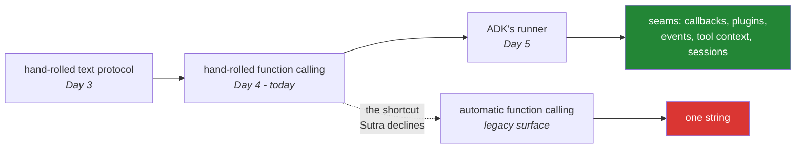

# 7.1 — 🅿️ Automatic function calling, declined: and the difference between that and tomorrow

## One-line answer

The SDK can run the whole loop for you — hand it Python functions, get a final answer — and Sutra
declines, for one reason of principle and one of fact: a loop you cannot open is a loop you cannot
put an approval gate, a budget or a redaction pass into, and it is not offered on the Interactions API
anyway.

> 🅿️ **Parked.** Awareness-level. You will meet this in most tutorials and most tool-calling code you
> read, and you should recognise it instantly and know why this project does not use it. Nothing here
> is built on.

---

## The story

A bread machine takes flour, water, yeast, salt and a little sugar. You close the lid and press a
button. Some hours later there is a loaf, and it is good bread — better than most people's first
twenty attempts by hand.

Then one day it produces a brick. Dense, pale, about half the height it should be.

The owner has no idea why, and no way to find out, because the machine did six things behind a closed
lid and showed none of them. Was the water too hot and the yeast killed? Was the yeast simply old? Was
the flour wrong? Did the machine's proving stage run short because the kitchen was cold? Every one of
those produces the same brick. The manual says to check the yeast, so they buy new yeast, and it
happens again a fortnight later.

Somebody who has made bread by hand picks up the same brick, presses it, smells it, and says "your
yeast is dead" in about three seconds — because they have watched dough that is proving next to dough
that is not, and the difference is obvious once you have seen it.

**The machine is not the problem.** It is a good machine, and the person who understands proving would
happily use one. The problem is only ever the order: a machine first, and every failure is a mystery;
the hand-made loaf first, and the machine is a convenience with a lid you know the inside of.

---

## The idea in plain language

Everything you built today has a shortcut. On the provider's **legacy `generate_content` surface**,
the Python SDK offers **automatic function calling**: instead of declarations, you pass your actual
Python functions, and the SDK builds the schemas from their signatures, sends them, receives the
model's call, executes the function, sends the result back, and repeats until the model produces an
answer. You get a string. The loop is inside the library.

It removes, in one parameter, everything section 2 and section 3 of today were about: the
declarations, the step reading, the dispatch, the result turn, the `call_id`, and the history
management.

Sutra declines it, and there are two independent reasons. Only one of them is a matter of taste.

**The fact.** Automatic function calling is a feature of the legacy `generateContent` API and is
**not available on the Interactions API** — the surface Sutra teaches, per ADR-0006 and the amendment
recorded in `CHANGELOG_PLAN.md` on 2026-08-24. So on the path this project is on, the question does
not currently arise. Verified against `ai.google.dev/gemini-api/docs/interactions` on 2026-08-25,
which lists it among the features not yet carried across.

**The principle**, which would apply even if it were available. Go back through today and list the
places your loop does something the library would have to do for you:

| Your loop does this | A hidden loop would have to | Sutra needs it on |
| --- | --- | --- |
| bound the run to `max_steps` | expose a limit, or run until the model stops | Day 3, 5.1 — and it is the brake |
| count tokens per step | expose usage per internal call | Day 24 (OPS-07) |
| refuse a tool not in `TOOLS` | trust the functions you handed it | Day 3, 2.2 · today, 5.1 |
| pass a caller identity out of band | have a place to put a non-model parameter | today, 5.2 |
| pause before a dangerous call | expose a hook between propose and execute | Days 62–65 |
| redact before appending | expose the result before it enters history | Day 68 |
| print every call and result | expose a trace | Day 84 |

Seven interventions, every one of them at a point **inside** the loop. That is the whole argument, and
it is not about elegance: **a loop with no seams is a loop you cannot put a requirement into.**

And now the distinction that makes this part worth reading rather than a rant, because tomorrow you
adopt a framework that also runs the loop:

> Sutra declines a loop it cannot open. It does **not** decline a loop somebody else wrote.

ADK's runner (Day 5) runs think-act-observe exactly as yours does — and it has callbacks (Day 13),
plugins (Day 14), an event stream (Day 7), a tool context for out-of-band state (Day 11), and a
session service you can inspect (Day 8). Every row in that table has an address in it. That is a
bread machine with a glass lid and a manual override on every stage, and it is a completely different
proposition from a convenience parameter that returns a string.

---

## Why Sutra needs it

- **Tomorrow (Day 5, ADK-01, ADK-02)** hands the loop to ADK, and the first question worth asking of
  any framework is the one this part poses: *which of my seven interventions does it expose?* You now
  have the list.
- **Day 9 (ADK-08, ADK-09)** runs the same agent on four providers. Automatic function calling is a
  per-SDK feature, so anything built on it is not portable — a second reason it does not fit a project
  whose model policy is "whichever free tier has quota".
- **Day 10 (ADK-10, ADK-11)** adopts `FunctionTool`, which does the *schema generation* half of this
  shortcut — the genuinely good half — while leaving the loop where you can reach it.
- **Days 62–65, Day 24, Day 68, Day 84** are the concrete cash-in. Each one is a change at a point
  inside the loop.

---

## The mechanism

What the shortcut looks like, so you recognise it in the wild. **This is the legacy surface and Sutra
does not run it** — it is here to be read:

```python
from google import genai

client = genai.Client()

response = client.models.generate_content(
    model="gemini-3.7-flash",
    contents="What is the status of ticket 4521, and is there a known issue?",
    config={"tools": [lookup_ticket, search_kb]},
)
print(response.text)
```

**Line by line:**

- `client.models.generate_content(...)` — the **legacy** surface, retitled *"Gemini Generate Content
  API (Legacy)"* in the provider's own documentation as of 2026-08-24
  ([Day 2, 6.1](../../../day-02-llm-mechanics/parts/06-the-legacy-door/6.1-generate-content-parked.md)
  parked it for the same reason). Everything below is a property of this call, not of
  `interactions.create`.
- `"tools": [lookup_ticket, search_kb]` — **the actual Python function objects**, not declarations.
  The SDK reads their signatures and docstrings and builds the schema itself. This half is genuinely
  good and it is what Day 10 adopts: a schema derived from the function cannot drift from it
  ([1.2](../01-the-schema/1.2-declaring-a-tool.md)'s hand-maintenance problem, solved).
- **What is not visible in this snippet is the entire day.** Between this line and the next, the SDK
  makes several model calls, executes your functions, and manages a history — and none of it is
  addressable. There is no parameter here for a step limit, a per-call callback, a caller identity, or
  a usage total.
- `response.text` — one string. The steps, the arguments the model chose, the results it received and
  the tokens it spent are all inside the call that has already returned. Compare
  [5.2](../../../day-03-loop-hand-rolled/parts/05-containment/5.2-the-transcript-is-a-bill.md): usage
  cannot be fetched afterwards.
- **This is the brick.** When the agent does something baffling, the artifact you have is a paragraph.

Against which, the thing Sutra actually has, reduced to its seams:

```python
for step in range(1, max_steps + 1):  # <- the brake
    interaction = ask(client, history, tools=DECLARATIONS, config=config)
    spent.append(interaction.usage)  # <- the meter
    for produced in interaction.steps:
        history.append(produced.model_dump())  # <- the record
    calls = [s for s in interaction.steps if s.type == "function_call"]
    if not calls:
        return interaction.output_text or "..."
    for call in calls:
        result = _dispatch(call)  # <- the gate
        history.append(_result_turn(call, result))  # <- the redaction point
```

**Line by line:**

- `for step in range(1, max_steps + 1)` — **the brake.** Days 62–65 pause here; Day 24 checks a budget
  here.
- `spent.append(interaction.usage)` — **the meter.** Day 24's per-run token ceiling reads this.
- `history.append(produced.model_dump())` — **the record.** Day 8 persists this; Day 84 traces it.
- `_dispatch(call)` — **the gate.** Day 3's dispatch table, today's declaration check
  ([5.1](../05-containment/5.1-the-declaration-is-the-new-boundary.md)), tomorrow's caller identity
  ([5.2](../05-containment/5.2-the-argument-a-schema-cannot-check.md)), and the one line an approval
  wraps.
- `_result_turn(call, result)` — **the redaction point.** Day 68 strips what should not enter a
  transcript, and this is the only place it can.
- Five named seams in eight lines. **Every one of them is a day in this curriculum**, and every one of
  them requires the loop to be openable at that exact point.

The three positions, and where each one sits:



Note that the dotted arrow leaves from **today**, not from Day 3. The shortcut is a real alternative
to what you just built, and it is a fair one to consider — which is why it deserves a reasoned
declining rather than silence.

---

## When it breaks

**The brick**, which is what going straight to the shortcut costs:

```text
>>> print(response.text)
I wasn't able to find information about that ticket.
```

**What it means.** Something went wrong across an unknown number of internal calls. Did the model call
`lookup_ticket`? With what argument? Did it call it three times? Did `search_kb` raise and get
swallowed? Did it spend six calls or one? **You cannot tell**, and the debugging moves available are
to change the prompt and try again — which is exactly the "buy new yeast" loop from the story.

Meanwhile the same failure in Sutra's loop prints a trace with the call, the argument and the result on
separate lines ([3.2](../03-rebuilding-the-loop/3.2-the-loop-that-shrank.md)), and
[4.1](../04-the-limits/4.1-validated-is-not-correct.md) taught you to read the argument first.

**The unbounded automatic loop:**

```text
google.genai.errors.ClientError: 429 RESOURCE_EXHAUSTED ... 'quotaId':
'GenerateRequestsPerDayPerProjectPerModel-FreeTier', 'quotaValue': '250'
```

**What it means.** A model that kept calling tools, inside a library, with a limit you did not set and
may not be able to see, until the day's quota was gone. Day 3's
[5.1](../../../day-03-loop-hand-rolled/parts/05-containment/5.1-the-step-budget.md) made the argument:
the bound belongs to your code, and a bound you cannot state is not one. Some SDKs expose a maximum
number of automatic calls; you should assume nothing about the default until you have read it, and if
you cannot find it, that is the answer.

**The half-adoption that is genuinely a good idea**, so that this part does not read as a blanket
refusal:

```python
# Day 10: the schema is generated, the loop is still yours.
from google.adk.tools import FunctionTool

ticket_tool = FunctionTool(lookup_ticket)
```

**Line by line:**

- `FunctionTool(lookup_ticket)` — takes the **schema generation** half of the shortcut, which solves
  [1.2](../01-the-schema/1.2-declaring-a-tool.md)'s hand-maintenance problem and
  [5.1](../05-containment/5.1-the-declaration-is-the-new-boundary.md)'s drift problem by construction.
- What it does **not** take is the hidden loop: the agent still runs inside a runner you can attach
  callbacks to. **The two halves of "automatic" are separable, and only one of them costs you the
  seams.** That distinction is the useful thing to carry out of this part.
- The symbol is named here as a **forward reference to Day 10**, verified as an ADK import path on
  2026-08-25 — and ADK is not installed until tomorrow, so this line does not run today (packages
  arrive on the day they are used).

---

## In production

**What a professional asks of any agent framework is the seam list**, and it is a better evaluation
than a benchmark. Where can I put a limit? Where does a human approve? Where do I count tokens? Where
do I redact before something is persisted? Where do I attach a trace id? Where does a caller identity
enter that the model cannot write? A framework that answers all six is one you can operate; one that
answers "you get a string back" is a prototype tool, whatever the quality of its output. Tomorrow you
will run exactly this evaluation on ADK, with a list you wrote yourself rather than one from a vendor
comparison.

**What degrades at scale is the ability to reason about cost and blast radius at all.** A hidden loop
means an unknown number of model calls per request and an unknown number of tool executions, which
makes capacity planning guesswork and makes an incident's blast radius unanswerable. "How many times
could this have run the refund tool before we noticed?" is a question with a number in it if you own
the loop and a shrug if you do not.

**The failure that only appears with real traffic is the one you cannot triage.** Every agent system
eventually produces a run that did something surprising, and the entire value of your observability is
what you can reconstruct afterwards. A trace of typed steps answers it in a minute
([2.1](../02-the-round-trip/2.1-two-channels-not-one.md): the timeline is an audit log). A final string
answers nothing, and the honest engineering response is to re-run with instrumentation — which means
building, under pressure, the loop you declined to build when it was cheap.

**The review comment a senior engineer leaves** on a proposal to use automatic function calling in a
production path: *"Where does the approval gate go, and what's the maximum number of tool executions
one request can trigger? If the answers are 'nowhere' and 'unknown', this is fine for a prototype and
not for anything that can touch a customer record. Use the schema generation — that part is strictly
good — and keep the loop where we can put a limit and a callback in it."*

**The interview question:** *"most SDKs will run the tool-calling loop for you. Why would you write
your own?"* The answer that shows judgement rather than dogma: "I wouldn't, for a prototype — it's
strictly less code and the schema generation half is genuinely better than hand-maintaining
declarations, because a schema derived from the signature can't drift from it. What I need before
production is a set of seams: a step bound, a token count per call, a point between the model
proposing an action and my code executing it where a human or a policy can intervene, a place to put a
caller identity the model can't write, a redaction point before results are persisted, and a trace. A
convenience call that hands me a final string has none of those, and adding them later means
rebuilding the loop anyway — under pressure, after an incident. So the question I actually ask of a
framework isn't 'does it run the loop', it's 'does it expose those six points'. If it does — which is
what a real agent framework offers, callbacks and plugins and an event stream — I'll happily use theirs
and never write my own again."

---

## Check yourself

```bash
grep -rn "generate_content" sutra/ | wc -l
```

It must print `0`. Sutra is on the Interactions API throughout (ADR-0006), so the legacy surface — and
the automatic loop that lives on it — appears nowhere in the package. Then open
[3.2](../03-rebuilding-the-loop/3.2-the-loop-that-shrank.md)'s `run_loop` and point at each of the five
seams with your finger; tomorrow you will look for them in somebody else's runner.

**Answer out loud, without scrolling up:**

> Name four things your loop does that a hidden loop would have to expose, and the day each one is
> cashed in. Then say the difference between declining automatic function calling and adopting ADK
> tomorrow — because on the face of it, both are "let something else run the loop".

---

**Next:** the parts are done — open this day's [`papers/`](../../papers/01-toolformer.md), where the
premise you spent today implementing turns out to come with a method you did not implement, for
reasons worth knowing. Then back to the hub — [Day 4 · LESSON.md](../../LESSON.md) §11, and the
commit.
