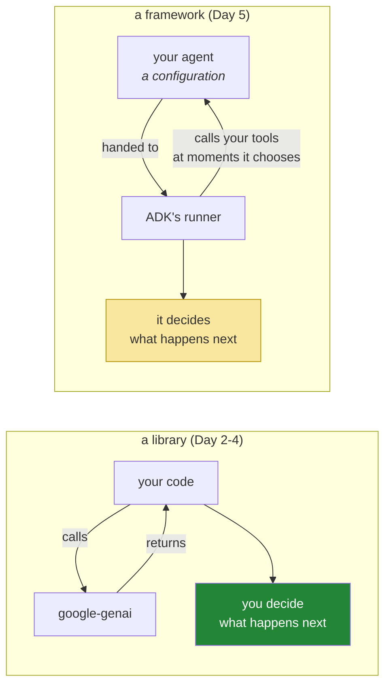

# 1.1 — What a framework takes from you: and the only question worth asking of one

## One-line answer

A framework does not add capability — it takes over code you already had, and the only question that
matters is which of your intervention points it hands back, which is why you spent two days writing
the loop it is about to replace.

---

## The story

A kitchen makes stock from bones, every day, for years. Somebody stands there skimming it. It takes
most of a morning and it is not interesting work, and the cook who does it can tell you, without
thinking, that a stock which has gone cloudy was boiled instead of simmered, and that the one from
last Tuesday tasted flat because the bones were not roasted long enough.

Then the restaurant buys stock in. Good stock, from a supplier who does nothing else. It arrives in
tubs. It is more consistent than theirs was and it costs less than the morning it replaces.

Nothing is lost — for about a year. Then the supplier changes something, and the sauces start
breaking, and nobody in the kitchen can say why, because nobody in that kitchen has made stock in a
year and the two people who could taste the difference have moved on. The head chef phones the
supplier and gets a spec sheet. The spec sheet does not have "why does my sauce break" on it.

The restaurant that survives this is not the one that refused to buy stock in. It is the one where
somebody still makes it by hand occasionally, and where the buying decision was made by a person who
knew exactly which morning's work they were handing over.

---

## The idea in plain language

You have now written the same agent twice. Once with a text protocol
([Day 3](../../../day-03-loop-hand-rolled/LESSON.md)) and once with native function calling
([Day 4](../../../day-04-tools-by-hand/LESSON.md)). Today a framework — **Google's Agent Development
Kit**, `google-adk` — takes over the loop, and it is worth being precise about what that means,
because the word "framework" does a lot of hiding.

**It does not give the model new abilities.** The model is the same model, on the same free tier, with
the same context window and the same tendency to fabricate on a miss. Nothing about today makes Sutra
smarter.

**What it gives you is code you no longer write.** Specifically, and you can list it because you wrote
all of it:

| You wrote it on | ADK provides it |
| --- | --- |
| Day 3, 4.1 · Day 4, 3.2 | the loop: call, read steps, dispatch, append, repeat |
| Day 3, 5.1 | a bound on how far it runs |
| Day 2, 1.5 | retry and error handling around the model call |
| Day 3, 1.2 · Day 4, 2.4 | the conversation history, held in a session |
| Day 4, 2.2 | reading the model's tool request out of the response |
| Day 4, 2.3 | building the tool-result turn |
| Day 3, 4.2 | a stream of events, instead of your `print` statements |

Seven things. Every one of them exists in your repository right now, works, and is understood — which
is the only reason handing them over is a decision rather than a leap.

And what it takes is the **inside** of those seven things. Your `run_loop` had places you could reach:
one line where a tool actually executes, one place where a result is appended, a counter you could
read. Those are the seams
([Day 4, 7.1](../../../day-04-tools-by-hand/parts/07-the-automatic-door/7.1-automatic-function-calling-declined.md)),
and when somebody else owns the loop, the seams are whatever they chose to expose and nothing more.

So the question to hold for the whole of today, and to ask of every framework you ever evaluate:

> **Which of my intervention points does it hand back?**

Not "is it good". Not "is it popular". A framework that runs a beautiful loop with no callback between
the model proposing an action and your code executing it is a framework you cannot put an approval gate
into, and no amount of quality elsewhere fixes that.
[5.1](../05-the-comparison/5.1-the-seam-list-checked.md) runs that evaluation properly, with your own
list, at the end of the day.

One piece of vocabulary defined here on first use: a **framework** differs from a **library** in who is
in charge. You call a library; a framework calls you. Day 2's `google-genai` is a library — your code
runs and asks it for things. ADK is a framework — you hand it an agent and it runs your code at the
moments it decides. That inversion is the whole of what makes the seams question the right one.

---

## Why Sutra needs it

- **Today**, [4.1](../04-the-runner/4.1-the-runner-is-your-run-loop.md) hands the loop over and
  [5.2](../05-the-comparison/5.2-what-you-handed-over.md) is the reckoning.
- **Day 6 (ADK-03, AG-05)** through **Day 8 (ADK-06, ADK-07)** are the seams themselves: instructions,
  events, sessions.
- **Days 13–14 (ADK-14..16)** are callbacks and plugins — the answer to "can I get between the model
  and the tool?", which is the question that decides whether Days 62–65 are possible at all.
- **Day 31 (OPS-08)** is the quality gate where the plan asks whether the framework is earning its
  place. That is a question you can only ask if you know what it replaced.
- **Principle 4** exists for exactly this day: *build first, compare after*, so the framework is a
  convenience and never a mystery.

---

## The mechanism

There is no ADK code in this part — it is not installed until
[1.2](1.2-pinning-the-framework.md). What there is, is the inventory you will check it against, and
writing it down *before* you install is the point. A list made after you have seen the API is a list
shaped by the API.

Start from your own loop and mark the places you can reach into it:

```python
for step in range(1, max_steps + 1):  # 1. the bound
    interaction = ask(client, history, tools=DECLARATIONS, config=config)
    spent.append(interaction.usage)  # 2. the meter
    for produced in interaction.steps:
        history.append(produced.model_dump())  # 3. the record
    calls = [s for s in interaction.steps if s.type == "function_call"]
    if not calls:
        return interaction.output_text or "..."
    for call in calls:
        result = _dispatch(call)  # 4. the gate
        history.append(_result_turn(call, result))  # 5. the redaction point
```

**Line by line:**

- `for step in range(1, max_steps + 1)` — **the bound.** Yours, structural, and the thing that stops a
  runaway ([Day 3, 5.1](../../../day-03-loop-hand-rolled/parts/05-containment/5.1-the-step-budget.md)).
  Question for ADK: *can I set a maximum number of steps, and what happens when it is reached?*
- `spent.append(interaction.usage)` — **the meter.** Question: *can I see token usage per model call,
  or only a total, or not at all?* Day 24's budget depends on the answer.
- `history.append(produced.model_dump())` — **the record.** Question: *can I read the conversation,
  and can I edit it?* Days 19–20's context engineering is impossible without the second.
- `_dispatch(call)` — **the gate**, and the most important line in the file. Question: *is there a hook
  that fires after the model proposes a tool call and before it executes?* If the answer is no, Days
  62–65 do not happen and this framework is a prototype tool.
- `_result_turn(call, result)` — **the redaction point.** Question: *can I see and modify a tool result
  before it enters the transcript?* Day 68's data handling lives here.
- Two more that are not in this snippet and belong on the list: **the model call itself** (can I wrap
  it, retry it, route it to a different provider? — Days 9 and 70) and **the trace** (does it emit
  events I can subscribe to, or does it print? — Days 7 and 84).
- **Write these seven questions in your lab folder now.** By this evening you will be able to answer
  four of them from the API, and Days 6–14 answer the rest. A framework evaluation you wrote yourself
  beats any comparison table.

The inversion, drawn once, because it is the thing that changes today:



Neither box is wrong. The yellow one is a trade, and today you find out the terms.

---

## When it breaks

**The framework adopted before the mechanism is understood**, which is not an error message but a
conversation:

```text
"The agent isn't calling our tool."
"Why not?"
"I don't know — I've tried rewording the instruction three times."
```

**What it means.** Nothing in that exchange references a tool declaration, a description's trigger
clause, whether tools were passed on the call, or a tool-selection metric — because the person has
never seen any of those things. They have only ever seen an `Agent(...)` with a `tools=[...]`
parameter, so the only lever they know about is the prose.

You already know the four things to check and the order to check them in
([Day 4, 4.2](../../../day-04-tools-by-hand/parts/04-the-limits/4.2-the-tool-that-is-never-called.md)),
and the framework has not changed any of them — it has only moved where they are configured. **That is
the entire return on Days 3 and 4**, and it is worth noticing that it arrives before you have written
a single line of ADK.

**The framework blamed for the model:**

```text
"ADK hallucinated a ticket number."
```

**What it means.** It did not; a language model produced a plausible token sequence, which is what
they do, and Day 3's
[4.3](../../../day-03-loop-hand-rolled/parts/04-running-the-loop/4.3-the-honest-failure.md) is
unchanged by anything in this package. The sentence matters because it sends people to the wrong
place — reading framework issues instead of tightening a tool's miss message or writing an eval.

The general form, and it is worth stating as a rule you apply all week: **when something goes wrong,
first ask which layer owns it.** The model produces text. The framework runs a loop. Your tools touch
the world. Almost every confused afternoon in agent work is a problem being debugged one layer away
from where it lives.

**The framework kept because it is there:**

```text
$ grep -rn "google.adk" sutra/ | wc -l
1
```

**What it means.** A perfectly healthy state — one agent, one import — and it is worth checking
occasionally, because the failure this part is really about is a slow one. Frameworks accumulate:
first the loop, then the sessions, then the memory, then the deployment, and each step is individually
reasonable. Day 31's quality gate exists to ask whether each one is still earning its place, and the
answer is only knowable if you can still remember what it replaced.

---

## In production

**What a professional does before adopting a framework is write the seam list first.** Not a feature
comparison — a list of the points where their own requirements attach, derived from the requirements
rather than from the framework's documentation. Approval before a destructive action. A per-tenant
spend cap. Redaction before persistence. A trace id that crosses process boundaries. Then the
evaluation is a short exercise with a yes or no per row, and it produces an answer that survives the
next release, because the list came from the problem rather than from the marketing.

**What degrades at scale is the cost of being wrong.** A framework choice is cheap to reverse in week
one and expensive in month nine, because by then the agent definitions, the tool wrappers, the session
storage and the deployment are all shaped by it. The mitigation is not to avoid frameworks; it is to
keep the parts that are genuinely yours — the tool functions, the data access, the authority checks —
free of framework types, so that what you would have to rewrite is the wiring rather than the system.
Sutra does this almost by accident: `lookup_ticket` and `search_kb` are plain functions that know
nothing about ADK, and they will still be plain functions on Day 96.

**The failure that only appears with real traffic is the seam you did not need until you did.** Nobody
asks for a human approval gate on day one. They ask for it after an agent does something expensive,
and at that point the framework either has a hook at that exact point or the answer is "we would have
to fork it". The teams that are comfortable at this moment are the ones who checked before they
committed — and the ones who are not are usually the ones who evaluated on output quality, which is a
property of the model rather than of the framework.

**The review comment a senior engineer leaves** on a framework proposal: *"This compares them on
ergonomics and example quality. Add a table of our actual integration points — approval before tool
execution, per-run token budget, redaction before persistence, trace propagation — with yes or no for
each. If one of them is 'no', say what we do instead, because 'we'll figure it out later' means
forking."*

**The interview question:** *"how do you evaluate an agent framework?"* The answer that shows you have
been through it: "I write down where my own requirements attach before I read anyone's documentation —
the point between the model proposing a tool call and my code running it, where token usage per call is
visible, whether I can read and edit the conversation history, where I can redact before something is
persisted, and how a trace id crosses process boundaries. Then it's a yes-or-no per row, and it's a
much more stable answer than an ergonomics comparison, because those points come from operating a
system rather than from building a demo. The reason I can write that list at all is that I built the
loop by hand first — otherwise I'd be evaluating against the framework's own vocabulary, which tends to
tell you what it's good at rather than what you need."

---

## Check yourself

```bash
grep -n "for step in range" sutra/agent.py
grep -n "_dispatch(call)" sutra/agent.py
```

Two line numbers. Write them down, with the seven questions from *The mechanism*, in
`days/day-05-first-adk-agent/lab/seams.md` — **before** you install anything. By this evening you will
be answering that list against somebody else's code, and a list written afterwards is a list shaped by
what you found.

**Answer out loud, without scrolling up:**

> Say what a framework adds (nothing, to the model) and what it takes (the inside of seven things you
> wrote). Then name the one seam whose absence would make Days 62–65 impossible, and say what you
> would do if a framework did not have it.

---

**Next:** [1.2 — Pinning the framework](1.2-pinning-the-framework.md)
