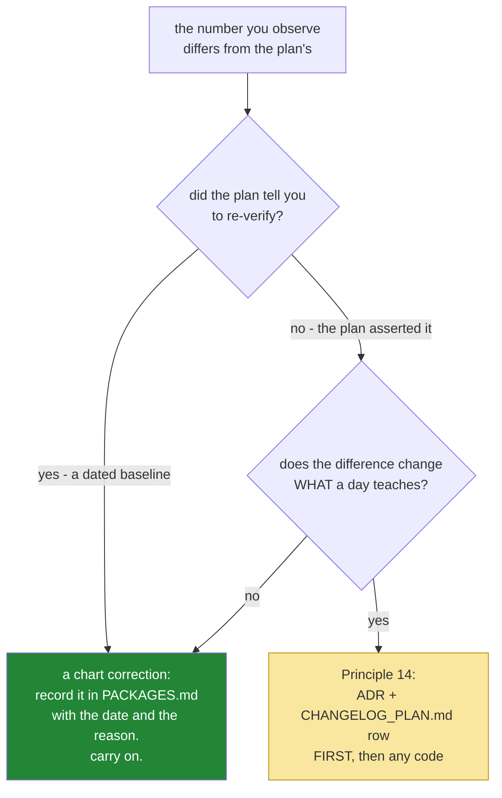

# 1.2 — Pinning the framework: when the plan's number and today's number disagree

## One-line answer

The plan names a baseline of `google-adk` 2.6.3 and instructs you to re-verify on install day — so
finding 2.7.1 is not a contradiction to be resolved, it is the plan working exactly as designed, and
the difference between that and a real amendment is worth being able to state.

---

## The story

A nautical chart is out of date the moment it is printed. A buoy gets moved, a channel silts up, a
wreck appears where there was open water last spring.

The profession's answer to this is not better printing. It is a **discipline of correction**. Every
chart carries the date it was compiled. A bulletin goes out regularly listing what has changed, and
correcting the charts by hand — striking out the old figure, writing in the new one, initialling it
with the date — is part of the navigator's job rather than a sign that something has gone wrong.

The chart is not the sea. It never claimed to be. It is a dated record of what somebody surveyed, plus
an instruction about how to keep it honest, and a navigator who found a corrected buoy position and
concluded that the chart had failed would have misunderstood what a chart is.

The dangerous ship is not the one with an old chart. It is the one whose charts have never been
corrected and whose crew has stopped noticing the date in the corner.

---

## The idea in plain language

Open `docs/00_MASTER_PLAN.md` §5 and read the first line of the baseline:

> **Framework:** `google-adk` **2.x** — baseline **2.6.3** (released 2026-08-07; verified on
> PyPI 2026-08-12). **Re-verify on install day; record in `PACKAGES.md`.**

Now look it up live and you will find something else — this document observed **2.7.1**, uploaded
**2026-08-17**, on **2026-08-25**.

Two numbers, and the interesting question is what kind of disagreement this is. There are two, and
this project treats them completely differently:

| | **A dated observation, superseded** | **A plan change (Principle 14)** |
| --- | --- | --- |
| What happened | a number moved, exactly as the plan expected | reality changed in a way the plan did not anticipate |
| Example | `2.6.3` → `2.7.1` on install day | the API you were going to teach was renamed and deprecated |
| The plan | already told you to re-check | is now wrong and must be amended first |
| What you do | record the observed version in `PACKAGES.md` and carry on | write the addendum and the `CHANGELOG_PLAN.md` row, **then** the code |
| Who decides | you, today, from a lookup | a written decision, dated, in the repository |

Today is the first column. The plan's §5 does not assert that 2.6.3 is the version; it records what was
observed on a date and instructs you to re-survey. **Finding 2.7.1 is the chart correction, not a
contradiction**, and treating every moved number as a crisis is as much of a mistake as treating none
of them as one.

The second column is not hypothetical, and you have already lived through it: on **2026-08-24** the
provider's own quickstart moved to a different API surface and the old one was retitled *legacy*. That
was a change to *what a day teaches*, the plan could not have anticipated it, and it was handled the
way Principle 14 requires — an ADR (`ADR-0006`), a dated entry in `CHANGELOG_PLAN.md`, and only then
Day 2's code. Being able to tell the two situations apart is the actual skill.

One more thing about today's number, and it is the reason the plan is emphatic about ADK in
particular. **ADK 2.0 was a breaking release** (§5: the graph Workflow Runtime, four named
1.x → 2.x traps), and the internet is full of 1.x tutorials that still look current. So the version you
pin is not just a number in a lock file — it is **the version whose documentation you are allowed to
read**. A 1.x example will import symbols that exist, run without error, and be wrong in ways nobody
tells you about (§5.1, traps #2 and #3).

---

## Why Sutra needs it

- **Today**, everything from [2.1](../02-the-agent-object/2.1-an-agent-is-a-configuration.md) onward is
  an API surface that belongs to a specific version, and the version is what makes
  [4.3](../04-the-runner/4.3-read-the-signature-not-the-tutorial.md)'s advice — read your installed
  object, not a blog post — enforceable rather than pious.
- **Day 31 (OPS-08)** is the quality gate, which includes a freshness check: has the framework moved
  under you, and was it a correction or an amendment?
- **Day 39 (ADK-78)** revisits the 2.6 extras. That day's usefulness depends on `PACKAGES.md` being an
  honest history of what was installed when.
- **Principle 7** is the whole part: never invent a version number, and every pin gets a dated row.

---

## The mechanism

Look it up before you type `uv add`. The order is not a preference
([Day 2, 1.2](../../../day-02-llm-mechanics/parts/01-first-contact/1.2-pinning-before-installing.md)
argued it): you cannot pin a number you have not read.

```bash
curl -s https://pypi.org/pypi/google-adk/json | python -c "
import sys, json
d = json.load(sys.stdin)
info = d['info']
print('version        :', info['version'])
print('requires_python:', info['requires_python'])
print('uploaded       :', d['releases'][info['version']][0]['upload_time'])
"
```

**Line by line:**

- `curl -s https://pypi.org/pypi/google-adk/json` — PyPI's JSON metadata endpoint, which is the
  authority on what exists. `-s` silences the progress meter so the output is only the answer.
- `python -c "..."` — **not `uv run python`**, deliberately. This reads a public URL and does not import
  anything from the project, so it works before the package is installed and before the environment is
  in the state you are about to put it in.
- `info['version']` — the **latest** release. This document read `2.7.1`; yours may differ, and yours is
  the one that goes in the ledger.
- `info['requires_python']` — read this every time. `>=3.10` here, and this project is `==3.12.*`
  (`pyproject.toml`), so it fits. A package requiring `>=3.13` would be a genuine decision rather than
  an install, and finding that out from an error message after the fact is the expensive way.
- `d['releases'][...][0]['upload_time']` — **when it landed.** A version uploaded a week ago and a
  version uploaded eighteen months ago are different risks, and the date is what tells you which
  documentation is likely to match.

Then pin exactly what you read, and check what actually arrived:

```bash
uv add google-adk==2.7.1
uv pip show google-adk | head -4
uv run python -c "import google.adk; print('import ok:', google.adk.__version__)"
```

**Line by line:**

- `uv add google-adk==2.7.1` — an **exact `==` pin**, with the number your own lookup printed rather
  than the one in this document. `uv add google-adk` without the pin resolves to whatever is latest at
  that instant and writes a range, which means two people running `uv sync` a month apart get different
  agents and neither of them chose that.
- It edits `pyproject.toml` **and** updates `uv.lock`. Both are committed
  ([Day 0](../../../day-00-toolchain-skeleton-driver/LESSON.md)): `pyproject.toml` is what you asked
  for, `uv.lock` is what you got, including every transitive dependency at an exact version.
- `uv pip show google-adk | head -4` — what is **actually installed**, which is the only number that
  matters. Compare it against what you typed; on a resolution conflict, `uv` will have told you, but
  confirm rather than assume.
- `google.adk.__version__` — the package's own report of itself. Three sources agreeing —
  `pyproject.toml`, `uv pip show`, and the module at runtime — is a cheap habit and it catches a stale
  virtual environment, which otherwise presents as a very confusing API mismatch.
- **`uv run` is back on the front from here**, because now you are importing from the project.

ADK is a large dependency and it is worth looking at what it brought with it:

```bash
uv pip list | wc -l
uv run python -c "
import importlib.metadata as md
print(sorted(md.requires('google-adk'))[:12])
"
```

**Line by line:**

- `uv pip list | wc -l` — the size of your environment before and after. Day 4's project had a handful
  of packages; ADK is a framework and brings a web server, a data layer and more with it. **Knowing
  that number is not pedantry** — it is your deploy image size on Day 90 and your vulnerability surface
  from Day 66.
- `importlib.metadata.requires(...)` — the declared dependencies, read from the installed package
  rather than from a documentation page. Stdlib, no extra install, and it is the same instinct as
  [4.3](../04-the-runner/4.3-read-the-signature-not-the-tutorial.md): **ask the object.**
- `[:12]` because the full list is long. Read it once, so that the first time a transitive dependency
  appears in a traceback you recognise the name.

And the ledger row, which is the chart correction:

```text
| google-adk | 2.7.1 | 2026-08-25 | 5 | The agent framework. Plan §5's baseline was 2.6.3 (observed 2026-08-12); §5 instructs re-verification on install day and this is it - a dated observation superseding a dated observation, not a Principle 14 amendment. Uploaded 2026-08-17, requires Python >=3.10. |
```

**Line by line:**

- The version and the date it was **observed**, not the date it was released. Principle 7 records
  observations.
- `5` — the day that added it, so `PACKAGES.md` doubles as a history of when each capability entered
  the project.
- The *why* column carries **the reasoning about the version difference**, in one sentence, so that
  somebody reading this row in six months does not have to reconstruct whether the plan was violated.
  That sentence is the whole of this part, compressed to fit a table cell.
- **No `CHANGELOG_PLAN.md` row today**, and that is the deliberate part. A changelog entry would assert
  that the plan changed, and it did not — it did exactly what it said it would do.

The decision, drawn once, because you will make it again on Days 9, 16, 32 and 39:



---

## When it breaks

**The version that does not exist:**

```text
  × No solution found when resolving dependencies:
  ╰─▶ Because google-adk was found, but none of the versions satisfy
      ==2.7.5 and your project depends on google-adk==2.7.5, we can conclude
      that your project's requirements are unsatisfiable.
```

**What it means.** You typed a number that is not a release — a transposed digit, or a version you
half-remembered. **This is the failure Principle 7 exists to make loud**, and note that it is
completely harmless: nothing is installed, nothing is broken, and the fix is to re-run the lookup.
Compare the alternative, which is guessing a version that *does* exist and is not the one you meant.

**The Python that does not fit:**

```text
  × No solution found when resolving dependencies:
  ╰─▶ Because google-adk==2.7.1 requires Python >=3.10 and your project
      requires Python ==3.12.*, ...
```

**What it means.** Read this one carefully when it appears, because the resolver's message names both
constraints and one of them is yours. The fix is **never** to widen `requires-python` in
`pyproject.toml` to make an error go away — that changes what your project claims to support, on the
basis of one package, in a line nobody will revisit. If a dependency genuinely needs a different
interpreter, that is a decision with an ADR, not an edit.

**The 1.x tutorial**, which is the failure this pin exists to prevent:

```text
Traceback (most recent call last):
  File "sutra/adk_agent.py", line 3, in <module>
    from google.adk.agents import SequentialAgent
ImportError: cannot import name 'SequentialAgent' from 'google.adk.agents'
```

**What it means.** You copied from a 1.x example. ADK 2.0's graph Workflow Runtime replaced the
workflow-agent classes (§5.1, trap #1), and the import simply is not there any more. **This is the
lucky version** — an `ImportError` is loud, immediate and unambiguous.

The unlucky version is a 1.x example whose symbols all still exist and whose *semantics* changed: trap
#2 (event field names) and trap #3 (yield rather than append) both produce code that runs and is
wrong. **The defence is not vigilance, it is a rule:** when you are about to use an ADK symbol, read
the current adk.dev page for it and note the date (Principle 8), and check the URL is for the version
you actually installed.

**The stale environment:**

```text
$ uv pip show google-adk | head -2
Name: google-adk
Version: 2.7.1
$ uv run python -c "import google.adk; print(google.adk.__version__)"
2.6.3
```

**What it means.** Two answers to one question. Usually an environment that was not re-synced, or a
second virtual environment shadowing the project's. **The fix is `uv sync`**, and the reason to run all
three checks rather than one is that this failure otherwise arrives disguised as an API that does not
match its documentation — which sends you to read release notes instead of to re-sync.

---

## In production

**What a professional does with a framework pin is treat the upgrade as a scheduled activity with an
owner.** A pinned version is not a decision you made once; it is a decision you are re-making every
week by not changing it, and the cost of that accumulates silently until an upgrade spans four minor
versions and becomes a project. Mature teams read the release notes on a cadence, upgrade in small
steps, and keep a note of *why* they are on the version they are on — which is precisely what the
*why* column of `PACKAGES.md` is doing at a small scale.

**What degrades at scale is the transitive surface.** `google-adk` is one line in `pyproject.toml` and
a substantial tree in `uv.lock`, and every package in that tree is code that runs with your process's
permissions and appears in your vulnerability reports. That is not an argument against frameworks; it
is an argument for the lock file being committed, for knowing roughly what is in it, and for the extras
mechanism — ADK ships optional extras (§5's ADK-78, Day 39) and installing the base package rather
than everything is a real reduction in surface for no loss of function.

**The failure that only appears with real traffic is the unpinned transitive dependency in a rebuilt
image.** Your lock file pins everything; a deploy pipeline that installs from `pyproject.toml` without
the lock does not. Months later an image is rebuilt, a transitive dependency has moved, and production
is running a combination nobody has ever tested — with no change in your repository to point at. This
is why `uv.lock` is committed and why the build must be the thing that uses it, and it is one of the
few places where "it works on my machine" is genuinely a build-system problem rather than a person
problem.

**The review comment a senior engineer leaves:** *"The pin is exact — good — but the row in
`PACKAGES.md` doesn't say why we're on 2.7.1 rather than the 2.6.3 in the plan. Write the reason down;
in six months the question will be 'did somebody go off-plan here' and the answer needs to be in the
repository rather than in someone's memory."*

**The interview question:** *"your project's spec says one version of a dependency and PyPI has a newer
one. What do you do?"* The answer that shows judgement rather than reflex: "It depends on what the spec
was claiming. If it recorded an observation with a date and told me to re-verify on install — which a
good spec does, because a version number in a document starts going stale immediately — then finding a
newer one is the process working, and I record what I actually installed with the date and the reason.
If the spec *asserted* the version as a design decision, then a difference is a change to the plan and
the plan gets amended before the code does, with the reasoning written down. The mistake I watch for is
treating every moved number as a crisis, which trains people to stop reading version notes at all — and
the opposite mistake, silently adapting, which leaves a repository where nobody can tell which
deviations were decisions."

---

## Check yourself

```bash
grep -n "google-adk" pyproject.toml
uv pip show google-adk | head -2
uv run python -c "import google.adk; print(google.adk.__version__)"
grep -n "google-adk" docs/PACKAGES.md
```

Four commands, and the first three must print the **same number**. The fourth must print a row that
includes today's date and a sentence explaining the difference from the plan's baseline — because the
row is the chart correction, and an uninitialled correction is worse than none.

**Answer out loud, without scrolling up:**

> Say the difference between a dated observation being superseded and a Principle 14 amendment, and
> give one example of each from this project. Then say why the pinned version determines which
> documentation you are allowed to read, and what the unlucky version of a 1.x tutorial looks like.

---

**Next:** [1.3 — The layout ADK expects](1.3-the-layout-adk-expects.md)
