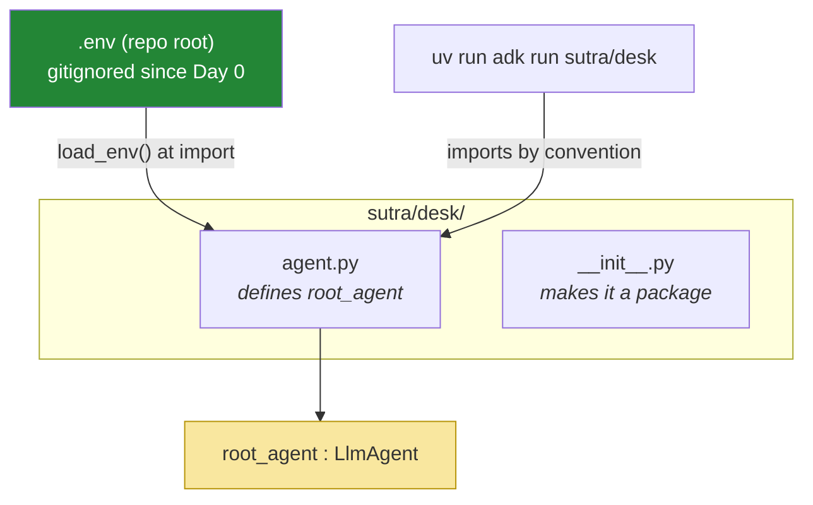

# 1.3 — The layout ADK expects: a convention, and the one place Sutra refuses it

## One-line answer

ADK finds your agent by convention — a folder containing `agent.py` that defines a module-level
`root_agent` — and Sutra adopts all of it except the suggested second `.env`, because one secret in
two files is one more file that can be committed.

---

## The story

In 1904 a fire started in a warehouse in Baltimore and burned for a day and a half, taking most of the
city's business district with it.

Crews came from Washington, from Philadelphia, from New York — dozens of engines, hundreds of
firefighters, arriving at speed to help. And a large number of them could do nothing at all when they
got there, because their hose couplings did not fit Baltimore's hydrants. There were, at the time,
something like six hundred different hydrant thread patterns in use across the country. Every one of
them worked perfectly. Every one of them was locally sensible.

What followed was a national standard thread. And the thing worth noticing is that the standard is
**arbitrary**: no particular thread pattern is better, and the one chosen was not the best engineering
of the six hundred. Its entire value is that everybody uses it, so an engine from anywhere can couple
to a hydrant anywhere without a conversation.

That is what a convention is. Not a claim that this way is right — a claim that agreeing is worth more
than being right.

---

## The idea in plain language

ADK's command-line tools need to find your agent, and they do it by **convention** rather than by
configuration. There is no file telling `adk` where to look. Instead:

| Thing | Where it must be | Why it is that |
| --- | --- | --- |
| a folder | anywhere importable | this is the unit `adk run` and `adk web` operate on |
| `agent.py` | inside that folder | the file the tooling imports |
| `root_agent` | a module-level name in `agent.py` | the object the tooling runs |
| `__init__.py` | inside that folder | declares it a regular package — nothing enforces this, see §*When it breaks* |
| `.env` | inside that folder *(ADK's suggestion)* | where ADK looks for `GOOGLE_API_KEY` |

Four of those five, Sutra adopts without argument, for the Baltimore reason: they cost nothing, the
tooling depends on them, and inventing your own layout buys you a hose that does not fit.

**The fifth is a decision.** Day 1 established that this project has exactly one `.env`, at the
repository root, listed in `.gitignore` before it existed, and read by a loader you wrote
([Day 1, 3.1](../../../day-01-bootstrap-and-map/parts/03-keys-and-env/3.1-the-three-free-doors.md)).
Adding a second `.env` inside an agent folder would mean the same key living in two files, and
Principle 9 is not a preference about tidiness — the repository goes public in Phase 14, and **every
additional file containing a secret is an additional file somebody can commit by accident**. One
`.gitignore` line protecting one path is a rule you can verify; two is a rule you have to remember.

So Sutra keeps one `.env` at the root and has `agent.py` call `load_env()` at import time. The key
still reaches the client, by the route the project already established, and there is still exactly one
file to protect.

That is worth generalising, because you will face it repeatedly from here to Day 96: **adopt a
framework's conventions by default, and refuse the ones that conflict with a decision you made for a
reason you can state.** A refusal without a stated reason is just a preference, and preferences are how
codebases become unnavigable.

---

## Why Sutra needs it

- **Today**, [4.1](../04-the-runner/4.1-the-runner-is-your-run-loop.md) runs this agent, and it can
  only find it because the layout is right.
- **Day 6 (ADK-03)** opens `adk web`, the development UI, which discovers agents by exactly this
  convention — one folder, one `root_agent`, listed in a dropdown.
- **Days 92–96 (multi-agent)** have several agent folders side by side. The convention is what makes
  "which agents does this repository contain?" answerable by looking.
- **Day 90 (deployment)** packages the thing. A layout the tooling recognises is a layout the
  deployment tooling recognises too.
- **Principle 9** is the whole of the refusal: secrets never touch git, and the discipline is real
  because the repository goes public.

---

## The mechanism

The folder, created inside the package so that everything Sutra builds stays in one place
(`CLAUDE.md`: new modules go where the day document says, and nothing scatters at the repo root):

```bash
mkdir -p sutra/desk
touch sutra/desk/__init__.py sutra/desk/agent.py
```

**Line by line:**

- `sutra/desk/` — **`desk`, not `agent`.** Sutra is a support-ticket triage *desk*, and the folder name
  is what will appear in Day 6's `adk web` dropdown and in every `adk run` command you type from here
  to Day 96. A folder called `agent` inside a project of agents answers nothing
  (the same argument the plan makes in §17.2 about numbered folders).
- `__init__.py` — **empty, and required by the convention but by nothing that will check.** It declares
  `sutra/desk` a *regular* package rather than leaving it to be assembled as a namespace package, which
  is what Python does with a directory that has no such file. Write it, and be aware that omitting it
  breaks nothing today: §*When it breaks* runs that experiment, and the reason it matters is Day 90, not
  today.
- `agent.py` — the filename is the convention. Not `main.py`, not `desk.py`. This is the thread
  pattern, and there is nothing to gain by choosing differently.
- **No `.env` here.** That is the refusal, and the next code block is how the key gets in instead.

Now the file, in the minimum shape that satisfies the convention:

```python
"""Sutra's triage desk as an ADK agent (Day 5).

Discovered by convention: ADK imports this module and runs `root_agent`.
    uv run adk run sutra/desk

The key comes from the repository's single .env via Day 1's loader - deliberately
NOT from a second .env in this folder (Principle 9: one file to protect).

Verified against adk.dev/agents/llm-agents/ on 2026-08-25.
"""

from google.adk.agents import LlmAgent

from sutra.config import load_env

load_env()

root_agent = LlmAgent(
    name="sutra_desk",
    model="gemini-3.7-flash",
    description="Triages customer support tickets against a known-issue knowledge base.",
    instruction=(
        "You are Sutra, a support-ticket triage assistant. "
        "Read the ticket before diagnosing it, then check the knowledge base for a "
        "known issue using the symptom words from the ticket body. "
        "Never state a fact that no tool result gave you; if a lookup found nothing, "
        "say so plainly rather than filling the gap."
    ),
)
```

**Line by line:**

- The module docstring names **the page checked and the date** (Principle 8), and states the one
  convention this file refuses and why. A deviation that is not written down next to itself will be
  "fixed" by the next person.
- `from google.adk.agents import LlmAgent` — the import path verified on adk.dev on 2026-08-25.
  `Agent` is documented as an alias for the same class; the quickstart uses `Agent` and the reference
  uses `LlmAgent`. **Sutra writes `LlmAgent`** because the explicit name says which kind of agent this
  is, and Days 92–96 introduce kinds that are not LLM-driven.
- `from sutra.config import load_env` — **Day 1's loader**, unchanged. Nothing about adopting a
  framework requires abandoning code that works.
- `load_env()` at **module level, before `LlmAgent(...)`.** This is import-time work, which is normally
  a smell — and here it is required by the convention: ADK imports this module and then uses
  `root_agent`, so anything that must happen before the agent exists has to happen at import. Note it
  as a genuine cost of the convention rather than pretending it is fine.
- `root_agent = ...` — **the name is the contract.** `desk_agent` or `sutra` would be perfectly good
  Python and ADK would not find it.
- `name="sutra_desk"` — required, and it is an **identifier**, not a title: it appears in traces, and
  from Days 92–96 it is how one agent refers to another. Snake case, no spaces, stable.
- `model="gemini-3.7-flash"` — **explicit, and this is ADK-73.** Leaving it out does not fail; it
  silently uses ADK's own default. [3.1](../03-the-model-pin/3.1-the-default-that-moved.md) is an
  entire part on why that is the trap of this day, and [6.1](../06-failure-lab/6.1-the-agent-with-no-model.md)
  stages it.
- `description=` — one sentence about what this agent is *for*. It reads like documentation and it is
  not ([2.2](../02-the-agent-object/2.2-name-and-description.md)): from Days 92–96 this text is how a
  coordinating agent decides whether to route work here.
- `instruction=` — **Day 4's `SYSTEM`, moved verbatim**
  ([Day 4, 3.2](../../../day-04-tools-by-hand/parts/03-rebuilding-the-loop/3.2-the-loop-that-shrank.md)).
  Not rewritten, not "adapted for ADK". It is the same three sentences because the framework changed
  who runs the loop, not what the agent is being asked to do — and moving it unchanged is what makes
  that visible.
- **No `tools=` yet.** Today is the agent and the runner (ADK-01, ADK-02); `FunctionTool` is Day 10, and
  packages and capabilities arrive on the day they are used. Today's agent can talk and cannot act,
  which makes the comparison in [5.2](../05-the-comparison/5.2-what-you-handed-over.md) about the loop
  rather than about the tools.

And the check that the convention is satisfied, before you try to run anything:

```bash
uv run python -c "
from sutra.desk.agent import root_agent
print(type(root_agent).__name__, '|', root_agent.name, '|', root_agent.model)
"
```

**Line by line:**

- Importing `sutra.desk.agent` **the way ADK will** proves the package layout works — a missing
  `__init__.py` fails here, clearly, rather than inside the tooling.
- `type(root_agent).__name__` — confirms you built the object you think you built.
- `root_agent.model` — **read the model back off the object.** This prints the string you set. It is
  also the exact probe that [6.1](../06-failure-lab/6.1-the-agent-with-no-model.md) uses to find out
  what ADK substitutes when you leave `model=` out, which is a number this document deliberately does
  not print for you.
- **Zero model calls.** Constructing an agent talks to nothing; it is a configuration object
  ([2.1](../02-the-agent-object/2.1-an-agent-is-a-configuration.md)).

Where the pieces sit:



The green box is outside the folder on purpose. That is the one thread Sutra cut its own.

---

## When it breaks

**The missing `__init__.py`, which does not break — and that is the problem:**

```text
$ rm sutra/desk/__init__.py
$ uv run python -c "from sutra.desk.agent import root_agent; print(root_agent.name)"
sutra_desk
```

**What it means.** Nothing failed. Delete the file the convention calls required and the import still
works, because since Python 3.3 a directory with no `__init__.py` can still be imported as a **namespace
package** — a package assembled from directories rather than declared by a file. ADK's loader is happy
too: it imports `desk.agent` and finds `root_agent`, and there is no step anywhere that checks for
`__init__.py`.

**So why write it?** Because "it worked on my laptop" is the whole failure mode. A namespace package has
no `__init__.py` to hold a docstring or an export, merges silently with any other directory of the same
name that appears earlier on `sys.path`, and is treated differently by packaging tools, by
`find_packages()`, and by the `[tool.hatch.build.targets.wheel]` block in this repository's
`pyproject.toml` — which is what decides whether the folder is in the wheel on Day 90. **Create it.** The
point worth carrying is not the file; it is that **a convention with no enforcement is a convention you
can break for months without knowing**, which is the same shape as ADK-73
([3.1](../03-the-model-pin/3.1-the-default-that-moved.md)) and the reason today's test file asserts
structure rather than trusting it.

**The wrong variable name:**

```text
ValueError: No root_agent found for 'desk'. Searched in 'desk.agent.root_agent',
'desk.root_agent' and 'desk\root_agent.yaml'.

Expected directory structure:
  <agents_dir>\
    desk\
      agent.py (with root_agent) OR
      root_agent.yaml
```

**What it means.** You named it `desk_agent`, or you built it inside a function. The convention is a
**module-level name**, so an agent constructed inside `def main():` is invisible however correct it is.

Read the second line rather than the first, because it is the one that saves you time: **the error names
every place it looked.** `desk.agent.root_agent` is the module and the variable, in that order, so a
message listing all three candidates tells you whether the import failed or only the lookup did. That is
what a good convention feels like when you break it — and it is worth contrasting with the two failures
in [7.1](../07-the-dev-ui/7.1-adk-run-and-adk-web.md), where the convention was *kept* and the error
still had to be traced back through two files.

**The second `.env`, which is the failure this part is really about:**

```text
$ git status
On branch main
Untracked files:
  (use "git add <file>..." to include in what will be committed)
        sutra/desk/.env
```

**What it means.** You followed the framework's suggestion and created an agent-folder `.env`. Nothing
is broken — the agent will run. And your repository now contains an untracked file with a live API key
in it, at a path your `.gitignore` does not cover, one `git add -A` away from being public.

Check what your ignore rule actually matches:

```bash
git check-ignore -v .env sutra/desk/.env
```

**Line by line:**

- `git check-ignore -v` — prints **which rule** ignores each path, and prints nothing for a path that is
  not ignored. It is the only way to answer "is this file safe?" without testing it destructively.
- If the second path produces no output, it is **not ignored.** The smallest fix is to delete the file
  and use `load_env()`; the second-smallest is to broaden the ignore rule, and it is second because it
  leaves two files holding one secret.
- **Run this after any framework tells you to put configuration somewhere new.** Every framework has an
  opinion about where secrets live, and every one of those opinions was formed without knowing what is
  in your `.gitignore`.

**The import-time work that surprises a test:**

```text
sutra/desk/agent.py:14: in <module>
    load_env()
E   ConfigError: GOOGLE_API_KEY is not set
```

**What it means.** Something imported `sutra.desk.agent` in an environment with no `.env` — a CI run,
usually, or `pytest` collecting a file that imports it. Because the convention forces import-time
construction, **importing this module is not free**, and anything that imports it inherits its
requirements. The fix in a test suite is to not import it, or to set the variable; the thing to
understand is that the convention made an import into an action, and that is exactly the kind of cost a
convention hides until it bites.

---

## In production

**What a professional does with a framework's layout conventions is adopt them wholesale and document
each refusal at the point of refusal.** A codebase that follows the convention is one any newcomer and
any tool can navigate; a codebase with three-quarters of the convention and some local improvements is
worse than either extreme, because the parts that look standard cannot be trusted to be. Sutra makes
exactly one deviation today and the reason for it sits in the module docstring, three lines from the
thing it explains.

**What degrades at scale is convention-based discovery itself.** One agent folder is obvious. Twenty,
across a monorepo, discovered by scanning for a magic variable name, is a system where "what agents do
we deploy?" is answered by a glob — and a folder someone left on a branch, or a copy made for an
experiment, becomes a deployed agent. Teams reach the same answer every time: an explicit manifest that
lists what is real, with discovery used for local development only. The convention is excellent for
`adk web` on a laptop and is not a deployment strategy.

**The failure that only appears with real traffic is import-time configuration.** `load_env()` at module
level is fine on a laptop and becomes interesting in a container, where the platform sets environment
variables and there is no `.env` at all — which is exactly why Day 1's loader returns quietly when the
file is absent rather than raising. It becomes a genuine outage when import-time work does something
slower or more fallible than reading a file: fetching a secret from a vault, opening a connection,
resolving a service. Every one of those turns a failed dependency into an *import* error, which many
process managers report as a crash loop with no useful message. Keep import-time work to reading
configuration, and do anything that can fail slowly in a function you call.

**The review comment a senior engineer leaves:** *"There's a `.env` in the agent folder and one at the
root. Which is real? Delete one — two files holding the same secret means two paths to protect and one
of them will eventually be outside `.gitignore`. And run `git check-ignore -v` on both before you
answer."*

**The interview question:** *"a framework tells you to put a config file somewhere your project's
conventions say it shouldn't go. What do you do?"* The answer that shows judgement: "I take the
framework's convention by default, because the value of a convention is agreement rather than
correctness and half-following one is the worst outcome. The exceptions are the places where the
convention conflicts with a decision I can state a reason for — and for secrets that's nearly always,
because frameworks suggest a config file per component and the security property I want is a small
number of paths to protect. So I'd keep one secrets file, load it in the module the framework imports,
document the deviation in that module, and verify with `git check-ignore` rather than assuming. What I
wouldn't do is deviate quietly, because a codebase that looks standard and isn't is harder to work in
than one that's consistently unusual."

---

## Check yourself

```bash
ls sutra/desk/
git check-ignore -v .env sutra/desk/.env
uv run python -c "from sutra.desk.agent import root_agent; print(root_agent.name, root_agent.model)"
```

Expect exactly two files, a rule reported for `.env` and **nothing at all** printed for
`sutra/desk/.env` — because that file must not exist. Then the agent's name and its explicitly pinned
model.

`ls` is the whole check for `__init__.py`, because §*When it breaks* is why nothing else will tell you.

**Answer out loud, without scrolling up:**

> Name the four parts of ADK's agent-folder convention and say why Sutra adopts them without arguing.
> Then say which one it refuses, the principle behind the refusal, and the command that proves the
> refusal was necessary.

---

**Next:** [2.1 — An agent is a configuration](../02-the-agent-object/2.1-an-agent-is-a-configuration.md)
