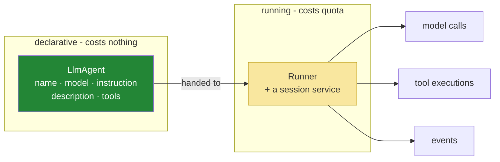

# 2.1 — An agent is a configuration, not a loop: constructing one does nothing at all

## One-line answer

`LlmAgent(...)` builds an object that describes an agent — a name, a model, an instruction, a tool
list — and makes no network call, spends no quota and runs nothing; the running is a separate thing
called a runner, and keeping those two ideas apart explains most of what is confusing about
frameworks.

---

## The story

A job description is a piece of paper. It has a title, a reporting line, a list of responsibilities,
and a paragraph about what the person will be expected to achieve.

You can write one, print it, file it, email it to eleven people and put it in a folder called
*Roles*. Nothing happens. No work is done, nobody is paid, and the responsibilities on it remain
undischarged, however carefully the paragraph is worded.

Something *does* happen when a person is hired and turns up on a Monday. And then the description
matters enormously — it shapes what they do, what they refuse, who they escalate to — but it is
still the paper, and the work is still the person.

The confusion worth avoiding is the one where somebody rewrites the job description in response to a
problem and expects the problem to change. Sometimes it does, because the description shaped the
behaviour. Often the issue is that nobody was hired, or two people were hired for it, or the person
who turned up has no access to the system they are supposed to be using.

---

## The idea in plain language

In ADK there are two objects and they do two completely different things:

| | `LlmAgent` | `Runner` |
| --- | --- | --- |
| What it is | a **description** of an agent | the thing that **runs** one |
| What it holds | name, model, instruction, tools | an agent, an app name, a session service |
| Constructing it | costs nothing, touches nothing | costs nothing, touches nothing |
| Using it | you do not "use" it — you hand it over | this is where model calls happen |
| Your Day 4 equivalent | `SYSTEM` + `DECLARATIONS` + `MODEL` | `run_loop` |

Read the last row, because it is the whole mapping. Everything you had that was *settings* is now an
`LlmAgent`. Everything you had that was *the loop* is now a `Runner`
([4.1](../04-the-runner/4.1-the-runner-is-your-run-loop.md)).

This sounds obvious and it is the single most common source of confusion for people meeting an agent
framework, because the word "agent" in ordinary speech means the thing that acts. Here it means the
thing that describes what would act. `LlmAgent(name="sutra_desk", ...)` is not an agent doing anything.
It is a paragraph, in an object.

Three practical consequences follow, and they are the reason the split is a good design rather than
pedantry:

- **Agents are cheap.** Constructing one makes no call, so you can build ten in a test, compare their
  instructions, assert on their tool lists, and never spend a token
  ([Check yourself](#check-yourself) does exactly this).
- **Agents are comparable.** Two agents differing only in instruction are two objects you can hold at
  once. That is what makes an evaluation harness possible on Days 79–83.
- **Agents are inert until run.** Nothing in an `LlmAgent` can call a tool, spend quota, or touch the
  world. All of that requires a runner, which means the question *"what could this thing do?"* has a
  precise answer: whatever the runner it is given permits.

One term defined here on first use: this style of object is **declarative** — it states *what* rather
than performing *how*. You have already written one, on Day 4: a tool declaration
([Day 4, 1.2](../../../day-04-tools-by-hand/parts/01-the-schema/1.2-declaring-a-tool.md)) is a dict
describing a function without containing one. An `LlmAgent` is the same idea one level up.

---

## Why Sutra needs it

- **Today**, [4.1](../04-the-runner/4.1-the-runner-is-your-run-loop.md) introduces the runner, and it
  will make sense immediately if you already know the agent is not it.
- **[6.1](../06-failure-lab/6.1-the-agent-with-no-model.md)** probes a constructed agent's `model`
  attribute without running anything. That probe only exists because construction is free.
- **Day 6 (ADK-03, AG-05)** varies the instruction and compares behaviour — two agents, one runner.
- **Days 92–96 (multi-agent)** compose agents into graphs. Composition of *descriptions* is
  straightforward; composition of running processes is not, and the split is what makes that day
  tractable.
- **Days 79–83 (evals)** construct agents in a loop and score them. Free construction is what makes an
  eval suite affordable.

---

## The mechanism

Prove it costs nothing. This is the demonstration worth running before you believe the paragraph:

```bash
uv run python -c "
import os
os.environ.pop('GOOGLE_API_KEY', None)
from google.adk.agents import LlmAgent
a = LlmAgent(name='probe', model='gemini-3.7-flash', instruction='say hello')
print('constructed with no key:', type(a).__name__, a.name, a.model)
"
```

**Line by line:**

- `os.environ.pop('GOOGLE_API_KEY', None)` — **deleting the key from this process's environment**
  before importing anything. `pop` with a default of `None` so it does not raise when the variable was
  never set. This is the experiment: if construction needed a key, this would fail.
- `LlmAgent(name=..., model=..., instruction=...)` — three fields, the minimum that says anything.
  `name` and `model` are the required ones ([1.3](../01-installing-adk/1.3-the-layout-adk-expects.md)).
- `print(...)` — it prints. **No key, no network, no error.** An object was built out of strings.
- **Zero model calls, and that is the finding.** Compare Day 2, where `genai.Client()` read the key at
  construction and a loader called afterwards was called too late
  ([1.3](../../../day-02-llm-mechanics/parts/01-first-contact/1.3-listed-is-not-callable.md)). An
  `LlmAgent` is not a client; it is a description of one's intended use.

Now read what an agent can hold, because the field list is the map of Days 6 through 12:

```python
root_agent = LlmAgent(
    name="sutra_desk",  # identifier - traces, and routing from Day 92
    model="gemini-3.7-flash",  # the pin - ADK-73, part 3.1
    description="Triages customer support tickets against a known-issue KB.",
    instruction="You are Sutra, a support-ticket triage assistant. ...",
    # tools=[...],                        # Day 10 (ADK-10, ADK-11)
    # output_key="triage",                # Day 17 (ADK-19) - writes the answer into session state
    # output_schema=...,                  # Day 12 (ADK-13) - structured output
    # generate_content_config=...,        # temperature and friends
    # include_contents="default",         # whether prior turns are sent at all
    # planner=...,                        # multi-step planning, later
)
```

**Line by line:**

- `name` and `model` are **required**; everything else is optional. Verified against
  `adk.dev/agents/llm-agents/` on 2026-08-25.
- `description` and `instruction` look like the same thing and are not — that is
  [2.2](2.2-name-and-description.md) and [2.3](2.3-the-instruction-is-your-system-prompt.md), one part
  each, because confusing them is the day's most common modelling error.
- The **commented-out fields are the point of showing them.** Each is a day in this curriculum, and
  seeing them here means that when Day 12 says "put a schema on the output", you will know it is a
  parameter you already saw rather than a new subsystem.
- `include_contents` — worth noticing now: it controls whether the conversation history is sent at all.
  That is the same decision Sutra made by hand on Day 2 with `store=False` and an explicit list
  ([3.3](../../../day-02-llm-mechanics/parts/03-context-and-memory/3.3-the-server-will-remember.md)),
  now a keyword. **Every framework parameter is somebody's hand-rolled decision, promoted.**
- `generate_content_config` — where `temperature` lives. Day 4 passed `{"temperature": 0.0}` on every
  call; here it is a property of the agent rather than of each call, which is a real difference and one
  the runner will make concrete.
- **No `tools=` today.** ADK-01 and ADK-02 are installation and the `Agent` + runner; `FunctionTool` is
  ADK-10 on Day 10, and capabilities arrive on the day they are used.

The two objects, and where the boundary between them falls:



Everything green is free and testable. Everything yellow is Day 24's budget and Days 62–65's approval
gates. **You can write a great deal of confident test coverage over the green box**, and it is worth
doing precisely because it costs nothing.

---

## When it breaks

**Expecting the agent to run:**

```text
>>> root_agent("what is the status of ticket 4521?")
Traceback (most recent call last):
  File "<stdin>", line 1, in <module>
TypeError: 'LlmAgent' object is not callable
```

**What it means.** The mental model has slipped back to "agent = the thing that acts". It is a
description; the runner runs it. **The error is a good one** — it is immediate and it names the type —
and it is worth triggering once deliberately, because the same confusion in a subtler form is the next
failure.

**Rewriting the description when nobody was hired:**

```text
"The agent isn't responding."
"What does the runner say?"
"...what runner?"
```

**What it means.** Someone edited `instruction` four times looking for an effect, and no runner was
ever created — or one was created around a *different* agent object. This is the job-description
failure exactly, and the diagnostic is the same as Day 3's: **print what actually ran**, which here
means printing the agent the runner was constructed with, not the one you have been editing.

**Two agents where you meant one:**

```python
root_agent = LlmAgent(name="sutra_desk", model="gemini-3.7-flash", instruction=INSTRUCTION)
# ... later in the same file, during an experiment ...
root_agent = LlmAgent(name="sutra_desk", model="gemini-3.7-flash", instruction=BETTER_INSTRUCTION)
```

**Line by line:**

- Both constructions succeed, because construction is free and validates almost nothing about intent.
  The second silently replaces the first.
- Which one the runner gets depends on **when** the runner was created relative to these lines — a
  runner built between them holds a reference to the first object, and every subsequent edit to
  `root_agent` changes nothing at all.
- **This is the flip side of "construction is free":** nothing objects to building agents you do not
  use. In a notebook or a long-running process this produces a genuinely baffling afternoon. Build the
  agent once, at module level, which is what the convention already pushes you towards.

**Assuming the agent holds the conversation:**

```text
>>> root_agent.history
AttributeError: 'LlmAgent' object has no attribute 'history'
```

**What it means.** The transcript is not on the agent. It is in a **session**, held by a session
service, which the runner is given ([4.2](../04-the-runner/4.2-sessions-and-the-transcript.md)). The
agent is the same object across every conversation it is ever used for — which is what lets one agent
serve a thousand users at once, and which is the answer to a question you should be asking by now:
*where did Day 4's `history` list go?*

---

## In production

**What a professional does with the declarative half is test it exhaustively, because it is free.**
Assertions that the instruction contains the constraints it must contain, that the tool list matches
what the security review approved, that the model is pinned rather than defaulted, that two agents
which must not diverge have not — all of it runs in milliseconds with no key. The behavioural tests
(Days 79–83) are the expensive ones and they should not be doing work that a structural assertion can
do.

**What degrades at scale is agent proliferation.** Free construction means agents multiply — a variant
for a customer, a variant for a locale, a variant somebody made for an experiment — and since they are
just objects, nothing tracks them. The question that becomes hard is "which agent configurations are
live in production, and who approved each one?" The answer that works is to make the *set* of agents
explicit and enumerable, the same conclusion as
[1.3](../01-installing-adk/1.3-the-layout-adk-expects.md)'s point about discovery: convention is fine
for finding agents on a laptop and a manifest is what you deploy.

**The failure that only appears with real traffic is shared mutable state on an agent.** One agent
object serves every concurrent request, which is exactly right for a description and becomes a bug the
moment somebody attaches per-conversation state to it — a "current ticket", a counter, a cached
lookup. Under load, two users' requests read and write the same attribute and the failure is
intermittent, load-correlated and impossible to reproduce locally. **The agent is shared; the session
is per-conversation.** Anything that varies by conversation belongs in the session
([4.2](../04-the-runner/4.2-sessions-and-the-transcript.md)), and Day 17's session-state work is where
that becomes a design skill rather than a rule.

**The review comment a senior engineer leaves:** *"This stores the current ticket id on the agent
object. The agent is a singleton shared across every concurrent request — that's a cross-user data leak
under load, and it'll pass every test we have because our tests are sequential. Per-conversation state
goes in the session."*

**The interview question:** *"in an agent framework, what's the difference between the agent and the
runner?"* The answer that shows you have used one: "The agent is declarative — a name, a model, an
instruction, a tool list. Constructing it makes no call and costs nothing, which means I can assert
whatever I like about it for free, and it also means it does nothing on its own. The runner is what
executes: it holds the loop, it calls the model, it dispatches tools, it emits events, and it works
against a session that holds the conversation. The practical consequence I care about is lifetime: the
agent is shared across every concurrent conversation and the session is per-conversation, so anything
that varies per user belongs in the session. Putting it on the agent gives you a cross-user leak that
only shows up under concurrency and passes every sequential test you have."

---

## Check yourself

```bash
uv run python -c "
import os; os.environ.pop('GOOGLE_API_KEY', None)
from sutra.desk.agent import root_agent as a
print('type       :', type(a).__name__)
print('name       :', a.name)
print('model      :', a.model)
print('has history:', hasattr(a, 'history'))
"
```

Four lines, **zero model calls**, and the last one must print `False`. If importing the module raises
because the key is missing, re-read [1.3](../01-installing-adk/1.3-the-layout-adk-expects.md)'s note
about import-time work — that is the convention's cost, showing up exactly where it was predicted to.

**Answer out loud, without scrolling up:**

> Say what constructing an `LlmAgent` costs and what it does. Then map your Day 4 code onto the two
> objects — which parts became the agent, which became the runner — and say where the conversation
> history went.

---

**Next:** [2.2 — Name and description are not decoration](2.2-name-and-description.md)
