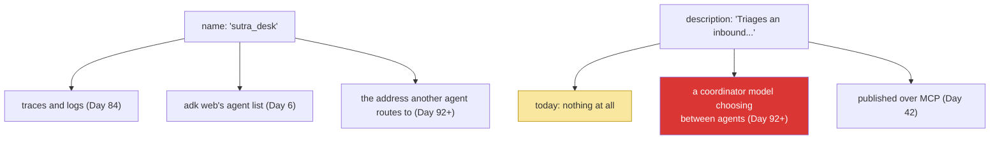

# 2.2 — Name and description are not decoration: one is an address, the other is an advertisement

## One-line answer

`name` is an identifier that appears in traces and becomes the address other agents route to, and
`description` is read by a *model* to decide whether to send work here — so the field that looks most
like a comment is the one with runtime behaviour attached, exactly as it was for tools on Day 4.

---

## The story

A large office building has a directory in the lobby. Each line is a floor, a company, and a short
phrase.

Most of them are fine. *"Wexler Marine — ship insurance and cargo claims."* Somebody arriving with a
damaged-container problem reads that and goes to the fourth floor.

Two of them are not. On the sixth floor there is *"Northgate Group."* On the eighth there is
*"Northgate Services Ltd."* Neither line says what either does. They are unrelated companies that
happen to share a name, and one of them handles payroll while the other one recycles industrial
solvents.

The security desk fields the consequences all day, every day, and has done for years — people going to
the wrong floor, coming back down, going up again, occasionally handing sensitive paperwork to a
receptionist at the wrong company before anybody notices. The building has tried a bigger sign and a
better font.

The problem was never the sign. It is that two lines of the directory do not distinguish the two
things behind them, and no amount of typography fixes a description that does not describe.

---

## The idea in plain language

Two fields on an `LlmAgent` look like documentation. Neither is.

**`name` is an address.** It is a machine identifier, and it shows up in three places that matter:

- in traces and logs, as the thing that says which agent produced an event
- in `adk web`'s agent list (Day 6), as the entry you select
- from Days 92–96, as the **string one agent uses to hand work to another**

That last one is why `name` is snake case with no spaces and why it should never change casually.
Renaming an agent is renaming an address that other agents, dashboards and saved queries refer to.

**`description` is an advertisement**, and it is read by a language model. Today, with one agent, it
does nothing at all — which is why it is easy to write badly now and expensive later. From Days 92–96,
Sutra has several agents and a coordinator that decides which one should handle a request, and it
decides **by reading their descriptions**. At that point the directory board becomes load-bearing.

If that structure feels familiar, it should:
[Day 4, 1.3](../../../day-04-tools-by-hand/parts/01-the-schema/1.3-the-description-is-the-prompt.md)
made exactly this argument about **tools** — three fields fail loudly and `description` fails silently,
because it is the only one a model reads. An agent is the same shape one level up:

| | tool (Day 4) | agent (today) |
| --- | --- | --- |
| the address | `name` in the declaration | `name` on the agent |
| the advertisement | `description` — read by the model choosing a tool | `description` — read by a model choosing an agent |
| what a bad one costs | the wrong tool is called, silently | the request is routed to the wrong agent, silently |

**The same lesson, at a different scale, is a signal that it is a real pattern rather than a quirk of
one API.** You will meet it a third time on Day 25, where an Agent Skill's front-matter description is
what makes an agent load it or ignore it.

And the fourth question from Day 4 applies unchanged: a good description says what it is **for**, what
it handles, what comes back, and **what it is not** — the last one being the clause that fixes
Northgate.

---

## Why Sutra needs it

- **Day 6 (ADK-03)** puts `adk web` in front of you, where `name` is the thing you click.
- **Days 92–96 (multi-agent)** are the cash-in: a coordinator reads descriptions and routes. An agent
  whose description says "Handles support things" will receive work it cannot do, and the failure will
  present as the coordinator being unreliable.
- **Day 42 (MCP-33)** exposes a whole agent as a tool over MCP, at which point `name` and `description`
  are published to clients you did not write. The advertisement becomes genuinely public.
- **Day 84 (OPS)** builds tracing. `name` is the label on every span this agent emits, and a renamed
  agent is a broken dashboard.

---

## The mechanism

The two fields, written for the jobs they actually do:

```python
root_agent = LlmAgent(
    name="sutra_desk",
    model="gemini-3.7-flash",
    description=(
        "Triages an inbound customer support ticket: reads the ticket, checks the "
        "internal knowledge base for a matching known issue, and returns a diagnosis "
        "with the article id, or says plainly that no known issue matched. "
        "Not for billing questions, account changes, or anything that writes."
    ),
    instruction="...",
)
```

**Line by line:**

- `name="sutra_desk"` — **snake case, no spaces, no version number.** Snake case because it is an
  identifier that will be typed into routing code and appear in log queries; no version because
  `sutra_desk_v2` becomes the permanent name of the thing everybody actually uses and then there are
  two.
- The name is **stable**, and that is a property to protect deliberately. From Day 92 it is a string in
  another agent's configuration; from Day 84 it is a label in a dashboard query. Rename it when the
  agent's *purpose* changes, not when its wording improves.
- `description=(...)` — four clauses, and they are the four questions from
  [Day 4, 1.3](../../../day-04-tools-by-hand/parts/01-the-schema/1.3-the-description-is-the-prompt.md):
- `"Triages an inbound customer support ticket"` — **what it is for**, in the vocabulary of the
  situation rather than of the code. A coordinator matching a request against this is matching prose
  against prose.
- `"reads the ticket, checks the internal knowledge base ... returns a diagnosis with the article id"`
  — **what it does and what comes back.** Naming the article id matters: a router deciding between this
  agent and a general question-answering agent needs to know the output is a cited diagnosis rather
  than an opinion.
- `"or says plainly that no known issue matched"` — **the miss case, advertised.** Same reasoning as a
  tool's description: a router that knows this agent can come back empty will plan for it, and one that
  does not will treat an empty result as a failure.
- `"Not for billing questions, account changes, or anything that writes."` — **the Northgate clause**,
  and the one people leave out. Today it distinguishes this agent from nothing, because there is
  nothing else. By Day 93 there is a billing agent, and this sentence is what stops half its traffic
  arriving here.
- **Notice the description never says "you".** It is written in the third person, about the agent,
  because its reader is somebody choosing between agents. The `instruction` is written in the second
  person, to the model, because its reader is the model being the agent —
  [2.3](2.3-the-instruction-is-your-system-prompt.md) is entirely about that distinction.

And the check that these are real rather than decorative, which is available today:

```bash
uv run python -c "
from sutra.desk.agent import root_agent as a
print('name         :', a.name)
print('description  :', len(a.description.split()), 'words')
print('has not-clause:', 'not for' in a.description.lower())
print('name is safe :', a.name.isidentifier() and a.name == a.name.lower())
"
```

**Line by line:**

- `len(a.description.split())` — a word count, because from Day 92 the descriptions of every candidate
  agent are sent to a router **on every routing decision**. They are a recurring cost, exactly as tool
  descriptions were
  ([Day 4, 1.3](../../../day-04-tools-by-hand/parts/01-the-schema/1.3-the-description-is-the-prompt.md)).
- `'not for' in a.description.lower()` — a crude check for the Northgate clause. Crude on purpose: a
  reminder that catches the omission most of the time beats an elegant check nobody writes.
- `a.name.isidentifier()` — **a valid Python identifier**, which is a good proxy for "safe as an
  address": no spaces, no punctuation, does not start with a digit. It will also be a fragment of a log
  query and a key in a routing table, and those want the same properties.
- `a.name == a.name.lower()` — consistent casing, so that `Sutra_Desk` and `sutra_desk` never both
  exist. Trivial, and the day two spellings of one agent appear in a dashboard is the day somebody
  spends an afternoon on it.
- **Zero model calls.** This is all structural, all free, and worth a test.

Where each field is consumed, today and later:



The yellow box is the trap: a field that does nothing today is a field written carelessly today, and
the red box is where that is paid for.

---

## When it breaks

**The Northgate directory**, which is a Day 92 failure with a Day 5 cause:

```text
[coordinator] routing "my card was declined on the March invoice"
  -> sutra_desk   ("Handles customer support requests.")

[sutra_desk] I could not find a ticket for that. Could you provide a ticket number?
```

**What it means.** Two agents' descriptions did not distinguish them, so the coordinator picked one on
a coin-flip's worth of signal. The user gets an unhelpful answer from an agent that was never meant to
see the request, and **nothing failed** — the routing was a model's judgement made on the information
available, and the information was two sentences that both said "customer support".

The fix is not a better coordinator. It is a description with the fourth clause in it, and the reason
to write that clause today, with one agent, is that on the day it matters you will be debugging a
routing decision rather than editing a field.

**The rename:**

```text
[coordinator] tried to delegate to 'sutra_desk'
ValueError: no agent named 'sutra_desk' is registered
```

**What it means.** Somebody improved the name to `support_triage_desk`. Every reference elsewhere —
another agent's configuration, a saved dashboard query, a deployment manifest — is now stale, and only
the loudest of them errored. **A name is an address**, and the discipline is the same as for a URL or a
database column: renaming is a migration, not a tidy-up.

**The description written for a human:**

```python
description = ("Sutra's main agent. See docs/ARCHITECTURE.md for details.",)
```

**Line by line:**

- Perfectly reasonable as a code comment, and useless as an advertisement. A router-model cannot open
  `docs/ARCHITECTURE.md`; it has this string and the other candidates' strings, and nothing else.
- `"Sutra's main agent"` describes the agent's **position in your codebase**, which is not a fact about
  what work it should receive. Compare *"triages an inbound support ticket against a known-issue
  knowledge base"*, which is entirely about the work.
- **The test to apply:** could somebody who has never seen this repository decide, from this sentence
  alone, whether a given request belongs here? If not, it is a comment in a field that is not a comment.

**The instruction pasted into the description:**

```python
description = ("You are Sutra, a support-ticket triage assistant. Read the ticket before...",)
```

**Line by line:**

- Written in the second person, to the model, which is the `instruction`'s job. A router reading
  *"You are Sutra..."* is being addressed by a description of a different agent, which is exactly as
  confusing as it sounds.
- The two fields are near-neighbours in the constructor and near-synonyms in English, which is why this
  is common. **The discriminator is the audience:** `description` is *about* the agent, third person,
  read by whoever is choosing; `instruction` is *to* the model, second person, read by the agent being
  the agent. [2.3](2.3-the-instruction-is-your-system-prompt.md) takes that apart properly.

---

## In production

**What a professional does with agent descriptions is write them as a set, not individually.** Routing
is a comparison between candidates, so the useful property is not that each description is good but
that no two are confusable — which means reviewing them together, and which means an agent's
description is not finished when the agent is finished. Teams that run multi-agent systems end up with
a single file listing every agent's name and description precisely so that the set can be read at once,
and that file is reviewed when an agent is added.

**What degrades at scale is routing accuracy, in a way that looks like a model problem.** Five agents
route well; twenty-five contain several near-neighbours by construction, and accuracy falls fastest
exactly where the consequences are worst — the billing agent and the refunds agent, the read agent and
the write agent. The measurement that separates "the router is bad" from "these two descriptions are
confusable" is **per-pair confusion**, not overall accuracy: you want to know *which* two are being
swapped, because the fix is a sentence in one description rather than a better router.

**The failure that only appears with real traffic is the description that drifts from the agent.** An
agent gains a tool, or loses one, or its instruction is tightened to refuse a category it used to
handle — and the description still advertises the old scope. The router keeps sending work the agent
now declines, which shows up as a rise in refusals rather than as a routing error, and the two look
nothing alike in a dashboard. **The description is part of the interface**, so it changes when the
capability changes, and the review that approves a tool addition should be looking at both.

**The review comment a senior engineer leaves:** *"This description says what the agent is called and
where its docs are. From Day 92 a model reads it to decide whether to send work here, and it can't open
our docs. Say what work it takes, what it returns, and — most importantly — what it doesn't handle;
that last clause is what keeps it distinguishable from the billing agent we're adding next month."*

**The interview question:** *"in a multi-agent system, how does work get to the right agent?"* The
answer that shows you have run one: "In most frameworks a coordinator model reads each candidate
agent's description and picks. So the description is a prompt, not documentation — and the failure mode
is silent: a well-formed delegation to the wrong agent, which looks like the coordinator being
unreliable rather than like two sentences that don't distinguish two things. I write descriptions as a
set and review them together, because selection is a comparison, and I make sure each one says what it
*doesn't* handle, which is the clause that keeps near-neighbours apart. When accuracy drops I measure
per-pair confusion rather than overall accuracy, because that tells me which sentence to fix. And I
treat the agent's name as an address — other agents reference it by string, so renaming it is a
migration."

---

## Check yourself

```bash
uv run python -c "
from sutra.desk.agent import root_agent as a
print(a.name, '|', a.name.isidentifier())
print(a.description)
"
```

Read the description out loud and ask the four questions: what work does it take, what does it do, what
comes back, **what does it not handle**. Then imagine a second agent called `sutra_billing` and ask
whether a router could tell them apart from these sentences alone.

**Answer out loud, without scrolling up:**

> Say what `name` is used for in three different places, and why renaming it is a migration. Then say
> who reads `description`, when it starts mattering, and which clause people leave out.

---

**Next:** [2.3 — The instruction is your system prompt](2.3-the-instruction-is-your-system-prompt.md)
