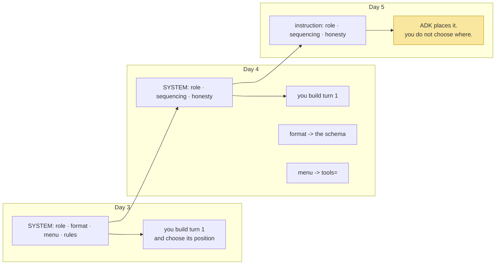

# 2.3 — The instruction is your system prompt: moved verbatim, and one lever lost

## One-line answer

`instruction` is Day 4's `SYSTEM` string, moved across without a word changed — the framework changed
who runs the loop, not what the agent is asked to do — and the one thing you give up is control over
*where* in the payload it lands, which was a real lever on Day 3.

---

## The story

A theatre programme describes a character in the third person, for people in the seats: *"Inspector
Vane, a weary detective in his final year of service, returns to the town he grew up in."* It is
accurate, it is well written, and its job is to help somebody in row H follow what is happening.

The actor's script is a different document. It is in the second person and the imperative: you enter
from the left, you do not look at her when you say this line, you are three drinks in but hiding it,
you exit before the lamp goes out.

Both are about Inspector Vane. Only one of them can be performed.

An understudy handed the programme instead of the script would know exactly who the character is and
would have no idea what to do on stage — and the mistake is easy to make, because at a glance the two
documents cover the same ground. The distinction is not detail. It is **audience**: one is written for
somebody choosing what to watch, the other for somebody being the thing.

---

## The idea in plain language

[2.2](2.2-name-and-description.md) established `description` as the programme note — third person,
about the agent, read by whoever is deciding where to send work.

`instruction` is the script. Second person, addressed to the model, read by the model *while being*
the agent. It is exactly what `SYSTEM` was on Days 3 and 4, and the honest way to move it is to
**not touch a word**:

```text
Day 4, sutra/agent.py:
    SYSTEM = ("You are Sutra, a support-ticket triage assistant. "
              "Read the ticket before diagnosing it, then check the knowledge base ...")

Day 5, sutra/desk/agent.py:
    instruction = ("You are Sutra, a support-ticket triage assistant. "
                   "Read the ticket before diagnosing it, then check the knowledge base ...")
```

The same three sentences, because the framework changed **who runs the loop**, not what the agent is
being asked to do. Rewriting it "for ADK" would obscure the most useful fact available today: the
prompt is portable, and it is portable because it was never about the plumbing.

Recall what those three sentences contain, and — more importantly — what Day 4 already deleted from
them ([3.2](../../../day-04-tools-by-hand/parts/03-rebuilding-the-loop/3.2-the-loop-that-shrank.md)):

| Still in the instruction | Deleted, and by what |
| --- | --- |
| the role — *"You are Sutra, a support-ticket triage assistant"* | — |
| sequencing — *"read the ticket... then check the knowledge base"* | *(no schema can express order)* |
| honesty — *"never state a fact that no tool result gave you"* | — |
| | the reply format — deleted by the schema (Day 4) |
| | the tool menu — deleted by `tools=` (Day 4), and generated from docstrings on Day 10 |

**Role, sequencing, constraints.** That is what a system prompt is for once the protocol and the menu
live elsewhere, and it is a much smaller subject than it looked on Day 3. Day 6 (ADK-03, AG-05) is
where it becomes a craft.

And now the thing you lose, which is worth being clear-eyed about rather than glossing. On Day 3 you
built the first turn yourself, so you controlled **where the instruction sat in the payload** — and
[Day 3, 3.1](../../../day-03-loop-hand-rolled/parts/03-the-protocol/3.1-a-contract-enforced-by-politeness.md)
named a real lever: *the last instruction before the question carries more weight than the first*, which
made "move the format block later" a fix you could try. Today you hand ADK a string and it decides
where it goes. That lever is gone unless the framework offers it back.

That is not a reason to reject the framework. It is the first concrete entry in the seam list from
[1.1](../01-installing-adk/1.1-what-a-framework-takes.md), and
[5.1](../05-the-comparison/5.1-the-seam-list-checked.md) tallies it up properly.

---

## Why Sutra needs it

- **Day 6 (ADK-03, AG-05)** is instruction design as its own subject: personas, constraints, refusals,
  and what changes when the instruction has to be written by somebody who will never read the loop.
- **Day 10 (ADK-10, ADK-11)** adds `tools=`, and the tool descriptions come from your functions'
  docstrings — so a second body of model-facing prose appears, and knowing which text does which job
  stops them duplicating each other.
- **Day 25 onward (Agent Skills)** makes instructions versioned artifacts on disk. That is this string,
  promoted to a file with an identity.
- **Days 79–83 (evals)** vary the instruction and score the result. The comparison is only meaningful if
  the instruction is the only thing that changed, which is an argument for moving it verbatim today.

---

## The mechanism

The move, in full, with the source it came from named:

```python
# sutra/desk/agent.py
# The instruction is Day 4's SYSTEM, unchanged. If you find yourself editing it
# while adopting the framework, stop: that is two changes at once, and you will
# not know which one moved the behaviour.
INSTRUCTION = (
    "You are Sutra, a support-ticket triage assistant. "
    "Read the ticket before diagnosing it, then check the knowledge base for a "
    "known issue using the symptom words from the ticket body. "
    "Never state a fact that no tool result gave you; if a lookup found nothing, "
    "say so plainly rather than filling the gap."
)

root_agent = LlmAgent(
    name="sutra_desk",
    model="gemini-3.7-flash",
    description="Triages an inbound customer support ticket ...",
    instruction=INSTRUCTION,
)
```

**Line by line:**

- The comment is doing real work and is not decoration: **changing two things at once is how a day of
  comparison becomes a day of confusion.** Principle 4 says build first and compare after, and a
  comparison needs one variable.
- `INSTRUCTION = (...)` — a **named module-level constant**, not an inline string in the constructor.
  Same reasoning as `SYSTEM` on Day 3
  ([3.1](../../../day-03-loop-hand-rolled/parts/03-the-protocol/3.1-a-contract-enforced-by-politeness.md)):
  a change to the agent's behaviour should be a diff a reviewer sees, and `git log -p` on this file
  should read as the history of what this agent was ever told.
- `"You are Sutra..."` — **second person.** Compare `description`, which is third person and about the
  agent ([2.2](2.2-name-and-description.md)). If you ever cannot remember which field you are writing,
  the pronoun tells you.
- `"Read the ticket before diagnosing it, then check the knowledge base"` — **sequencing**, and it
  survives every protocol change because no schema and no tool list can express an ordering
  ([Day 4, 1.2](../../../day-04-tools-by-hand/parts/01-the-schema/1.2-declaring-a-tool.md)).
- `"using the symptom words from the ticket body"` — steering the *content* of a future tool argument,
  from a day on which the agent has no tools. It stays because Day 10 adds them and because deleting it
  now would be a second change.
- `"Never state a fact that no tool result gave you..."` — **honesty**, still a request rather than a
  mechanism. Nothing in ADK reduces fabrication; Day 3's
  [4.3](../../../day-03-loop-hand-rolled/parts/04-running-the-loop/4.3-the-honest-failure.md) is
  unchanged, and Days 79–83 are still the only instrument that measures it.
- `instruction=INSTRUCTION` — one keyword. **Everything Day 3 did to place this text in the payload —
  building the first turn, labelling the question, deciding what came before what — is gone**, and what
  remains is a string handed over.

Now find out what actually happens to it, because "handed over" is not a description you should accept:

```bash
uv run python -c "
import inspect
from google.adk.agents import LlmAgent
print(inspect.signature(LlmAgent).parameters.get('instruction'))
print([p for p in inspect.signature(LlmAgent).parameters if 'instr' in p or 'content' in p])
"
```

**Line by line:**

- `inspect.signature(LlmAgent)` — **read the installed object**, not a tutorial. This is the same rule
  Day 2 applied to a turn shape and
  [4.3](../04-the-runner/4.3-read-the-signature-not-the-tutorial.md) states as a habit: the class you
  imported is more authoritative than any page, because it is the version you pinned.
- `.parameters.get('instruction')` — prints the parameter with its annotation and default, which tells
  you whether a plain string is the only thing accepted. Some frameworks accept a callable or a
  template here; **whether this one does is a question for your object, not for this document**, and
  Day 6 builds on the answer.
- The second line lists neighbouring parameters — `global_instruction` and `include_contents` are the
  ones to look for. `include_contents` in particular decides whether prior turns are sent at all, which
  is the same decision Sutra made by hand with `store=False`
  ([Day 2, 3.3](../../../day-02-llm-mechanics/parts/03-context-and-memory/3.3-the-server-will-remember.md)).
- **Zero model calls.** Reading a signature is free, and doing it before writing code that depends on
  the answer is the difference between Principle 8 and a guess.

What moved where, across three days:



The yellow box is the day's first entry in the seam list. Not a problem — a **trade**, recorded.

---

## When it breaks

**The instruction rewritten during the port:**

```text
"The ADK version answers worse than yesterday's."
"What changed?"
"I moved it to ADK and tidied up the prompt while I was there."
```

**What it means.** Two variables changed and the comparison is now worthless. Was it the framework's
placement of the instruction, or the three words you improved? **Nobody can say**, and the only way
back is to restore the original wording and re-run — which is why the comment at the top of the
constant is there. Port first, tidy in a separate commit.

**The instruction and the description swapped:**

```python
name = ("sutra_desk",)
description = ("You are Sutra, a support-ticket triage assistant. Read the ticket...",)
instruction = ("Triages customer support tickets against a known-issue knowledge base.",)
```

**What it means.** Both fields accept strings, so nothing errors. The model is told, as its standing
instruction, a third-person sentence *about* an agent — which it will do its best with, usually by
describing itself rather than acting — and a future router is told *"You are Sutra..."*, which is
addressed to nobody it knows. **The pronoun is the tell**, and it is worth checking on sight every time
you write these two fields adjacent to each other.

**The 1.x instruction copied from a tutorial:**

```text
LlmAgent(
    name="assistant",
    instruction="You are a helpful assistant. Use the tools provided. "
                "Return your answer as JSON with keys 'answer' and 'confidence'.",
)
```

**Line by line:**

- `"Use the tools provided"` — a Day 3 sentence in a Day 5 world. It is harmless and it is noise: the
  tool list is a parameter now, and telling a model that tools exist when they have already been
  attached is paying tokens for nothing.
- `"Return your answer as JSON with keys..."` — **the format block, resurrected.** This is what
  `output_schema` is for (Day 12, ADK-13), and asking for JSON in prose gives you the Day 3 failure
  mode — an unvalidated format, discovered after you pay — inside a framework that would have enforced
  it. The symptom is intermittent parse errors that look like model flakiness.
- The general shape: **prompt text copied from before a capability existed keeps working and stops
  earning its place.** When adopting a framework parameter, delete the prose that was standing in for
  it, and Day 4's deletion table
  ([3.2](../../../day-04-tools-by-hand/parts/03-rebuilding-the-loop/3.2-the-loop-that-shrank.md)) is
  the model for how to do it deliberately.

**The instruction that grew because a behaviour would not stick:**

```text
    instruction=(
        "You are Sutra... IMPORTANT: ALWAYS read the ticket first. NEVER answer "
        "without reading the ticket. It is CRITICAL that you read the ticket. ..."
    ),
```

**What it means.** Emphasis was added instead of information, which is
[Day 4, 4.2](../../../day-04-tools-by-hand/parts/04-the-limits/4.2-the-tool-that-is-never-called.md)'s
staff-room rule in a new field. It costs tokens on every call, it crowds out the sequencing and honesty
clauses that were doing real work, and the underlying cause is usually elsewhere — no tools attached,
a description with no trigger clause, or a temperature that is not zero. **Check the mechanism before
you turn up the volume.**

---

## In production

**What a professional does with an instruction is version it and test it.** It stops being a string
literal and becomes an artifact with an id, a version, a set of scenarios it is expected to satisfy,
and a diff when it changes — because it is the single highest-leverage input to the system's behaviour
and the one most likely to be edited by somebody in a hurry. Sutra reaches that on Day 25, where Agent
Skills make an instruction a versioned folder; the habit that starts today is that it lives in a named
constant so that a change to it is visible in review.

**What degrades at scale is the interaction between instruction and everything else that is prose.** By
Day 10 the tool descriptions are model-facing text too; by Day 20 a summariser writes model-facing text
into the context; by Day 92 a coordinator's routing prompt is a third. Each is written by a different
person at a different time, and they can contradict each other — an instruction saying "always cite the
article id" and a tool description saying "returns a summary" produce an agent that cites ids that are
not in its results. There is no compiler for that. What works is a single review of all the model-facing
text at once, periodically, in the way you would review a public API.

**The failure that only appears with real traffic is instruction erosion**, which Day 3 named
([3.1](../../../day-03-loop-hand-rolled/parts/03-the-protocol/3.1-a-contract-enforced-by-politeness.md))
and which you can no longer directly fight. At step three the instruction is a large fraction of the
context; at step thirty it is a small one, and compliance falls. On Day 3 the counter-move was to place
the instruction late in the payload; today the framework decides placement, so the available moves are
different — keep observations short, cap the conversation, or use whatever re-assertion the framework
offers. **The reason to notice this today is that it is the first requirement you cannot satisfy with
your own code**, and that is what handing over a loop means.

**The review comment a senior engineer leaves:** *"The instruction was rewritten in the same commit
that adopted the framework. Split those: port it verbatim, confirm the behaviour matches, then change
the wording in its own commit with its own eval run. Right now if the numbers moved we can't attribute
it."*

**The interview question:** *"you moved an agent onto a framework and its answers changed. How do you
find out why?"* The answer that shows you have done it: "First I check that only one thing changed — the
most common cause is that somebody improved the prompt during the port, and then there is nothing to
attribute anything to. Assuming the instruction really is verbatim, the next suspect is placement: with
a hand-rolled loop I controlled where the instruction sat in the payload relative to the question and
the history, and a framework decides that for me. Position matters — an instruction late in the context
carries more weight than one buried at the top of a long conversation — so the same words in a different
position genuinely behave differently. After that I'd look at whether the framework is sending the
history differently, since that changes the ratio of instruction to everything else. The general
principle is that a prompt's behaviour is a property of the whole payload, not of the string, so
'verbatim' isn't the same as 'unchanged'."

---

## Check yourself

```bash
diff <(uv run python -c "from sutra.agent import SYSTEM; print(SYSTEM)") \
     <(uv run python -c "from sutra.desk.agent import INSTRUCTION; print(INSTRUCTION)")
```

**Zero model calls, and it must print nothing.** Day 4's system prompt and Day 5's instruction are the
same text; if `diff` has anything to say, you changed two things at once and today's comparison is
compromised.

**Answer out loud, without scrolling up:**

> Say who reads `instruction` and in what person it is written, and contrast that with `description`.
> Then name the one lever you had on Day 3 that you do not have today, and say why that is a trade
> rather than a defect.

---

**Next:** [3.1 — The default that moved under you](../03-the-model-pin/3.1-the-default-that-moved.md)
