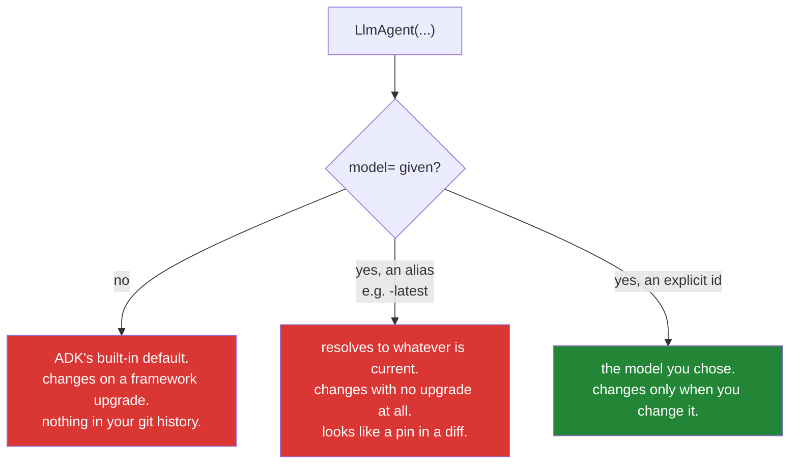

# 3.1 — The default that moved under you: why every agent pins its model

## One-line answer

An `LlmAgent` without `model=` falls back to ADK's own built-in default, that default was changed in a
minor release, and a model that changes without a commit in your history means your eval scores move
overnight with nothing in the repository to explain it — so **every agent in Sutra pins its model
explicitly**, and this is curriculum item ADK-73.

---

## The story

A bakery buys the same flour every week for eleven years. Same brand, same bag, same order code.

One spring the brand switches which mill it sources from. Nothing on the bag changes — same name, same
weight, same code — and the new flour is a little different: slightly more protein, slightly thirstier.
It is not worse flour. In a blind test most people would prefer it.

The baker's sourdough starts coming out tighter. Not badly, just *not right*: a denser crumb, a crust
that goes leathery by mid-afternoon. So they adjust the hydration. It helps a bit. They adjust the
proof time. That helps a bit too, and now the timings do not fit the morning any more, so the whole
schedule shifts by half a step and everybody is slightly out of rhythm.

Six weeks of this before somebody thinks to phone the supplier and ask whether anything changed.

The flour was fine. The bakery was fine. **What was missing was any way to notice that an input had
changed** — and because there was nothing to notice, six weeks of skilled work went into compensating
for a variable nobody knew was moving.

---

## The idea in plain language

`model=` is optional on an `LlmAgent`. Leave it out and the agent still works, because ADK has a
**built-in default model** it falls back to. There is also a way to set that default globally for every
agent in a process.

Both of those are conveniences, and both of them are the flour.

Here is the specific fact this curriculum item exists for, recorded in
`docs/01_MASTER_PLAN_ADDENDUM_GAPS.md` as **ADK-73**:

> **Default model is now `gemini-3-flash-preview` (ADK 2.2).** Agents without an explicit `model=`
> silently changed model. Rule for Sutra: **every agent pins its model explicitly.**

Read the middle sentence slowly. Somebody's agent, which they did not touch, running code they did not
change, started using a different model because they upgraded a framework by a minor version. Nothing
in their repository records that. `git log` shows a version bump in a lock file.

Three things follow, and they are why this is a `production` part rather than a footnote:

- **Your evals become uninterpretable.** Days 79–83 build a scoring harness whose whole value is
  comparing runs across time. A score that moved because the model moved, with no commit to attribute
  it to, is the bakery adjusting hydration for six weeks.
- **Your budget arithmetic breaks.** Day 24 counts tokens against per-provider quota, and different
  models have different thinking behaviour and different rate limits
  ([Day 2, 2.3](../../../day-02-llm-mechanics/parts/02-tokens-the-meter/2.3-the-thinking-tax.md): the
  hidden share is model-specific). A silent swap invalidates the numbers.
- **"Preview" is a word with teeth.** A preview model can change behaviour, change price, or stop
  existing. Day 2 already met the sharper version of this: `gemini-2.5-flash` is closed to new accounts
  and shuts down on **2026-10-16**, inside this curriculum's ninety-six days
  ([1.3](../../../day-02-llm-mechanics/parts/01-first-contact/1.3-listed-is-not-callable.md)).
  Defaulting onto a preview is defaulting onto a moving target.

And there is a fourth thing that is really a general lesson: **the dangerous defaults are the ones that
work.** A default that failed would be found in a minute. A default that quietly produces slightly
different output is the flour, and the cost is measured in weeks.

The rule, from plan §4 and unchanged by anything since: **every agent pins its model explicitly.** Not
because ADK's default is bad — it is probably a sensible choice — but because a choice you did not make
is a choice you cannot notice changing.

---

## Why Sutra needs it

- **Today**, [6.1](../06-failure-lab/6.1-the-agent-with-no-model.md) stages this: an agent built
  without `model=`, run, and probed to find out what it actually used.
- **[3.2](3.2-a-floating-alias-is-not-a-pin.md)** is the near-miss: a model string that *looks* like a
  pin and resolves to whatever is current. ADK's own documentation uses one.
- **Day 9 (ADK-08, ADK-09, and ADK-73 reinforced)** runs the same agent across four free providers.
  Comparison requires that each lane's model is a known, stated string.
- **Day 24 (OPS-07)** budgets in RPM/RPD per provider per model. **Days 79–83** score across weeks.
  Both are arithmetic over a variable that must not move on its own.
- **Day 31 (OPS-08)** is the quality gate, whose freshness check asks exactly this question: has
  anything moved under us since the last gate?

---

## The mechanism

Find out what your installed version actually does. This document will not print the answer, because
Principle 8 says the object you installed is the authority and a default is precisely the kind of fact
that moves:

```bash
uv run python -c "
from google.adk.agents import LlmAgent
pinned  = LlmAgent(name='pinned',  model='gemini-3.7-flash', instruction='x')
try:
    default = LlmAgent(name='default', instruction='x')
    print('no model= is ALLOWED. it resolved to:', repr(default.model))
except Exception as e:
    print('no model= RAISES:', type(e).__name__, e)
print('pinned resolved to:', repr(pinned.model))
"
```

**Line by line:**

- `LlmAgent(name='pinned', model='gemini-3.7-flash', ...)` — the control. Whatever else happens, you
  want to see that an explicit pin is reported back unchanged.
- `try: LlmAgent(name='default', instruction='x')` — **the experiment: omit `model=` entirely.** There
  are two possible worlds and you need to know which one you are in.
- `except Exception as e:` — a broad catch, and it is justified exactly here because this is a probe
  rather than production code: you do not know what it raises, and finding out is the point. **Do not
  copy this pattern into `sutra/`** — Principle 10 and trap #4 are unchanged.
- `print('no model= is ALLOWED. it resolved to:', repr(default.model))` — if this prints, you are in the
  world ADK-73 warns about, and **the string it prints is the model your agents would silently be
  using.** Write it down; it goes in your lab notes and it is what Day 9's comparison is against.
- `repr(...)` rather than plain printing, so that `None` and an empty string and a real model id are
  distinguishable at a glance.
- If instead it **raises**, that is good news — the framework has made the pin mandatory — and the rule
  in this part costs you nothing. Record which world you are in either way, with the date, because the
  answer is a property of the version you pinned.
- **Zero model calls.** Construction is free ([2.1](../02-the-agent-object/2.1-an-agent-is-a-configuration.md)),
  which is why this whole investigation is free.

There is also a documented way to set a default for every agent in the process, and it is worth knowing
so you recognise it in somebody else's code:

```python
LlmAgent.set_default_model("gemini-3.7-flash")  # documented on adk.dev, 2026-08-25
```

**Line by line:**

- It sets a **process-wide** default, so an agent constructed anywhere afterwards without `model=`
  picks it up. Verified against `adk.dev/agents/llm-agents/` on 2026-08-25.
- It is a genuine improvement on ADK's built-in default — at least now *you* chose the model — and
  Sutra still does not use it, for a reason worth stating: **it makes the model an ambient property of
  the process rather than a stated property of the agent.** Reading `sutra/desk/agent.py` would no
  longer tell you what model this agent uses; you would have to find the call and know it ran first.
- The failure it enables is import-order dependence — an agent constructed before the call gets the
  built-in default and one constructed after gets yours, and both are in the same file.
- **The rule that avoids all of it is one keyword per agent.** `model="gemini-3.7-flash"` costs nothing
  and makes the answer local.

And the assertion that keeps the rule true, which belongs in `./m check`:

```python
def test_every_agent_pins_its_model() -> None:
    """ADK-73: an agent without an explicit model silently follows ADK's default."""
    from sutra.desk.agent import root_agent

    assert root_agent.model, "no model pinned - ADK's default would apply"
    assert not root_agent.model.endswith("-latest"), (
        f"{root_agent.model!r} is a floating alias, not a pin (see part 3.2)"
    )
```

**Line by line:**

- `assert root_agent.model` — catches `None` and the empty string in one expression. This is the whole
  of ADK-73 as an executable check.
- `assert not root_agent.model.endswith("-latest")` — catches [3.2](3.2-a-floating-alias-is-not-a-pin.md)'s
  near-miss, which a truthiness check would happily pass. Written here because the two failures are one
  concept — *a model string that does not identify a model* — and separating them into two tests would
  invite fixing one and not the other.
- The messages **name the consequence**, not the assertion. `assert root_agent.model` failing with
  `AssertionError: assert ''` tells a future reader nothing; "ADK's default would apply" tells them why
  anyone cared.
- **Zero model calls, milliseconds, and it will still be catching this on Day 96** — when there are
  several agents and the loop over them is the natural generalisation.

The three states a model field can be in:



Two of the three are red, and the second red box is the more dangerous one, which is why it gets its
own part.

---

## When it breaks

**The eval that moved with no commit** — the bakery, in a dashboard:

```text
run 2026-08-18   grounding 0.91   fabrication 0.03   mean steps 2.4
run 2026-08-25   grounding 0.78   fabrication 0.11   mean steps 3.1

$ git log --oneline --since=2026-08-18 -- sutra/
(nothing)
```

**What it means.** The agent's behaviour degraded measurably and **no code changed**. The prompt is the
same, the tools are the same, the eval set is the same. What changed is in `uv.lock`, because somebody
upgraded ADK and the default model moved with it.

The debugging that follows is the six weeks: people re-read the instruction, add emphasis
([2.3](../02-the-agent-object/2.3-the-instruction-is-your-system-prompt.md)'s failure), tighten the tool
descriptions, and eventually somebody diffs the lock file. **The smallest fix is one keyword**, applied
before any of that happens.

**The preview that stopped existing:**

```text
google.genai.errors.ClientError: 404 NOT_FOUND. {'error': {'code': 404,
'message': 'models/gemini-3-flash-preview is not found for API version v1beta,
or is not supported for generateContent.', 'status': 'NOT_FOUND'}}
```

**What it means.** A preview model was retired. If you pinned it, this is a clear error naming a string
that is in your source — you know exactly what to change. **If you were defaulting onto it, the string
in this message appears nowhere in your repository**, which turns a two-minute fix into an
investigation. Day 2's rule stands and is doubly earned here: **listed ≠ callable, and only a live call
proves access** ([1.3](../../../day-02-llm-mechanics/parts/01-first-contact/1.3-listed-is-not-callable.md)).

**The global default set in the wrong place:**

```python
# sutra/desk/agent.py
root_agent = LlmAgent(name="sutra_desk", instruction=INSTRUCTION)  # no model=

# tests/conftest.py
LlmAgent.set_default_model("gemini-3.7-flash")
```

**Line by line:**

- Under `pytest`, `conftest.py` runs first, so the default is set and the agent gets the right model.
  **Every test passes.**
- Under `adk run`, `conftest.py` never executes, so the same agent silently uses ADK's built-in default
  instead. Production and tests are running different models.
- **This is the worst arrangement available** — a green suite that proves nothing about the deployed
  configuration — and it arises naturally from a reasonable-looking attempt to avoid repetition. The
  fix is the keyword on the agent, where a reader can see it.

**The pin that is a typo:**

```text
google.genai.errors.ClientError: 404 NOT_FOUND. {'error': {'code': 404,
'message': 'models/gemini-3.7-flah is not found for API version v1beta ...'}}
```

**What it means.** A dropped letter. This is a **good** failure — loud, immediate, and the wrong string
is right there in the message and in your source. Compare the silent default: an explicit pin converts
"the wrong model" from an invisible condition into a `404`.

---

## In production

**What a professional does is treat the model id as a deployed artifact, not as configuration.** It
appears in the run's trace, in the eval report, and in the incident timeline, so that "which model
produced this answer?" is answerable from a log line rather than by reconstructing which version of
which framework was deployed that week. The habit that starts today is `model=` on every agent; the
habit that follows on Day 84 is emitting it as a span attribute on every call.

**What degrades at scale is that model changes become the hidden variable in every investigation.**
With several agents, several providers (Day 9) and a router choosing between them (Day 70), the
question "was this run's behaviour different because of the input or because of the model?" is asked
constantly — and it is only answerable if the model is recorded per run. Teams without that end up
attributing genuine model regressions to prompt changes and vice versa, in both directions, for months.

**The failure that only appears with real traffic is the silent capability difference.** Two models
that both work will differ in tool-calling reliability, in how they behave on a retrieval miss, and in
how much hidden thinking they do
([Day 2, 2.3](../../../day-02-llm-mechanics/parts/02-tokens-the-meter/2.3-the-thinking-tax.md)). A
default that moves from one to another does not break anything — it shifts a distribution. Your
fabrication rate rises by a few points, your cost per run rises by a third, and every individual run
looks fine. **This is the failure that a version pin exists to prevent**, and it is invisible without
the per-run model record described above.

**The review comment a senior engineer leaves:** *"This agent has no `model=`, so it's using whatever
the framework's default is this month. That's a variable we can't see in the diff and can't attribute
an eval change to. Pin it explicitly on every agent, and add the pin to the eval report output so a
score change and a model change are never confusable."*

**The interview question:** *"why pin a model id explicitly instead of using your framework's
default?"* The answer that shows you have been burned: "Because a default is a choice somebody else
makes on your behalf and can change in a minor release, and when it changes nothing appears in your
repository. The failure isn't an error — it's a distribution shift: your grounding scores drop a few
points, your cost per run moves, and every individual run looks fine. So the team spends weeks tuning
prompts against a variable they don't know is moving. Pinning turns that into either no change at all
or a loud 404 naming a string that's in my source. I'd also treat the model id as something that gets
recorded per run alongside the trace, because the question 'was this the input or the model?' comes up
constantly once you're running more than one, and it's only answerable if the model is in the record.
The related trap is a floating alias — a string ending in something like 'latest' looks like a pin in a
code review and isn't one."

---

## Check yourself

```bash
uv run python -m pytest tests/test_desk.py -q -k pins_its_model
uv run python -c "from sutra.desk.agent import root_agent; print(root_agent.model)"
```

Green, and an explicit model id printed — not `None`, not an empty string, and not something ending in
`-latest`. Then write into your lab notes the string that
[the probe](#the-mechanism) printed for an agent with no `model=`, with today's date. That number is
what you are choosing not to use, and it is a fact about a version rather than about the framework.

**Answer out loud, without scrolling up:**

> Say what happens to an `LlmAgent` with no `model=`, and why that is worse than an error. Then
> describe how a moved default shows up in an eval dashboard, and why the debugging that follows goes
> to the wrong place.

---

**Next:** [3.2 — A floating alias is not a pin](3.2-a-floating-alias-is-not-a-pin.md)
