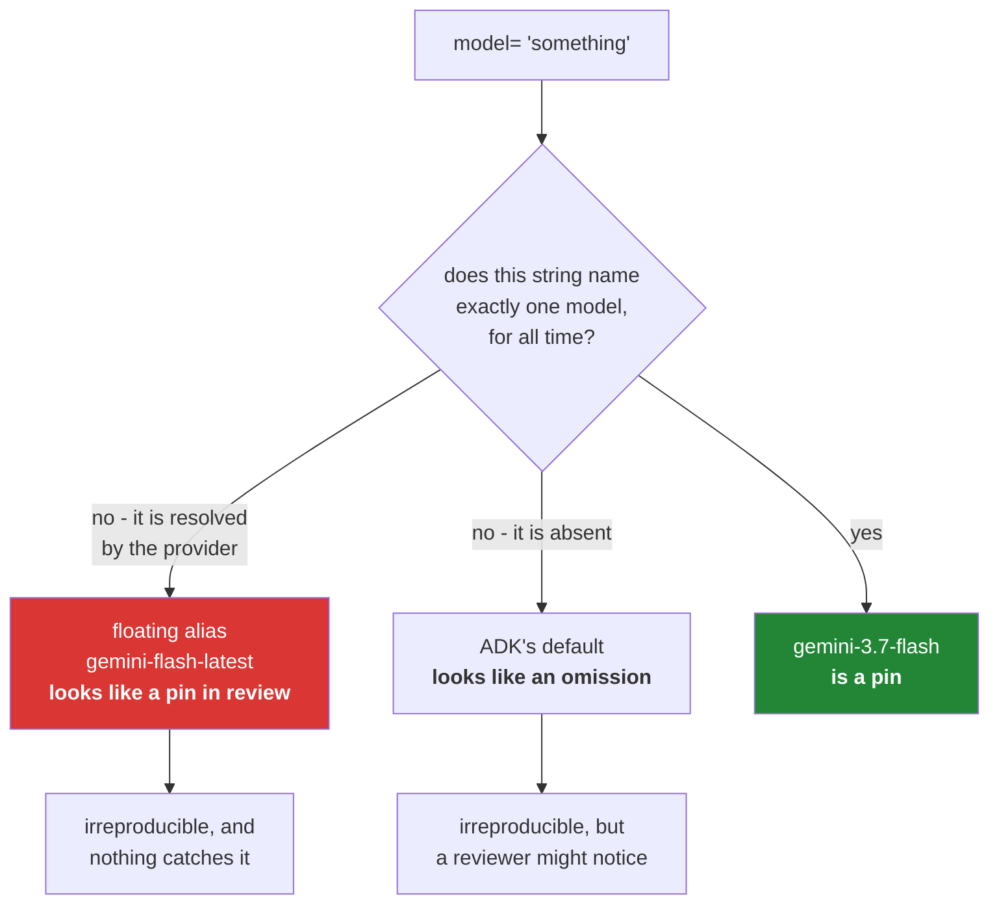

# 3.2 — A floating alias is not a pin: the string that survives code review and moves anyway

## One-line answer

`gemini-flash-latest` is what ADK's own documentation puts in its examples, and it is not a model — it
is a **pointer** that resolves to whatever is current — which makes it worse than having no `model=` at
all, because a reviewer looking at the diff sees a string that appears to be a decision.

---

## The story

A university course hands out a reading list. Most entries name a book, an edition and a chapter range.
One entry, written years ago by somebody being helpfully future-proof, says: *the current edition of the
standard anatomy text, chapters 4 to 7.*

For a long time this is completely fine, and arguably better than the others — nobody has to update it
when a new edition appears.

Then a new edition comes out mid-year. It reorganises the middle of the book: two chapters are merged,
one is moved to an appendix, and the numbering shifts by one from chapter 5 onward. Students who bought
their books in September and students who bought theirs in January are now reading materially different
material from the same instruction, and neither group has any way to know.

The exam asks about something in chapter 6. Half the room learned it. The other half learned something
adjacent, and answered the question they had prepared for.

Nobody was careless. The reading list was followed exactly, by everyone. **The entry looked more
precise than the others** — it named a book, a subject and a chapter range — and it was the only one
that was not a reference to a fixed thing.

---

## The idea in plain language

[3.1](3.1-the-default-that-moved.md) was about the model you did not specify. This is about the model
you *did* specify, which turns out not to be one.

A **floating alias** is a model string that the provider resolves, at request time, to whichever
underlying model is currently behind it — `gemini-flash-latest`, `-preview`, `-exp` and similar. It is
a pointer, not an identity.

Two facts make this Day 5's problem rather than a general caution:

- **ADK's own documentation uses one.** The examples on `adk.dev` show `model="gemini-flash-latest"`
  (checked 2026-08-25). You will copy from the docs — that is what docs are for — and this is what you
  will copy.
- **It survives code review.** This is the important difference from a missing `model=`. A reviewer
  scanning a diff sees `model="gemini-flash-latest"` and reads it as *somebody chose a model*. There is
  nothing to catch. A missing `model=` at least looks like an omission.

Line them up:

| | no `model=` | `gemini-flash-latest` | `gemini-3.7-flash` |
| --- | --- | --- | --- |
| Where the choice lives | ADK's source | the provider's alias table | your source |
| When it changes | you upgrade the framework | **whenever they decide** | when you edit a line |
| Visible in `git log`? | no | no | yes |
| Visible in a code review? | as an absence | **no — it looks like a decision** | yes |
| Reproducible run last month? | no | no | yes |

Read the fourth row. **The alias is the only option that is actively misleading**, and that is the
argument of this part: it is not merely as bad as the default, it is worse in the one place you would
normally catch a problem.

Day 2 already stated the rule — *never a floating alias*
([1.3](../../../day-02-llm-mechanics/parts/01-first-contact/1.3-listed-is-not-callable.md)) — when the
model string went into `sutra/mechanics.py`. What is new today is that the framework's documentation
hands you one, and that Sutra now has more than one place a model can be named.

There is a related rule from `docs/02_ADDENDUM_ZERO_BUDGET_MODELS.md` worth putting beside it, because
it is the same shape and it bites on Day 9: **`openrouter/` model strings must end in `:free`.** A
missing suffix silently selects a paid model. Both rules are "a model string that does not say exactly
what it selects", and both are lintable, which is why they become `./m check` rules on Day 31.

---

## Why Sutra needs it

- **Today**, `sutra/desk/agent.py` names a model and the test from
  [3.1](3.1-the-default-that-moved.md) asserts it is not an alias.
- **Day 9 (ADK-08, ADK-09, ADK-73 reinforced)** puts four providers behind one agent. Four model
  strings, four chances to write a pointer instead of an identity — and a comparison table built on
  aliases is a table that cannot be reproduced.
- **Days 79–83 (evals)** compare scores across time. An alias makes "the model" a hidden variable in
  every comparison ([3.1](3.1-the-default-that-moved.md)'s bakery, arriving by a different route).
- **Day 31 (OPS-08)** adds the lint, alongside the `:free` check from Addendum 02.
- **Day 70 (Quota-Router)** routes between providers by remaining quota per model. Quota is *per model*;
  a pointer has no quota of its own.

---

## The mechanism

First, find out what the alias currently points at. You cannot pin what you have not resolved:

```bash
uv run python -c "
from google import genai
from sutra.config import load_env
load_env()
c = genai.Client()
names = [m.name for m in c.models.list() if 'flash' in m.name]
for n in sorted(names):
    print(n)
"
```

**Line by line:**

- `c.models.list()` — the catalogue. Day 2's rule stands: **listed is not callable**
  ([1.3](../../../day-02-llm-mechanics/parts/01-first-contact/1.3-listed-is-not-callable.md)), so this
  tells you what names exist and proves nothing about your key's access. It is a starting point, not an
  answer.
- `if 'flash' in m.name` — narrow to the family Addendum 02 puts Sutra on. The full list is long and
  most of it is irrelevant to a zero-budget project.
- **Read the output for two kinds of entry:** concrete ids with version numbers, and names ending in
  `-latest`, `-preview` or `-exp`. The first kind is what goes in your source; the second kind is what
  the documentation examples use.
- `models.list()` is **metadata, not inference** — it costs no token quota, which Day 2's budget table
  already recorded. Run it freely.
- What this **cannot** tell you is which concrete model an alias currently resolves to; the catalogue
  lists both without linking them. So the honest procedure is: pick the concrete id you intend, and
  prove it with a live call — which is the next block, and it is the only proof there is.

Then pin it, and prove the pin:

```bash
uv run python -c "
from google import genai
from sutra.config import load_env
load_env()
i = genai.Client().interactions.create(
    model='gemini-3.7-flash', store=False, input='Reply with just: OK.')
print('callable:', i.output_text)
"
```

**Line by line:**

- One live call against the **exact string you are about to put in `agent.py`**. This is the whole of
  Day 2's *listed ≠ callable* rule, applied to the pin rather than to the family.
- `store=False` — the house shape (ADR-0006), even for a probe.
- `'Reply with just: OK.'` — a deliberately tiny prompt, because you are testing access rather than
  quality and quota is the currency.
- **One model call.** Budget it. It is the cheapest insurance available: a `404` here costs a second,
  and the same `404` on Day 79 costs an eval run.
- If it fails, the model is not available to your key and the fix is to choose another **concrete** id —
  never to fall back to the alias because the alias happens to work. An alias that works is an alias
  that is currently pointing somewhere you can reach.

And the assertion, which is one line of the test from [3.1](3.1-the-default-that-moved.md):

```python
    assert not root_agent.model.endswith(("-latest", "-preview", "-exp")), (
        f"{root_agent.model!r} is a pointer, not a model id (ADK-73, Addendum 02)"
    )
```

**Line by line:**

- `endswith((...))` — **a tuple**, so one call covers three suffixes. `str.endswith` accepts a tuple and
  that is the idiomatic way to write this; three chained `or`s would say the same thing less clearly.
- The three suffixes are the ones observed in the provider's catalogue on 2026-08-25. **This is a
  denylist and denylists are always incomplete** — a future alias with a different suffix passes. It is
  written this way because the alternative, an allowlist of exact model ids, has to be edited every time
  the roster moves, and a rule people edit around is worse than a rule that catches most of it. Note the
  weakness rather than pretending it away.
- The message **names the curriculum item and the addendum**, so a future reader can find out why anyone
  cared without asking anybody.
- **Zero model calls.** This runs in `./m check` forever.

The two ways a model string can fail to identify a model:



---

## When it breaks

**The reproduction that will not reproduce:**

```text
$ git checkout 4f2a1c9        # the commit from the incident, six weeks ago
$ uv sync
$ uv run adk run sutra/desk
(the agent behaves differently from the incident transcript)
```

**What it means.** You checked out the exact code and the exact locked dependencies, and got different
behaviour — because the code says `gemini-flash-latest` and the alias now points somewhere else. **Your
repository is no longer a record of what ran.** That is a serious property to lose, and it is lost
quietly: nothing warned you at the time, and nothing warns you now.

This is the sharpest version of the argument. A pinned model id does not make a run bit-for-bit
reproducible — sampling and provider-side changes see to that
([Day 2, 4.3](../../../day-02-llm-mechanics/parts/04-sampling-the-dial/4.3-stability-is-not-reproducibility.md)
was explicit about the difference between stability and reproducibility) — but it removes the largest
and most avoidable source of divergence.

**The alias that was copied from the docs and reviewed:**

```text
+ root_agent = LlmAgent(
+     name="sutra_desk",
+     model="gemini-flash-latest",
+     instruction=INSTRUCTION,
+ )

Approved.
```

**What it means.** Three reviewers looked at this and none of them had anything to say, because there is
nothing to see: a model was specified. **This is the failure**, and it is why the rule has to be
mechanical rather than cultural. A lint catches it every time; attention catches it on the days people
are paying attention.

**The 404 six weeks later:**

```text
google.genai.errors.ClientError: 404 NOT_FOUND. {'error': {'code': 404,
'message': 'models/gemini-flash-latest is not found for API version v1beta,
or is not supported for this method.'}}
```

**What it means.** Even the pointer stopped resolving — an alias was retired, or renamed, or restricted.
Note what this error does **not** tell you: which concrete model you had been using for the last six
weeks. Every run in your logs was against a model whose identity is now unrecoverable, which makes the
incident timeline unreconstructable. **An explicit pin failing produces a `404` naming a string that is
in your source and in your history.**

**The `:free` suffix, dropped**, which is the same mistake with a bill attached:

```python
model = "openrouter/some-org/some-model"  # 💥 the :free suffix is missing
```

**Line by line:**

- Addendum 02: an `openrouter/` string **must** end in `:free`. Without it, the request selects the paid
  variant of the same model — and it works, which is the problem.
- The failure is not an error. It is a charge, and on a project whose entire premise is a zero budget it
  is the one failure mode that cannot be undone by fixing the code.
- **Same shape as the alias:** a string that looks like a model and does not say exactly what it
  selects. Day 9 is where this becomes live and Day 31 is where the lint catches it; the rule is worth
  carrying from today because the habit — *read the string and ask what exactly it selects* — is one
  habit rather than two.

---

## In production

**What a professional does is resolve aliases at deploy time and record the resolution.** Where a
floating alias is genuinely wanted — some teams do want automatic upgrades — the mature version is to
resolve it once, in the build, write the concrete id into the artifact, and log it. That way you get the
convenience of tracking the current model and keep the property that any given deployment names exactly
one model. What does not work is resolving it per request, forever, and hoping nobody ever needs to know
what ran.

**What degrades at scale is quota accounting.** Rate limits are per model
([Day 2, 1.5](../../../day-02-llm-mechanics/parts/01-first-contact/1.5-the-only-door-429.md): the
`quotaId` in a 429 body names one), so an alias that moves silently moves your traffic onto a different
quota bucket with different limits. The symptom is a sudden change in 429 rate with no change in
traffic, which sends people to investigate load when the cause is an identity. Day 70's quota router
cannot route what it cannot name.

**The failure that only appears with real traffic is the mid-flight alias move.** The pointer changes
between one request and the next, so for a window your production traffic is split across two models —
some runs on the old, some on the new — and your metrics are a blend of two distributions. Nothing
errors. Aggregate quality moves by a few percent and then settles, which reads exactly like noise. This
is why per-run model recording ([3.1](3.1-the-default-that-moved.md)) and pinning are the same
discipline: one makes the identity stable, the other makes it observable.

**The review comment a senior engineer leaves:** *"`gemini-flash-latest` isn't a model, it's a pointer —
this diff looks like we chose something and we didn't. Pin the concrete id, prove it with a live call
before merging, and let's add the lint now rather than at the Day 31 gate: this is exactly the class of
thing that passes review because it looks fine."*

**The interview question:** *"what's wrong with using a `-latest` model tag?"* The answer that shows you
have carried a system: "It isn't a model, it's a pointer the provider resolves at request time, so the
same commit runs against different models on different days and my repository stops being a record of
what ran. The reproduction failing six weeks after an incident is the moment that costs you. What makes
it worse than simply not specifying a model is that it passes code review — a reviewer sees a model
string and reads it as a decision, whereas a missing model at least looks like an omission. So the
control has to be a lint rather than attention. If a team genuinely wants to track the newest model, the
version that works is resolving the alias at build time, writing the concrete id into the deployed
artifact and logging it — you keep the convenience and each deployment still names exactly one model.
The same reasoning applies to any string that doesn't say precisely what it selects; on a free tier the
equivalent is a provider string missing its free-tier suffix, which doesn't error, it just bills you."

---

## Check yourself

```bash
grep -rn "latest\|preview\|-exp\"" sutra/ | grep -v "^sutra/.*#"
uv run python -m pytest tests/test_desk.py -q -k pins_its_model
```

The first must print nothing from any file that names a model. The second must be green. Then open
`adk.dev`'s agent examples and find the model string they use — recognising it as a pointer, on sight,
is the skill this part exists to install.

**Answer out loud, without scrolling up:**

> Say why a floating alias is worse than a missing `model=`, using the word "review" in the answer. Then
> describe what happens when you check out a six-week-old commit to reproduce an incident, and name the
> sibling rule from the zero-budget addendum.

---

**Next:** [3.3 — Two doors to Gemini](3.3-two-doors-to-gemini.md)
