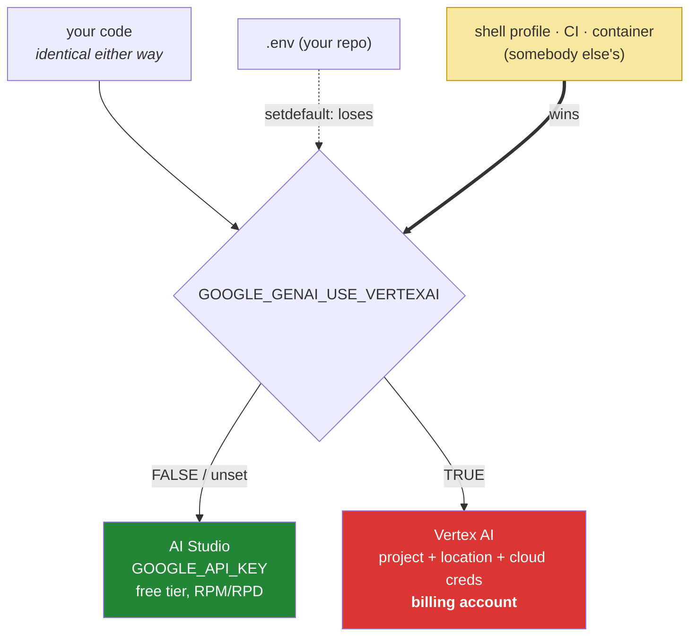

# 3.3 — Two doors to Gemini: and the environment variable that picks one without asking

## One-line answer

The same models are reachable two ways — a free AI Studio API key, or a Vertex AI project with a
billing account attached — and which one you get is decided by an environment variable that can be set
outside your repository, which means your code can be entirely correct and still be walking through the
door that sends invoices.

---

## The story

A city library has two ways in.

The public reading room takes anyone with a library card. The card is free, the shelves are the same
shelves, and there are limits — you can borrow six books, the room shuts at six, and the scanner has a
queue.

Round the side there is a research service. Same building, same collection, same catalogue. It opens at
seven, there is no queue, you can borrow forty, and it runs on institutional accounts: your department
is invoiced monthly against a purchase order.

The doors are twenty metres apart and the signage is not brilliant. Most of the time it does not matter,
because people who need the research service know they need it.

Where it goes wrong is with the departmental laptops. Somebody set them up years ago, sensibly, to
authenticate against the research service by default — because the department pays for it and that was
the point. So a student borrowing a laptop for an afternoon, walking in the public door, doing exactly
what a student on a free card would do, generates line items on a purchase order nobody is reading.

Nothing is broken. The library works, the laptop works, the student did nothing wrong. **The choice of
door was made somewhere else, before anybody arrived, by a setting nobody thinks about.**

---

## The idea in plain language

Gemini is reachable through two different backends, and `google-genai` — the library ADK uses
underneath — talks to both:

| | **AI Studio** (Sutra's door) | **Vertex AI** |
| --- | --- | --- |
| Credential | `GOOGLE_API_KEY` | Google Cloud project + location + cloud credentials |
| Cost | free tier, quota in RPM/RPD | **a billing account** |
| Set up by | pasting a key into `.env` (Day 1) | a cloud project, IAM, enabled APIs |
| Sutra's policy | **this one, always** | out of scope — Addendum 02 |

The switch between them is an environment variable: **`GOOGLE_GENAI_USE_VERTEXAI`**. Set it to `TRUE`
and the same code, the same model string, and the same agent go through the other door.

`docs/02_ADDENDUM_ZERO_BUDGET_MODELS.md` is unambiguous and it wins over the plan on this
(the precedence rule in `CLAUDE.md`): **Gemini Flash-class via `GOOGLE_API_KEY`, with
`GOOGLE_GENAI_USE_VERTEXAI=FALSE`.** Principle 15 — never write code that requires a billing account —
is not a budgeting preference. It is a design constraint that shapes what this whole project is allowed
to build, and it is enforced right here, in one variable.

Now the part that makes this a `production` section rather than a setup note, and it follows from
something you wrote yourself on Day 1.

Your loader uses `os.environ.setdefault`
([Day 1, 3.3](../../../day-01-bootstrap-and-map/parts/03-keys-and-env/3.3-loading-keys-failing-loudly.md)),
which means **a real environment variable always wins over a line in `.env`.** That was a deliberate and
correct decision: in a container the platform sets the environment, and a stray `.env` must never
override the platform.

The consequence today is sharp. If `GOOGLE_GENAI_USE_VERTEXAI=TRUE` is set anywhere in your actual
environment — a shell profile, a CI runner's configuration, a cloud shell that sets it by default, a
container image built by somebody else — then writing `GOOGLE_GENAI_USE_VERTEXAI=FALSE` in your `.env`
**does nothing at all**. Your repository says one thing and your process does another, and no file in
the repository is wrong.

So the rule for today is not "put it in `.env`". It is: **assert it, do not assume it.**

---

## Why Sutra needs it

- **Today**, everything from [4.1](../04-the-runner/4.1-the-runner-is-your-run-loop.md) onward makes
  real calls. Which door they go through is decided before the first one.
- **Day 9 (ADK-08, ADK-09)** adds Groq, OpenRouter and Ollama behind LiteLLM. Every provider has its own
  version of this — an environment variable or a base URL that silently changes what you are talking to,
  and Addendum 02's `:free` suffix rule ([3.2](3.2-a-floating-alias-is-not-a-pin.md)) is the same
  hazard.
- **Day 24 (OPS-07)** budgets in RPM/RPD, which are AI Studio's units. Vertex has different limits and
  a different billing model, so a run through the wrong door is not just a charge — it is arithmetic
  against the wrong denominator.
- **Day 90 onward (deployment)** runs Sutra somewhere that is not your laptop, which is exactly where
  an environment set by somebody else is the normal case rather than the exception.

---

## The mechanism

State it in `.env`, which is the right place for the intent even though it is not sufficient:

```bash
# .env  (repo root, gitignored since Day 0 - never committed)
GOOGLE_API_KEY=...your AI Studio key...
GOOGLE_GENAI_USE_VERTEXAI=FALSE
```

**Line by line:**

- `GOOGLE_API_KEY` — Day 1's key, unchanged, in the one `.env`
  ([1.3](../01-installing-adk/1.3-the-layout-adk-expects.md) refused a second one).
- `GOOGLE_GENAI_USE_VERTEXAI=FALSE` — **written explicitly, not left absent.** Absence and `FALSE` may
  behave the same today, and they are different statements: absence says nothing, and `FALSE` says
  somebody decided. A future reader of this file learns that there was a choice.
- Uppercase `FALSE` because that is the form the documentation and Addendum 02 use. Do not spend time
  discovering whether `false` also works; matching the documented form costs nothing.

Then assert it, because the `.env` line is a statement of intent and not a guarantee:

```python
# sutra/config.py - one more function, beside load_env and require
def require_free_tier() -> None:
    """Fail loudly if this process would talk to a billing-account backend.

    Principle 15: never write code that requires a billing account. A real
    environment variable beats .env (load_env uses setdefault), so the intent
    written in .env is not enough on its own - it has to be checked.
    """
    if os.environ.get("GOOGLE_GENAI_USE_VERTEXAI", "FALSE").upper() != "FALSE":
        raise ConfigError(
            "GOOGLE_GENAI_USE_VERTEXAI is "
            f"{os.environ['GOOGLE_GENAI_USE_VERTEXAI']!r} - Sutra is free-tier only "
            "(Addendum 02, Principle 15). Unset it in your shell, not just in .env."
        )
```

**Line by line:**

- `os.environ.get(..., "FALSE")` — reads the **live environment**, after `load_env()` has run, so it
  sees whatever actually won. Defaulting to `"FALSE"` treats absence as the safe case, which matches the
  library's own default and is the conservative reading.
- `.upper() != "FALSE"` — **anything that is not `FALSE` is treated as the paid door**, including
  typos, `0`, and an empty-but-set value. This is a deliberately paranoid comparison: the asymmetry of
  the two outcomes is a bill versus an exception, so ambiguity resolves towards the exception.
- `raise ConfigError(...)` — Day 1's own exception type
  ([3.3](../../../day-01-bootstrap-and-map/parts/03-keys-and-env/3.3-loading-keys-failing-loudly.md)), so a
  caller can catch exactly this. Not a bare `RuntimeError`, and certainly not a `print` and a `return`:
  Principle 10 says the error surfaces.
- `f"...{os.environ['GOOGLE_GENAI_USE_VERTEXAI']!r}..."` — **the message shows the offending value**,
  quoted. The difference between `'TRUE'` and `'true '` with a trailing space is invisible in prose and
  obvious in a `repr`, and a message that does not show the value sends people to edit the file they
  have already edited.
- `"Unset it in your shell, not just in .env."` — **the message names the actual fix**, which is the
  non-obvious half. Somebody hitting this will reach for `.env` first, because that is where they put
  it, and it will not work.
- Called once, at import, next to `load_env()` in `sutra/desk/agent.py` — the same import-time cost
  [1.3](../01-installing-adk/1.3-the-layout-adk-expects.md) already accepted, for a check that must run
  before any client exists.

And the probe that shows you which door this process would actually use:

```bash
uv run python -c "
import os
from sutra.config import load_env
load_env()
v = os.environ.get('GOOGLE_GENAI_USE_VERTEXAI')
print('GOOGLE_GENAI_USE_VERTEXAI :', repr(v))
print('GOOGLE_API_KEY set        :', bool(os.environ.get('GOOGLE_API_KEY')))
print('GOOGLE_CLOUD_PROJECT      :', repr(os.environ.get('GOOGLE_CLOUD_PROJECT')))
print('door                      :', 'VERTEX (paid)' if (v or 'FALSE').upper() != 'FALSE' else 'AI Studio (free)')
"
```

**Line by line:**

- `load_env()` first, so the probe sees exactly what the program will see — including the case where a
  real environment variable beat the file.
- `repr(v)` — prints `None` for absent and `'TRUE'` for set, distinguishably. Printing the bare value
  would show an empty line for both.
- `bool(os.environ.get('GOOGLE_API_KEY'))` — **`bool`, never the key itself.** A key printed into a
  terminal is a key in your shell history, and Principle 9 is about the discipline being real.
- `GOOGLE_CLOUD_PROJECT` — printed because its presence is the tell that somebody's environment is set
  up for the other door. On a personal laptop it is usually `None`; in a cloud shell it very often is
  not, which is precisely the departmental laptop.
- The final line states the conclusion in words, so the answer is not something you have to derive from
  three values at the moment you are already confused.
- **Zero model calls.**

The two doors, and where the choice is actually made:



The thick arrow is the one to remember. **The setting you wrote is the one that loses.**

---

## When it breaks

**The check firing, which is the system working:**

```text
sutra.config.ConfigError: GOOGLE_GENAI_USE_VERTEXAI is 'TRUE' - Sutra is
free-tier only (Addendum 02, Principle 15). Unset it in your shell, not just
in .env.
```

**What it means.** Something outside your repository set the variable. Find it and unset it there:

```bash
env | grep -i vertex
grep -rn "USE_VERTEXAI" ~/.bashrc ~/.bash_profile ~/.profile 2>/dev/null
```

**Line by line:**

- `env | grep -i vertex` — the live environment, case-insensitively. If it appears here and not in your
  `.env`, it came from somewhere else and that somewhere else is what to fix.
- `grep -rn ... ~/.bashrc ...` — the usual suspects for a Git Bash shell on Windows. `2>/dev/null`
  because some of those files will not exist and their absence is not interesting.
- If it is a CI runner or a container, the fix is in that configuration rather than on your machine —
  and the check is what turned a silent charge into a five-minute search.

**The missing credentials on the other door.** With `USE_VERTEXAI=TRUE` and no project configured, the
client cannot construct. The shape of the failure is a `ValueError` at client construction, naming both
sets of arguments it will accept — the API-key set and the Vertex set — rather than an authentication
error, because the library has not got as far as authenticating.

**This document did not observe that message**, and Principle 8 says so plainly rather than printing a
sentence it did not run. Produce yours and paste it into your lab notes:

```bash
GOOGLE_GENAI_USE_VERTEXAI=TRUE uv run python -c "
from google import genai
genai.Client()
" 2>&1 | tail -3
```

**Line by line:**

- `GOOGLE_GENAI_USE_VERTEXAI=TRUE` **prefixed to the command**, so it applies to this one process and
  nothing persists. Never `export` it to test.
- `genai.Client()` and nothing else — you are testing construction, not a call. **Zero model calls**, and
  the error arrives before any request is made.
- `2>&1 | tail -3` — the message is what you want, not the whole traceback.
- Record what it says, with the date and the `google-genai` version. That is the difference between
  recognising this error in eight weeks and losing twenty minutes to it.

**The worst case, which produces no error at all:**

```text
$ env | grep -i vertex
GOOGLE_GENAI_USE_VERTEXAI=TRUE
GOOGLE_CLOUD_PROJECT=my-old-experiment
$ uv run adk run sutra/desk
(it works. the agent answers. everything is fine.)
```

**What it means.** The variable is set **and** the machine has working cloud credentials from some
earlier project. So every call succeeds, the agent is excellent, and the calls are being billed to a
cloud project. This is the departmental laptop, exactly, and it is the reason the check exists as code
rather than as a line in a setup document: **a misconfiguration that works is not discoverable by
using the system.**

**The `.env` that was believed:**

```text
$ grep VERTEX .env
GOOGLE_GENAI_USE_VERTEXAI=FALSE
$ env | grep -i vertex
GOOGLE_GENAI_USE_VERTEXAI=TRUE
```

**What it means.** Both are true at once and the second one wins, because `load_env` uses
`setdefault` and refuses to override a real environment variable — which is the behaviour you chose on
Day 1 and would choose again, because the alternative is a `.env` silently overriding a production
platform. **The lesson is not to change the loader.** It is that a value written in a file you control
is an intent, and only a check of the live environment is a fact.

---

## In production

**What a professional does is make the cost-bearing configuration fail closed.** Anything that can turn
a free path into a billed one — a backend switch, a model tier, a region, a provider string missing its
free-tier suffix — is asserted at startup rather than assumed from a config file, because config files
are what get overridden by the environments you do not control. The general rule is that **the check
belongs in the process, not in the documentation**, and it should refuse to start rather than warn:
a warning in a log is a warning nobody reads until the invoice.

**What degrades at scale is the number of places a backend can be chosen.** One environment variable is
easy. By Day 9 there are four providers, each with a key, a base URL and a model string, and by Day 70 a
router picking between them at runtime. The question "which provider and which tier did this run use?"
must be answerable per run — which is the same conclusion as
[3.1](3.1-the-default-that-moved.md)'s per-run model recording, and for the same reason. Record the
door with the model.

**The failure that only appears with real traffic is the environment that differs between one process
and another.** Your laptop is free-tier; the CI runner inherits an organisation-wide cloud
configuration; the staging container was built from a base image with the variable baked in. Each is
individually explicable and together they mean the system behaves differently in three places for
reasons no repository records. The defence is the startup assertion, because it fails in **every**
environment that is wrong, including the ones you never look at.

**The review comment a senior engineer leaves:** *"We're relying on `.env` to keep us on the free tier,
and our own loader lets a real environment variable win — correctly. So this is intent, not enforcement.
Assert it at startup and refuse to run, and log which backend we're on with every run, or the first time
somebody deploys onto a box with cloud credentials we'll find out from finance."*

**The interview question:** *"how do you stop a service accidentally using a paid backend?"* The answer
that shows you have shipped one: "Not with a config file, because config files are exactly what gets
overridden by the environments you don't control — a shell profile, a CI runner, a base image. So the
value that selects the backend is asserted at startup and the process refuses to start if it's wrong,
with an error that shows the offending value and says where to actually fix it, since people's first
instinct is to edit the file they already edited. Then I record the backend alongside the model on every
run, because 'which door did this go through' needs to be answerable per request once there's more than
one provider. The failure I'm actually designing against isn't the one that errors — it's the
misconfiguration that works, where the box happens to have valid credentials for the paid path and
everything succeeds beautifully until somebody reads a bill."

---

## Check yourself

```bash
uv run python -c "from sutra.config import require_free_tier; require_free_tier(); print('free tier: confirmed')"
env | grep -i vertex
```

The first must print the confirmation. The second must print **nothing**, or `FALSE` — and if it prints
`TRUE`, fix it in the shell rather than in `.env`, which is the whole point of the part.

**Answer out loud, without scrolling up:**

> Name the two backends and the one variable that chooses between them. Then say why writing
> `GOOGLE_GENAI_USE_VERTEXAI=FALSE` in `.env` is not enough, referring to a decision you made on Day 1 —
> and describe the version of this failure that produces no error at all.

---

**Next:** [4.1 — The runner is your run_loop](../04-the-runner/4.1-the-runner-is-your-run-loop.md)
