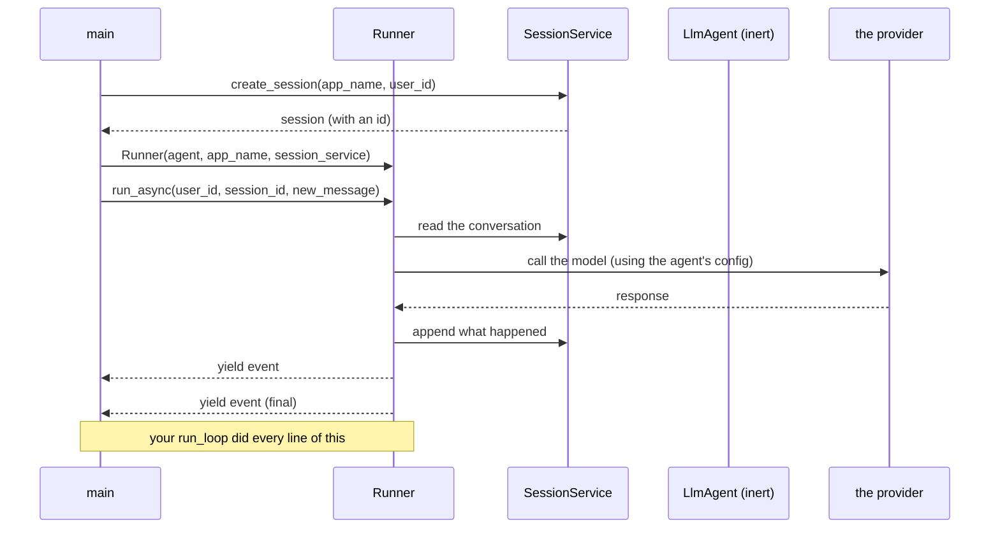

# 4.1 — The runner is your run_loop: handing over the thing you wrote twice

## One-line answer

A `Runner` is ADK's name for the function you wrote on Day 3 and rewrote on Day 4. It takes an agent, a
session and a message, and it hands you events as it goes. Today you give your loop away, and then you
find out what comes back.

---

## The story

You order something online, and it arrives four days later. Think about what actually happened in those
four days.

The parcel was finished before it moved. Somebody packed it, sealed it, weighed it and stuck a label on
it. After that, the parcel does nothing. Leave it on a shelf and it will sit there for a year. **A
parcel cannot deliver itself.**

The courier is what turns it into a delivery. A person scans it out of the warehouse. It goes to a
sorting centre, and gets scanned again. It goes onto a van. Somebody rings your bell and takes a
signature. Every scan on the way is a small update: picked up, in transit, out for delivery, delivered.
You get those updates while it is happening, not at the end.

Now notice where the complaints go. Nobody complains about the parcel. They complain about the delivery.
It came two days late. It was left out in the rain. Nobody rang the bell. The tracking page did not move
for a whole day. In every one of those, the parcel was exactly the same object.

So when a shop picks a courier, it does not ask questions about parcels. It asks: can I see where it is
right now, can I stop it if the customer changes their mind, what happens when nobody is home, and who
pays if it goes missing.

---

## The idea in plain language

[2.1](../02-the-agent-object/2.1-an-agent-is-a-configuration.md) showed that an `LlmAgent` does nothing
on its own. It is the parcel. The **`Runner`** is the courier, and it is the object that does what your
`run_loop` did:

| Your `run_loop` (Day 4, 3.2) | ADK's `Runner` |
| --- | --- |
| a `for` over `range(max_steps)` | its own loop, bounded by its own rules |
| `ask(client, history, tools=...)` | calls the model for you |
| `history.append(...)` twice | writes into a **session** ([4.2](4.2-sessions-and-the-transcript.md)) |
| `_dispatch(call)` | executes tools (from Day 10) |
| `print(f"--- step {step} ---")` | **yields events** ([5.1](../05-the-comparison/5.1-the-seam-list-checked.md)) |
| `return final` | the last event is the final response |

Three things about it are worth holding in your head before you write a line.

**It needs three things to exist.** The agent, a name for the application, and a **session service**,
which is the thing that holds conversations. You cannot build a runner without saying where the
transcript lives. That is good design. It makes the question unavoidable instead of letting you drift
into a default.

**It is asynchronous.** `run_async` is an *async generator*. It produces events as they happen, rather
than returning one answer at the end. That is the shape of trap #3 from plan §5.1: **yield, do not
append.** It is also why a half-finished answer can be shown to a user before the run is over, the same
way a tracking page moves while the van is still driving.

**Events are the output, not the answer.** Your loop printed a trace and returned a string. A runner
gives you a sequence of events, and one of them is the final response. Day 7 (ADK-04, ADK-05) is the
event model in full. Today you take the last one and stop.

One term, defined here on first use. **Asynchronous** code lets a program wait for something slow, such
as a model call, without freezing everything else. In Python it is written with `async def` and `await`,
and an `async for` loop reads items as they arrive. Sutra's own loop was synchronous, and it sat still
inside `time.sleep` during a 429 wait.
[Day 2, 1.5](../../../day-02-llm-mechanics/parts/01-first-contact/1.5-the-only-door-429.md) flagged that
as a real production limit. ADK being async is a genuine improvement you get for free today, and it
comes with one cost: everything that touches it becomes async too.

---

## Why Sutra needs it

- **Today**, [5.1](../05-the-comparison/5.1-the-seam-list-checked.md) checks this object against the
  seam list you wrote in [1.1](../01-installing-adk/1.1-what-a-framework-takes.md).
- **Day 7 (ADK-04, ADK-05)** is the event stream, which is what `run_async` yields. It also names trap
  #2: event field names changed in 2.0, so never copy event handling from a 1.x tutorial.
- **Day 8 (ADK-06, ADK-07)** is sessions and runs in depth. [4.2](4.2-sessions-and-the-transcript.md) is
  today's minimum.
- **Day 10 (ADK-10, ADK-11)** attaches tools. At that point the runner starts dispatching, and the
  comparison with your `_dispatch` becomes concrete.
- **Days 13–14 (ADK-14..16)** are callbacks and plugins. They answer whether you can get inside this
  loop, and that answer decides Days 62–65.

---

## The mechanism

**Read the signatures before you write the call.** This is Principle 8, and it is not ceremony. While
this document was written, ADK's runner API could not be verified against a live adk.dev page. So what
follows carries `TODO(me)` markers wherever an exact keyword is needed, together with the command that
answers it. A guessed keyword is an invented API.

```bash
uv run python -c "
import inspect
from google.adk.runners import Runner
from google.adk.sessions import InMemorySessionService
print('Runner.__init__      :', inspect.signature(Runner.__init__))
print('Runner.run_async     :', inspect.signature(Runner.run_async))
print('create_session       :', inspect.signature(InMemorySessionService.create_session))
"
```

**Line by line:**

- `from google.adk.runners import Runner` — the import path, confirmed first. If this raises
  `ModuleNotFoundError`, nothing below matters, and the answer is in the package you installed rather
  than in this document.
- `inspect.signature(...)` — **the installed object's own answer**, printed. It gives you every parameter
  name, its annotation and its default. It describes the version you pinned, not the version that
  whoever wrote a tutorial happened to have.
- `Runner.__init__` — you are looking for three things: the agent, an application name, and a session
  service. The exact keyword names are what the `TODO(me)` below needs.
- `Runner.run_async` — you are looking for a user id, a session id, and the new message. Note whether it
  is `async def`. If the signature says so, it must be consumed with `async for`.
- `InMemorySessionService.create_session` — note whether it is a coroutine, which adk.dev documents as
  awaited (checked 2026-08-25), and whether `session_id` is a parameter or is generated for you.
- **Zero model calls.** Reading signatures costs nothing, and doing it first is the difference between a
  quick fix and a lost afternoon.

Now the file. `sutra/desk/run_once.py`, beside the agent:

```python
"""Run Sutra's ADK agent once, from the command line (Day 5).

    uv run python -m sutra.desk.run_once "why does ticket 4521 log people out?"

This is the manual equivalent of `adk run sutra/desk`. It exists so the runner is
visible - `adk run` hides exactly the object this day is about.
"""

import asyncio
import sys

from google.adk.runners import Runner
from google.adk.sessions import InMemorySessionService
from google.genai import types

from sutra.config import load_env, require_free_tier
from sutra.desk.agent import root_agent

APP_NAME = "sutra"
USER_ID = "local"


async def ask_once(question: str) -> str:
    """One question through the runner; returns the final response text."""
    session_service = InMemorySessionService()

    # TODO(me): confirm the exact keywords from the signature you printed above.
    #   uv run python -c "import inspect; from google.adk.sessions import \
    # InMemorySessionService as S; print(inspect.signature(S.create_session))"
    session = await session_service.create_session(app_name=APP_NAME, user_id=USER_ID)

    runner = Runner(agent=root_agent, app_name=APP_NAME, session_service=session_service)

    message = types.Content(role="user", parts=[types.Part(text=question)])

    answer = "(no final response)"
    async for event in runner.run_async(
        user_id=USER_ID, session_id=session.id, new_message=message
    ):
        print(f"[event] {type(event).__name__}")
        if event.is_final_response():
            answer = event.content.parts[0].text
    return answer


def main() -> int:
    if len(sys.argv) < 2:
        print('usage: uv run python -m sutra.desk.run_once "<question>"')
        return 2
    load_env()
    require_free_tier()
    print(asyncio.run(ask_once(" ".join(sys.argv[1:]))))
    return 0


if __name__ == "__main__":
    raise SystemExit(main())
```

**Line by line:**

- The module docstring says **why this file exists when `adk run` already works.** `adk run` hides the
  runner, and the runner is today's subject. That is Principle 4 again: the convenience comes after the
  mechanism, not instead of it.
- `import asyncio` — the standard library's event loop. Nothing extra installed
  ([1.2](../01-installing-adk/1.2-pinning-the-framework.md): today's one package is ADK).
- `from google.genai import types` — the message is built from the **underlying SDK's** types, not from
  an ADK type. That is worth noticing. ADK sits on top of `google-genai`, the library you have used since
  Day 2, so the message shape is one you already know.
  [Day 2, 3.2](../../../day-02-llm-mechanics/parts/03-context-and-memory/3.2-history-is-a-list-you-own.md)
  built the dict version of the same idea.
- `APP_NAME` and `USER_ID` as **module constants**. `app_name` groups the sessions that belong to one
  application. `user_id` scopes them to a person. Together they are the namespace a conversation lives
  in. `"local"` is honest, because today there is one user, on one machine.
- `async def ask_once(...) -> str` — async, because `run_async` is. **The asyncness spreads.** One async
  call at the bottom makes every caller above it async, until somebody starts an event loop, and `main`
  is where that happens.
- `session_service = InMemorySessionService()` — **in memory, so the conversation dies with the
  process.** That is a real limit, and it is deliberate for today
  ([4.2](4.2-sessions-and-the-transcript.md)). A service that survives a restart is Day 8.
- The **`TODO(me)`** is a genuine gap, not a teaching device. This document did not verify
  `create_session`'s exact keywords against a live page, so it prints the command that will tell you. If
  your signature disagrees with the line below it, **your signature wins**, and you correct the code.
- `await session_service.create_session(app_name=..., user_id=...)` — awaited, and keyword-only.
  `session_id` **is** an optional parameter; leaving it out is a decision, and the service then mints
  a UUID that you read back off the object it returns
  ([4.2](4.2-sessions-and-the-transcript.md) is why that is the right default).
- `Runner(agent=root_agent, app_name=APP_NAME, session_service=session_service)` — the three things.
  **The agent is passed in, not owned.** The same `root_agent` could be handed to a different runner with
  a different session service, which is exactly the separation
  [2.1](../02-the-agent-object/2.1-an-agent-is-a-configuration.md) argued for.
- `types.Content(role="user", parts=[types.Part(text=question)])` — one message, one part. Compare it
  with Day 2's `{"type": "user_input", "content": [{"type": "text", "text": ...}]}`. **It is the same
  shape, written as objects instead of dicts:** a role, and a list of parts, because one message can hold
  more than text.
- `answer = "(no final response)"` — **bound before the loop starts**, for the same reason Day 3 bound
  `observation` early
  ([4.1](../../../day-03-loop-hand-rolled/parts/04-running-the-loop/4.1-assembling-the-loop.md)). If the
  loop yields nothing, the name must still exist. Same bug class, new framework.
- `async for event in runner.run_async(...)` — **the loop that replaces your loop.** Each event arrives
  as it happens, rather than all at the end. That is trap #3's shape (§5.1: yield, do not append) showing
  up as an API you consume instead of a rule you have to remember.
- `print(f"[event] {type(event).__name__}")` — printing only the **type** today. You are establishing
  that a sequence exists before you care what is inside it, exactly as
  [Day 4, 2.1](../../../day-04-tools-by-hand/parts/02-the-round-trip/2.1-two-channels-not-one.md) did
  with `interaction.steps`. Day 7 reads the contents properly, and **plan §5.1 trap #2 says not to copy
  event-handling code from a 1.x tutorial**, because field names changed in 2.0.
- `if event.is_final_response():` — the exit condition, replacing your `if not calls:`. Confirm this
  method exists in your version. If it does not, the signature probe is how you find the one that does.
- `event.content.parts[0].text` — the text of the final message. `parts[0]` assumes there is exactly one
  part. That is fine today, and it is the same class of assumption as Day 4's `next(...)` over one call.
  [3.3](../../../day-04-tools-by-hand/parts/03-rebuilding-the-loop/3.3-two-calls-in-one-turn.md) showed
  what that assumption costs once the count grows. Note it.
- `load_env()` then `require_free_tier()` — in that order, from
  [3.3](../03-the-model-pin/3.3-two-doors-to-gemini.md). The check runs before anything builds a client.
- `asyncio.run(ask_once(...))` — **the one place the async world is entered.** Everything above it is
  async, and everything below it is ordinary. Calling `asyncio.run` twice in one process, or inside a
  loop that is already running, is a common error, and it is worth knowing about before you meet it.
- `main() -> int` and `raise SystemExit(main())` — Day 3's shape, unchanged
  ([4.1](../../../day-03-loop-hand-rolled/parts/04-running-the-loop/4.1-assembling-the-loop.md)). An exit
  code rather than a `sys.exit`, so `main` stays testable.

The handover, drawn:



Every arrow in that diagram is a line you wrote on Day 4. **That is the point of having written it.**

---

## When it breaks

**The signature that does not match:**

```text
TypeError: Runner.__init__() got an unexpected keyword argument 'session_service'
```

**What it means.** The keyword is different in your installed version. **This is the failure the
`TODO(me)` exists for.** The fix is the signature probe, not a search engine. A search will find a
tutorial written for a different version, which is how you end up with code that imports cleanly and
behaves wrongly (§5.1, traps #2 and #3).

**The coroutine that was never awaited:**

```text
RuntimeWarning: coroutine 'InMemorySessionService.create_session' was never awaited
AttributeError: 'coroutine' object has no attribute 'id'
```

**What it means.** You called `create_session(...)` without `await`, so you are holding a coroutine
object instead of a session. Python warns, and then fails on the attribute access. **The warning is the
useful line**, because it names the exact call. The `AttributeError` underneath it is only the symptom.

**The async generator consumed with a plain `for`:**

```text
TypeError: 'async_generator' object is not iterable
```

**What it means.** `run_async` yields asynchronously, so it needs `async for`. A plain `for` cannot read
it. This one is mercifully clear, and it is the moment the asyncness of the framework stops being an
abstraction.

**The empty run:**

```text
[event] Event
[event] Event
(no final response)
```

**What it means.** Events arrived, and none of them satisfied `is_final_response()`. Either the run
genuinely did not finish, because of a tool loop or an error swallowed somewhere, or that method is not
the right one for your version. **Binding `answer` before the loop is what turned this into a readable
message instead of an `UnboundLocalError`**, which is the same small win Day 3 got from the same habit.
Print the events properly (Day 7) before you decide which case you are in.

**The event loop that was already running:**

```text
RuntimeError: asyncio.run() cannot be called from a running event loop
```

**What it means.** You called `main()` from inside something that already has a loop, such as a notebook
or another async function. `asyncio.run` creates and owns a loop, so there can only be one. In a notebook
the answer is to `await ask_once(...)` directly, and the same is true inside an async caller. **It is
worth knowing today**, because Day 7 onward does more of this, and otherwise the error reads like a
framework problem.

---

## In production

**The first things a professional looks at in a runner are its shutdown and its concurrency.** A runner
inside a service handles many conversations at once. The questions that matter are whether one runner
instance is safe to share across requests, what happens to a run that is halfway through when the process
is told to stop, and whether one slow tool can block the others. None of those are visible from a
quickstart. All of them are answerable from the signatures, the source and a load test, which is why
"read the object" is a professional habit rather than a beginner's crutch.

**What degrades at scale is the in-memory session service**, which is why it has "in memory" in its name.
It lives inside one process, so two replicas do not share conversations, and a restart loses all of them.
Under real traffic it is also unbounded memory. It is exactly right for a laptop and for tests, and Day 8
replaces it. The general shape is worth noticing: **frameworks ship an in-memory version of every
pluggable service**, and each one is a development convenience wearing a production interface.

**The failure that only appears with real traffic is the async that was not.** One blocking call inside
an otherwise async path, such as a synchronous HTTP client in a tool, a `time.sleep`, or a file read,
blocks the event loop, and therefore blocks every other conversation in that process. It is invisible at
one request per second and catastrophic at fifty. It also shows up as slowness everywhere, rather than at
the tool that caused it. Sutra's own `ask` blocks on `time.sleep` during a 429 wait
([Day 2, 1.5](../../../day-02-llm-mechanics/parts/01-first-contact/1.5-the-only-door-429.md) named it),
which is correct for a single-threaded script, and would be an outage inside a runner.

**The review comment a senior engineer leaves:** *"`parts[0].text` assumes there is exactly one part on
the final event, and we do not handle the case where no event is final. Both are fine for a CLI, and
neither is fine in the service. Also, is one `Runner` safe to share across requests, or do we build one
per request? That needs an answer before this goes behind an HTTP handler, not after."*

**The interview question:** *"what does an agent framework's runner actually do?"* The answer that shows
you have written one by hand: "The same loop I would write myself. It takes the agent's configuration,
reads the conversation from a session, calls the model, dispatches whatever tools the model asked for,
writes the results back, and repeats until there is a final response. Two differences matter
operationally. It yields events as it goes instead of returning at the end, so a partial answer can
stream and I have somewhere to hang tracing. And it makes me name a session service at construction, so
'where does the transcript live' is a decision I cannot defer. Before I trust one, I check what it
exposes at the points I need: a bound on iterations, token usage per call, a hook between the model
proposing a tool call and the tool running, and what happens to a run in flight when the process shuts
down."

---

## Check yourself

```bash
uv run python -m sutra.desk.run_once "Say hello in one short sentence."
```

**One model call.** You should see a few `[event]` lines, and then the answer. If the run prints events
and no answer, that is the `(no final response)` case. Read *When it breaks* rather than changing the
instruction.

**Answer out loud, without scrolling up:**

> Map your Day 4 `run_loop` onto the runner, line by line, and say which three things a `Runner` needs at
> construction. Then say why the runner yields events instead of returning a string, and name the
> 1.x → 2.x trap that shape corresponds to.

---

**Next:** [4.2 — Sessions and the transcript](4.2-sessions-and-the-transcript.md)
