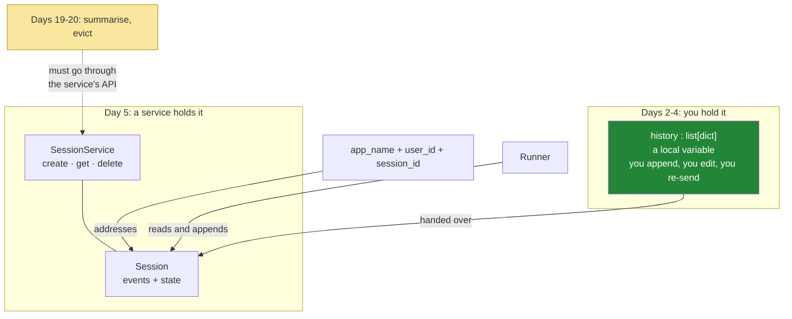

# 4.2 — Sessions and the transcript: the list you owned now belongs to a service

## One-line answer

The `history` list you have kept by hand since Day 2 is now a **session**, held by a session service and
addressed by application, user and session id. The runner does the appending for you. It also means that
Days 19–20's context work has to go through whatever that service allows.

---

## The story

Your phone stops charging, so you take it to a repair shop.

The person behind the counter does not just take the phone. They open a **job card**. It gets a number.
On it they write what you reported, what your phone is, your number, and the date. Over the next few
days everything about this repair goes onto that same card: the port was loose, a part was ordered, the
part arrived, it was tested, it is ready.

You go back a week later, and a different person is at the counter. They have never seen you before, and
they remember nothing about your phone. That does not matter at all. You give them your job number, they
pull the card, they read it, and within seconds they know as much as anybody. **The knowledge is in the
card, not in the person.** That is what lets the shop work across shifts and holidays.

Next month your screen cracks. That is not the same repair, so it is not the same card. They open a new
one, with a new number. The old card is still filed away, and it is not what anybody is working from
today.

And here is the part that matters most. The card belongs to the shop, not to you. It is written the
shop's way, kept for as long as the shop keeps records, and stored where the shop stores things. If you
want a line removed from it, you have to ask, and the answer depends on their rules. You cannot reach
over the counter and rub it out yourself.

---

## The idea in plain language

Since Day 2 you have held the conversation yourself: a Python list, appended to by your own code, and
re-sent on every call.
[Day 3, 1.2](../../../day-03-loop-hand-rolled/parts/01-loop-anatomy/1.2-the-transcript-is-the-world.md)
called it the world model, and Day 4 kept it with `store=False`.

Today it moves. The list becomes a **session**, and a **session service** holds it.

Three names address one conversation. It is worth getting them straight now, because everything from
Day 8 onward uses them:

| Name | What it scopes | Sutra's value today |
| --- | --- | --- |
| `app_name` | which application's conversations these are | `"sutra"` |
| `user_id` | whose conversations they are | `"local"`, because there is one machine and one person |
| `session_id` | **this one conversation** | generated by the service |

The counter staff are the agent: shared, holding nothing, interchangeable
([2.1](../02-the-agent-object/2.1-an-agent-is-a-configuration.md) showed that one agent object serves
every conversation at once). The job card is the session. Two people talking to Sutra at the same time
are two sessions and one agent, and that is exactly the arrangement that lets one agent serve a
thousand people.

A session holds two things, and they are worth keeping apart:

- **The events.** The conversation itself, appended by the runner as it goes. This is your `history`
  list, renamed, and no longer yours to write.
- **The state.** A plain dictionary that sits beside the events, for things that are not conversation: a
  ticket id being worked on, a user's plan tier, a counter. Sutra does not use it today. Day 17 (ADK-19,
  ADK-20) is the deep dive. The thing to notice now is simply that it exists, and that it is **not** the
  transcript.

What you gain today is real. The appending is done for you, and it is done correctly, including the
two-halves rule you had to be careful about by hand.
[Day 3, 6.1](../../../day-03-loop-hand-rolled/parts/06-failure-lab/6.1-the-goldfish-loop.md) was a whole
part about getting that wrong. Conversations also become addressable, so you can look one up instead of
holding it in a variable. And the storage becomes pluggable, so the same code runs against memory today
and against a database on Day 8.

What you lose is the third row of the seam list from
[1.1](../01-installing-adk/1.1-what-a-framework-takes.md): **you no longer own the list.** Days 19–20 are
about summarising old turns, dropping stale observations and keeping the token bill down
([Day 3, 5.2](../../../day-03-loop-hand-rolled/parts/05-containment/5.2-the-transcript-is-a-bill.md)).
Every one of those is an *edit to the conversation*. Whether you are allowed to make one is now a
question about the service's API, rather than a question about `list.pop`. That is not a defect. It is
the job card belonging to the shop. It is worth writing down as a trade today, rather than discovering it
on Day 19.

---

## Why Sutra needs it

- **Today**, [5.1](../05-the-comparison/5.1-the-seam-list-checked.md) scores this against the seam list,
  and [5.2](../05-the-comparison/5.2-what-you-handed-over.md) is the honest tally.
- **Day 8 (ADK-06, ADK-07)** is sessions properly: persistence, lifecycle, and the comparison against the
  Interactions API's server-side state that ADR-0006 declined
  ([Day 2, 3.3](../../../day-02-llm-mechanics/parts/03-context-and-memory/3.3-the-server-will-remember.md)).
  Two answers to one question, and you will have held both.
- **Day 17 (ADK-19, ADK-20)** is session **state**: prefixes, scopes and lifetimes. That is the other
  half of what a session holds.
- **Days 19–20 (AG-08..10)** are context engineering, and this part is where you find out what the
  service will let you do to a conversation.
- **Day 68 (data handling)** cares that a session is a durable copy of everything a user and a tool ever
  said.

---

## The mechanism

The three-name address, in the code from [4.1](4.1-the-runner-is-your-run-loop.md):

```python
APP_NAME = "sutra"
USER_ID = "local"

session_service = InMemorySessionService()
session = await session_service.create_session(app_name=APP_NAME, user_id=USER_ID)
print("session id:", session.id)
```

**Line by line:**

- `InMemorySessionService()` — **the whole storage layer, built with no arguments.** No database, no
  connection string, nothing to configure, and nothing that survives the process. That is the right
  choice for today, and the class name says so out loud.
- `create_session(app_name=..., user_id=...)` — **awaited**, and every argument is keyword-only
  (probed against `google-adk` 2.7.1 on 2026-08-26). `session_id` **is** a parameter, and it defaults
  to `None`. **Omitting it is the decision**, not a limitation of the API: leave it out and the
  service mints a UUID, so two callers cannot collide. Pass one only when an id already exists
  somewhere you trust, and read *In production* below before you decide that it does.
- `session.id` — read the id back off the returned object. It is what you pass to `run_async`, and it is
  the only handle to this conversation.
- The service also exposes `session.state`, `session.events` and `session.last_update_time` (adk.dev,
  2026-08-25). `events` is your `history`. `state` is [Day 17](../../../day-04-tools-by-hand/LESSON.md)'s
  subject. `last_update_time` is what a cleanup job would sort on.
- **Zero model calls.** Creating a session talks to nothing except the service.

Now prove that a session *is* the memory, by reproducing Day 2's amnesia demo through the framework. This
is the experiment worth running slowly:

```python
async def two_turns_one_session() -> None:
    """The same session remembers; a new session does not."""
    svc = InMemorySessionService()
    runner = Runner(agent=root_agent, app_name=APP_NAME, session_service=svc)

    s1 = await svc.create_session(app_name=APP_NAME, user_id=USER_ID)
    print("turn 1:", await _say(runner, s1.id, "My favourite ticket is 4521. Reply with just: OK."))
    print("turn 2:", await _say(runner, s1.id, "Which ticket did I say was my favourite?"))

    s2 = await svc.create_session(app_name=APP_NAME, user_id=USER_ID)
    print("turn 3:", await _say(runner, s2.id, "Which ticket did I say was my favourite?"))
```

**Line by line:**

- `svc` and `runner` are built **once** and reused across all three turns. The runner is not
  per-conversation; the session is. That is the counter and the job card, in two lines.
- `s1 = await svc.create_session(...)`, then two calls with `s1.id` — **turn 2 shares turn 1's session**,
  so the runner reads turn 1's events before it calls the model. It will answer `4521`.
- `s2 = await svc.create_session(...)` — **a new card for the same customer.** Turn 3 asks the identical
  question with a different `session_id`, and the model has no idea, because the conversation it is
  handed does not contain the answer.
- **Nothing about the model or the agent changed between turns 2 and 3.** Only the session id did. That
  is Day 2's
  [3.2](../../../day-02-llm-mechanics/parts/03-context-and-memory/3.2-history-is-a-list-you-own.md)
  arriving through a framework. The model is still amnesiac, and "memory" is still a list that somebody
  re-sends. The somebody is just no longer you.
- `_say(...)` is a small helper that wraps the `async for` from
  [4.1](4.1-the-runner-is-your-run-loop.md), so the demo reads as three turns instead of three copies of
  an event loop.
- **Three model calls.** Budget them, and run this once deliberately rather than repeatedly.

And then the thing worth looking at afterwards, because it is your `history` list under a new name:

```python
    after = await svc.get_session(app_name=APP_NAME, user_id=USER_ID, session_id=s1.id)
    print("events in session 1:", len(after.events))
    print("state:", after.state)
```

**Line by line:**

- `get_session(...)` — **fetching a conversation by address.** That capability did not exist when the
  transcript was a local variable. Confirm the exact keywords from the signature
  ([4.3](4.3-read-the-signature-not-the-tutorial.md)); this shape comes from adk.dev's session page,
  checked on 2026-08-25.
- `len(after.events)` — count them, and compare the number against what you would have counted in your
  own `history` after two turns. **The runner appended both halves of each exchange without being told**,
  and that is the thing Day 3's failure lab was about.
- `after.state` — an empty dict today. It is printed here so that you see it exists and is separate from
  the events. Putting the wrong thing in it is a Day 17 mistake, and knowing that the two are different
  is a today fact.
- **Read the events once.** They are the same conversation you were building by hand on Day 4, in the
  framework's own shape, and looking at them is what stops a session from being a black box.

Who holds what, across four days:



The green box is what you are giving up. The yellow arrow is where you will feel it.

---

## When it breaks

**The session that was never created:**

```text
ValueError: Session not found: app_name='sutra', user_id='local', session_id='abc123'
```

**What it means.** You passed a `session_id` that the service does not know. It may be a hard-coded
string, an id from a previous process, because `InMemorySessionService` starts empty every time, or the
right id with the wrong `app_name`. **All three names have to match**, and that is the point of there
being three. A session is addressed, not guessed.

**The new session on every turn**, which is the framework version of Day 3's goldfish:

```text
turn 1: OK
turn 2: I don't have any record of a ticket you mentioned.
turn 3: I don't have any record of a ticket you mentioned.
```

**What it means.** `create_session` is being called inside the loop instead of once, so every turn gets a
fresh card. The agent looks like it has no memory, and it is behaving perfectly. This is
[Day 3, 6.1](../../../day-03-loop-hand-rolled/parts/06-failure-lab/6.1-the-goldfish-loop.md) exactly, one
layer up. **The diagnostic is the same too:** print the session id on every turn and see whether it
changes.

**The shared session that should not have been shared:**

```text
turn 1 (user A): My card ending 4419 was declined...
turn 2 (user B): What was the last thing I told you?
        -> "You mentioned a card ending 4419 was declined."
```

**What it means.** A `session_id` was reused across two users. Usually it is a constant, or an id derived
from something that is not unique per person. This is a **cross-user data leak**, and it is very easy to
cause, because a session id is only a string and nothing checks that the same person is on both ends of
it. Note that `user_id` being part of the address is what *should* prevent it. The leak happens when both
are constants, which is exactly what today's `USER_ID = "local"` would become if somebody copied it into
a service without replacing it. **Write that down.** It is the shape of a real incident, and today's code
contains the seed of it.

**The lost conversation:**

```text
$ uv run python -m sutra.desk.run_once "My favourite ticket is 4521."
$ uv run python -m sutra.desk.run_once "Which ticket did I say?"
I don't have any record of a previous conversation.
```

**What it means.** Two processes, and `InMemorySessionService` holds nothing between them. Nothing is
broken. This is what "in memory" means, and it is why `run_once` is honestly named. Multi-turn inside one
process works ([the demo above](#the-mechanism)); across processes it needs Day 8's persistent service.

**The state used as a transcript:**

```python
session.state["last_answer"] = answer  # 💥 not what state is for
```

**Line by line:**

- It will work, and it is the beginning of a second conversation history living beside the real one,
  maintained by hand, drifting away from it.
- **Events are the conversation; state is everything else.** The model reads the events. It does not read
  state, unless something puts state into a prompt. Confusing the two produces an agent that "remembers"
  things it was never told, or forgets things you carefully saved.
- Day 17 (ADK-19, ADK-20) is where state gets its own rules: prefixes, scopes and lifetimes. The reason to
  name the mistake today is that the mistake is available today.

---

## In production

**The first thing a professional decides about a session service is retention and access.** A session is
a durable copy of everything a user typed and every tool result they saw. In a support system that means
names, addresses, and whatever somebody pasted into a ticket. So the questions are how long sessions are
kept, who can read one, whether they are encrypted, and what a deletion request does to them. Those are
answered when the service is chosen, on Day 8. Answering them late means migrating data you should never
have kept.

**What degrades at scale is the conversation that grows without limit.** A session grows forever by
default, and the cost of a run grows with it
([Day 3, 5.2](../../../day-03-loop-hand-rolled/parts/05-containment/5.2-the-transcript-is-a-bill.md): the
square law does not care who holds the list). Production systems cap it, with a maximum number of events,
a summarising pass over the old ones, or a session that expires. Every one of those is an edit to
somebody else's data structure. **This is the seam to check hardest**, because it is the difference
between Days 19–20 being a design exercise and Days 19–20 being a fork.

**The failure that only appears with real traffic is session-id collision or reuse.** Ids derived from
something that is not actually unique, such as a timestamp, a user's email, or a hash of the first
message, collide under concurrency, and two conversations merge. The symptom is a user seeing a fragment
of somebody else's conversation. It is reported rarely, it is impossible to reproduce, and it is
catastrophic for trust. **Let the service mint the ids by omitting `session_id`.** The parameter is
there, so nothing stops you passing your own, and that is the point: this is a discipline the API
permits you to break rather than a rail it puts you on.

**The review comment a senior engineer leaves:** *"`USER_ID` is a constant. That is fine for the CLI, and
it is a cross-user leak the moment this sits behind an HTTP handler, because the session address would be
the same for everybody. Thread the authenticated user through, and let the service generate session ids
rather than deriving them from anything."*

**The interview question:** *"where does an agent's conversation history live, and who owns it?"* The
answer that shows you have moved one: "In a framework it lives in a session, held by a session service,
addressed by application, user and session id, and the runner reads and appends to it as part of the
loop. The agent itself holds nothing, which is what lets one agent object serve every conversation at
once. What I check when adopting that is what I am allowed to *do* to a session. Long-running
conversations need summarising and eviction, and those are edits to a structure I no longer own, so if
the service only lets me append, my context strategy is limited to whatever the framework already thought
of. The other thing I settle early is retention and access, because a session is a durable copy of
everything the user said and everything the tools returned, and that is a data-protection question people
usually reach a year late."

---

## Check yourself

```bash
uv run python -m sutra.desk.multi_turn
```

Three model calls. Turns 1 and 2 share a session and the agent answers `4521`. Turn 3 uses a new session
and it does not. **Nothing about the model changed between turns 2 and 3.** Say out loud what did change,
and notice that this is Day 2's memory demo with a framework around it.

**Answer out loud, without scrolling up:**

> Name the three parts of a session's address, and say which one identifies the conversation. Then say
> what you gained by handing the transcript to a service, and the one thing you gave up, naming the days
> where you will feel it.

---

**Next:** [4.3 — Read the signature, not the tutorial](4.3-read-the-signature-not-the-tutorial.md)
