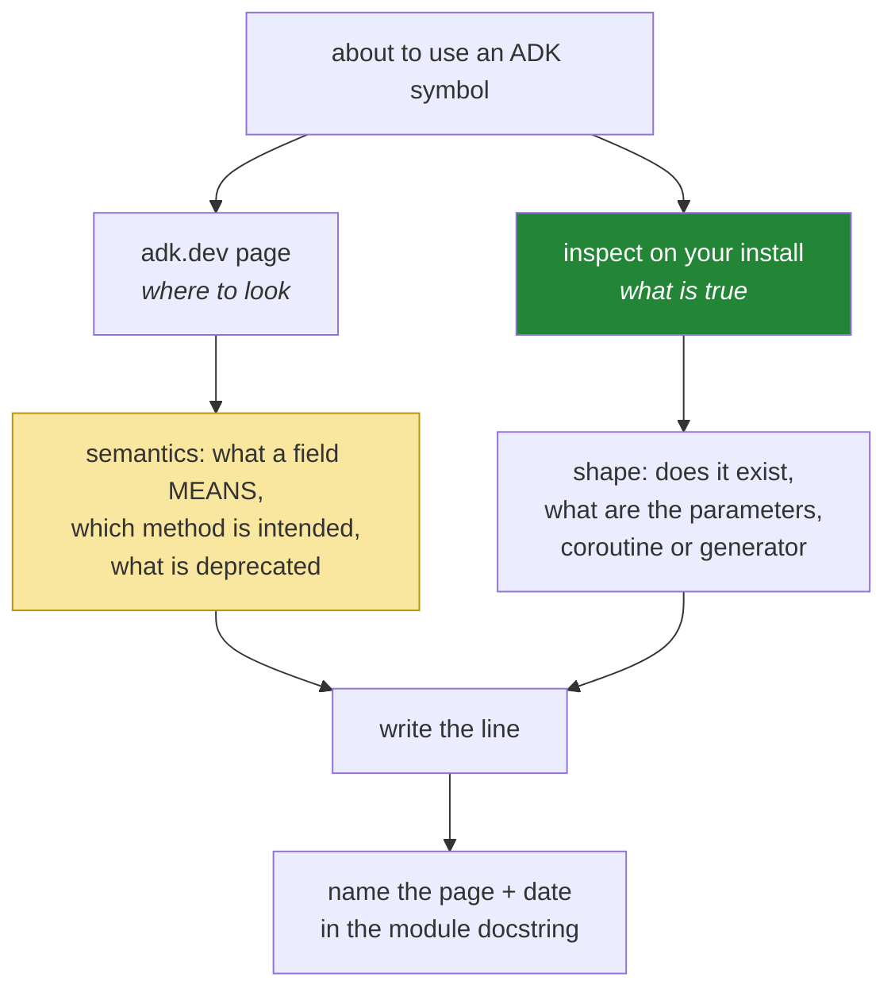

# 4.3 — Read the signature, not the tutorial: the object you installed is the authority

## One-line answer

Before you write a line that uses a framework symbol, print its signature. ADK 2.0 was a breaking
release, the internet is full of 1.x examples that import cleanly and behave differently, and `inspect`
costs nothing and answers about the exact version you pinned.

---

## The story

There is a route map painted on the wall at a bus stop. It shows every bus that stops there and where
each one goes.

It was painted four years ago. Since then a flyover opened, so route 34 no longer goes past the
hospital, it turns left before it. One route was renumbered. Another was split into two. Nobody repaints
a wall for that.

So what does an experienced traveller do? They read the wall, and then they read the board on the front
of the actual bus. Both. Not one or the other.

The wall is still worth reading, and this is the part people get wrong when they hear this story. The
wall tells you **which bus to look for**. It is the difference between watching for one number and
squinting at every bus that pulls in. What it cannot tell you is what is true about the bus that is in
front of you right now.

And the board on the bus has the opposite limit. It says `34A` in big letters. It does not say whether
34A goes anywhere near where you are going. Only the wall says that.

The traveller who gets lost is not the one without a map. It is the one who read the map once, decided
they knew the route, and stopped reading the boards.

---

## The idea in plain language

You have already done this twice. On Day 2 the turn shape was a `TODO(me)` that told you to print a real
interaction object and read the shape off it, instead of copying it from a page
([3.2](../../../day-02-llm-mechanics/parts/03-context-and-memory/3.2-history-is-a-list-you-own.md)). On
Day 4 you asserted that a declaration's property names actually bind to the function's signature
([2.2](../../../day-04-tools-by-hand/parts/02-the-round-trip/2.2-the-call-comes-back-parsed.md)).

Today it becomes a standing habit, because ADK is where the cost of skipping it is highest. Three
reasons stack up.

**ADK 2.0 was a breaking release.** Plan §5 names four 1.x → 2.x traps, and two of them, **#2, event
field names, and #3, yield rather than append**, produce code that *imports cleanly and runs*. An
`ImportError` you can fix in a minute. A field that still exists and now means something different costs
an afternoon.

**The internet is full of 1.x.** Search results are ordered by popularity and age, not by version, and a
1.x example is not labelled as such from the inside.

**Documentation always lags implementation.** It also documents *a* version, rather than *your* version.

So here is the rule, which costs nothing and is the whole part:

> **Before writing a line that uses a framework symbol, print its signature.**

And now the balance, because the story is not "documentation is useless". `inspect` will tell you that a
parameter is called `new_message` and takes a `Content`. It cannot tell you what an event field *means*,
which of two similar methods is the intended one, or that a value is deprecated. That is what adk.dev is
for. **The docs tell you where to look; the object tells you what is true.** Principle 8 asks for both:
verify against adk.dev on the day you use it, and name the page you checked.

---

## Why Sutra needs it

- **Today**, [4.1](4.1-the-runner-is-your-run-loop.md) carries a `TODO(me)` for exactly this reason, and
  it is a real gap rather than an exercise.
- **Day 7 (ADK-04, ADK-05)** reads event fields, which is trap #2. It is the highest-risk place in the
  whole curriculum for a copied 1.x snippet.
- **Days 13–14 (ADK-14..16)** are callbacks and plugins, where the signature *is* the contract. You are
  writing a function that the framework will call, so getting its parameters wrong is not a typo. It is a
  hook that never fires.
- **Day 39 (ADK-78)** revisits the 2.6 extras, and **Day 31 (OPS-08)** is the freshness check. Both ask
  "has the object changed under us?", and both are answered by probing.
- **Principle 8**, never invent an API, is unenforceable as a good intention and trivial as a habit.

---

## The mechanism

Four probes, in the order you reach for them. Each one is a single command, and none of them costs quota.

**Does it exist, and where?**

```bash
uv run python -c "
import google.adk
print('version:', google.adk.__version__)
import google.adk.runners as r, google.adk.sessions as s, google.adk.agents as a
print('runners :', [n for n in dir(r) if not n.startswith('_')][:8])
print('sessions:', [n for n in dir(s) if not n.startswith('_')][:8])
print('agents  :', [n for n in dir(a) if not n.startswith('_')][:8])
"
```

**Line by line:**

- `google.adk.__version__` — **first, always.** Every answer below is a fact about this number, and
  writing the number in your lab notes next to the answers is what makes them checkable again later.
- `dir(module)` — every public name the module exposes. This is how you find out that a class you read
  about in a blog post is not there, before you write three files that import it.
- `if not n.startswith('_')` — drop the private names, which are noise for this question.
- `[:8]` — the lists are long, and you are orienting rather than cataloguing. Drop the slice when you are
  hunting for something specific.

**What are its parameters?**

```bash
uv run python -c "
import inspect
from google.adk.runners import Runner
sig = inspect.signature(Runner.run_async)
for name, p in sig.parameters.items():
    print(f'{name:<16} {p.kind.name:<20} default={p.default!r}')
print('is coroutine fn :', inspect.iscoroutinefunction(Runner.run_async))
print('is async gen fn :', inspect.isasyncgenfunction(Runner.run_async))
"
```

**Line by line:**

- `sig.parameters.items()` — **one line per parameter**, with its name, whether it is positional or
  keyword-only, and its default. That is far easier to read than the raw signature once there are more
  than three.
- `p.kind.name` — `KEYWORD_ONLY` versus `POSITIONAL_OR_KEYWORD` matters. A keyword-only parameter cannot
  be passed positionally, and that is the difference between your call working and a `TypeError`.
- `p.default!r` — `<class 'inspect._empty'>` means **required**. That answers "do I have to pass this?",
  which is the question a documentation page most often leaves unclear.
- `inspect.iscoroutinefunction` and `inspect.isasyncgenfunction` — **the two questions that decide how you
  call it.** A coroutine needs `await`. An async generator needs `async for`. Getting it wrong produces
  the `'async_generator' object is not iterable` and `coroutine was never awaited` errors from
  [4.1](4.1-the-runner-is-your-run-loop.md). Two booleans, printed before you write the loop, remove
  both.

**What does it actually do?**

```bash
uv run python -c "
import inspect
from google.adk.sessions import InMemorySessionService
print(inspect.getsource(InMemorySessionService.create_session))
"
```

**Line by line:**

- `inspect.getsource(...)` — **the implementation, printed.** This is the board on the front of the bus.
  For a small method it is often quicker to read than any documentation, and it settles questions that
  documentation does not address: what happens when the session already exists, whether the id is
  generated or derived, and whether anything is validated.
- It works because ADK is pure Python, installed as source. It will not work for a compiled extension,
  which is worth knowing so that you are not confused the first time it fails.
- **Use it to answer one specific question**, not to read the framework. Reading a framework's source
  cover to cover is how a two-minute check becomes a lost morning.

**And what does the docs page say it means?**

```text
adk.dev/agents/llm-agents/     - checked 2026-08-25
adk.dev/sessions/session/      - checked 2026-08-25
adk.dev/runtime/               - checked 2026-08-25
```

**Line by line:**

- **Three URLs and a date**, written into the day's §8 *Verify before you code* table, and into the module
  docstring of the file that uses them. Principle 8 asks for the page to be *named*, and a page named
  without a date is a claim with no shelf life.
- This is the half `inspect` cannot do: whether a parameter is deprecated, which of two methods is
  intended, and what an event field *means*. The signature gives you the shape. The page gives you the
  meaning. **Trap #2 lives precisely in the gap between them**, because a field name can survive a
  breaking release with a different meaning.
- Fetch them again on the day you use them. This day's table is evidence that a check happened. It is not
  a substitute for yours.

Put together as one command you will use for the rest of this curriculum:

```bash
adkprobe() { uv run python -c "
import inspect, importlib, sys
mod, _, name = sys.argv[1].rpartition('.')
obj = getattr(importlib.import_module(mod), name)
print(obj)
print(inspect.signature(obj))
print('coroutine:', inspect.iscoroutinefunction(obj), '| asyncgen:', inspect.isasyncgenfunction(obj))
" "$1"; }

adkprobe google.adk.runners.Runner
adkprobe google.adk.sessions.InMemorySessionService
```

**Line by line:**

- A **shell function**, defined in your session or in your profile, so the check is one word instead of a
  paste. A habit that needs a paste is a habit you will skip when you are in a hurry, and that is exactly
  when you need it most.
- `sys.argv[1].rpartition('.')` — splits `google.adk.runners.Runner` into a module and an attribute at
  the **last** dot, so the same function works for classes and for functions.
- `importlib.import_module(mod)` then `getattr` — imports by string, which is what lets the name come
  from the command line.
- `print(obj)` first. For a class this prints its qualified name, which catches the case where you have
  found a re-export from somewhere unexpected.
- **Zero model calls, every time.** The whole discipline of this part is free, which is why there is no
  excuse for skipping it.

The two sources, and what each one is good for:



Neither box on its own is enough, and the trap that eats afternoons, a 1.x field name that still exists,
sits exactly where the two boxes disagree.

---

## When it breaks

**The 1.x example that imports cleanly**, which is the failure this part exists for:

```text
$ uv run python -m sutra.desk.run_once "hello"
(runs, produces an answer, and the event handling silently sees nothing)
```

**What it means.** A snippet copied from a 1.x tutorial used an event attribute that still exists in 2.x
with different meaning, or looked for a field that is now nested somewhere else. **There is no error.**
The condition you were checking for is simply never true, so your branch never fires and the run looks
fine. That is trap #2 from plan §5.1, in its natural habitat.

The probe that catches it before you write the branch:

```bash
uv run python -c "
import inspect
from google.adk.events import Event
print([n for n in dir(Event) if not n.startswith('_')])
"
```

**Line by line:**

- Print the **actual attributes** of the actual class, and compare them against what the snippet assumed.
  A name that is missing from this list is a name that will be `None` or an `AttributeError`. A name that
  is present but shaped differently is what the adk.dev page is for.
- Confirm the import path for `Event` from the `dir()` probe above before you run this. If
  `google.adk.events` is not where it lives in your version, that is itself the answer.

**The `ImportError`, which is the kind version:**

```text
ImportError: cannot import name 'SequentialAgent' from 'google.adk.agents'
```

**What it means.** A 1.x class that no longer exists (§5.1, trap #1: workflow-agent classes were replaced
by the graph Workflow Runtime). It is **loud, immediate and unambiguous**, and it is the outcome you want
from a version mismatch. Every minute spent wishing for more of these is a minute better spent probing
for the silent ones.

**The signature that changed between patch versions:**

```text
TypeError: create_session() got an unexpected keyword argument 'session_id'
```

**What it means.** You wrote the call from a page describing a neighbouring version. The fix takes
seconds *if* you probe. Without probing, the natural next move is to search, find another page, and try a
third arrangement of keywords. **The search-and-try loop is the thing this habit replaces.**

**The probe that was skipped because the code already worked:**

```text
$ git log --oneline -1
a91f3c2 upgrade google-adk 2.7.1 -> 2.8.0
$ uv run python -m pytest -q
....................  20 passed
```

**What it means.** Twenty green tests, and none of them exercises the path where a signature changed.
That is because your tests, correctly, mostly test your own code
([Day 4, §5](../../../day-04-tools-by-hand/LESSON.md) is almost entirely structural assertions). A
framework upgrade is exactly when to run the probes again, and the probes are exactly what a test suite
of your own code does not do. **Day 31's freshness check is this, scheduled.**

---

## In production

**What a professional builds out of this habit is a pinned-version compatibility check.** It is not a
test of the framework, because that is the framework's job. It is a handful of assertions that the
symbols you depend on still have the shapes you depend on: this class exists, this method takes these
parameters, this one is still an async generator. It runs in CI, it takes milliseconds, and it turns a
framework upgrade from "hope the tests cover it" into a specific, readable failure that names the symbol
that moved.

**What degrades at scale is the number of framework surfaces you touch.** One runner and one session
service is a morning of probing. Add callbacks (Day 13), plugins (Day 14), toolsets (Day 15), MCP
(Day 32) and agent-to-agent (Day 42), and the surface is wide enough that upgrades become a project,
unless the dependencies are written down somewhere. The compatibility check above is that "somewhere",
and it is worth writing on the day the second surface appears, rather than on the day an upgrade goes
wrong.

**The failure that only appears with real traffic is the deprecation you never read.** A parameter keeps
working and starts emitting a warning that your logging configuration filters out. Three releases later
it is removed, and the upgrade fails in production rather than in CI, because CI does not exercise that
path under load. `inspect` cannot see a deprecation, because it lives in the docs and in the warnings.
That is the concrete reason the balance in this part is a balance, and not a preference for probing.

**The review comment a senior engineer leaves:** *"This calls the runner with keywords from a blog post.
Print the signature from our pinned version and match it, and put the adk.dev URL and the date in the
module docstring. When somebody upgrades this in six months, the first question will be which page this
was written against."*

**The interview question:** *"how do you avoid writing code against the wrong version of a library?"* The
answer that shows the habit rather than the intention: "I read the installed object before I write the
call. The signature, whether it is a coroutine or an async generator, and what the module actually
exports. That is a fact about the version I pinned, rather than about whichever version a page or a
search result was describing, and it costs a couple of seconds while removing the search-and-try loop
entirely. But I do not treat it as a replacement for the docs, because introspection gives me shape and
not meaning. A field can survive a breaking release with different semantics, and that is the failure
that does not error: my branch just never fires. So the docs tell me where to look and what things mean,
the object tells me what is true, and I put the page URL and the date next to the code so the next person
knows what it was written against. On top of that I keep a small compatibility check in CI that asserts
the shapes we depend on, so a framework upgrade fails with the name of the symbol that moved instead of
failing somewhere downstream."

---

## Check yourself

```bash
uv run python -c "
import inspect
from google.adk.runners import Runner
print(inspect.signature(Runner.run_async))
print('asyncgen:', inspect.isasyncgenfunction(Runner.run_async))
"
grep -n "adk.dev" sutra/desk/*.py
```

The first must print a signature whose parameters match the call you wrote in
[4.1](4.1-the-runner-is-your-run-loop.md). If it does not, go and fix the code rather than the document.
The second must show a page URL and a date in the module you wrote today.

**Answer out loud, without scrolling up:**

> Give the two questions `inspect` answers that decide *how* you call something, and say what happens when
> you get each one wrong. Then say the one thing the object cannot tell you, and name the 1.x → 2.x trap
> that lives in exactly that gap.

---

**Next:** [5.1 — The seam list, checked](../05-the-comparison/5.1-the-seam-list-checked.md)
