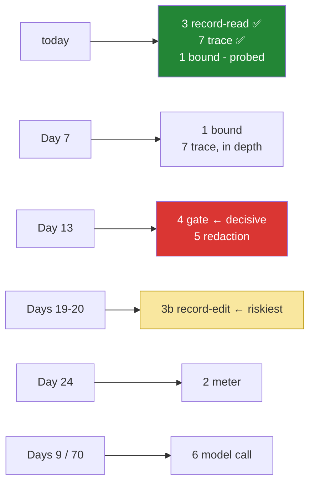

# 5.1 — The seam list, checked: answering your own questions against somebody else's loop

## One-line answer

Take the seven questions you wrote before installing anything, and answer them against ADK. A few get
answered today, and most get a day number. What you end up holding is not an opinion about a framework.
It is a schedule with known gaps in it.

---

## The story

Somebody is buying a used car. They have seen it twice, it looks clean, it started on the first turn of
the key, and the seller has been friendly about it.

Then they take it to a mechanic. The mechanic does not say a word about how clean it is. They put it up
on the ramp, spin each wheel, look at the brake pads, check the tyres, pull the oil dipstick, test the
battery, and look underneath for rust and for fresh paint hiding a repair. Then they come back with a
list of about eight things.

The brake pads need doing now. The rear tyres have maybe six months in them. The battery will not see
another winter. There is surface rust under the sill, and it is only surface. The clutch is fine, and so
is the gearbox.

Nothing on that list says *do not buy this car*. That was never what the check was for.

What it did was turn *"it looks good to me"* into **a list of known conditions with dates and costs
attached.** Now the buyer can make an offer knowing what they are taking on, put money aside for the
tyres, and never be surprised by the battery.

The people who get hurt are not the ones who bought a car with problems. Every used car has problems.
They are the ones who bought a car whose problems they found out about afterwards, one at a time, each
one arriving as a crisis on a day they had not planned for.

---

## The idea in plain language

[1.1](../01-installing-adk/1.1-what-a-framework-takes.md) asked you to write seven questions in
`lab/seams.md` **before** installing anything, taken from your own loop. Today you go and answer them.
That list is what the rest of this part calls a **survey**: a systematic check that ends in a written
list, exactly like the mechanic's.

Two rules make it a survey rather than an argument.

**Every row gets an answer or a date.** "Yes", "no", or "Day *N* settles this". A row with a shrug in it
is a row that becomes a crisis.

**A "no" is not a veto.** A framework that cannot do something is a framework you do something else
about: a fork, a wrapper, a different tool for that one job, or a decision that you do not need it after
all. What matters is knowing.

Here is the survey, with what today's parts established. **Fill in your own version**, because the
answers depend on the version you pinned, and this document could not verify all of them live:

| # | The seam | Your loop | ADK | Settled |
| --- | --- | --- | --- | --- |
| 1 | **the bound** — max iterations | `for step in range(max_steps)` | the runner owns its loop; find its limit | **probe it today**; Day 7 |
| 2 | **the meter** — tokens per call | `spent.append(interaction.usage)` | events carry usage; not read today | Day 24 (OPS-07) |
| 3 | **the record** — read the conversation | `history` list | ✅ session `events`, addressable | today ([4.2](../04-the-runner/4.2-sessions-and-the-transcript.md)) |
| 3b | **the record** — *edit* it | `history.pop()` | ? — through the service's API only | Days 19–20 |
| 4 | **the gate** — between propose and execute | `_dispatch(call)` | callbacks | **Day 13 (ADK-14, ADK-15)** |
| 5 | **the redaction point** — before a result is stored | `_result_turn(...)` | after-tool callback | Day 13, Day 68 |
| 6 | **the model call** — wrap, retry, route | `ask()` | the runner calls it; LiteLLM for routing | Day 9, Day 70 |
| 7 | **the trace** — what happened, in order | `print(...)` | ✅ events, yielded as they happen | today ([4.1](../04-the-runner/4.1-the-runner-is-your-run-loop.md)); Day 7 in depth |

Read the "Settled" column rather than the "ADK" column, because that is what a survey produces. **Two
rows are answered today. Five have dates.** None of them is a shrug, and that is the deliverable.

Row 4 deserves a sentence of its own, because it is the row that decides whether this framework can carry
Sutra to Day 96. Everything in Phase 10, which is approval gates, spend caps, and the ability to stop an
agent mid-run, attaches between the model proposing a tool call and your code executing it. In your loop
that was one line. ADK's answer is **callbacks**, and the plan puts them on Day 13. Until then it is an
unverified assumption, and writing it down as one is the difference between a survey and a hope.

---

## Why Sutra needs it

- **Day 7 (ADK-04, ADK-05)** settles rows 1 and 7: the event model, and what a run's shape actually is.
- **Day 13 (ADK-14, ADK-15)** settles row 4, the one that matters most.
- **Day 24 (OPS-07)** settles row 2, and Day 9 settles row 6.
- **Days 19–20 (AG-08..10)** settle row 3b, which is the row with a question mark, and therefore the row
  most likely to surprise you.
- **Day 31 (OPS-08)** is the quality gate. This table is what you take to it: has anything moved, and are
  the rows still answered?

---

## The mechanism

Answer row 1 now, because it is answerable now, and because an unbounded loop is the one seam whose
absence is an outage rather than an inconvenience:

```bash
uv run python -c "
import inspect
from google.adk.agents import LlmAgent
from google.adk.runners import Runner
params = dict(inspect.signature(LlmAgent).parameters)
print('agent params mentioning a limit :',
      [n for n in params if any(k in n for k in ('max', 'limit', 'step', 'iter'))])
rparams = dict(inspect.signature(Runner.run_async).parameters)
print('run_async params               :', list(rparams))
"
```

**Line by line:**

- This searches the **parameter names** for the words a bound is usually spelled with: `max`, `limit`,
  `step`, `iter`. It is crude, and it answers the question in two seconds. Either something appears, or
  the bound lives somewhere else and you have a follow-up.
- `inspect.signature(LlmAgent)` on the class rather than on `__init__`. For a class, that gives the
  constructor's signature, which is what you want.
- `list(rparams)` is printed in full, because `run_async` is short enough to read, and one of those names
  may be a per-run configuration object where a bound would live.
- **If nothing turns up, that is an answer too.** The row becomes "Day 7: find it in the event model or in
  the runtime configuration". Write down what you searched for, because a negative result you can
  reproduce is worth far more than a vague memory of having looked.
- **Zero model calls.**

Then row 4, which cannot be settled today but can be *scoped* today:

```bash
uv run python -c "
import inspect
from google.adk.agents import LlmAgent
print([n for n in inspect.signature(LlmAgent).parameters if 'callback' in n or 'plugin' in n])
"
```

**Line by line:**

- You are looking for the **names** of the hooks, not for how to use them. Day 13 is where they get used.
  Today you are establishing that they exist, and roughly where they attach: to the agent, to the runner,
  or to a plugin registered somewhere else.
- The answer changes the shape of Days 62–65, and it is worth knowing five weeks early. A hook on the
  *agent* means an approval policy is per-agent. A hook on the *runner* means it is per-application. A
  plugin means it cuts across everything. Those are three different designs.
- Record what you find, with the date and the version, in `lab/seams.md`, because **this is the row the
  next framework evaluation will start from.**

And now the file itself, which is the real deliverable of this part:

```text
# lab/seams.md - Sutra's framework survey
# google-adk 2.7.1, probed 2026-08-25

1  bound            for-range        -> ADK: <what your probe found>        [Day 7]
2  meter            usage per call   -> ADK: on events, unread today        [Day 24]
3  record (read)    history list     -> ADK: session.events                 [DONE today]
3b record (edit)    list ops         -> ADK: ??? service API only           [Days 19-20]  <-- riskiest
4  gate             _dispatch line   -> ADK: callbacks, names: <...>        [Day 13]      <-- decisive
5  redaction        _result_turn     -> ADK: after-tool callback            [Day 13/68]
6  model call       ask()            -> ADK: runner-owned; LiteLLM          [Day 9/70]
7  trace            print()          -> ADK: yielded events                 [DONE today]
```

**Line by line:**

- Plain text, in the lab folder, and **not** in the day document. This is your survey of your install. It
  is a working document, and it gets updated on Days 7, 9, 13, 19 and 24.
- The version and the date sit on line two. Every answer below them is a fact about that number
  ([4.3](../04-the-runner/4.3-read-the-signature-not-the-tutorial.md)).
- Two rows are marked. **`<-- riskiest` on 3b**, because it is the only question mark, and an unknown is
  worse than a known "no". **`<-- decisive` on 4**, because a "no" there would change the framework
  decision rather than the schedule.
- The `[Day N]` column is what makes this a schedule instead of a complaint. Each of those days now has a
  question it must answer, and the question was written before anybody turned up with a solution.

The survey, as a picture of what you know and when:



---

## When it breaks

**The survey that was never done:**

```text
"Can we put a human approval step before the refund tool?"
"...I'd have to look into it."
```

**What it means.** The framework was adopted on how nice it felt to use and on how good its examples
were, and the first question that came from an actual requirement has no answer. It may well turn out
fine, because most agent frameworks have callbacks. The point is that **this is the wrong moment to find
out**, because by now there are agents, tools and sessions built on it, and a "no" is expensive.

The survey does not prevent a bad answer. It moves the answer to the week when changing your mind costs
a day.

**The row that was answered optimistically:**

```text
lab/seams.md:
  4  gate    -> ADK: "callbacks, probably before_tool something"   [Day 13]
```

**What it means.** That is a shrug wearing a date. "Probably" in a survey is the mechanic saying the
brakes looked all right from where they were standing, without putting the car on the ramp. **Either
probe it, or write "unknown".** An honest unknown gets investigated. A vague yes gets relied on.

**The framework blamed for a row you never checked:**

```text
"ADK doesn't let us cap tokens per run."
```

**What it means.** Possibly true. Possibly it is on an event field that nobody has read yet. Possibly it
is a plugin. The sentence is being said with the confidence of a finding and the evidence of an
assumption, and it will be repeated by somebody who was not in the room. **A survey row says what was
probed, on what version, on what date**, and that is what makes a later "no" trustworthy.

**The rows that were answered and never checked again:**

```text
$ git log --oneline -1 -- uv.lock
9c1d84f upgrade google-adk 2.7.1 -> 2.9.0
$ grep "probed" lab/seams.md
# google-adk 2.7.1, probed 2026-08-25
```

**What it means.** The survey now describes a car that has since had work done on it. This is the same
staleness problem as [1.2](../01-installing-adk/1.2-pinning-the-framework.md)'s nautical chart, and it has
the same answer: the date is on the document so that a mismatch is visible. **Day 31's quality gate exists
to be the moment somebody looks at it.**

---

## In production

**What a professional produces from this exercise is an integration-points document that outlives the
framework choice.** The seven rows are not about ADK. They are about what any agent runtime must expose
for this system to be operable. When a better framework appears in two years, the evaluation takes a
morning rather than a project, because the questions already exist, and they are phrased in terms of the
system's requirements rather than in any vendor's vocabulary.

**What degrades at scale is that the gaps add up.** One deferred row is a to-do. Five deferred rows, each
with a workaround, and the workarounds start interfering with each other. A token counter bolted on
outside the runner does not see retries. An approval implemented as a tool wrapper does not fire for
tools the framework calls internally. **The rows are not independent**, and the way to notice that early
is to review the survey as a whole at each gate, rather than closing rows one at a time.

**The failure that only appears with real traffic is the seam that exists and does not fire everywhere.**
A before-tool callback that runs for the tools you registered but not for built-in tools, or for the
first agent but not for a sub-agent it delegates to, is worse than no callback at all, because you will
believe you have coverage. This is the specific thing to test rather than read about when Day 13 arrives.
Not "does the hook exist", but "does it fire on every path", including the paths added on Days 15, 16
and 42.

**The review comment a senior engineer leaves:** *"Row 4 says 'probably callbacks'. That row decides
whether we can ship an approval gate, which is a hard requirement, so it needs to be probed and written
down with the version. Specifically, whether it fires for built-in tools and for delegated agents, not
just for ours. Everything else can stay dated."*

**The interview question:** *"you've adopted an agent framework. How do you know it was the right
choice?"* The answer that shows you have operated one: "I do not evaluate it as right or wrong. I write
down where my own requirements attach before I install anything, taken from the loop I already have, and
then each one gets a yes, a no, or a date. Approval between the model proposing an action and the tool
running is the decisive one for me. If that hook does not exist, no amount of quality elsewhere makes up
for it, because everything in the safety story attaches there. The rest, such as token accounting,
editing the conversation for context management, tracing and provider routing, usually exists, and I care
about the schedule rather than the answer. What I have learned to check specifically is not whether a
hook exists, but whether it fires on *every* path, because a callback that covers your tools and not the
built-in ones gives you the illusion of coverage, and that is worse than knowing you have none."

---

## Check yourself

```bash
cat days/day-05-first-adk-agent/lab/seams.md
```

Seven rows, each with an answer or a day number, the version and the date at the top, and at least one
row marked as the riskiest unknown. **If any row says "probably", go and probe it or write "unknown".**
That edit is the whole exercise.

**Answer out loud, without scrolling up:**

> Name the two seams ADK settled today, and the one that Day 13 decides. Then say why a "no" on that row
> would be different in kind from a "no" on any of the others, and why an honest "unknown" beats an
> optimistic "probably".

---

**Next:** [5.2 — What you handed over](5.2-what-you-handed-over.md)
