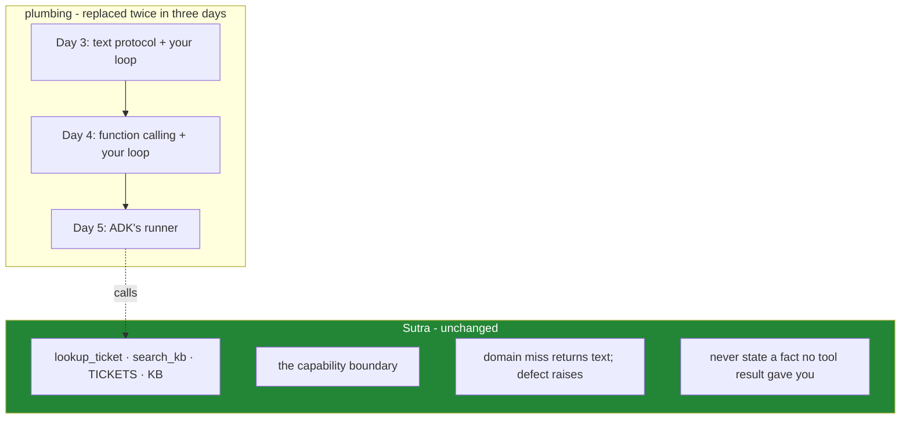

# 5.2 — What you handed over: and the part that was never the framework's to take

## One-line answer

Three days, three completely different loops, and the same four things survived every rewrite: the
tools, the data they touch, the rule about which errors raise, and the honesty policy. That list is the
practical definition of what Sutra actually *is*, as distinct from what it happens to run on.

---

## The story

A tailor's shop has been open for thirty years, and it does almost nothing it used to do.

It stopped making its own buttons decades ago. It buys thread, zips, lining and cloth from a wholesaler
who does nothing else. Heavy embroidery goes out to a specialist across town, who is better at it than
anybody in the shop has ever been. The machines are serviced by a technician who comes once a month.
Pressing and finishing is done by somebody who is not on the payroll and who does three other shops on
the same street.

Every one of those was a sensible decision, made carefully, and the clothes are better than they were.

What has never left the shop is a short list, and everybody who works there could tell you what is on
it: **the measuring, and the cutting.** Not because nobody else could do them. A specialist would take
the work tomorrow, and the results would probably be acceptable. But those two things are what makes a
shirt from *this* shop fit, and a version of this shop that sent them out would be a perfectly good shop
that nobody would cross town for.

The skill in that story is not knowing how to cut cloth. It is being able to say, out loud and without
hesitating, which two things are not for sale.

---

## The idea in plain language

You have now built the same agent three times:

| | Day 3 | Day 4 | Day 5 |
| --- | --- | --- | --- |
| Protocol | text, `startswith` | native function calling | ADK |
| The loop | `run_loop` (yours) | `run_loop` (yours) | `Runner` (theirs) |
| Parsing | `_parse`, 9 lines | none — typed steps | none |
| History | your list | your list | a session service |
| Trace | `print` | `print` | events |

Three of those rows changed completely, twice. That is a lot of churn in three days, so it is worth
asking what did **not** move.

- **The tool functions.** `lookup_ticket` and `search_kb` are the same plain Python they were on Day 3
  ([2.1](../../../day-03-loop-hand-rolled/parts/02-tools-and-dispatch/2.1-tools-are-plain-functions.md)),
  and they will still be plain Python on Day 96. They import nothing from any framework.
- **The dispatch boundary.** The set of things this agent can do is the set of tools you registered. The
  registration mechanism changed shape twice. The property did not.
- **The two species of error.** A domain miss returns readable text, and a defect raises
  ([2.3](../../../day-03-loop-hand-rolled/parts/02-tools-and-dispatch/2.3-a-failed-tool-is-an-observation.md)).
  Nothing about ADK touches this, and trap #4 is a rule you apply per tool, forever.
- **The honesty policy.** *"Never state a fact that no tool result gave you."* Same sentence, three files
  ([2.3](../02-the-agent-object/2.3-the-instruction-is-your-system-prompt.md) moved it across verbatim on
  purpose, so that you could see exactly that).

Four things. **That list is Sutra.** Everything else you have written in three days was plumbing, and it
was replaced twice without the system changing what it is.

Which gives the honest ledger for today:

| Handed over | Kept |
| --- | --- |
| the loop's control flow | the tool functions and their data |
| the history list | the capability boundary |
| the trace mechanism | the error policy (trap #4) |
| the model call | the honesty instruction |
| **placement of the instruction in the payload** ([2.3](../02-the-agent-object/2.3-the-instruction-is-your-system-prompt.md)) | the evals that will measure all of it |
| **the ability to edit the conversation directly** ([4.2](../04-the-runner/4.2-sessions-and-the-transcript.md)) | |

The two bold rows are real losses, and naming them is the point of this part. Not to argue against the
framework, but so that on Day 19, when a context strategy needs the conversation edited, nobody is
surprised.

And now the deeper reading, which is the thing to carry past this curriculum: **the churn tells you where
not to invest.** A parser you wrote carefully on Day 3 lasted one day. The rule about which errors raise
has survived two rewrites, and it will survive the rest. When you are deciding what to spend design
effort on, the things that survive protocol changes are the things worth getting right.

---

## Why Sutra needs it

- **Day 9 (ADK-08, ADK-09)** swaps the *provider* underneath. The four survivors survive that too, which
  is the next piece of evidence for the same claim.
- **Day 31 (OPS-08)** is the quality gate that asks whether the framework is still earning its place.
  This ledger is the input.
- **Days 62–72 (safety and security)** all attach to the boundary and the error policy, which is the kept
  column rather than the handed-over one.
- **Days 79–83 (evals)** measure the honesty policy. It is the only one of the four that the framework
  could not have provided even if it had wanted to.
- **Principle 4**, build first and compare after, finishes here. Today is the "after".

---

## The mechanism

Prove the claim rather than asserting it. The four survivors should be visible as **code that imports
nothing from ADK**:

```bash
grep -rLn "google.adk" sutra/*.py
grep -rln "google.adk" sutra/**/*.py
```

**Line by line:**

- `grep -rLn "google.adk" sutra/*.py` — **`-L` is a capital L, and it means files that do *not* match.**
  These are the modules that know nothing about the framework, and `sutra/loop.py`, which holds the tools
  and their data, should be among them. That is the survivor list, computed rather than claimed.
- `grep -rln ...` with a lower-case `l` gives the files that **do** import ADK. Today that should be only
  the two files in `sutra/desk/`. **A short list here is the property to protect**, because the smaller
  the framework's footprint, the cheaper the next migration.
- If a tool function ever appears in the second list, something framework-shaped has leaked into the part
  of the system that is genuinely yours. Day 10 will put `FunctionTool` around these functions, and the
  test is whether the *functions* stay clean while the wrapping happens somewhere else.

Now the size of the handover, which is worth seeing as a number:

```bash
wc -l sutra/loop.py sutra/agent.py sutra/desk/agent.py sutra/desk/run_once.py
```

**Line by line:**

- `sutra/loop.py` — Day 3, the text protocol and the tools. Still there, still working, and Day 4's
  [7.1](../../../day-04-tools-by-hand/parts/07-the-automatic-door/7.1-automatic-function-calling-declined.md)
  argued for keeping it as a fallback lane.
- `sutra/agent.py` — Day 4, the function-calling loop.
- `sutra/desk/agent.py` and `run_once.py` — today. **Read the two numbers side by side.** The framework
  version is smaller, and the difference is the seven things from
  [1.1](../01-installing-adk/1.1-what-a-framework-takes.md) that you no longer write.
- **The number that matters is not how much smaller it got.** It is that `sutra/loop.py`, which holds the
  tools, the data and the miss messages, is the same size it was two days ago. The churn happened entirely
  in the plumbing.

And the assertion that keeps the boundary honest, which belongs in `./m check`:

```python
def test_the_tools_know_nothing_about_the_framework() -> None:
    """Sutra's tools are plain functions. Days 3, 4 and 5 all agree on this."""
    source = pathlib.Path("sutra/loop.py").read_text(encoding="utf-8")
    assert "google.adk" not in source, "framework types have leaked into the tool layer"
    assert "google.genai" not in source, "SDK types have leaked into the tool layer"
```

**Line by line:**

- It reads the **file's text** rather than importing and inspecting, because the assertion is about the
  source. It is about what a future reader and a future migration will see, rather than about runtime
  behaviour.
- Two assertions, and the second one is the less obvious one: the tool layer should not know about the
  *SDK* either. `lookup_ticket` takes a string and returns a string
  ([2.1](../../../day-03-loop-hand-rolled/parts/02-tools-and-dispatch/2.1-tools-are-plain-functions.md)),
  which is what makes it testable with no key, portable to Day 9's four providers, and exposable over MCP
  on Day 32 without change.
- The messages say **what leaked and why it matters**, rather than merely that an assertion failed.
- **Zero model calls**, milliseconds to run, and it will still be true on Day 96. That is the strongest
  thing you can say about a test.

The three days, and the line that did not move:



---

## When it breaks

**The framework in the tool layer:**

```python
# sutra/loop.py
from google.adk.tools import ToolContext  # 💥


def lookup_ticket(ticket_id: str, tool_context: ToolContext) -> str:
    caller = tool_context.state["caller"]
    return TICKETS.get(ticket_id.strip(), f"No ticket with id {ticket_id!r}.")
```

**Line by line:**

- This is a completely reasonable thing to write on Day 11, and ADK's tool context is genuinely useful. It
  is how a caller identity reaches a tool without going through the model, which is exactly what
  [Day 4, 5.2](../../../day-04-tools-by-hand/parts/05-containment/5.2-the-argument-a-schema-cannot-check.md)
  said you would need.
- And it makes `lookup_ticket` **untestable without the framework**, unusable behind Day 9's other
  providers, and impossible to expose over MCP on Day 32 without a wrapper.
- **The shape that keeps both** is to leave the function plain and put the framework type in the
  *wrapper*. The tool layer stays `str -> str` with a keyword-only `caller`, and the adapter that ADK sees
  does the translation. That is a Day 11 design decision. The reason to name it today is that holding a
  boundary is much cheaper than restoring one.

**The instruction rewritten because the framework is different:**

```text
$ diff <(...SYSTEM...) <(...INSTRUCTION...)
< Never state a fact that no tool result gave you...
---
> Always be helpful and accurate. Use your tools appropriately.
```

**What it means.** The honesty policy, which is one of the four things that actually are Sutra, was
replaced with a sentence that means nothing, during a port. The agent will still work. It will fabricate
more on a miss, the eval will catch it in three weeks, and nobody will connect it to this diff. **The kept
column is kept deliberately, or it is not kept at all.**

**The comparison that cannot be made:**

```text
$ git log --oneline -3
c4f1a20 day 05: ADK agent + runner, prompt improvements, new KB articles, drop loop.py
```

**What it means.** Four changes in one commit. The framework was adopted, the prompt was edited, the data
changed, and Day 3's file was deleted. So no question about today can be answered by looking at the
repository. Principle 2 is one day, one commit, and its whole value is that a change of this size stays
attributable. **The specific loss here is `loop.py`**, which was the control. Without it there is nothing
to compare against, and nothing to fall back to on Day 9.

**The survivors that were never named:**

```text
"What would we have to rewrite if we moved off ADK?"
"...most of it, probably?"
```

**What it means.** Nobody has drawn the line, so the honest answer is unknown, and the pessimistic guess
becomes the assumption. In practice that means the team never seriously evaluates an alternative. Not
because the migration would be expensive, but because nobody knows whether it would be. **Being able to
name the four things is the difference between a framework being a choice and a framework being a
fact.**

---

## In production

**What a professional maintains is a deliberate boundary between domain code and framework code**, and
checks it mechanically rather than culturally. The tools, the data access, the authority checks and the
business rules import nothing from the framework. The adapters that expose them to the framework are thin
and live in one place. That is not an argument against frameworks. It is what makes a framework safe to
adopt, because the cost of being wrong is bounded to the adapter layer.

**What degrades at scale is that the boundary erodes one convenience at a time.** No single import of a
framework type into the domain layer is unreasonable, and each one solves a real problem more directly
than the alternative. Twenty of them later, "what would we have to rewrite" is genuinely most of it. The
mechanism that holds is a test in CI, of exactly the kind above, because the erosion happens in commits
that are each individually defensible, and cultural rules do not survive commits that are each
individually defensible.

**The failure that only appears with real traffic is the one this ledger insures against.** A framework
has an outage, a licence change, a breaking release you cannot take, or simply stops being maintained. At
that point the question is not whether you liked it. It is how much of your system it is. Teams that kept
the boundary move in weeks. Teams that did not discover that their business logic is spread across
callbacks, plugins, agent configurations and framework-specific types, and the migration becomes a
rewrite with a deadline attached.

**The review comment a senior engineer leaves:** *"This commit adopts the framework, rewrites the
instruction, and deletes the previous loop. Split it. We need the old loop as a control for at least the
provider comparison, and if the eval numbers move next week we have to be able to say whether it was the
framework or the prompt. Right now we could not."*

**The interview question:** *"you built an agent by hand and then moved it onto a framework. What did you
learn?"* The answer that shows the reflection rather than the exercise: "That most of what I had written
was plumbing. The protocol changed completely twice in three days, from a text format and a parser, to
native function calling, to the framework's own loop, and four things survived all of it: the tool
functions and their data, the boundary that defines what the agent can do, the rule that a domain miss
returns text while a defect raises, and the instruction about not stating facts no tool gave it. That list
is the system. Everything else was how it happened to be wired that week. Practically it changed where I
spend effort. I do not invest in protocol code, and I do keep the domain layer free of framework types, so
that the adapter is the only thing a migration touches. And I keep the hand-rolled version around, because
it is both a fallback for providers with weaker support and the control that lets me tell a framework
regression apart from a prompt change."

---

## Check yourself

```bash
grep -rLn "google.adk\|google.genai" sutra/loop.py
uv run python -m pytest tests/test_desk.py -q -k knows_nothing
wc -l sutra/agent.py sutra/desk/agent.py
```

The first must print `sutra/loop.py`, the file that does *not* import either one. The second must be
green. The third shows what the handover cost in lines. Read both numbers, and say which of the four
survivors is in neither file.

**Answer out loud, without scrolling up:**

> Name the four things that survived three rewrites, and say which of them a framework could never have
> provided. Then name the two things you gave up today, and the day each one will be felt.

---

**Next:** [6.1 — 💥 The agent with no model](../06-failure-lab/6.1-the-agent-with-no-model.md)
