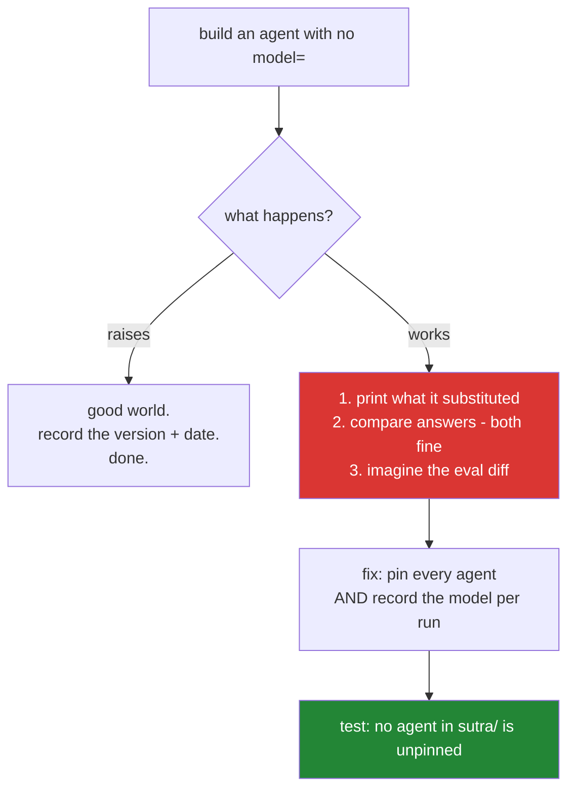

# 6.1 — 💥 The agent with no model: running the substitution on purpose

## One-line answer

Build an agent with no `model=`, run it beside the pinned one, and read what the framework put there
instead. The whole hazard of ADK-73 is that the substitution works, and a failure you have watched
happen on a day you chose is a failure you will recognise on a day you did not.

---

## The story

A hospital tests its backup generator on the first Sunday of every month, at eleven in the morning.

Somebody walks down to the basement and deliberately cuts the mains. To a visitor standing in the
corridor it looks like exactly the thing everybody spends the year hoping will never happen. It is the
opposite. Somebody chose the day, chose the hour, and made sure that a technician was standing next to
the switchboard and a nurse was standing in each ward before anything was switched off.

The staff who do this learn things that no notice on a wall can teach them. The generator takes about
forty seconds to pick up, and forty seconds is much longer than it sounds when you are counting it. The
lift stops between two floors and has to be wound down by hand. Two of the corridor lights are on the
wrong circuit, and they stay dark. The fridge in the small lab is not on the backup at all, and nobody
had ever noticed, because nobody had ever looked at that fridge in the dark.

Every month that gets skipped, the fuel goes stale, the starter battery quietly dies, and the new staff
have never seen it happen.

Nobody learns any of that at two in the morning, in a real power cut, with patients in the building.

---

## The idea in plain language

[3.1](../03-the-model-pin/3.1-the-default-that-moved.md) made the claim. An `LlmAgent` without `model=`
uses ADK's built-in default, that default has changed in a minor release before, and a model that moves
without a commit makes your evals impossible to interpret.

Reading that is not the same as watching it. So today you build the unpinned agent on purpose, on a day
you chose, with the pinned one next to it for comparison. And the specific thing you are here to observe
is **how completely normal it looks.**

There are two worlds, and you do not yet know which one your installed version puts you in.
[3.1](../03-the-model-pin/3.1-the-default-that-moved.md)'s probe was the first half of this.

- **It raises.** `model=` is mandatory in your version, ADK-73 costs you nothing, and you record that
  fact with the version and the date. That is good news, and it is still worth having in writing, because
  it is a property of `google-adk 2.7.1` rather than a property of ADK.
- **It works.** An agent is built, `.model` reports something you did not choose, and a run completes with
  an answer that is probably fine. **This is the stale fuel and the dead starter battery**, and
  everything below is about seeing it clearly.

The test has three observations in it, and the third one is the one people miss.

1. **What did it substitute?** A string, printed. Write it down with the date.
2. **Does the answer differ?** Run both agents on the same question. Often it will not differ in any way
   you can see, and that is the point. A difference you can see is a difference you would have caught.
3. **What would a dashboard have shown?** This is the real damage. Not a broken run, but a distribution
   that moved, in a system where nothing in the repository changed.

---

## Why Sutra needs it

- **Today**, it turns [3.1](../03-the-model-pin/3.1-the-default-that-moved.md)'s rule from something you
  agree with into something you have seen.
- **Day 9 (ADK-08, ADK-09, ADK-73 reinforced)** compares four providers. A comparison is arithmetic over
  named models, and today is the demonstration of what an unnamed one costs.
- **Days 79–83 (evals)** are where the invisible version of this failure lands, and the eval report will
  carry the model id because of what you see here.
- **Day 31 (OPS-08)** is the freshness check: has the default moved since last time? A number you write
  down today is what makes that question answerable.
- **Principle 11**, every day ends with a check that can go RED, and the test at the end of this part is
  the one that stays.

---

## The mechanism

The test. One file, `days/day-05-first-adk-agent/lab/unpinned.py`, **in the lab folder and never in
`sutra/`**, because this is an experiment rather than a deliverable:

```python
"""💥 Failure lab: what happens when an agent has no model= (ADK-73).

    uv run python days/day-05-first-adk-agent/lab/unpinned.py

Lives in lab/ on purpose. Nothing in sutra/ may construct an unpinned agent.
"""

import asyncio

from google.adk.agents import LlmAgent

from sutra.config import load_env, require_free_tier
from sutra.desk.agent import INSTRUCTION, root_agent
from sutra.desk.run_once import ask_with

QUESTION = "In one sentence: what is a support-ticket triage desk?"


async def main() -> None:
    load_env()
    require_free_tier()

    try:
        unpinned = LlmAgent(name="unpinned", instruction=INSTRUCTION)
    except Exception as error:  # probe only - never in sutra/
        print("no model= RAISES:", type(error).__name__, error)
        return

    print("pinned   .model :", repr(root_agent.model))
    print("unpinned .model :", repr(unpinned.model))
    print()
    print("pinned   answer :", await ask_with(root_agent, QUESTION))
    print("unpinned answer :", await ask_with(unpinned, QUESTION))


if __name__ == "__main__":
    asyncio.run(main())
```

**Line by line:**

- The docstring says **where this lives and why.** A file that deliberately does the forbidden thing has
  to say so at the top, or it becomes an example that somebody copies.
- `from sutra.desk.agent import INSTRUCTION, root_agent` — **the same instruction for both agents**, so
  that the only variable is the model. A comparison with two variables in it is not a comparison.
  [2.3](../02-the-agent-object/2.3-the-instruction-is-your-system-prompt.md) made the same point about
  porting the prompt across verbatim.
- `ask_with(agent, question)` — a small helper that you factor out of
  [4.1](../04-the-runner/4.1-the-runner-is-your-run-loop.md)'s `ask_once`, taking the agent as a
  parameter so that one runner shape serves both. **This is the refactor today's experiment asks for**,
  and it is a good one: an agent that is passed in rather than imported is an agent you can vary.
- `except Exception as error:` — the broad catch, justified **only here**, for the same reason as
  [3.1](../03-the-model-pin/3.1-the-default-that-moved.md)'s probe. You do not know what it raises, and
  finding out is the point. The comment says so. Principle 10 and trap #4 are untouched inside `sutra/`.
- `print("...RAISES:", type(error).__name__, error)` and then `return` — **if you are in the good world,
  the experiment is over in one line**, and you have a fact worth recording.
- `repr(root_agent.model)` beside `repr(unpinned.model)` — the two strings, next to each other. `repr`, so
  that `None`, `''` and a real id are all distinguishable.
- `QUESTION` is deliberately **generic and short.** You are comparing models, not testing triage, and a
  one-sentence answer keeps the experiment cheap.
- **About four model calls** for the whole experiment. Budget it.

Run it, and read the three observations:

```text
pinned   .model : 'gemini-3.7-flash'
unpinned .model : '<whatever your version substituted>'

pinned   answer : A support-ticket triage desk reviews incoming customer issues and
                  routes each to the right team with the right urgency.
unpinned answer : A support-ticket triage desk is the function that assesses inbound
                  customer problems and assigns them a priority and an owner.
```

**Observation one: the substitution.** A model string you did not choose, printed. Copy it into
`lab/seams.md` with today's date and your `google-adk` version. It is a fact about that version, and
Day 31's freshness check compares against it.

**Observation two: the answers.** Both are fine. Both are correct. Read them twice, and notice that
**nothing here would fail any check you own.** If you had shipped the unpinned agent, you would have
noticed nothing today, and that is the entire hazard. The failure mode of ADK-73 is not a broken agent.
It is an unlabelled one.

**Observation three is not in the output**, and it is the one to sit with. Imagine that difference
repeated across a whole eval set:

```text
run 2026-08-25   grounding 0.91   fabrication 0.03   mean steps 2.4   model gemini-3.7-flash
run 2026-09-14   grounding 0.84   fabrication 0.07   mean steps 2.9   model <unrecorded>
```

**Line by line:**

- The numbers moved, and **the last column is the reason**: a different model, arrived at through a
  framework upgrade rather than through a decision.
- Without that column, the investigation goes to the prompt, then the tools, then the eval set, in that
  order, and it takes days.
  [3.1](../03-the-model-pin/3.1-the-default-that-moved.md)'s bakery spent six weeks adjusting hydration
  for the same reason.
- **With** that column it is a two-second diff. Which is why the fix is not only "pin the model" but also
  "record the model with every run". Two habits, one problem.

And now the second half of the test, which shows the asymmetry directly. Break both agents the same way
and compare the errors:

```bash
# pinned, with a deliberate typo in sutra/desk/agent.py: model="gemini-3.7-flah"
uv run python -m sutra.desk.run_once "hello"
```

**Line by line:**

- A pinned agent with a wrong model gives you a `404` naming `gemini-3.7-flah`, and **that string is in
  your source and in your git history.** You know what to change before you have finished reading the
  message.
- An unpinned agent whose default model has been retired gives you a `404` naming a string that appears
  **nowhere in your repository**, and the first question is "where is that even coming from?" Same class
  of failure, and the pin turned an investigation into a typo.
- **Put the correct model string back** before you move on.

Then restore everything and write the test that stays:

```python
def test_no_agent_in_sutra_is_unpinned() -> None:
    """ADK-73: the failure lab lives in lab/; sutra/ never constructs an unpinned agent."""
    for path in pathlib.Path("sutra").rglob("*.py"):
        source = path.read_text(encoding="utf-8")
        if "LlmAgent(" in source:
            assert "model=" in source, f"{path} constructs an agent without model="
```

**Line by line:**

- `pathlib.Path("sutra").rglob("*.py")` — **every module in the package**, not just today's. The rule has
  to hold on Day 96, when there are several agents, and a test that names one file will be quietly
  outgrown.
- `if "LlmAgent(" in source:` — only files that construct one. It is crude text matching, and it is honest
  about that: it would miss an agent built through a factory or an alias. It catches the case that
  actually happens, which is somebody writing a second agent by copying the docs example, and a crude test
  that runs is worth more than a precise one that nobody writes.
- `assert "model=" in source` — the assertion is per **file**, not per construction, so a file with two
  agents where only one is pinned would pass. Note the weakness rather than pretending it away. The
  stronger version parses the AST, and it is worth writing on the day there are five agents.
- The docstring names **ADK-73**, so that a future reader can find out why this test exists.
- **Zero model calls**, and it catches the exact regression this part is about.

The test, and what each half teaches:



---

## When it breaks

**The experiment that showed nothing:**

```text
pinned   .model : 'gemini-3.7-flash'
unpinned .model : 'gemini-3.7-flash'
```

**What it means.** Your version's default happens to be the model you pinned, so the two runs are
identical and the experiment appears to prove nothing. **It proved the most important thing available
today:** the default is currently harmless, *and you now know what it is*, which is precisely the number
Day 31 compares against. The hazard was never that the default is a bad model. It is that it is an
unrecorded one.

**The experiment run against `sutra/`:**

```text
$ git status
        modified:   sutra/desk/agent.py
```

**What it means.** The unpinned agent was created by editing the real module instead of adding a lab
file. It works, and it leaves a deliberately broken agent one forgotten `git checkout` away from being
committed, which is how a failure lab becomes an incident. **Experiments go in `lab/`.** That is what the
folder is for, and it is why today's test asserts that `sutra/` is clean.

**The typo left in:**

```text
google.genai.errors.ClientError: 404 NOT_FOUND. {'error': {'code': 404,
'message': 'models/gemini-3.7-flah is not found for API version v1beta,
or is not supported for generateContent.', 'status': 'NOT_FOUND'}}
```

**What it means.** You left the deliberate typo in `sutra/desk/agent.py` after the second half of the
experiment. **And this is the good outcome**, exactly as the experiment predicted: a loud error naming a
string you can find with one `grep`. Fix it, and notice that you were never confused for a second, which
is the comparison this part exists to make.

**The default that changed between one run and the next:**

```text
lab/seams.md:  default model (adk 2.7.1, 2026-08-25) = 'X'
$ uv run python days/day-05-first-adk-agent/lab/unpinned.py
unpinned .model : 'Y'
```

**What it means.** Somebody upgraded ADK and the default moved. That is **exactly the event ADK-73
describes**, observed rather than read about. Nothing in the repository would have told you. Update the
note, keep both values with their dates, and take that history to Day 31's gate. A default that has moved
once will move again.

---

## In production

**What a professional does with a failure lab is schedule it.** The generator test is only useful because
somebody chose the day, and the same is true of these. You want a regular exercise where a known failure
is reproduced deliberately, to check that the detection still works and that the people are still
familiar with the shape. Teams that only ever meet a failure in production meet it with nobody in
position. The version of this for model pinning is simple: at each quality gate, run the probe and confirm
that the recorded default is still the recorded default.

**What degrades at scale is that the substitution stops being one agent.** Today it is one file. With
several agents across several services, a framework upgrade moves the default for **all** of the unpinned
ones at once. The resulting change is system-wide, simultaneous, and attributable to a lock-file diff that
mentions no models at all. Investigations of system-wide, simultaneous quality changes go to
infrastructure first, and that is a long way from the answer.

**The failure that only appears with real traffic is the mixed fleet.** Two services on different
framework versions, both unpinned, are running different models. So the same agent behaves differently
depending on which service handled the request, and the split is invisible in every aggregate. This is the
same shape as [3.2](../03-the-model-pin/3.2-a-floating-alias-is-not-a-pin.md)'s alias moving mid-term, and
it has the same answer: pin the model, and record which one ran with every request, so that a blend of two
distributions is visible as a blend rather than as noise.

**The review comment a senior engineer leaves:** *"Good, the lab file is in `lab/` and the test asserts
`sutra/` is clean. Add the substituted model string and the ADK version to the notes, and make the eval
report print the model id. Half of this class of bug is prevented by the pin, and the other half is
diagnosed by the record. We need both."*

**The interview question:** *"tell me about a failure you reproduced on purpose."* The answer that shows
the practice rather than the anecdote: "The one I always run when adopting an agent framework is
constructing an agent without specifying a model, because most of them have a built-in default and that
default changes in minor releases. The point is not that it breaks. It is that it does not. You get a
working agent, a plausible answer, and a model you did not choose, so nothing fails and your eval baseline
quietly moves with no commit to attribute it to. Running it deliberately gives you three things. The
string it substituted, written down with the version and the date, so that a later upgrade is a diff. The
experience of seeing two perfectly good answers from two different models, which is what makes the
invisibility concrete. And the argument for recording the model id with every run, because pinning
prevents half of this class, and only the record diagnoses the other half."

---

## Check yourself

```bash
uv run python -m pytest tests/test_desk.py -q -k unpinned
grep -rn "LlmAgent(" sutra/ | wc -l
grep -rn "model=" sutra/ | wc -l
```

Green, and the two counts must match, because every `LlmAgent(` in the package has a `model=`. Then
confirm that `lab/seams.md` records the substituted model string, your `google-adk` version, and today's
date.

**Answer out loud, without scrolling up:**

> Say what you observed when you ran the unpinned agent, and why "both answers were fine" is the finding
> rather than a disappointment. Then say what a `404` looks like for a pinned model versus a defaulted
> one, and why that difference is the argument in one sentence.

---

**Next:** [7.1 — 🅿️ `adk run` and `adk web`](../07-the-dev-ui/7.1-adk-run-and-adk-web.md)
