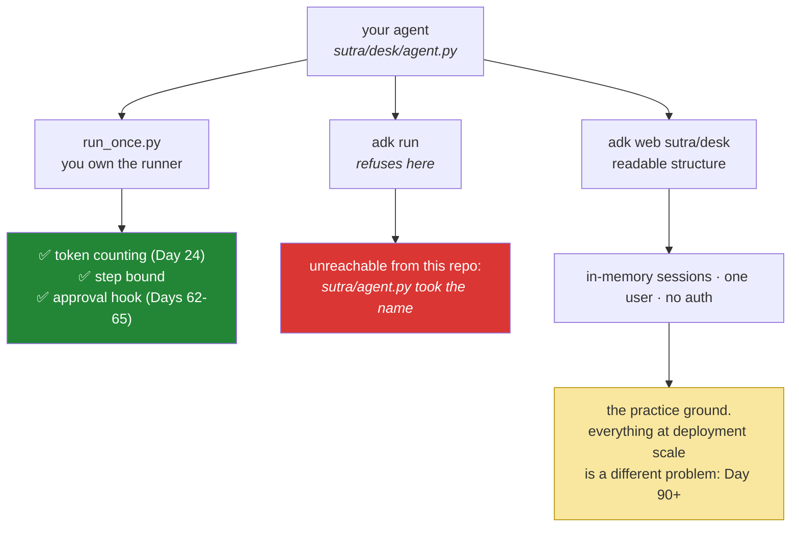

# 7.1 — 🅿️ `adk run` and `adk web`: the practice ground is not the road

## One-line answer

ADK ships a command-line runner and a browser development UI, and one of the two will run today's
agent with no code at all — `adk run` cannot, in this repository, for a reason worth the detour. Sutra
wrote `run_once.py` anyway, because those tools hide exactly the object this day is about, and because
everything that makes a deployment hard happens at a scale they do not have.

> 🅿️ **Parked.** Use these tools freely from tomorrow. Nothing here is built on. What you take from this
> part is what they show you, and what they cannot.

---

## The story

Somebody learns to drive on an empty ground on a Sunday morning, with an instructor sitting beside them
and a second brake pedal on the instructor's side.

That is not play. It is real learning. They find the biting point of the clutch. They learn to reverse
in a straight line, to park between two cones, to look before they turn, and to stop smoothly instead of
in a lurch. After a month they can explain what they are doing and why. That knowledge is genuine, and
it did not come from a book.

And it tells them almost nothing about the road. Nothing about a truck sitting two feet off the back
bumper. Nothing about a signal that has failed at a busy crossing and a traffic policeman waving
everybody through by hand. Nothing about rain at night, when the lane markings disappear and every
headlight turns into a star. Nothing about what to do when the car in front stops dead for no reason.

The empty ground is not a lie, and it is not a lesser road. It is a **different scale**. And the second
brake pedal, the one that made all of that safe to learn, will not be there.

---

## The idea in plain language

`sutra/desk/` satisfies ADK's folder convention
([1.3](../01-installing-adk/1.3-the-layout-adk-expects.md)), which means two commands already work
without any of the code you wrote in [4.1](../04-the-runner/4.1-the-runner-is-your-run-loop.md):

| Command | What it does | Here |
| --- | --- | --- |
| `adk run sutra/desk` | an interactive conversation in your terminal | ❌ refuses |
| `adk web sutra/desk` | a local web server with a chat UI, an agent picker, and a view of what happened | ✅ |
| `adk web` | the same server, discovering every agent folder below the current directory | ❌ offers nine, none of them yours |

Both of them build the runner and the session service for you, and both are genuinely useful. So the
reasonable question is why part 4 had you write `run_once.py` at all.

The third column is this repository's answer rather than the framework's, and it is why this part is
longer than a parked part should be. Two of those three commands do not work here, and the cause is not
a mistake in your code. It is the folder convention from
[1.3](../01-installing-adk/1.3-the-layout-adk-expects.md) meeting a filename that was chosen before the
convention arrived: **a convention you adopt is a name you can no longer use for anything else**, and
Day 4 spent that name on `sutra/agent.py`. Both errors, and the fix, are in *When it breaks*.

The answer is Principle 4 in its plainest form: **`adk run` hides the runner, and the runner is the
subject of the day.** A tool that builds the thing you are trying to understand is a tool that is useful
*after* you understand it. You have now built the runner by hand, so when `adk web` shows you a
conversation, you know which object made it and where the session lives.

That said, this is not an argument against the tools, and it is worth being clear about what they are
excellent for.

- **`adk run`** is the fastest way to have a conversation with an agent while you are editing its
  instruction. Day 6 (ADK-03, AG-05) is instruction design, and the loop of *edit, run, read* is the work
  of that day.
- **`adk web`** shows the run's structure, meaning the events, the tool calls and the state, in a form
  that is far easier to read than a terminal. It is a debugger, and Day 7's event model is what it is
  displaying.

And then the parked half, which is the empty ground: **neither of them is how Sutra runs anywhere except
your laptop.** They start a process, hold sessions in memory, serve one user, and have no
authentication. Everything that makes a deployment hard, such as concurrency, sessions that outlive a
process, who is allowed to talk to it, and what happens on a restart, sits at a scale these tools do not
have. That is not a criticism, because a development server is supposed to be a development server. It
becomes a problem only when a team develops against it alone and then meets all of those questions at
once, late.

---

## Why Sutra needs it

- **Day 6 (ADK-03, AG-05)** is the day these tools earn their place. Instruction design is an
  edit-and-try loop, and `adk web` is the right instrument for it.
- **Day 7 (ADK-04, ADK-05)** is the event model, which is what `adk web` is rendering. Reading events in a
  UI after you have consumed them in an `async for` is the right order.
- **Day 8 (ADK-06, ADK-07)** replaces the in-memory session service, which is the first of these limits to
  be lifted.
- **Days 90+ (deployment)** are the road. The gap between `adk web` and that day is the thing this part
  exists to keep visible.

---

## The mechanism

The two commands, and what each one hides:

```bash
uv run adk run sutra/desk
```

**Line by line:**

- `uv run` — the project's interpreter, so `adk` is the one in this environment rather than one that
  happens to be on your `PATH`. That is the same reasoning as every other command since Day 0.
- `adk run sutra/desk` — the **folder path**, which is why the convention from
  [1.3](../01-installing-adk/1.3-the-layout-adk-expects.md) matters. It imports `sutra/desk/agent.py` and
  looks for `root_agent`.
- What it builds for you: a session service, a session, and a runner. **Those are exactly the three
  objects [4.1](../04-the-runner/4.1-the-runner-is-your-run-loop.md) made you build**, and being able to
  name them while the tool builds them is the difference between using a tool and being operated by one.
- What it does **not** show you: which session service it chose, what the session id is, or how many model
  calls a turn cost. If those matter, and on Day 24 they will, you are back to owning the runner.
- **In this repository it does not run.** `adk run` splits the path you hand it into a parent folder and
  an agent name, then asks ADK to find `desk` inside `sutra/` — and ADK, seeing `sutra/agent.py`, decides
  `sutra/` is itself an agent and stops looking. The error and the whole chain are in *When it breaks*.
  Use `adk web sutra/desk`, which takes the same path and does **not** split it, or `run_once.py`, which
  takes no path at all.

```bash
uv run adk web sutra/desk
```

**Line by line:**

- **The path is the agent folder itself**, not a folder of agents. `adk web` documents both — *"the
  directory of agents (where each subdirectory is a single agent...) or a path pointing directly to a
  single agent folder"* (`adk web --help`, google-adk 2.7.1, read 2026-08-26) — and the second form is
  the one that works here, because it never splits the path and so never looks at `sutra/`.
- **Bare `adk web`, with no path, is the form the framework's examples use, and here it is the wrong
  one.** With no path it **discovers** agents by scanning the current directory for the folder
  convention, then presents them in a picker. That is the multi-agent convenience
  [1.3](../01-installing-adk/1.3-the-layout-adk-expects.md) predicted, and it is also the
  discovery-versus-manifest hazard that part flagged — except that it needs no stray branch or copied
  folder to bite. Run it at this repository's root and read the picker; *When it breaks* has what it
  offers you.
- It starts a **local web server**. Check the port it prints rather than assuming. The documented default
  is 8000, and `--port` overrides it (adk.dev, checked 2026-08-25).
- It is bound to your machine and it has **no authentication**. That is correct for a development tool,
  and it is a sentence worth keeping in mind before anybody suggests exposing it to a colleague "just to
  show them".
- **The reason to run it once today** is to see your agent's `name` and `description`
  ([2.2](../02-the-agent-object/2.2-name-and-description.md)) rendered as the thing a human picks from a
  list. Those two fields stop looking like documentation the moment you see them in a dropdown.

Now the comparison that makes the parking honest. The same agent, three ways to run it:

```bash
uv run python -m sutra.desk.run_once "Say hello in one short sentence."   # yours
uv run adk web sutra/desk                                                  # the UI
uv run adk run sutra/desk                                                  # the CLI - refuses here
```

**Line by line:**

- The first two produce the same answer from the same agent, because the agent is a configuration and
  neither of them is the agent ([2.1](../02-the-agent-object/2.1-an-agent-is-a-configuration.md)).
- **Yours** prints `[event]` lines, so you can see the sequence and count the turns. It is the only one of
  the three where you can add a token counter, a step limit, or an approval prompt, because it is the only
  one where you hold the runner.
- **The UI** is best for reading a run's structure. Use it tomorrow for instruction work and on Day 7 for
  events. It is the one of the two framework tools this repository has, and it is the better of them for
  both jobs anyway.
- **The CLI** is listed third so that you type it once and read what comes back. A command that fails for
  a reason you can explain is worth more than one you were told to skip.
- **Two model calls**, not three, because the third never reaches a model. Budget them, and run the UI
  last, because it is the one you will linger in.

What each tool has and has not, drawn once so that the parking is explicit:



---

## When it breaks

**💥 The command this part told you to type, refusing to run:**

```text
$ uv run adk run sutra/desk
Traceback (most recent call last):
  ...
  File ".../google/adk/cli/utils/agent_loader.py", line 256, in _validate_agent_name
    raise ValueError(
ValueError: Agent not found: 'desk'. In single agent mode, only 'sutra' is accessible.
```

**What it means.** Not what it appears to mean. `sutra/desk/` is correct, `root_agent` is there,
`__init__.py` is there, and `uv run python -c "from sutra.desk.agent import root_agent"` succeeds. The
sentence to read twice is **"in single agent mode"**, because nothing you typed asked for a mode.

Follow it back one step at a time. `adk run` takes one path and splits it:

```text
# google/adk/cli/cli_tools_click.py, google-adk 2.7.1 - quoted verbatim
agent_parent_folder = os.path.dirname(agent)   # "sutra"
agent_folder_name = os.path.basename(agent)    # "desk"
```

**Line by line:**

- The fence says `text`, not `python`, and that is deliberate. This is a file from `site-packages`,
  and a `python` fence would hand it to this project's formatter, which would restyle somebody else's
  source inside a quotation. **Quote foreign code in a fence your tools will not touch.**
- `os.path.dirname` and `os.path.basename` — the path you typed becomes **a folder of agents plus the
  name of one of them.** That is the shape `adk run` was designed around: agents sit side by side in a
  parent folder, and you name one.
- Nothing here is wrong yet. The parent folder is `sutra/`, and the name is `desk`, which is exactly what
  you meant. The trouble is what the loader then thinks `sutra/` is.

The loader is given `sutra/` as the folder of agents, and its very first act is to ask whether that
folder is an agent itself:

```text
# google/adk/cli/utils/agent_loader.py, google-adk 2.7.1 - quoted verbatim,
# two-space indentation and all: this is Google's file, not Sutra's.
def is_single_agent_directory(path: Path | str) -> bool:
  """Returns True if the directory contains a single agent configuration or file."""
  p = Path(path).resolve()
  return p.joinpath("agent.py").is_file() or p.joinpath("root_agent.yaml").is_file()
```

**Line by line:**

- `p.joinpath("agent.py").is_file()` — **the whole test is "does this folder contain a file called
  `agent.py`?"** There is no check that the file defines `root_agent`, and no check that it imports.
  The *name* is the entire evidence.
- `sutra/agent.py` exists. It is Day 4's native-function-calling loop
  ([Day 4, 3.2](../../../day-04-tools-by-hand/parts/03-rebuilding-the-loop/3.2-the-loop-that-shrank.md)),
  it has no `root_agent` in it, and it has never heard of ADK — and none of that is asked.
- So the loader concludes that `sutra/` **is** an agent, sets its single-agent name to `sutra`, and
  narrows the world to that one name. `desk` is now not a name it will consider, and you get the
  `ValueError`.

Prove the chain rather than believing this document, which costs nothing and no model call:

```bash
uv run python -c "
from google.adk.cli.utils.agent_loader import AgentLoader, is_single_agent_directory
print('sutra      is single-agent dir?', is_single_agent_directory('sutra'))
print('sutra/desk is single-agent dir?', is_single_agent_directory('sutra/desk'))
loader = AgentLoader('sutra')
print('mode:', loader.is_single_agent, '| name:', loader.single_agent_name)
"
```

**Line by line:**

- Both calls print `True`, and **that is the finding.** `sutra/desk` being a single-agent directory is
  the intended answer; `sutra` being one as well is the accident, and the two are indistinguishable to a
  test that only looks at filenames.
- `AgentLoader('sutra')` is constructed with **the parent folder**, exactly as `adk run` constructs it,
  so this reproduces the failure without the CLI in the way. Printing `single_agent_name` gives you the
  `'sutra'` from the error message, which is how you know you are looking at the right cause.
- `is_single_agent_directory` is a private helper of the CLI and reading it is fair. When an error message
  uses a phrase you did not put there — "single agent mode" — the installed source is the shortest route
  to what it means. That is [4.3](../04-the-runner/4.3-read-the-signature-not-the-tutorial.md)'s habit
  pointed at an error instead of a signature.

**The insight, which is bigger than this bug: a convention is a name you give up.** By adopting ADK's
folder convention in [1.3](../01-installing-adk/1.3-the-layout-adk-expects.md), this project agreed that
`agent.py` means "an ADK agent lives here" — everywhere, not only where it meant it. `sutra/agent.py`
was named on Day 4, when nothing in the repository had an opinion about that filename, and it became a
claim retroactively. Adopting a convention rewrites the meaning of files you already have.

**Sutra's answer is to leave both files where they are**, use `adk web sutra/desk` and `run_once.py`, and
keep this page as the record. The alternatives were weighed and each costs more than it returns:

| Option | What it fixes | What it costs |
| --- | --- | --- |
| rename `sutra/agent.py` | `adk run sutra/desk` works | rewrites Day 4, which is committed teaching, to buy a command `adk web` already covers |
| move `sutra/desk/` to a top-level `agents/` | both commands work | contradicts [1.3](../01-installing-adk/1.3-the-layout-adk-expects.md)'s reason for keeping the agent in the package, and moves a decision to accommodate a tool |
| leave it, use `adk web sutra/desk` | nothing to change | `adk run` is unavailable in this repository for the rest of the curriculum |

**Row three is the honest trade**, because the thing lost is a convenience with a working substitute, and
`adk web` is the better instrument for both jobs the curriculum has for these tools — instruction work
tomorrow and events on Day 7. It is written into `docs/PACKAGES.md` beside the `google-adk` pin, because a
behaviour that surprised you once will surprise you again on a version bump, and a ledger row is where you
will look.

**💥 Bare `adk web`, and the picker full of things that are not agents:**

```text
$ uv run adk web
```

Its picker offers nine entries. This is what the loader is actually holding:

```text
['days', 'dist', 'docs', 'legacy', 'scripts', 'skills', 'sutra', 'sutra_mcp', 'tests']
```

**What it means.** With no path, the current directory becomes the folder of agents, so **every
subdirectory of the repository root is offered as an agent.** `docs` is in that list. So is `legacy`,
which is read-only, and `tests`. None of them is an agent and the loader does not claim otherwise — it
lists candidates, and finds out whether one is real only when you pick it.

Pick `sutra`, the one that looks right, and:

```text
ValueError: No root_agent found for 'sutra'. Searched in 'sutra.agent.root_agent',
'sutra.root_agent' and 'sutra\root_agent.yaml'.

Expected directory structure:
  <agents_dir>\
    sutra\
      agent.py (with root_agent) OR
      root_agent.yaml

Then run: adk web <agents_dir>
```

**What it means.** The same collision from the other side, and this error is the more useful of the two
because it **names where it looked**: `sutra.agent.root_agent` is Day 4's module, imported and searched
for a variable it does not have. Two errors, one cause, and neither mentions the file that caused it.

**This is the discovery-versus-manifest hazard from [1.3](../01-installing-adk/1.3-the-layout-adk-expects.md), arriving early.** That part predicted it as a scaling
problem — twenty agents, a folder left on a branch. It did not need twenty. A repository with a `docs/`
folder is enough, because **discovery answers "what could be an agent?" and a manifest answers "what is
one?"**, and only the second question has a useful answer. Pass the path: `adk web sutra/desk`.

**The agent that is not discovered:**

```text
$ uv run adk web sutra/desk
ValueError: No root_agent found for 'desk'. Searched in 'desk.agent.root_agent',
'desk.root_agent' and 'desk\root_agent.yaml'.
```

**What it means.** The folder you pointed at does not satisfy the convention — almost always a variable
named something other than `root_agent`, or one built inside a function instead of at module level.
Everything in [1.3](../01-installing-adk/1.3-the-layout-adk-expects.md) applies, and **the tools failing
loudly on a broken convention is the convention working.**

Note the contrast with the two failures above. This one fails because a rule was **broken**, and it names
the three places it looked. Those two failed because a rule was **kept** — and neither error mentions
`sutra/agent.py`, the file that actually caused them. **An error is only as good as the distance between
the symptom and the cause**, and a convention silently widens that distance the moment a second file
happens to match it.

**The import-time failure, surfaced by a tool:**

```text
sutra/desk/agent.py:16: in <module>
    require_free_tier()
E   sutra.config.ConfigError: GOOGLE_GENAI_USE_VERTEXAI is 'TRUE' - Sutra is
    free-tier only (Addendum 02, Principle 15).
```

**What it means.** The tool imported your module, and your import-time check fired. That is exactly what
[3.3](../03-the-model-pin/3.3-two-doors-to-gemini.md) built it to do, in a context you had not thought
about. **This is a good outcome.** The check protects every entry point, including the ones you did not
write, precisely because it lives at import.

**The UI that was shown to somebody else:**

```text
$ uv run adk web --host 0.0.0.0
```

**Line by line:**

- This binds to all interfaces, so that a colleague on the same network can look. That is
  understandable, and it puts an **unauthenticated** interface to an agent holding your API key onto the
  network.
- Anybody who can reach it can spend your quota, read any session in memory, and talk to the agent as you.
  On a free tier the worst case is a lost day of quota. The habit is what matters, because the same reflex
  applied to an agent with write tools is an incident.
- **The fix is a screen share**, or Day 90's actual deployment. A development server is not a way to share
  something.

**The team that only ever ran `adk web`:**

```text
"It works fine locally. In staging the agent forgets everything between messages."
```

**What it means.** In-memory sessions, and staging runs more than one process, so a follow-up message
lands on a different replica with a different, empty session service
([4.2](../04-the-runner/4.2-sessions-and-the-transcript.md)). **The practice ground has one process and
the road does not.** Day 8 is the fix, and the reason to name it here is that this particular surprise is
almost universal, and it is entirely predictable from the words "in memory".

---

## In production

**What a professional does is treat the development UI as a debugger, not as the product's shape.** It is
excellent for the inner loop: change an instruction, see what happens, read the events. And it answers
none of the questions that make a deployment, such as how sessions persist, who is authenticated, how many
concurrent conversations one process can hold, and what happens to a run in flight when the process is
told to shut down. Those get designed against the real runtime, and the earlier a team runs the agent
through *its own* entry point, even a crude one like `run_once.py`, the earlier those questions arrive.

**What degrades at scale is discovery.** Scanning folders for a magic variable is the right trade for a
laptop with three agents, and the wrong one for a deployment.
[1.3](../01-installing-adk/1.3-the-layout-adk-expects.md) said so, and this is where it bites. An
experiment left on a branch, a copied folder, a half-finished agent: all of them become deployable
artifacts. The mature arrangement is discovery for development and an explicit manifest for what ships,
and the two can disagree, which is exactly why the manifest exists.

**The failure that only appears with real traffic is the behaviour that was only ever exercised by hand.**
A development UI drives an agent one message at a time, by a person who waits for each answer. Real
traffic is concurrent, impatient, and full of clients that disconnect mid-run. Everything that breaks
under those conditions is invisible to a human clicking in a browser, however thoroughly they click:
shared mutable state on an agent
([2.1](../02-the-agent-object/2.1-an-agent-is-a-configuration.md)), a blocking call inside an async path
([4.1](../04-the-runner/4.1-the-runner-is-your-run-loop.md)), an unbounded session.

**The review comment a senior engineer leaves:** *"All our manual testing is through `adk web`, which
means we have never exercised our own entry point, our own session service, or two conversations at once.
Run the agent through the same path production will use, even if that path is a twenty-line script. The
first three surprises always come from the wiring, not from the agent."*

**The interview question:** *"your framework ships a dev UI. Do you use it?"* The answer that shows
proportion: "Constantly, for the inner loop. Changing an instruction and seeing what the agent does is
much faster in a UI that renders the run's structure than in a terminal, and it is the right tool for
prompt work and for reading events. What I do not do is let it be the only way the agent is ever run,
because it hides the wiring. It builds the runner and the session service for me, holds sessions in memory
in one process, serves one user, and has no auth. Every surprise in the first week of a deployment comes
from exactly those: sessions not surviving a second replica, concurrency, shutdown. None of them is
reachable by clicking. So I make sure there is an entry point we own that goes through the same path
production will, however crude it is, and I use the UI for what it is genuinely good at."

---

## Check yourself

```bash
uv run adk run sutra/desk      # read the refusal, then the chain in "When it breaks"
uv run adk web sutra/desk      # the one that works: pass the agent folder
```

Open the port the second one prints, find `sutra_desk` in the picker, and ask it something. Then read the
agent's `description` where it appears in the interface. That is the field
[2.2](../02-the-agent-object/2.2-name-and-description.md) called an advertisement, being used as one by a
human instead of by a router.

**Answer out loud, without scrolling up:**

> Name the three objects `adk run` builds for you, and say why part 4 had you build them by hand anyway.
> Then name three things about a deployment that these tools cannot tell you, and the day each one is
> settled. Finally: `adk run sutra/desk` refuses in this repository — name the file that causes it, say
> why ADK is not wrong to stop, and give the two-word phrase in the error that told you where to look.

---

**Next:** back to the hub — [Day 5 · LESSON.md](../../LESSON.md) §11, and the commit.
