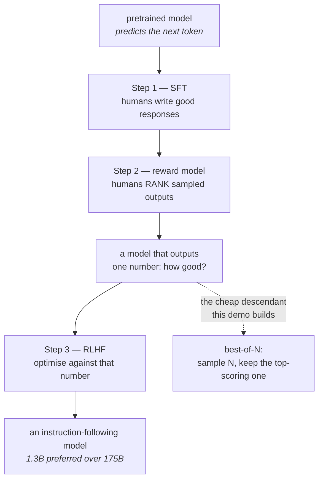

# Training language models to follow instructions with human feedback

> **arXiv:2203.02155** · 2022 · <https://arxiv.org/abs/2203.02155>
> Record opened and title copied from it on 2026-08-26. Ledger row: `docs/PAPERS.md`.

## One-line answer

Making a language model bigger does not make it better at doing what you asked, and fine-tuning it on
human demonstrations and human preference comparisons does — so **instruction following is a trained
behaviour, not a property of scale**, and the whole practice of writing a handbook rests on somebody
having done that training.

---

## The story

You walk into a photocopy shop with a page and hand it over. Written across the top of the page, in
your handwriting, is: *"Please make 10 copies of this."*

You get back ten copies of the page — including your note. Of course you do. That is what a copier
does, and nobody would call it broken.

Now imagine a machine that reads the page. It is remarkable. It has read everything, it knows what
your handwriting says, it understands the words "please", "make", "ten" and "copies". And it still
gives you ten copies of a page that says *please make 10 copies of this*, because reading is not the
same as being asked.

For a while that was the actual situation. The machine could be steered, but you had to steer it
sideways — instead of asking for what you wanted, you had to set up a page that your request would
naturally *continue*. People got good at this. There were tricks, and the tricks worked, and everybody
assumed the answer was that the machines needed to get bigger.

They got bigger. It did not fix this.

What fixed it was somebody sitting down with the machine and showing it, thousands of times, what a
*response to a request* looks like as opposed to a continuation of one — and then, thousands more
times, holding up two responses and saying *this one is better than that one.*

---

## The idea in plain language

To read this paper you need one term, and it is the one its title assumes.

A language model is trained by **next-token prediction**: given a stretch of text, predict what comes
next, over an enormous amount of writing. That is the whole objective. What you get is a machine
extremely good at continuing text — which you met on
[Day 2, part 4.1](../../day-02-llm-mechanics/parts/04-sampling-the-dial/4.1-the-probability-list.md)
as a list of candidate next words with probabilities.

Notice what that objective never mentions: **doing what the text asks.** "Write a poem about rain" is
a piece of text, and the most likely continuation of it, in a corpus scraped from the internet, might
be another line of a list of writing prompts. The model is not disobeying. It is doing exactly the one
thing it was trained to do, and being helpful was never that thing.

The paper's abstract opens on precisely this gap: *"Making language models bigger does not inherently
make them better at following a user's intent. For example, large language models can generate outputs
that are untruthful, toxic, or simply not helpful to the user."* Bigger makes the continuation better.
It does not turn a continuation into a response.

The paper's answer is to change what the model is trained on, in two stages after the main training.
First, show it examples of the behaviour you want: a request, and a good response written by a person.
Second — and this is the part that generalises — instead of writing more examples, have people look at
several of the model's own outputs and **rank them**, then train a second model to predict those
rankings, and use that second model as a stand-in for human judgement at a scale no human could reach.

The headline result is the one worth remembering, from the abstract: a **1.3B-parameter** InstructGPT
model was preferred by human raters over the **175B** original, a model more than a hundred times
larger. Not better at language. Better at doing what was asked. The paper also reports "improvements
in truthfulness and reductions in toxic output generation while having minimal performance regressions
on public NLP datasets" — the last clause mattering because the obvious worry is that you make it
obedient by making it worse.

The consequence for you is direct, and it is why this paper sits at the end of a day about writing
instructions. **The handbook you wrote today only works because of this.** A model that had not been
through alignment training would not treat your role section as a role, your refusal script as words
to say, or your tone budget as a constraint. It would treat all of it as text preceding more text.
Every technique in [section 1](../parts/01-writing-the-handbook/1.1-handbook-not-a-wish.md) is
downstream of somebody having trained a model to take instructions seriously.

And so is the failure in [6.1](../parts/06-failure-lab/6.1-the-handbook-that-promised-equipment.md).
The model described a search it had not performed because it was trained, deliberately and
successfully, to be helpful and to follow instructions. **The cooperativeness that makes a handbook
work is the same cooperativeness that fills a gap when the handbook is wrong.** Those are not two
properties. They are one property, seen from two sides.

---

## Why Sutra needs it

Today's whole day rests on it. [Part 1.1](../parts/01-writing-the-handbook/1.1-handbook-not-a-wish.md)
claims an instruction is a specification you can check; that claim is only true of an
instruction-tuned model, and this paper is why the models you can reach are instruction-tuned.

[Part 6.1](../parts/06-failure-lab/6.1-the-handbook-that-promised-equipment.md) is the same finding
with the sign flipped, and reading it here rather than at the start of the day is deliberate: you
watched a model be over-cooperative before being told that cooperativeness was installed on purpose.

Further out, **Days 79 to 83** are evaluation, and this paper is the origin of the method — collect
human comparisons, train something to predict them, use it to grade at a scale humans cannot. An
**LLM judge**, which [2.3](../parts/02-testing-a-persona/2.3-when-probes-become-an-evalset.md) parked
until Phase 12, is a direct descendant of this paper's reward model.

---

## The mechanism

Three stages. The paper's own numbering, written out rather than paraphrased.

**Step 1 — supervised fine-tuning (SFT).** Collect a set of prompts, have people write the response
they would want, and fine-tune the pretrained model on those pairs. This is ordinary supervised
learning, and it is the step that first teaches the shape *request → response* rather than *text →
more text*. Its limit is cost: every training example is a human writing a whole answer, which does
not scale, and it can only teach what a person thought to write down.

**Step 2 — the reward model (RM).** This is the paper's contribution and the reason it is still cited.
Take a prompt, sample **several** outputs from the SFT model, and show them to a person who does one
thing only: **puts them in order.** No score out of ten, no rubric — just *this one is better than that
one.* Then train a separate model on those comparisons to output a single number, a **reward**, that
ranks outputs the way the humans did.

Why ranking rather than rating is the whole design insight, and it survives everywhere. People are
unreliable at absolute scores — one person's 7 is another's 4, and the same person drifts across a
morning. People are **much** more consistent at comparing two things in front of them. So the paper
collects the judgement humans are good at, and lets the model turn it into the number nobody could
have given directly.

**Step 3 — reinforcement learning from those preferences (RLHF).** Use the reward model as the
objective and optimise the language model against it with PPO, a reinforcement-learning algorithm.
Sample an output, score it with the RM, push the model towards higher-scoring outputs. A penalty term
keeps it from drifting too far from the SFT model, because a policy optimised freely against a learned
reward will find outputs that score well and are nonsense.



Note the dotted line. Step 3 is expensive and needs training infrastructure. Step 2's reward model,
used to **pick** among samples rather than to retrain the model, gives you a large fraction of the
benefit for the cost of a few extra samples. That is the version this paper's descendants shipped
everywhere, and it is what the demo below implements.

---

## The paper in one demo

The paper's contribution, stripped to nothing else: **learn a preference model from human comparisons,
then use it to choose.** No framework, no web layer, no model call. Two files, pure standard library,
and an ablation switch that turns the preference model off.

```text
days/day-06-instructions-and-personas/lab/papers/instructgpt/
├── samples.py    # one instruction, four candidate answers, one person's comparisons
└── bestofn.py    # the reward model, and the selection it drives
```

```python
# samples.py
"""Four candidate answers to one instruction, plus one person's ranking of them.

Fixed demo data, written by hand, so the demo is free and deterministic. It is NOT
a model transcript. To generate your own from a live model, see the note below.
"""

INSTRUCTION = "Explain to a five-year-old why the sky is blue. Two sentences."

CANDIDATES = [
    # 0 - fluent, accurate, useless to the reader
    "Rayleigh scattering causes shorter wavelengths of visible light to be "
    "scattered more strongly by atmospheric gas molecules, and the human eye's "
    "sensitivity peaks such that this is perceived as blue.",
    # 1 - continues the prompt instead of answering it
    "Why is the sky blue? This is a question children often ask. Many parents "
    "struggle to answer it. Here are some thoughts on the topic.",
    # 2 - obeys both constraints: five-year-old, two sentences
    "Sunlight looks white but it is really made of many colours mixed together. "
    "The tiny bits of air bounce the blue part around the most, so blue comes at "
    "you from everywhere in the sky.",
    # 3 - obedient and empty
    "The sky is blue.",
]

# One person, comparing pairs. (better, worse) - exactly the comparison data the
# paper collects. Nobody scored anything; they only said which of two they preferred.
COMPARISONS = [(2, 0), (2, 1), (2, 3), (0, 1), (0, 3), (3, 1)]
```

**Line by line:**

- `INSTRUCTION` names an **audience**, which is what makes the four candidates genuinely rankable.
  Without "to a five-year-old" the technically correct answer would be the best one, and there would be
  no preference to learn.
- Candidate `0` is fluent, accurate and useless to the reader. **This is the pre-alignment failure mode
  in one string**: a perfect continuation of the topic that ignores what was asked.
- Candidate `1` is the other pre-alignment failure: it **continues** the prompt instead of answering
  it. Given "explain why the sky is blue", it writes more text *about* the question. That is
  next-token prediction doing its job.
- Candidate `2` obeys both constraints — five-year-old, two sentences. It is the one a person wants.
- Candidate `3` is obedient and empty, so the ranking has to distinguish *did what was asked* from
  *useful*, which a single "follows instructions" axis could not.
- `COMPARISONS` holds **pairs, not scores**, and that is the paper's design decision rather than a
  simplification for the demo. Six pairs is every ordering of four items, gathered the way people are
  reliable at giving it.
- The data is fixed on purpose. Addendum 02: a demo that spends quota to run is a demo people run once.
  The live-generation route is given at the end, with its exact command.

```python
# bestofn.py
"""The paper's contribution, and nothing else: learn a preference model from human
comparisons, then use it to pick the best of N samples.

    python bestofn.py            # selection guided by the learned preference model
    python bestofn.py --ablate   # the model turned OFF: take the first sample

Pure stdlib. No model call, no quota, no dependencies.
"""

import sys
from collections import Counter

from samples import CANDIDATES, COMPARISONS, INSTRUCTION

EPOCHS = 300
RATE = 0.1


def features(text: str) -> Counter:
    """Bag of lowercased words. The crudest possible stand-in for a neural encoder."""
    return Counter(text.lower().split())


def score(weights: dict[str, float], text: str) -> float:
    """The reward model: one number saying how good a human would find this."""
    return sum(weights.get(word, 0.0) * n for word, n in features(text).items())


def train(candidates: list[str], comparisons: list[tuple[int, int]]) -> dict[str, float]:
    """Fit weights so that score(better) > score(worse) for every human comparison.

    This is the paper's reward model in miniature: it never sees an absolute rating,
    only pairs, and it learns a scalar from them.
    """
    weights: dict[str, float] = {}
    for _ in range(EPOCHS):
        for better, worse in comparisons:
            margin = score(weights, candidates[better]) - score(weights, candidates[worse])
            if margin < 1.0:  # hinge: only learn from pairs it still gets wrong
                for word, n in features(candidates[better]).items():
                    weights[word] = weights.get(word, 0.0) + RATE * n
                for word, n in features(candidates[worse]).items():
                    weights[word] = weights.get(word, 0.0) - RATE * n
    return weights


def main() -> None:
    ablate = "--ablate" in sys.argv
    mode = "ABLATED - no preference model" if ablate else "best-of-N via preference model"
    print(f"INSTRUCTION: {INSTRUCTION}")
    print(f"MODE       : {mode}")
    print()

    if ablate:
        chosen = 0
    else:
        weights = train(CANDIDATES, COMPARISONS)
        ranked = sorted(range(len(CANDIDATES)), key=lambda i: -score(weights, CANDIDATES[i]))
        for rank, i in enumerate(ranked, 1):
            print(f"  rank {rank}  score {score(weights, CANDIDATES[i]):+7.2f}  candidate {i}")
        print()
        chosen = ranked[0]

    print(f"CHOSEN: candidate {chosen}")
    print(CANDIDATES[chosen])


main()
```

**Line by line:**

- `features` is a **bag of words** — a count of each word, ignoring order. It is deliberately the
  crudest possible encoder, because the paper's contribution is not the encoder. If this used a neural
  network the demo would be about the network. Subtractive test: swapping this for something better
  would not change the claim, so it stays crude.
- `score` returns **one number**. That is the reward model's entire interface, and it is the thing the
  paper had to invent a way to obtain, because nobody can hand-label text with a scalar consistently.
- `train(...)` takes **only comparisons**. Read the signature: there is nowhere to pass a rating. This
  is the design decision made structural — the code physically cannot accept the kind of data people
  are bad at giving.
- `margin = score(better) - score(worse)` — the quantity being optimised. Not accuracy, not likelihood:
  the **gap between a preferred output and a rejected one**, which is exactly what a pairwise
  preference asserts.
- `if margin < 1.0:` — a hinge loss. Once a pair is ranked correctly with room to spare, it stops
  contributing. Without it, the pairs it already gets right keep pushing the weights and drown out the
  ones it gets wrong. This is the smallest honest version of the paper's ranking objective.
- The two loops push the better candidate's words **up** and the worse candidate's words **down** by
  the same rate. That symmetry is the whole learning rule, and it is four lines.
- `EPOCHS = 300`, `RATE = 0.1` — a fixed budget with no early stopping and no validation split. Both
  would be good practice and neither is the paper's idea, so both are absent.
- `ablate = "--ablate" in sys.argv` — **the switch**. When on, the reward model is never trained and
  never consulted; selection falls back to taking the first sample, which is what you get with no
  preference model at all.
- `chosen = 0` in the ablated branch — the first candidate, not a random one, so **both arms are
  deterministic** and the difference between the two runs cannot be luck.
- `print(f"  rank ... score ...")` — the intermediate ranking is printed, not just the winner. A demo
  that printed only its choice would ask you to trust it; printing the ordering lets you check whether
  the learned scores match the human's comparisons.

Run both arms:

```bash
cd days/day-06-instructions-and-personas/lab/papers/instructgpt
python bestofn.py
python bestofn.py --ablate
```

**Line by line:**

- `cd` first, so `from samples import ...` resolves — Python puts the script's own directory on the
  path. Two files, one directory, no packaging.
- Plain `python`, not `uv run`: this demo imports nothing from `sutra/` and needs no dependency. **That
  is the subtractive test passing** — if it needed the project's environment, something in it was not
  the paper.
- Zero requests, zero quota, and it runs with no API key at all.

Real output, from this machine on 2026-08-26:

```text
INSTRUCTION: Explain to a five-year-old why the sky is blue. Two sentences.
MODE       : best-of-N via preference model

  rank 1  score   +4.20  candidate 2
  rank 2  score   +2.80  candidate 0
  rank 3  score   -0.10  candidate 3
  rank 4  score   -1.70  candidate 1

CHOSEN: candidate 2
Sunlight looks white but it is really made of many colours mixed together. The tiny bits of air bounce the blue part around the most, so blue comes at you from everywhere in the sky.
```

```text
INSTRUCTION: Explain to a five-year-old why the sky is blue. Two sentences.
MODE       : ABLATED - no preference model

CHOSEN: candidate 0
Rayleigh scattering causes shorter wavelengths of visible light to be scattered more strongly by atmospheric gas molecules, and the human eye's sensitivity peaks such that this is perceived as blue.
```

That is the paper in two runs. Same four candidates, same code, one flag. With the preference model,
the answer a five-year-old could use. Without it, the fluent one that ignores the request. **Nothing
about the candidates changed and nothing got bigger** — the only thing added was six human comparisons
and four lines of learning rule.

To generate the candidates from a live model instead of using the fixed set, replace `CANDIDATES` with
four samples of one prompt and re-rank them yourself. That costs 4 of the day's 20 requests, and the
command is:

```bash
uv run python -c "
from google import genai
from sutra.config import load_env
load_env()
c = genai.Client()
p = 'Explain to a five-year-old why the sky is blue. Two sentences.'
for i in range(4):
    print(i, c.models.generate_content(model='gemini-3.7-flash', contents=p).text)
"
```

**Line by line:**

- `range(4)` — four separate requests, so four genuinely independent samples. Sampling is what makes
  best-of-N work at all ([Day 2, part 4.2](../../day-02-llm-mechanics/parts/04-sampling-the-dial/4.2-turning-the-dial.md)):
  with no randomness every sample would be identical and there would be nothing to choose between.
- `load_env()` — Day 1's loader. No 429 handling here because this is a hand-run lab command; anything
  under `sutra/` handles it with backoff.
- Doing this teaches something the fixed data cannot: **your own model is already aligned**, so all
  four samples will be reasonable, and finding a real preference between them is harder than the demo's
  hand-written contrast suggests. That difficulty is itself the paper's result.

---

## When it breaks

**Where the claim does not hold**, and the paper is unusually honest about most of it.

**"Better" means better to the people they hired.** The preferences came from a specific group of
labellers, working to a specific instruction sheet. The reward model learned *their* judgement, and
what the model became aligned to is that group's preferences — not a universal notion of helpfulness.
The paper says as much. It matters more now than it did then, because these models are used by
everybody and the labelling was not done by everybody.

**Optimising against a learned reward breaks the reward.** Push hard enough on any proxy and the model
finds outputs that score highly and are not what the proxy was measuring. The paper's KL penalty exists
precisely to stop this, which means the method has a knob that has to be tuned rather than a guarantee.
A reward model is an approximation of human judgement, and **an approximation optimised against
eventually stops approximating.**

**The alignment tax.** Fine-tuning for instruction following costs performance on standard NLP
benchmarks — the paper reports "minimal performance regressions", which is a real finding and also an
admission that the number is not zero. Obedience is not free.

**It made models agreeable, and agreeable is not truthful.** The reward signal is *what a human
preferred*, and humans prefer confident, fluent, helpful-sounding answers. Nothing in the method checks
whether the answer is true. This is the direct ancestor of both sycophancy and of
[6.1](../parts/06-failure-lab/6.1-the-handbook-that-promised-equipment.md): a model trained to produce
what people prefer will produce a plausible answer where the honest answer is "I cannot do that."

**It is a 2022 paper about a 2022 model.** The models you call today are several generations of method
past this. Treat it as the origin of the approach, not as a description of what is running behind
`gemini-3.7-flash`.

---

## In production

**What survived**, and it is most of it. The three-stage shape — supervised fine-tuning, then a
preference signal, then optimisation against it — is how essentially every deployed conversational
model is built now. **Pairwise comparison as the unit of human feedback** survived completely; ranking
rather than rating is now simply how preference data is collected, in evaluation harnesses as much as
in training. And the reward model itself escaped its original purpose: a model that scores an output
against criteria is the **LLM judge** used to grade evalsets, which is where Sutra meets it in Phase 12
and which [2.3](../parts/02-testing-a-persona/2.3-when-probes-become-an-evalset.md) parked until then.

**What the field moved past.** PPO — the specific reinforcement-learning algorithm of step 3 — has
largely been replaced. Direct Preference Optimization and its relatives skip the separate reward model
and optimise the language model on the comparison data directly, getting similar results with far less
machinery. So the paper's **middle step is the enduring idea and its third step is the dated one**,
which is the opposite of what the title suggests. Human labelling has also been substantially replaced
by model-generated preferences, with humans supervising the process rather than producing every
comparison.

**What this means for the work you did today.** The handbook in
[1.2](../parts/01-writing-the-handbook/1.2-six-sections-of-a-handbook.md) is the cheap end of the same
spectrum. Training changes what the model does by default; a system prompt changes what it does now, at
a cost you pay on every turn ([1.5](../parts/01-writing-the-handbook/1.5-every-line-is-a-tax.md)). They
are the same lever at different prices, and knowing that is what keeps you from reaching for
fine-tuning when a prompt would do, or from writing your fortieth prompt rule when the behaviour really
should be trained in.

**The review comment a senior engineer leaves:** *"We're not fine-tuning for this. It's a prompt rule
with an eval case — try that first, and if the rule keeps getting broken across model versions, then
we talk about preference data. And when we collect it, collect comparisons, not scores. Nobody's 7
means the same thing twice."*

**The interview question:** *"what is RLHF and why did it matter?"* The answer that shows you have
read it: "It's the three-stage recipe from the InstructGPT paper — supervised fine-tuning on
human-written responses, then a reward model trained on human *rankings* of the model's own outputs,
then optimising the model against that reward. What mattered wasn't the reinforcement learning, which
the field has largely moved past in favour of methods like DPO that skip the separate reward model.
What mattered was the finding that instruction following is a trained behaviour rather than something
scale gives you — a 1.3B aligned model beat a 175B unaligned one on human preference — and the
insight that you should collect comparisons rather than ratings, because people are unreliable at
absolute scores and reliable at picking between two things. The reward model also outlived its
original job: it's the ancestor of the LLM-as-judge setups we grade evals with. And the thing I'd flag
is the failure it built in — the signal is *what a human preferred*, not *what is true*, so a model
trained this way will produce a confident plausible answer where the honest answer is 'I can't do
that'."

---

## Check yourself

```bash
cd days/day-06-instructions-and-personas/lab/papers/instructgpt
python bestofn.py --ablate
python bestofn.py
```

Then change one comparison in `COMPARISONS` — say, claim candidate `1` is better than candidate `2` —
and re-run. Watch the ranking move. **Six pairs of one person's opinion are the entire training
signal**, and feeling how little data it takes to move the result is the point of running this rather
than reading it.

**Answer out loud, without scrolling up:**

> What did this paper show that scale does not give you, and what number in the abstract makes that
> case? Then say why the humans were asked to rank rather than to score, and name the property of the
> reward signal that causes an aligned model to invent an answer rather than admit it cannot help.

---

**Next:** back to the hub — [Day 6 LESSON.md](../LESSON.md), §11, to write the ledger rows and commit.
