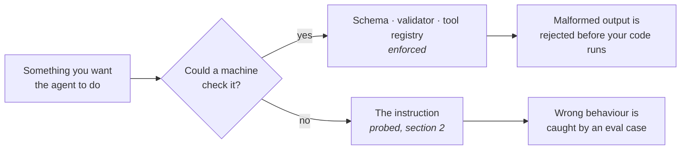

# 1.3 — Protocol does not belong in prose

## One-line answer

An instruction may say **who the agent is and what it must refuse**, but never **what shape its
output must be**, because a shape asked for in prose is a request the model can decline and a shape
declared in a schema is a rule the machinery enforces.

---

## The story

Think about the automated phone menu you get when you call a bank.

*"For balance, press 1. For card services, press 2. To speak to an executive, press 9."*

You press 2. The system does not wonder whether you meant 2. There is no accent to misunderstand, no
background noise, no politeness to interpret. The number arrived as a number, and the only numbers
that can arrive are the ones on the keypad.

Now think about what happens when the same bank tries the other approach: *"Please say what you would
like to do."* You say "card services". Sometimes it hears you. Sometimes it hears "cash services" and
sends you somewhere else. Sometimes a child shouts in the next room and it hears nothing at all.
Sometimes you are being polite, you say "I'd like to ask about my card, please", and the system takes
the last word.

Both menus are trying to get one fact out of you: which of nine branches to take. One of them makes
the fact impossible to get wrong. The other one asks nicely, and then handles the misunderstandings
for the rest of its life.

And here is the part that matters. Nobody at that bank made the voice menu better by writing a longer
greeting. *"Please speak clearly, in English, using one of the following exact phrases, and do not
add any other words"* — that greeting has been tried. It does not work, because it is still asking.

---

## The idea in plain language

An instruction can carry two different kinds of content, and they behave completely differently.

**Persona and policy** is who the agent is, what it does, what it refuses, and how it sounds. This is
what [1.2](1.2-six-sections-of-a-handbook.md) built. It is genuinely soft: there is no machinery that
could enforce "be honest", so writing it down and probing it is the best available tool.

**Protocol** is the *shape* of what comes out: a JSON object with three keys, a line beginning with
`ACTION:`, a priority that must be one of exactly three words. Protocol is not soft. It is a data
format, and data formats have machinery.

The mistake — and it is the single most common mistake in prompt writing — is putting protocol in the
prose section. It looks like it works. The model is good, it follows the format most of the time, and
"most of the time" is exactly the failure mode that survives a demo and dies in production.

You have already lived through this. On [Day 3](../../../day-03-loop-hand-rolled/parts/03-the-protocol/3.1-a-contract-enforced-by-politeness.md)
Sutra's prompt spent a long stretch begging for an `ACTION:` line, and you wrote a parser to pick that
line back out of the text. On [Day 4](../../../day-04-tools-by-hand/parts/01-the-schema/1.1-the-form-that-rejects-itself.md)
you deleted the parser, because **function calling** — the provider feature where you declare a
tool's arguments as a JSON Schema and the model returns a structured call rather than a sentence —
moved the shape out of prose and into machinery. The provider validates it. A malformed call is
rejected before your code ever sees it.

So the rule for today, and it is a boundary you will defend for the next ninety days:

> **If a machine could enforce it, a machine must enforce it. The instruction gets what is left.**

Here is the division, concretely:

| Belongs in the instruction | Belongs in machinery | Where the machinery is |
| --- | --- | --- |
| who you are, and for whom | the argument types of a tool call | JSON Schema (Day 4) |
| the closed list of things you do | which of three words a priority may be | output schema (Day 12) |
| the exact refusal sentence | whether a required field is present | the schema validator |
| what you cannot see | that a number is a number | the schema validator |
| tone, and a length budget | that the reply parses at all | the provider, before your code runs |
| when to reach for a tool | that the tool exists | the tool registry (Day 10) |

Notice the last row. *When* to use a tool is genuinely a judgement call and belongs in prose — the
official ADK guidance says so directly: "Guide Tool Use: Don't just list tools; explain *when* and
*why* the agent should use them" (adk.dev/agents/llm-agents/, checked 2026-08-26). *Whether the tool
exists and what arguments it takes* is not a judgement call, and no sentence about it belongs in the
instruction at all.

---

## Why Sutra needs it

**Day 12** is the payoff and it has a name: structured output. Sutra's triage verdict — the priority
word, the hypothesis, the confidence — becomes a declared schema rather than a paragraph you regex.
Every sentence you *do not* write into today's instruction is a sentence you will not have to delete
on Day 12.

**Day 10** is the nearer one. The moment Sutra has real tools, the temptation returns in a new
costume: writing "always call `search_kb` before answering" into the prose, when what you actually
want is a runtime rule. Prose says it; only code enforces it.

And **Days 79 to 83** cannot grade prose protocol. An eval that asserts "the reply contained a valid
priority" is trivial against a schema and miserable against free text, because the assertion has to
re-implement the parser you were trying to avoid.

---

## The mechanism

Take the difference at its narrowest. Both of these are trying to make Sutra return a priority that
is one of exactly three words.

```python
# WRONG - protocol smuggled into prose. Do not put this in sutra/desk/agent.py.
INSTRUCTION = """# Tone
...
# Output format
Always end your reply with a line of the form:
PRIORITY: <low|normal|high>
Use exactly these three words. Do not add any other text after this line.
Do not use markdown around it. This line is parsed by a program.
"""
```

**Line by line:**

- `# Output format` — the heading itself is the smell. Six sections were named in
  [1.2](1.2-six-sections-of-a-handbook.md), and this is not one of them. A seventh section describing
  a data shape is the signal that a schema is missing somewhere.
- `PRIORITY: <low|normal|high>` — a grammar, written in prose, to be honoured voluntarily. The
  angle-bracket-and-pipe notation is borrowed from documentation for humans, and the model has to
  infer that it means "pick one" rather than "print this literally".
- `Do not add any other text after this line.` — a **negative instruction about formatting**, which
  is the weakest thing a prompt can contain. Every one of these is a rule the model will honour
  perhaps ninety-five times in a hundred, and the five are the ones your parser meets at 11pm.
- `This line is parsed by a program.` — the author knows. That sentence is a confession that the
  shape has a consumer, and a shape with a consumer is a contract. **Contracts do not go in prose.**
- Count the cost: five lines of text, re-sent on every turn forever ([1.5](1.5-every-line-is-a-tax.md)),
  buying a guarantee that is not a guarantee.

The right shape declares the constraint where something can check it:

```python
# RIGHT - the shape is a type, and the instruction never mentions it.
# This is Day 12's mechanism, previewed here only to show the boundary.
from pydantic import BaseModel, Field
from typing import Literal


class Verdict(BaseModel):
    """One triage verdict. The shape is the contract; the prose is the persona."""

    summary: str = Field(description="What the ticket is about, in one sentence.")
    hypothesis: str = Field(description="The likely cause, stated as a guess.")
    priority: Literal["low", "normal", "high"]
```

**Line by line:**

- `from pydantic import BaseModel` — **pydantic** is the data-validation library ADK and the Gemini
  SDK already use to describe shapes. It is not a new dependency; it arrived with `google-adk` on
  Day 5.
- `class Verdict(BaseModel):` — the class **is** the protocol. It is code, so it is diffable, testable
  and importable, and a typo in a field name is a `NameError` rather than a silent behaviour change.
- `summary: str = Field(description=...)` — the description is sent to the model as part of the
  generated schema, so **the explanation lives next to the thing it explains** rather than in a
  paragraph of prose three sections away.
- `priority: Literal["low", "normal", "high"]` — the whole point. `Literal` narrows the type to three
  exact strings. The provider will not return a fourth, and your code cannot receive one. Compare that
  with `Use exactly these three words` above, which was a polite request.
- What is **absent** matters most: there is no sentence anywhere telling the model to produce JSON, to
  avoid markdown, or to put the priority on its own line. Those are the provider's job once a schema
  is declared, and every one of them would be dead weight in the instruction.

The boundary in one picture:



---

## When it breaks

**💥 The brace that ate the instruction.** This one is specific to ADK and it catches everybody who
puts a JSON example into their prose. ADK treats the instruction as a **template** and substitutes
session state into anything in curly braces ([4.1](../04-state-templating/4.1-the-instruction-is-a-template.md)).
So write a format example like this:

```text
# Output format
Reply with: {"priority": "high", "reason": "..."}
```

...and you have written a template variable. In `google-adk` 2.7.1 you get lucky, because
`"priority"` with its quotes is not a valid state key and the renderer leaves it alone. Rename it to
something that *is* a valid identifier and the luck runs out:

```text
KeyError: 'Context variable not found: `priority`.'
```

**The instruction that was supposed to describe a format prevented the agent from starting at all.**
This is not a reason to escape your braces carefully. It is a reason not to have a format section.

**💥 The parser that worked until the model got better.** The subtler one, and the reason this rule
is stated so strongly. A prose protocol works. Your parser handles `PRIORITY: high` and everything is
green for a month. Then the provider ships a model update, the new model is chattier, and it starts
writing `**PRIORITY:** high` because the reply was in markdown and bold felt appropriate. Your parser
returns `None`. Nothing in your repository changed:

```text
AttributeError: 'NoneType' object has no attribute 'group'
```

A schema would not have moved, because the schema is sent with every request and enforced by the
provider. **Prose protocol makes your code depend on a model's stylistic habits**, and those are the
least stable thing about it.

---

## In production

**What a professional writes instead** is a prompt file that contains no data shapes at all, and a
schema module that contains no persona at all, reviewed by different people for different reasons.
The prompt is reviewed for behaviour and policy — often by someone from support or legal. The schema
is reviewed for compatibility, because changing it breaks consumers. Mixing them means every prompt
tweak needs a schema reviewer and every schema change needs a policy reviewer, and in practice that
means neither review happens.

**What degrades at scale is the parser you thought you had deleted.** Prose protocol never fails
loudly enough to be prioritised. It fails at a low rate, so the fix is always a small one: another
regex branch, another `.strip()`, another special case for when the model wraps it in a code fence.
Two years later that function is four hundred lines and is the most-edited file in the repository,
and nobody can delete it because nobody knows which model behaviour each branch is absorbing. **A
schema has no branches.**

**The failure that only shows with real traffic** is multilingual. Your prose says `PRIORITY:` and a
user writes their ticket in Hindi, so the model — reasonably, helpfully — replies in Hindi and
translates the label too. Your parser has never seen the translated word. This is not a rare edge
case in a support product, it is a Tuesday, and it is invisible in any test suite written in one
language. A `Literal["low", "normal", "high"]` is not translatable, which here is a feature.

**The review comment a senior engineer leaves:** *"Delete the output-format section and add an
output schema. If we're parsing it, it's a contract, and contracts don't go in a paragraph the model
is free to reinterpret. Also that JSON example in the prompt is a template variable — check what ADK
does with those braces before this goes anywhere near main."*

**The interview question:** *"how do you get reliable structured output from a language model?"* The
answer that shows you have done it: "I don't ask for it in the prompt. Asking gets you maybe
ninety-five percent, and the missing five percent is a parser that grows a branch every month. I
declare a schema — function calling for tool arguments, an output schema for the final answer — so
the provider constrains generation and rejects anything that doesn't fit before my code sees it. The
prompt then only carries the things no machine could check: who the agent is, what it refuses, how
it sounds. The tell that someone hasn't done this is a prompt with an 'output format' section and a
utility module full of regexes, and those two always appear together."

---

## Check yourself

```bash
uv run python -c "
from sutra.desk.agent import INSTRUCTION
banned = ['JSON', 'format:', 'output format', 'exactly this', 'do not add']
hits = [b for b in banned if b.lower() in INSTRUCTION.lower()]
print('protocol smell:', hits or 'none')
"
```

Anything other than `none` is a sentence to move into a schema or delete. Run the same check against
Day 3's prompt in `sutra/loop.py` and count the hits there — that contrast is the whole lesson.

**Answer out loud, without scrolling up:**

> State the boundary rule in one sentence. Then name the row in the table that is the exception —
> the thing about tools that genuinely does belong in prose — and say why that one cannot be moved
> into a schema.

---

**Next:** [1.4 — Contradictions are randomised behaviour](1.4-contradictions-are-randomised-behaviour.md)
