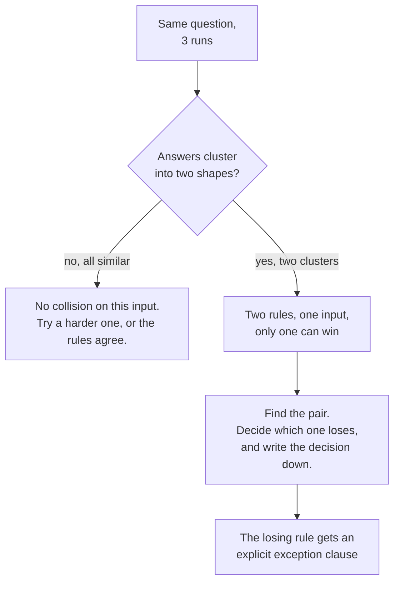

# 1.4 — Contradictions are randomised behaviour

## One-line answer

Two instructions that cannot both be obeyed do not produce a compromise, they produce a **coin
toss** — the model breaks one of them on every turn, and which one it breaks changes from turn to
turn with nothing in your code to explain it.

---

## The story

A small shop has one worker behind the counter and two people who give them orders.

The owner comes in the morning and says: *"We shut at nine sharp. I am not paying the electricity
past nine."*

The manager comes in the evening and says: *"Never send a customer away. If somebody walks in, you
serve them. That is how we keep people."*

Both of those are reasonable. Both were said by somebody with the authority to say it. Neither person
has ever heard the other one say it, because they are never in the shop at the same time.

Now it is five to nine and a customer walks in.

The worker has to break one of the two rules. There is no third option, no clever way to obey both,
and no guidance about which one matters more. So they decide — and what they decide depends on
things nobody wrote down. How tired they are. Whether the customer looks like a regular. Whether the
owner came by yesterday and was annoyed. Some nights the shutter comes down at nine and a customer
is turned away. Some nights the lights are on at half past.

Here is the part that gets missed. The worker is not the problem, and hiring a better worker will not
fix it. Ask them and they will tell you exactly what happened: *"I had two rules, I could only follow
one, so I picked."* The inconsistency was created the moment the second rule was given without
checking it against the first.

---

## The idea in plain language

A language model produces text by picking the next word from a list of candidates with probabilities
attached — that is the sampling you met on
[Day 2, part 4.2](../../../day-02-llm-mechanics/parts/04-sampling-the-dial/4.2-turning-the-dial.md).
When your instruction contains two rules that cannot both hold, you have not created a conflict the
model resolves. You have created a **fork in the probabilities**, and the sampler walks down one
branch or the other.

That is why the word for this is *randomised* and not *unpredictable*. Unpredictable suggests you
could study it and learn the pattern. There is no pattern to learn. The same input can go either way
on two consecutive calls, and running it once and seeing a good answer tells you nothing about the
next one.

Contradictions come in three sizes, and only the first is easy to spot:

**Direct.** "Be concise" and "always explain your full reasoning." Anybody reviewing the prompt would
catch it, so this one is rare in practice.

**Conditional.** Two rules that are compatible almost always, and collide in one case. "At most three
sentences" and "if the ticket mentions data loss, list every step the engineer should take." Fine on
ordinary tickets, contradictory on exactly the tickets that matter most. **The conflict is invisible
until traffic finds it**, which means it lands in production by definition.

**Between a rule and an example.** [Part 1.2](1.2-six-sections-of-a-handbook.md) named this one: the
tone section says three sentences, the worked example shows five. Demonstration outranks description,
so the rule loses. This is the most common of the three and the hardest to see, because the two
halves are in different sections and both look correct on their own.

The fix is not "write more carefully". It is a rule about **editing**:

> **Every new line must be read against every existing line before it is added.** Not the section it
> is going into. All of them.

That sounds heavy, and it is exactly as heavy as the handbook is long, which is one more argument for
keeping the handbook short ([1.5](1.5-every-line-is-a-tax.md)). Six sections can be re-read in one
pass. Three hundred lines cannot, which is why long prompts are contradictory prompts — not because
their authors were careless, but because past a certain size nobody can hold the whole thing in mind
while adding to it.

And one thing to be clear about, because it is the trap: **you cannot detect a contradiction by
reading the output.** The output is always one coherent answer. It obeys one of the two rules
completely and says nothing about the other. It reads like a good answer, because it *is* a good
answer — to a question about which rule wins that you never knew you had asked.

---

## Why Sutra needs it

The section that will do this to Sutra is scope, and the day it happens is **Day 10**. Tools arrive,
the honesty section says "never state a fact no tool result gave you", and somebody adds a helpfulness
line: "if the knowledge base has nothing, suggest the most likely cause anyway." Those are compatible
on paper and contradictory the moment a lookup comes back empty, which is the single most common
outcome of a lookup.

**Days 79 to 83** are where this becomes measurable rather than arguable. A flaky eval case — green
on one run, red on the next, with no code change between — is the diagnostic signature of a
contradiction, and once you know that, an intermittent failure stops being noise and starts being a
pointer at two specific lines. That is a much better position than "the model is unreliable".

**Day 24** puts numbers on the token side of the same argument.

---

## The mechanism

You cannot see a contradiction by reading one answer, so the mechanism is to **run the same input
more than once and compare**. That is the whole technique, and it costs quota, so it is the part of
today you budget for.

Write the pair of rules you suspect, then send one message that forces the collision:

```python
# lab/collision.py - the same question, several times, to the same agent.
# This is the ONLY thing in today's lab that spends real quota. Keep n small:
# the free tier is 20 requests per day (docs/PACKAGES.md, 2026-08-25).
import asyncio
import sys

from sutra.desk.run_once import ask_with
from sutra.desk.agent import root_agent


async def main(question: str, n: int = 3) -> None:
    for attempt in range(1, n + 1):
        answer = await ask_with(root_agent, question)
        sentences = answer.count(".") + answer.count("!") + answer.count("?")
        print(f"--- run {attempt}: {sentences} sentence-ish, {len(answer)} chars")
        print(answer.strip())
        print()


asyncio.run(main(sys.argv[1], int(sys.argv[2]) if len(sys.argv) > 2 else 3))
```

**Line by line:**

- `from sutra.desk.run_once import ask_with` — the helper you wrote on
  [Day 5, part 4.1](../../../day-05-first-adk-agent/parts/04-the-runner/4.1-the-runner-is-your-run-loop.md).
  It takes an agent and a question, builds a fresh runner and session, and returns the final text.
  **A fresh session per attempt is the point**: each run must start from the same blank state, or you
  are measuring the conversation rather than the instruction. It calls `say(..., trace=True)`
  internally, so each run also prints a `[event] Event` line per event — noise here, and the subject
  of Day 7.
- `n: int = 3` — three is the smallest number that can show a split. Two runs that differ prove
  variation; two runs that agree prove nothing. Three gives you a majority to notice.
- `sentences = answer.count(".") + ...` — a crude sentence count, deliberately crude. You are not
  grading prose here, you are looking for one run at three sentences and another at nine. **A
  contradiction shows up as a distribution, so the measurement only has to be good enough to see two
  clusters.**
- `print(f"--- run {attempt}: ...")` — the counts on their own line, so you can scan the runs without
  reading them. Reading all three carefully is how you talk yourself into believing they are the same.
- `sys.argv[1]` — the question comes from the command line, because you will run this against several
  different collision candidates and editing the file each time invites you to change two things at
  once.
- The script deliberately has **no retry and no 429 handling**, and that is a decision rather than an
  omission: this is a lab script under `days/`, it is run by hand, and a 429 here should stop you and
  make you wait rather than quietly burning three more of the day's twenty requests. Anything under
  `sutra/` follows the standing rule and handles 429 with backoff.

Run it against the collision you are hunting:

```bash
uv run python days/day-06-instructions-and-personas/lab/collision.py \
  "Ticket says customers are losing saved drafts on logout. 40 users. Triage it." 3
```

**Line by line:**

- The question mentions **data loss**, which is the case that pulls the length budget and a
  thoroughness rule apart. A generic question would not collide, and you would conclude wrongly that
  the prompt is fine.
- `3` — the run count, passed explicitly so the quota cost of the command is visible in the command
  itself. Three requests out of twenty for the day.
- The backslash is a line continuation in Git Bash, which is this project's shell (`days/README.md`
  has the PowerShell equivalent).

What you are looking for:



The resolution is never "delete one rule". It is **write the precedence into the rule itself**, so the
model is not deciding:

```python
# The tone rule, with the collision resolved in the text rather than by the sampler.
"""# Tone
Plain words, no filler, at most three sentences unless asked for detail.
Exception: if the ticket involves data loss, security or money, length
does not matter. Completeness wins.
"""
```

**Line by line:**

- `Exception:` — naming it as an exception rather than rewriting the rule keeps the common case cheap
  to read and makes the rare case explicit. The model is no longer choosing between two rules; it is
  applying one rule that has a stated branch.
- `data loss, security or money` — three concrete triggers, not "important tickets". **A precedence
  clause with a vague trigger is a new contradiction**, because now the model decides what counts as
  important.
- `Completeness wins.` — the tie-break said out loud, in two words. This is the sentence that used to
  be a coin toss.

---

## When it breaks

**💥 The eval that went red on a Tuesday.** There is no exception text and no traceback for this
failure, which is exactly what makes it expensive. What you see is a test suite that behaves like
this:

```text
$ uv run python -m pytest tests/test_persona.py -q
.F..                                                             [100%]
FAILED tests/test_persona.py::test_reply_is_at_most_three_sentences

$ uv run python -m pytest tests/test_persona.py -q
....                                                             [100%]
```

Same commit. Same input. Different result. The instinct is to call the test flaky and add a retry, and
that instinct is the bug: **the retry does not fix the agent, it hides the measurement that was
working.** A test that goes red one run in three against a fixed prompt is reporting a real property
of that prompt.

**💥 The rule somebody added after an incident.** The most common way a contradiction enters a
codebase, and it always looks like diligence. A customer got a wrong answer, so a line goes in:
"always double-check your reasoning before answering and explain the check." Nobody removed the
length budget, because nobody was looking at the length budget — they were looking at the incident.
The prompt now has two rules that collide on every non-trivial ticket, and the next month's complaint
is that the agent has become verbose. Those two tickets are never connected to each other.

**💥 The contradiction with a rule you did not write.** The one people forget: your instruction is not
the only thing shaping the reply. The model has its own trained-in defaults — it is inclined to be
helpful, to hedge, to offer follow-up help. Write "never end with a follow-up question" and you are in
a contradiction with something you cannot read or edit, and which was not put there by anyone on your
team. You will win most of the time and lose some of the time, and there is no line to delete.
[The paper part](../../papers/01-instructgpt.md) is about where those defaults came from.

---

## In production

**What a professional writes instead** is a prompt with an explicit precedence order, usually stated
once near the top: *"Where these rules conflict: honesty first, then scope, then tone."* Three words
of ordering remove an entire class of coin tosses, and they cost almost nothing per turn. It is the
cheapest line in the whole handbook and it is missing from nearly every prompt in the wild.

**What degrades at scale is the review.** With four sections a reviewer genuinely does re-read the
whole prompt when a line is added. With forty, they read the diff. Reading the diff is precisely the
thing that cannot catch a contradiction, because a contradiction is a relationship between the new
line and a line that is not in the diff. This is a structural property of the process, not a comment
about the reviewer, and the teams that handle it well do one of two things: they keep the prompt small
enough to re-read, or they write a conflict test per rule so the collision fails in CI instead of in
review.

**The failure that only shows with real traffic** is the conditional contradiction, and it shows up
first as a customer-facing inconsistency rather than as an error. Two users ask nearly the same
question and get answers of very different shape — one gets a three-line reply, the other gets a
detailed walk-through. Support escalates it as "the agent is inconsistent", product reads that as a
quality problem, and somebody proposes a larger model. The actual fix is two lines of text and a
precedence clause. **Nothing about the symptom points at the cause**, which is why knowing this
failure mode by name is worth more than it looks.

**The review comment a senior engineer leaves:** *"This new rule and the tone budget can't both hold
on a data-loss ticket. Pick a winner and write it into the rule as an exception, or we'll ship a
coin toss and find out from support in three weeks. And add the case to the evalset — if it's worth a
rule it's worth a probe."*

**The interview question:** *"your agent gives different-quality answers to the same question. Where
do you look?"* The answer that shows you have done it: "First I check whether it's actually the same
question and the same starting state, because a stale session explains most of these. If it is, I run
the input several times and look at whether the answers fall into two clusters rather than scattering
— a spread is sampling, two clusters is a fork. Two clusters means my prompt has two rules that can't
both hold on that input, and the model is picking one per turn. The fix is to write the precedence
into the text so I'm making the decision instead of the sampler. I'd also say what I *don't* do: I
don't lower the temperature to make it go away. That makes the coin land the same way more often and
leaves the contradiction in place, so it comes back the day the model version changes."

---

## Check yourself

```bash
uv run python -c "
from sutra.desk.agent import INSTRUCTION
import re
rules = [l.strip() for l in INSTRUCTION.splitlines() if l.strip() and not l.startswith('#')]
print(len(rules), 'rule lines to check pairwise')
print(len(rules) * (len(rules) - 1) // 2, 'pairs')
"
```

That second number is the size of the job every time you add a line. Watch what it does when the
handbook doubles — that growth is why [1.5](1.5-every-line-is-a-tax.md) is about deletion.

**Answer out loud, without scrolling up:**

> Why does a contradiction produce a coin toss rather than a compromise? Then name the three sizes of
> contradiction, say which one is guaranteed to reach production, and say why lowering the temperature
> is the wrong fix.

---

**Next:** [1.5 — Every line is a tax](1.5-every-line-is-a-tax.md)
