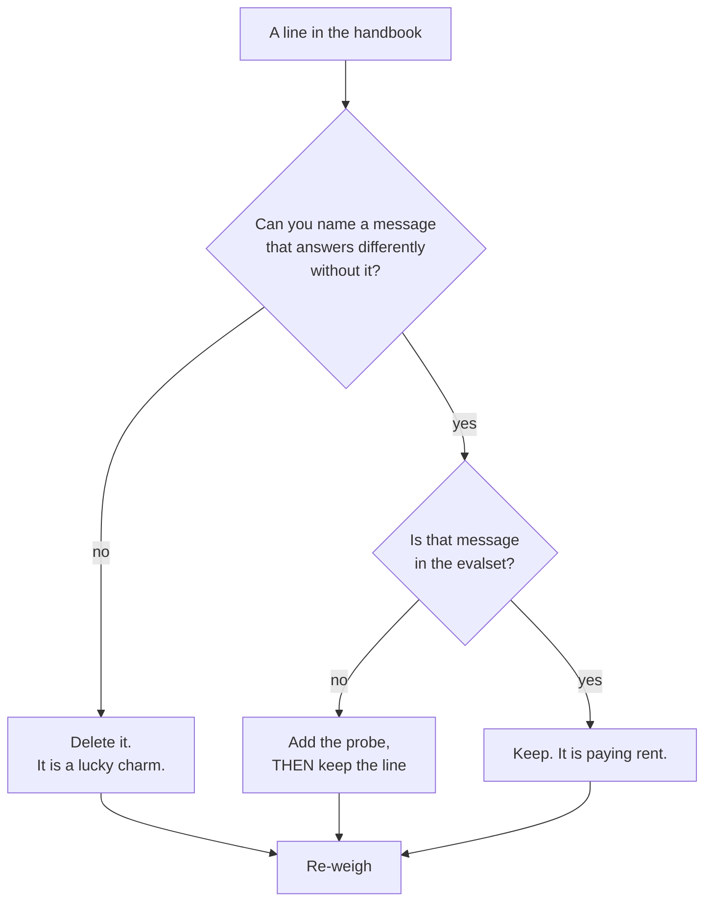

# 1.5 — Every line is a tax

## One-line answer

The instruction is re-sent in full on **every single turn**, so a line is not a one-off cost but a
standing charge — and the only line that is worth paying for forever is one whose absence would
change an answer.

---

## The story

Think about the bag you carry to work every day.

There is a small umbrella in there. You put it in during the monsoon, three years ago, and it made
complete sense that week. There is a charging cable for a phone you no longer own. There is a
half-used notebook, a spare set of keys to a house you have moved out of, and a folder of papers
somebody once asked you to keep safe.

None of those things is heavy. That is exactly the problem. If any single item were heavy you would
have taken it out. Each one weighs almost nothing, so each one survives every time you glance into
the bag.

But you do not carry the bag once. You carry it down the stairs, on to the bus, up three flights at
the office, back down at six, and home again. Every day. The cost of the cable is not the cable. It is
the cable multiplied by every journey you will ever make with that bag.

And there is a second cost, quieter than the weight. When you actually need something — the pen, in a
hurry, at a counter, with somebody waiting — you have to go past all of it to find the pen. The junk
does not just weigh; it gets in the way of the thing that matters.

Nobody ever decides to carry a dead charging cable for three years. What happens is that nobody ever
decides to take it out.

---

## The idea in plain language

A **token** is the unit a language model reads and writes in: roughly a short word or a piece of one.
[Day 2, part 2.1](../../../day-02-llm-mechanics/parts/02-tokens-the-meter/2.1-what-a-token-is.md)
introduced them, and
[part 2.2](../../../day-02-llm-mechanics/parts/02-tokens-the-meter/2.2-reading-the-receipt.md) showed
you where to read the count off a real response.

The model has no memory between turns. You met that on
[Day 3, part 6.1](../../../day-03-loop-hand-rolled/parts/06-failure-lab/6.1-the-goldfish-loop.md) as
the goldfish problem: every request has to carry everything the model needs to know, because the last
request taught it nothing. The instruction is part of "everything". So:

> **The instruction is not sent once at the start of a conversation. It is sent again, in full, with
> every message.**

That single fact is the whole part. A ten-line instruction in a twenty-turn conversation is not ten
lines of cost. It is two hundred. Add a line to the handbook and you have not spent forty tokens, you
have committed to spending forty tokens per turn, for every user, for as long as that line lives — and
lines live a long time.

There are three separate costs, and the one people think of first is the least interesting:

**Quota.** The obvious one. On this project the free tier is 20 requests per day
(`docs/PACKAGES.md`, 2026-08-25), and the limit is on *requests*, so a longer instruction does not use
up your day faster. On a paid tier the input tokens are billed, and a bloated system prompt is a
line item somebody eventually asks about.

**Context.** The model has a fixed **context window** — the total amount of text it can consider at
once. Every token the instruction occupies is a token unavailable to the conversation. Today Sutra's
handbook is short and the window is large, so this is theoretical. On Day 19, when Sutra starts
carrying retrieved documents and a long ticket history, the handbook and the evidence are competing
for the same space, and the handbook wins by default because it is sent first.

**Attention.** The one that actually bites, and the reason "it's only a few tokens" is the wrong
defence. A rule that matters has to be found among the rules that do not. Instructions in the middle
of a long block get followed less reliably than instructions at the start or the end — this is a
well-documented property of long prompts, not a quirk of one model. So **a lucky charm does not
merely cost tokens, it dilutes the rules you actually need.** Twelve lines of hopeful text around
your one real safety rule makes that safety rule weaker.

Put those together with [1.1](1.1-handbook-not-a-wish.md)'s test and you get the deletion rule:

> **A line stays only if you can name the message that would answer differently without it. Every
> other line is being carried, every turn, forever, and is crowding out the ones that work.**

The hard part of prompt engineering is not writing. It is deletion, and deletion is hard for a reason
worth naming: **you cannot safely delete a line that has no probe.** If nothing tests it, removing it
might change behaviour and you would not find out. So an untestable line is not just useless, it is
*permanent*. That is the sentence to remember from this whole section.

---

## Why Sutra needs it

**Day 24** is the day this stops being an argument and becomes a number: token economics, measured
across a real run, with the system prompt broken out as its own line item. Today's handbook is the
thing that gets measured, so today is when you decide whether it is worth measuring.

**Day 19** is where the context cost lands. Retrieved passages arrive, and every token of standing
instruction is a token of evidence that did not fit.

And **Phase 8**, from Day 53, multiplies everything. A multi-agent system does not have one
instruction, it has one per agent, each re-sent on each of its own turns, and an orchestrator that
adds its own on top. A habit of trimming that looks pedantic today is the difference between a system
that fits and one that does not.

---

## The mechanism

The instruction is text, so you can weigh it. Do it with the real tokeniser, not by counting words —
`count_tokens` is a **metadata call**, not inference, so it costs no request quota.

```python
# lab/weigh.py - what the handbook costs, per turn and per conversation.
# Uses count_tokens, which is metadata: no generation, no quota spent (Day 2, part 2.2).
from google import genai

from sutra.config import load_env
from sutra.desk.agent import INSTRUCTION

MODEL = "gemini-3.7-flash"  # the pin from Day 5; docs/PACKAGES.md carries the date


def main() -> None:
    load_env()
    client = genai.Client()
    total = client.models.count_tokens(model=MODEL, contents=INSTRUCTION).total_tokens
    print(f"whole handbook: {total} tokens per turn")

    for section in INSTRUCTION.split("\n# "):
        head = section.splitlines()[0].lstrip("# ").strip()
        cost = client.models.count_tokens(model=MODEL, contents=section).total_tokens
        print(f"  {cost:>5}  {head}  ->  {cost * 20:>6} over a 20-turn conversation")


main()
```

**Line by line:**

- `from google import genai` — the raw SDK from Day 2, not ADK. Counting tokens is a property of the
  text and the model, and reaching for the framework here would add nothing.
- `client.models.count_tokens(...)` — **metadata, not generation**. It returns a count without
  producing any output, so it does not consume the day's 20 requests. This is the same distinction
  Day 5 part 3.2 drew about `models.list()`: not everything that touches the network is inference.
- `.total_tokens` — the field name, taken from the response object rather than assumed. Print the
  whole response once if you want to see what else is on it.
- `INSTRUCTION.split("\n# ")` — splits on the Markdown headings from
  [1.2](1.2-six-sections-of-a-handbook.md), so the six sections are weighed separately. This is why
  the structure was worth having: **a handbook with named sections is a handbook you can cost by
  section.**
- `cost * 20` — the standing charge made visible. Twenty turns is an ordinary support conversation,
  and this column is the one that changes people's minds. A section that costs 60 tokens costs 1,200
  across one conversation, and it will have thousands of conversations.
- `load_env()` — Day 1's loader, because `count_tokens` still needs a key. `require_free_tier()` is
  deliberately **not** called here: this script makes no generation call, so the Vertex door check
  that guards billing has nothing to guard. That is a judgement, and the safe habit is to call it
  anyway if you are unsure.

Then run it and read the last column, not the first:

```bash
uv run python days/day-06-instructions-and-personas/lab/weigh.py
```

**Line by line:**

- No arguments: the script reads `INSTRUCTION` straight from `sutra.desk.agent`, so what it weighs is
  what the agent actually ships. Weighing a copy pasted into the script would be weighing your
  intentions.
- Costs **zero** of the day's 20 requests, which is why it is safe to re-run after every edit. Make
  that a habit: edit the handbook, re-weigh, and watch whether a "small clarification" was small.

The decision procedure for each line, once you can see its price:



---

## When it breaks

**💥 The context window that filled up.** Today the handbook is small and nothing goes wrong. The
error arrives on a later day, when the instruction has grown and the conversation carries retrieved
text, and it looks like this:

```text
google.genai.errors.ClientError: 400 INVALID_ARGUMENT. {'error': {'code': 400,
'message': 'The input token count (1084237) exceeds the maximum number of tokens
allowed (1048576).', 'status': 'INVALID_ARGUMENT'}}
```

Read the two numbers. Nothing in that message says *which* part of the input was worth keeping, and
your standing instruction is inside the first number whether it earned its place or not. The fix
people reach for is truncating the conversation — throwing away what the user actually said — while
the handbook, which nobody has audited in a year, is preserved in full because it is sent first.

**💥 The rule that got lost in the middle.** No error text at all, which is why it is worse. The
safety rule is on line 41 of a 60-line prompt, and it is followed most of the time. Move the same rule
to the top and it is followed noticeably more often. **Nothing in your code changed and nothing failed
loudly** — the behaviour simply degraded as the prompt grew around it, one well-meaning addition at a
time. This is the concrete mechanism behind "a longer prompt is not a stricter prompt".

**💥 The clarification that cost more than the bug.** A user misreads one answer, so someone adds a
paragraph explaining the distinction. It works: that user's case is now handled. The paragraph is 90
tokens, it is sent on every turn of every conversation forever, and it addresses a case that occurs in
roughly one conversation in five hundred. **Nobody computes that ratio, because the paragraph was
free to write.** The weigh script above exists to make the ratio visible before the paragraph lands,
not after.

---

## In production

**What a professional writes instead** is a prompt with a dated comment against any line that is not
self-evidently load-bearing: which incident it came from, and which eval case covers it. That comment
is not documentation, it is **permission to delete**. When somebody a year later asks whether line 34
still matters, the answer is a probe they can run rather than an archaeology exercise, and lines start
being removable for the first time.

**What degrades at scale is that instructions only ever grow.** There is a standing incentive to add —
an incident, a complaint, an edge case, and adding a line is the cheapest visible response available.
There is no incentive at all to remove, because removal risks regression and earns nobody credit. Left
alone this is monotonic, and it ends in a prompt nobody understands. The teams that hold the line put
deletion in the process: the prompt has an owner, it is reviewed on a schedule, and every review asks
which lines have no probe. **Any process where addition is easy and deletion is nobody's job produces
the same artifact eventually.**

**The failure that only shows with real traffic** is the interaction between length and the long
conversation. Your prompt is fine on turn one and fine in every test, because tests are one turn. In
production a user goes back and forth twenty times, the conversation grows, the model has more to
attend to on every turn, and adherence to the middle of the instruction quietly falls off. The symptom
is "the agent forgets its rules in long conversations", reported by users and unreproducible by
engineers, because reproducing it requires a long conversation rather than a hard question.

**The review comment a senior engineer leaves:** *"This adds 90 tokens to every turn for a case I
can't find in the evalset. If it's real, add the probe and I'll approve both. If it isn't, we're
paying for it forever and diluting the rules above it. Also move the safety line to the top of the
prompt while you're in here — it's currently line 41 of 60."*

**The interview question:** *"how do you decide what goes into a system prompt?"* The answer that shows
you have done it: "I treat it as a standing charge rather than a one-off, because it's re-sent in full
on every turn — so the unit isn't tokens, it's tokens times every turn the product will ever serve.
The test for keeping a line is whether I can name the message that would answer differently without
it, and if I can, that message goes in the evalset. That second half matters more than it sounds: a
line with no probe can never be safely deleted, so an untestable line is a permanent line. The cost
people miss isn't the quota, it's attention — rules in the middle of a long prompt get followed less
reliably, so twelve lines of hopeful text around your one real safety rule actively weakens the safety
rule. Most of the prompt work I've done that mattered was deletion."

---

## Check yourself

```bash
uv run python days/day-06-instructions-and-personas/lab/weigh.py
```

Take the most expensive section and try to name the message that would answer differently without it.
Then do the same for the cheapest. One of the two will surprise you, and the surprise is the point:
**price and value are unrelated here**, which is why you have to check both.

**Answer out loud, without scrolling up:**

> Name the three costs of a line, and say which one is the reason "it's only a few tokens" is a bad
> defence. Then say why a line with no probe is not merely useless but permanent.

---

**Next:** [2.1 — A line you cannot probe](../02-testing-a-persona/2.1-a-line-you-cannot-probe.md)
