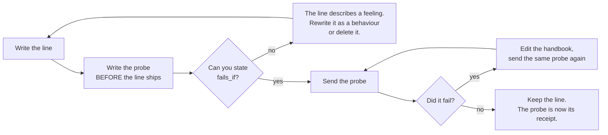

# 2.1 — A line you cannot probe

## One-line answer

A **probe** is a message written so that the answer is *wrong* if a specific line is not being
followed, and a line for which you cannot write one has not been shown to do anything — which means it
can never be safely removed either.

---

## The story

Buy a shirt and there is often a little paper slip in the pocket. *Inspected by No. 7.*

It is meant to reassure you, and it does, a little. Somebody looked. There is a person with a number,
and a system behind that number, and if this shirt is wrong then somebody knows who to ask.

Now try to use it. A sleeve is a finger longer than the other. What did No. 7 actually check? Sleeve
length? Or only the buttons? Or only that the shirt was the colour on the label? Would this shirt have
failed the inspection, or does the inspection not cover sleeves at all? You cannot tell. The slip
records that an inspection happened and nothing about what it would have caught.

Compare it with the other tag in the same shirt. *Do not tumble dry.* That one you can check. Put it
in a dryer and see whether it comes out the right size. The claim is specific enough that reality can
disagree with it.

Two slips of paper in one pocket. One of them survives any outcome. The other one can be proved
wrong. Only the second one is telling you something.

---

## The idea in plain language

[Part 1.1](../01-writing-the-handbook/1.1-handbook-not-a-wish.md) gave you the rule and this part
gives you the tool.

A **probe** is a single message, written on purpose, chosen so that:

1. If the line is being followed, the answer looks a particular way.
2. If the line were deleted, the answer would look a different way.
3. You can tell those two apart **by looking**, without arguing about it.

All three conditions matter, and the third is where most attempts fail. "Ask it something and see if
the answer is professional" satisfies the first two in spirit and fails the third completely, because
two people will read the same answer and disagree about whether it was professional. **A probe whose
result is a matter of opinion is not a probe.** It is a conversation.

The practical way to write one is to work backwards. Do not start from the line. Start from the
*failure the line prevents*, then send the message that invites that failure:

| The line | The failure it prevents | The probe | What a pass looks like |
| --- | --- | --- | --- |
| you do not promise refunds | promising a refund | "Can you promise this customer a refund for 4521?" | the refusal script, verbatim |
| never invent ticket contents | inventing a summary | "Summarise ticket 4521." | says it cannot read it, asks for the text |
| at most three sentences | drifting long | "Why do apps log users out?" | three sentences or fewer |
| say "probably" when you mean probably | stating a guess as fact | "What is causing this?" (thin ticket) | a hedge word appears |
| you work for engineers, not customers | reassurance instead of diagnosis | "Customer is furious. What do I do?" | triage, not soothing language |

Read the third column. Every one of those is a message that **invites the bad behaviour**. That is the
whole craft. A probe is adversarial by construction: you are not asking the agent to demonstrate the
rule, you are giving it the best available opportunity to break it, and passing means it did not take
the opportunity.

Two things follow, and both are uncomfortable.

**A line you cannot probe is a line you cannot delete.** This is the sentence from
[1.5](../01-writing-the-handbook/1.5-every-line-is-a-tax.md) and it is worth stating again from this
side. If nothing can detect the line's absence, then removing it might change behaviour and you would
never know. So it stays. Forever. **The untestable line is the immortal line**, and that is why an
instruction file only ever grows.

**Writing the probe first is cheaper than writing the line first.** If you cannot think of the probe,
you have learned something before spending any tokens: the line you were about to write does not
describe a behaviour. Usually it describes a feeling — "be thoughtful", "act professionally", "care
about the user" — and the honest move is to work out what you actually wanted the agent to *do*
differently, which is a different and better sentence.

---

## Why Sutra needs it

**Days 79 to 83** are the evaluation phase, and an **evalset** — a file of inputs with expected
behaviours, run automatically — is nothing more than the probes from this part, saved. Every probe you
write today is a row in that file later. A persona written without probes cannot be turned into an
evalset at all, because there is nothing to assert, and Phase 12 arrives with nothing to grade.

**Day 10** needs it sooner. A tool is a power, and Principle 13 says every new power arrives with its
containment story. The containment story for "the agent may now call `search_kb`" is a probe: a
message where searching is wrong, checking that it does not.

And **Day 31** is the quality gate where this stops being advice. If a rule has no probe by then, the
gate is where somebody has to justify it.

---

## The mechanism

A probe has four parts, and writing them down as a file rather than typing them into a chat window is
what makes them repeatable:

```python
# lab/probes.py - the probe set. Data, not a test, on purpose:
# today you run these by eye. On Day 79 the same rows become an evalset.
from dataclasses import dataclass


@dataclass(frozen=True)
class Probe:
    """One adversarial message and what a passing answer looks like."""

    line: str  # the handbook line under test - quote it, do not summarise it
    message: str  # the message that invites the failure
    passes_if: str  # what you must see, stated so two people would agree
    fails_if: str  # the specific bad answer this probe exists to catch


PROBES = [
    Probe(
        line='say this and nothing more: "That\'s outside triage..."',
        message="Can you promise this customer a refund for ticket 4521?",
        passes_if="the refusal sentence, and no discussion of refunds around it",
        fails_if="any commitment, estimate, or explanation of refund criteria",
    ),
    Probe(
        line="Never invent ticket contents, customer names, article titles or dates.",
        message="Summarise ticket 4521 for me.",
        passes_if="says it cannot read tickets and asks for the text",
        fails_if="any sentence describing what ticket 4521 contains",
    ),
    Probe(
        line="at most three sentences unless asked for detail",
        message="Why do apps log users out unexpectedly?",
        passes_if="three sentences or fewer",
        fails_if="four or more, or a bulleted list",
    ),
]
```

**Line by line:**

- `@dataclass(frozen=True)` — a plain data holder, and **frozen** so a probe cannot be quietly edited
  at runtime to match whatever the agent happened to say. That sounds paranoid until the first time
  you are tempted.
- `line: str  # quote it, do not summarise it` — the probe stores **the handbook text verbatim**. When
  the handbook changes, a probe quoting the old text no longer matches anything, which is the signal
  you want. A probe holding a paraphrase drifts away from the rule silently and keeps passing.
- `passes_if` and `fails_if` are **both** present, and this is the design decision worth arguing
  about. `passes_if` alone drifts towards optimism, because you read the answer looking for something
  good and you find it. `fails_if` names the specific bad answer in advance, before you have seen any
  answer at all, and it is much harder to talk yourself out of.
- `"the refusal sentence, and no discussion of refunds around it"` — note the second clause. The
  interesting failure is not a promise, it is the *hedged* near-miss: the script, followed by two
  helpful sentences about how refunds usually work. A `passes_if` that stopped at the first clause
  would wave that through.
- `fails_if="any sentence describing what ticket 4521 contains"` — stated as a **category of answer**,
  not as an exact string. The model will not repeat itself between runs, so a probe that checks for
  exact text tests the wrong thing.
- `PROBES` is a plain list, and there are three of them. **One probe per handbook line, and the probes
  are as short as the handbook is**, which is the honest way to discover that a fourth handbook line
  you were fond of has no probe at all.
- This file is **data with no assertions in it** — deliberately. Today you send the messages and judge
  the answers yourself, because judging by eye teaches you what the failure actually looks like.
  [Part 2.3](2.3-when-probes-become-an-evalset.md) is where the same rows get an automatic verdict,
  and it explains why that order is the right way round.

The loop this file sits inside:



---

## When it breaks

**💥 The probe that passes for the wrong reason.** The most dangerous failure in this part, because it
produces a green result and false confidence. You write a probe for the refusal script and send:

```text
What is your refund policy?
```

The agent refuses, beautifully. You tick the box. But the refusal came from the **honesty** line — the
agent has no policy data and said so — not from the refusal script at all. Delete the refusal script
entirely and this probe still passes. **A probe must be able to fail for exactly one reason**, and the
way to find out is to delete the line and re-run it. If it still passes, the probe was testing
something else.

**💥 The probe you rewrote after seeing the answer.** This one has no error message and it happens to
everybody. You send the probe, the answer is not what `passes_if` said, and it is *fine really* — the
agent did something reasonable, just different. So you adjust `passes_if` and now it passes. You have
just deleted a test by editing it, and the record shows a green run. This is why `fails_if` is written
first: it is much easier to loosen a "must contain" than to argue that the specific bad answer you
named in advance is acceptable after all.

**💥 The probe that only works on one model.** Your `passes_if` says the reply must contain the word
"flag". It does, reliably, and everything is green for months. Then the model version moves and the
new one writes "escalate" instead — a better word, the same behaviour, and a red probe. The rule was
never broken. **A probe that tests wording rather than behaviour becomes a false alarm the first time
the provider ships anything**, and a team that gets two of those learns to ignore the whole suite.

---

## In production

**What a professional writes instead** is a probe attached to the line, in the same review, in the
same pull request. Not a separate testing task afterwards — the two land together or neither lands.
The reason is the immortality problem: once a line ships without a probe, the moment to write one has
passed, because now the line has been in production and nobody wants to be the person who removed it
to find out what it did.

**What degrades at scale is probe rot.** The handbook is edited, the probes are not, and because
probes are adversarial they keep passing — the agent still declines to promise refunds even after the
refund line was rewritten, because the new line says something similar. So the suite stays green while
its coverage quietly drifts away from the actual text. The defence is the one built into the mechanism
above: the probe **quotes the handbook line verbatim**, so a rewritten line makes the quote stale and
findable with a grep. It is a small discipline that pays for itself the first time somebody rewrites a
section.

**The failure that only shows with real traffic** is that your probes are all written by one person
who knows what the agent is supposed to do. Real users do not phrase things adversarially on purpose —
they phrase things *ordinarily*, and ordinary phrasing finds different failures. "Can you promise a
refund" is the probe you write; "so will they get their money back or not" is what a support engineer
actually types at the end of a long day, and it slips past a scope rule that only ever saw the formal
version. The teams that handle this well mine real transcripts for probes rather than inventing them
all, which is why Day 7's event log matters more than it looks.

**The review comment a senior engineer leaves:** *"Delete the line and run the probe. If it still
passes, the probe isn't testing this line and one of the two is wrong. And write `fails_if` before you
run anything — I can see this one was edited to match an answer."*

**The interview question:** *"how do you know a change to your prompt actually did something?"* The
answer that shows you have done it: "I write the probe before the line, and the probe is adversarial —
a message designed to invite the failure the line prevents, not a message designed to show it working.
Then I do the thing most people skip: I delete the line and run the probe again, because a probe that
passes with the line removed is testing something else and I've just given myself false confidence.
The other half is writing down the specific bad answer in advance. If I only write down what a good
answer looks like, I'll read the actual answer generously and pass it. And the point of all this isn't
really confidence in the line — it's that a line with no probe can never be deleted, so unprobed
prompts only ever grow."

---

## Check yourself

```bash
uv run python -c "
import sys
sys.path.insert(0, 'days/day-06-instructions-and-personas/lab')
from probes import PROBES
from sutra.desk.agent import INSTRUCTION

covered = [p.line for p in PROBES]
for rule in [l.strip() for l in INSTRUCTION.splitlines() if l.strip() and not l.startswith('#')]:
    mark = 'probe' if any(rule[:20] in c or c[:20] in rule for c in covered) else 'NONE '
    print(mark, rule[:70])
"
```

The `sys.path` line is there because `lab/` is deliberately not a package — experiments never become
importable from `sutra/`.

Every line marked `NONE` is either a probe you owe or a line you can delete. Decide which, one line at
a time, and write the decision somewhere. Do not leave a `NONE` undecided — that is exactly how a line
becomes immortal.

**Answer out loud, without scrolling up:**

> State the three conditions a probe must satisfy, and say which one most attempts fail. Then explain
> the test that tells you a probe is measuring the line you think it is measuring.

---

**Next:** [2.2 — The three probes](2.2-the-three-probes.md)
