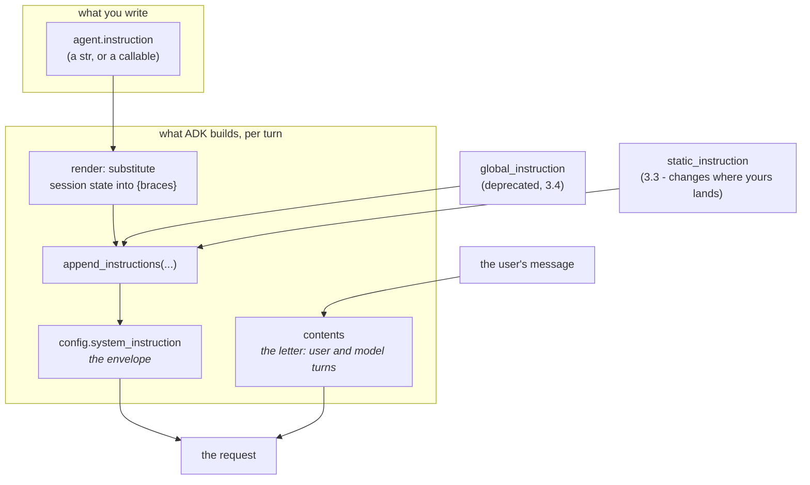

# 3.1 — Where your instruction lands

## One-line answer

The string you put in `instruction` does not reach the model as your message — ADK renders it, then
**appends** it to a dedicated `system_instruction` slot in the request, which is a different channel
from the conversation and can already contain text you did not write.

---

## The story

Post a letter and you write in two places, and they are not the same place.

On the outside of the envelope goes the address. That is not part of your letter. Nobody at the other
end reads it as something you said. It is instructions for the postal system: which sorting office,
which route, which door. If you write it wrongly the letter does not arrive, and the person you were
writing to never finds out you wrote at all.

Inside goes the letter. That is the thing you actually wanted to say.

Now think about what happens when somebody mixes them up. Write "please handle this urgently" on the
envelope and no postman treats it as urgent — the envelope is read by machines that are looking for a
pincode. Write your friend's address in the middle of the letter and it gets delivered nowhere; your
friend, if the letter ever reaches them, reads it as a strange thing to include.

Same paper, same pen, same person writing. Two channels, with different readers and different rules,
and putting your words in the wrong one does not produce an error. It produces silence.

---

## The idea in plain language

On [Day 5, part 2.3](../../../day-05-first-adk-agent/parts/02-the-agent-object/2.3-the-instruction-is-your-system-prompt.md)
you learned that `instruction` is the system prompt: text addressed to the model, telling it how to
behave, sent on every turn. That part answered *what the field is*. This one answers *where it goes*,
and the answer has three surprises in it.

A request to a Gemini-family model has two distinct places text can sit:

- **`contents`** — the conversation. A list of turns, each with a role (`user` or `model`). This is
  the letter.
- **`config.system_instruction`** — a separate slot, outside the conversation, that the provider
  treats as standing guidance rather than as something somebody said. This is the envelope.

`instruction` goes in the second one. That is surprise number one for anybody coming from a raw SDK
habit of prepending the system prompt to the first user message: it is genuinely a different field,
and the provider treats it differently.

**Surprise two: it is rendered before it is sent.** Your string is not shipped verbatim. ADK runs it
through a template step that substitutes session state into anything in curly braces
([section 4](../04-state-templating/4.1-the-instruction-is-a-template.md) is entirely about this). So
what the model receives can differ from what is in your source file, and on a bad day it can fail to
be produced at all.

**Surprise three, and the one that matters most: it is *appended*, not assigned.** The ADK function
that builds this is called `append_instructions`, and the name is honest. `system_instruction` is a
slot that several things can write into, one after another, joined together. Your agent's
`instruction` is one contributor. A deprecated `global_instruction` on the root agent is another
([3.4](3.4-the-deprecated-global-instruction.md)). A plugin can be another. A `static_instruction`
changes the picture completely ([3.3](3.3-the-static-instruction-that-moves-yours.md)).

Which gives the rule this section runs on:

> **What you wrote is not what the model got. Render it and look, before you spend a request arguing
> with behaviour you cannot see.**

That is not a slogan, it is a command you can run, and it costs nothing. The step that builds the
request runs entirely on your machine — no network, no key needed, no quota. This is the single most
useful habit in the whole day, and it is why part 1.1's little script keeps coming back.

---

## Why Sutra needs it

**Day 7** is tomorrow, and it reads events: the structured records of what happened in a turn. The
request that produced those events is assembled by exactly the step you are about to run by hand.
Knowing where the instruction sits in it makes an event log readable rather than a wall of fields.

**Day 11** brings tool context and state in tools, and **Day 17** brings session state properly. Both
of them write into the same rendering step you are looking at here, so an instruction that renders
correctly today can start failing on a day when nothing about the instruction changed.

The blunt one is **every debugging session from here to Day 96**. When an agent behaves oddly, there
are exactly two possibilities: the model did something surprising with the request, or the request was
not what you thought. **The second is far more common, and it is free to rule out.** Engineers who do
not know that spend requests guessing.

---

## The mechanism

ADK builds the request through a chain of processors, and one of them handles instructions. Call it
yourself:

```python
# days/day-06-instructions-and-personas/lab/show_instruction.py
# What the model is actually given. No runner, no turn, no model call, no quota.
import asyncio

from google.adk.agents.invocation_context import InvocationContext
from google.adk.flows.llm_flows.instructions import _build_instructions
from google.adk.models.llm_request import LlmRequest
from google.adk.sessions import InMemorySessionService

from sutra.desk.agent import root_agent


async def main() -> None:
    service = InMemorySessionService()
    session = await service.create_session(app_name="sutra", user_id="local")
    context = InvocationContext(
        session_service=service,
        invocation_id="probe",
        agent=root_agent,
        session=session,
    )
    request = LlmRequest()
    await _build_instructions(context, request)

    print("=== config.system_instruction ===")
    print(request.config.system_instruction)
    print("=== contents (the conversation) ===")
    print(request.contents)


asyncio.run(main())
```

**Line by line:**

- `from google.adk.flows.llm_flows.instructions import _build_instructions` — the leading underscore
  marks it as ADK's internal function, not a promised interface. Importing it is a **deliberate,
  read-only trade**: this is a lab script whose only job is to show you the truth, and reading the
  installed source is the habit
  [Day 5, part 4.3](../../../day-05-first-adk-agent/parts/04-the-runner/4.3-read-the-signature-not-the-tutorial.md)
  built. **Nothing under `sutra/` may import it**, because a private name can be renamed in a patch
  release with no warning and no deprecation.
- `InMemorySessionService()` — the rendering step reads session **state**, so it needs a session. The
  in-memory one costs nothing and dies with the process, which is all you want here.
- `InvocationContext(...)` — the object ADK carries through one turn. Built by hand because there is
  no turn: no runner, no user message, therefore no model call and no quota. Constructing it directly
  is what makes this script free.
- `invocation_id="probe"` — normally a generated id tying a turn's events together. A constant is fine
  because nothing will look it up.
- `LlmRequest()` — an **empty** request. This matters for seeing the append behaviour: you are watching
  the slot get filled from nothing, in the same order a real turn fills it.
- `await _build_instructions(context, request)` — the actual step. One call, and the request now holds
  whatever the model will be given.
- `request.config.system_instruction` — the envelope. This is where `instruction` lands.
- `request.contents` — the letter, printed too, and today it will be empty. **Printing an empty thing
  on purpose is the point**: [3.3](3.3-the-static-instruction-that-moves-yours.md) is a part in which
  this line stops being empty, and you want to have seen it as `[]` first.
- Verified against `google-adk` 2.7.1 on 2026-08-26 by running it, not by reading a page. The adk.dev
  page for `LlmAgent` (checked the same day) documents the `instruction` field; it does not document
  this internal function, which is precisely why the script prints rather than asserts.

Run it against today's agent and you get the four sentences Day 5 left, exactly as the model receives
them:

```bash
uv run python days/day-06-instructions-and-personas/lab/show_instruction.py
```

**Line by line:**

- No arguments and no key required for the render itself — `sutra/desk/agent.py` calls `load_env()` at
  import ([Day 5, part 1.3](../../../day-05-first-adk-agent/parts/01-installing-adk/1.3-the-layout-adk-expects.md)),
  so a `.env` must exist, but nothing here calls out to the network.
- Re-run it after **every** handbook edit. It takes no quota and it is the only way to know that your
  triple-quoted string kept its newlines, that the headings survived, and that no brace was eaten.

The two channels, in one picture:



---

## When it breaks

**💥 The render that failed before the model was ever called.** Put a brace in your instruction and the
turn does not reach the network at all:

```text
Traceback (most recent call last):
  File ".../google/adk/flows/llm_flows/instructions.py", line 112, in _build_instructions
    si = await _process_agent_instruction(agent, invocation_context)
  File ".../google/adk/utils/instructions_utils.py", line 174, in _replace_match
    raise KeyError(f'Context variable not found: `{var_name}`.')
KeyError: 'Context variable not found: `triage_focus`.'
```

Read the file names in that traceback. `instructions.py` and `instructions_utils.py` are both ADK, both
local, and there is **no HTTP call anywhere in it**. The failure happened while assembling the request.
That is good news twice over: it costs no quota, and it tells you the fault is in your string rather
than in the model's behaviour. [Part 4.2](../04-state-templating/4.2-hard-and-soft-contracts.md) is the
fix.

**💥 The edit that never reached the agent.** No traceback at all, which is why it wastes an evening.
You change `INSTRUCTION`, run a probe, and the old behaviour comes back. The usual causes are dull:
you edited `sutra/agent.py` (Day 4's module) instead of `sutra/desk/agent.py`; or a long-running `adk
web` process is holding the old module in memory
([5.1](../05-the-dev-ui/5.1-the-glass-engine.md) has the reload flag that catches people out); or the
string you edited is not the one passed to `LlmAgent(...)`. **All three are settled in one command**,
because the render script prints what the constructed agent actually carries.

**💥 Assuming the slot was yours alone.** The subtle one. You render, you see your handbook, and you
conclude `system_instruction` equals `INSTRUCTION`. Then a later day adds a plugin or a
`global_instruction`, and the slot has two contributors joined together. Nothing errors. The behaviour
shifts, and you go looking in the wrong file, because you are certain what the system prompt says.
`append_instructions` is the name of the function; **treat the slot as shared from today.**

---

## In production

**What a professional writes instead** is a request-dump behind a debug flag, so this is available in
every environment rather than only in a lab script on somebody's laptop. When a customer reports odd
behaviour on a specific conversation, the first question is "what did we actually send?", and a team
that cannot answer it in a minute will spend a day guessing. The dump is redacted — the rendered
instruction can contain injected state, and state can contain a customer's data
([4.1](../04-state-templating/4.1-the-instruction-is-a-template.md)), which means a naive log of the
system prompt is a data leak with good intentions.

**What degrades at scale is the number of contributors to that slot.** One agent with one instruction
is easy. A system with a plugin adding a compliance preamble, a framework upgrade adding its own
default, and three agents each with their own text produces a `system_instruction` nobody wrote and
nobody has read end to end. The teams that stay sane assert on the **rendered** result rather than on
the source string — a test that dumps the final `system_instruction` and checks the expected sections
are present, in order, catches a plugin quietly prepending a paragraph. Asserting on `INSTRUCTION`
would not.

**The failure that only shows with real traffic** is state-dependent rendering. Your instruction
renders perfectly for every user you tested with, and fails for the one user whose session is missing
a key, or contains a value with a stray brace in it, or has a name long enough to push the prompt over
a limit. The instruction is not a constant once it is a template, and **anything that varies per user
fails per user** — which means it fails for a fraction of traffic and never in your dev environment.
That fraction is exactly what an error rate on the render step would show, and almost nobody has one.

**The review comment a senior engineer leaves:** *"You're asserting on the INSTRUCTION constant. Assert
on the rendered `system_instruction` instead — that's what the model sees, and it's not the same object
once anything else can append to it. While you're there, make sure whatever you log of it is redacted;
we inject account state into that string."*

**The interview question:** *"an agent is misbehaving. What's your first move?"* The answer that shows
you have done it: "Print the request before I theorise about the model. In ADK that's the instruction
processor, which runs locally, so I can render the exact system prompt for a given session without
spending a request. Most of the time the string isn't what I thought — an edit went into the wrong
module, a template variable didn't resolve, or something else appended to the same slot, because the
system instruction is appended to rather than assigned and it usually has more than one contributor.
Ruling that out is free and takes a minute, and it separates 'the request was wrong' from 'the model
did something surprising', which are completely different investigations."

---

## Check yourself

```bash
uv run python days/day-06-instructions-and-personas/lab/show_instruction.py
```

Two things to confirm: the `system_instruction` block is your handbook with its headings intact, and
`contents` prints as an empty list. Now predict what each of those will look like after
[3.3](3.3-the-static-instruction-that-moves-yours.md), write your prediction down, and check it when
you get there.

**Answer out loud, without scrolling up:**

> Name the two channels a request has and say which one `instruction` lands in. Then give the three
> things that happen to your string between the source file and the model, and say which of the three
> can fail before any network call is made.

---

**Next:** [3.2 — Two fields, two readers](3.2-two-fields-two-readers.md)
