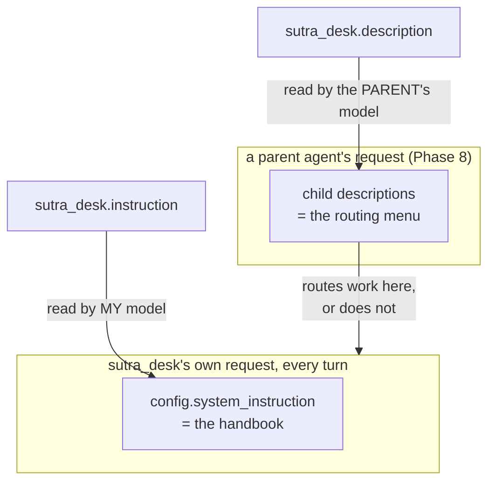

# 3.2 — Two fields, two readers

## One-line answer

`instruction` is read by **your own model, on every turn**, and `description` is read by **other
agents' models, when deciding whether to send work here** — so writing either one for the wrong reader
breaks either behaviour or routing, and neither failure looks like a bug.

---

## The story

There is a small shop near most people's homes with a board outside and a folder behind the counter.

The board says: **Photocopy · Lamination · Passport photos · Online forms.** Four words, painted once,
facing the street. It is not for the person working inside — they know what the shop does. It is for
you, walking past with a document in your hand, deciding in about a second whether to stop here or
keep walking to the next place.

The folder behind the counter is the other thing. *Photocopy is two rupees a page, one rupee over
fifty. Check both sides before you charge. If the machine jams, do not open the back — call. Passport
photos are taken against the white wall, not the blue one. If somebody wants a form filled and cannot
read it, read it out to them, do not fill it from guesswork.*

Nobody outside has ever read the folder. Nobody behind the counter needs the board.

Now imagine swapping them. Paint the pricing rules and the jam procedure on the board, and the person
walking past cannot tell in one second whether this shop does passport photos, so they keep walking.
Put "Photocopy · Lamination" in the folder as the entire content, and the new person on their first
day charges whatever they feel like.

Neither mistake produces a complaint that names the cause. The first shows up as *fewer customers*.
The second shows up as *inconsistent service*. And in both cases the text that was written was
perfectly good text, put where nobody who needed it would read it.

---

## The idea in plain language

An ADK agent carries both fields, and
[Day 5, part 2.2](../../../day-05-first-adk-agent/parts/02-the-agent-object/2.2-name-and-description.md)
introduced `description` as "an advertisement" alongside `name` as "an address". This part is about
the pairing that actually confuses people: `description` against `instruction`.

| | `instruction` | `description` |
| --- | --- | --- |
| Who reads it | **your own model**, every turn | **another agent's model**, when routing |
| When it is read | on every single request | when a parent agent picks a child |
| What it answers | *how do I behave?* | *what is this agent for?* |
| Voice | second person — "you do three things" | third person — "triages support tickets" |
| Where it lands | `config.system_instruction` ([3.1](3.1-where-your-instruction-lands.md)) | a tool-style declaration in the *parent's* request |
| Length | as long as it needs to be, and no longer | one or two sentences |
| Failure when wrong | the agent misbehaves | the agent is **never called at all** |

The official page is explicit about the second column: `description` is "Optional, Recommended for
Multi-Agent", and "This description is primarily used by *other* LLM agents to determine if they
should route a task to this agent" (adk.dev/agents/llm-agents/, checked 2026-08-26).

Read the last row of the table again, because it is the whole reason this part exists.

An `instruction` written badly produces **visible** failure. The agent says something wrong, somebody
notices, you go and look at the prompt. Painful but self-announcing.

A `description` written badly produces **silence**. In a multi-agent system, a parent agent reads its
children's descriptions and picks one. If yours reads *"An advanced AI-powered assistant leveraging
state-of-the-art language models to deliver best-in-class support experiences"*, the parent cannot
tell what it does, so work goes elsewhere. **There is no error.** There is no log line saying "did not
route to sutra_desk". The agent simply sits there, healthy, never called, and the symptom is a
different agent giving worse answers to questions yours was built for.

This is the same mechanism you already met on
[Day 4, part 1.3](../../../day-04-tools-by-hand/parts/01-the-schema/1.3-the-description-is-the-prompt.md):
a tool's description is not documentation, it is the text the model uses to decide whether to call the
tool. An agent's `description` is that idea one level up. **In a system that routes by description,
the description is the routing logic**, and it happens to be written in English.

So the four questions a description must answer, in third person, in about two sentences: what it
does, what kind of input it wants, what it produces, and — the one everybody omits — **what it is not
for.** That last clause is what stops a parent sending it work it will do badly rather than refuse.

---

## Why Sutra needs it

**Phase 8, from Day 53**, is multi-agent, and that is when `description` stops being a comment and
starts being a contract. A dispatcher will read Sutra's description alongside a researcher agent's and
a summariser's, and choose. Today's one line is the thing it will read.

**Day 43** brings a stateless MCP server answering requests no instance has seen before, where the
declared description is the only introduction the caller gets.

The reason it is written **today** rather than on Day 53 is Principle 1, doc-first, applied to the
agent itself: a description written on the day you need routing is written to make the routing work,
which is how you get a description that oversells. One written now, while the agent's scope is fresh
from [1.2](../01-writing-the-handbook/1.2-six-sections-of-a-handbook.md), tells the truth.

---

## The mechanism

Both fields sit on the same object, and the quickest way to feel the difference is to print them side
by side and read each one in its own voice:

```python
# lab/two_readers.py - the same agent, read the two ways it will be read.
from sutra.desk.agent import root_agent

print("--- what MY model reads, every turn (instruction) ---")
print(root_agent.instruction)
print()
print("--- what ANOTHER agent's model reads, when routing (description) ---")
print(root_agent.description)
print()
print(f"instruction: {len(root_agent.instruction.split())} words, sent every turn")
print(f"description: {len(root_agent.description.split())} words, sent to a parent")
```

**Line by line:**

- `root_agent.instruction` — printed raw, **not** rendered. This is the source string; what the model
  actually receives goes through the template step in [3.1](3.1-where-your-instruction-lands.md). The
  two are the same today only because the handbook contains no braces.
- `root_agent.description` — a plain `str` on the model, with no rendering step and no template
  behaviour. That asymmetry is worth knowing: **`{state_key}` in a description is not substituted**, it
  is just characters, because nothing in ADK renders this field.
- The two word counts at the bottom are the point of the script. One number should be large and one
  should be small, and if they are close, one of the two fields is wrong.
- No model call, no key needed beyond the import-time `load_env()`, no quota. This is a five-second
  check to run whenever you edit either field.

Now the two fields as they should read for Sutra:

```python
# sutra/desk/agent.py
root_agent = LlmAgent(
    name="sutra_desk",
    model="gemini-3.7-flash",
    description=(
        "Triages incoming customer support tickets: explains what a ticket is "
        "about, proposes a likely cause as a hypothesis, and recommends a "
        "priority. Works only from ticket text supplied in the request. Does "
        "not look anything up, and does not handle refunds, billing or account "
        "changes."
    ),
    instruction=INSTRUCTION,
)
```

**Line by line:**

- `description=(...)` — third person throughout: "triages", "proposes", "recommends". A description
  written in second person ("you triage tickets") reads to a routing model as an instruction addressed
  to it, which is a small confusion that costs nothing to avoid.
- `"explains ... proposes ... recommends"` — the same three verbs as the handbook's scope section, on
  purpose. **The description is the scope section, restated for an outsider.** When they drift apart,
  one of them is lying, and it is usually the description, because nobody probes it.
- `"Works only from ticket text supplied in the request."` — the **input** contract. A parent agent
  needs to know what to hand over, and this sentence is the difference between being sent a ticket
  body and being sent a ticket number it cannot use.
- `"Does not look anything up"` — the honesty rule, promoted from the handbook into the advertisement.
  This is the clause that stops a dispatcher routing "find me the KB article for this" here.
- `"and does not handle refunds, billing or account changes."` — **what it is not for**, the omitted
  fourth question. Without it a plausible parent sends billing questions to the support-ticket agent,
  the agent refuses correctly, and the user gets a dead end that looks like the agent being unhelpful
  when it is actually the routing being wrong.
- `instruction=INSTRUCTION` — unchanged, and notably it is a **name** rather than a literal here, while
  the description is inline. That is a deliberate asymmetry: the handbook is long and lives at module
  level where it can be diffed cleanly; the description is two sentences and belongs where the routing
  contract is declared.
- Verified against adk.dev/agents/llm-agents/ on 2026-08-26: both `description` and `instruction` are
  documented fields of `LlmAgent`, and `description` is described there as read by other agents for
  routing.

Where each one actually goes:



---

## When it breaks

**💥 The description that is silence.** There is no error text for this one, and that is the finding.
The closest thing to evidence is a routing decision that went elsewhere, which in ADK shows up as a
transfer event naming a different agent:

```text
[event] Event  author=dispatcher
  actions.transfer_to_agent='research_agent'
```

Nothing failed. `sutra_desk` was available, healthy and correct. It was not chosen, because its
description said less about what it does than the other one's did. **The only way to debug a routing
failure is to read the descriptions as a menu**, side by side, and ask which one you would pick.

**💥 The instruction pasted into the description.** A real and common mistake, because both fields take
prose and one is obviously more thought-through than the other. Copy the handbook into `description`
and two things happen. The parent's request now carries your entire six-section handbook for **every
child agent it is choosing between**, which is a token bill that scales with the number of agents. And
the parent's model, reading a page of second-person rules, gets a worse signal about what the agent
does than it would have got from one honest sentence. **Longer descriptions route worse**, which is the
opposite of the intuition.

**💥 The description that outsold the agent.** The failure with the worst consequences, and it arrives
by good intentions on a day when routing is not working:

```text
description="Handles all customer support queries end to end."
```

Now the parent routes *everything* here — billing, account deletion, angry escalations — and the
handbook correctly refuses each one. Every refusal is a user who was sent to the wrong place by a
sentence that was trying to be helpful. **A description is a promise the instruction has to keep**, and
when they disagree, the description wins the routing and the instruction wins the answer, so the user
gets the worst of both.

---

## In production

**What a professional writes instead** is a description reviewed as an interface, because that is what
it is. It changes behaviour in systems that do not import your code — a parent agent somewhere else
reads it and routes on it — so editing it is a compatibility change, not a copy edit. Teams that have
been burned put descriptions in the same review category as an API signature: a change needs a reason,
and "made it sound better" is not one.

**What degrades at scale is the menu, not the entry.** One description is easy to write well. Twenty,
written by six teams over two years, become a menu where four entries overlap, two are aspirational,
and one is stale because the agent's scope was narrowed last quarter and nobody edited the
advertisement. The routing model sees all of them at once. **The quality of routing is a property of
the set, not of any single description**, which means nobody's individual review can catch the real
problem, and the fix is periodically reading the whole menu the way a user would read a shop board.

**The failure that only shows with real traffic** is overlap. Two agents with genuinely similar
descriptions get routed between inconsistently — the same question goes to different agents on
different days, because the parent model is choosing between two nearly-equal options and the choice
is a coin toss, exactly as in
[1.4](../01-writing-the-handbook/1.4-contradictions-are-randomised-behaviour.md). Users experience it
as the product being erratic. Nothing is broken in either agent, and the fix is in neither of them: it
is in making the two descriptions say what the other one is not for.

**The review comment a senior engineer leaves:** *"Your description doesn't say what this agent won't
do, so the dispatcher will send it billing questions and the user will get a refusal instead of an
answer. Add the negative clause. And check it against the scope section of the instruction — right now
the description promises more than the handbook delivers."*

**The interview question:** *"in a multi-agent system, how does the orchestrator decide which agent
handles a request?"* The answer that shows you have done it: "It reads the agents' descriptions, so
the descriptions *are* the routing logic — written in English, evaluated by a model. That has two
consequences people miss. First, a badly written description fails silently: your agent is healthy and
simply never gets called, and there's no error anywhere, so you debug it by laying the descriptions out
as a menu and asking which one you'd pick. Second, a description is an interface, because something
you don't own reads it and routes on it — so it needs the same review discipline as a function
signature. The clause everyone omits is what the agent is *not* for, and that's the one that prevents
the user-visible failure, which is being routed to an agent that correctly refuses you."

---

## Check yourself

```bash
uv run python days/day-06-instructions-and-personas/lab/two_readers.py
```

Read the description out loud as though you were choosing between four agents and had one second.
Then answer the four questions from it alone: what does it do, what does it want, what does it give
back, and what is it not for? Any question you cannot answer is a clause to add.

**Answer out loud, without scrolling up:**

> Who reads `instruction` and who reads `description`? Then say what a badly written description
> actually looks like from the outside, and why that failure is harder to find than a badly written
> instruction.

---

**Next:** [3.3 — The static instruction that moves yours](3.3-the-static-instruction-that-moves-yours.md)
