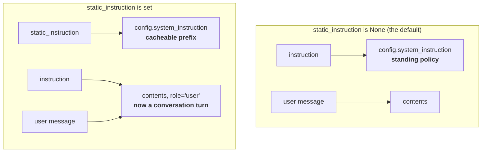

# 3.3 — The static instruction that moves yours

## One-line answer

Setting `static_instruction` does not add a second system prompt — it **takes over** the system slot
and demotes your `instruction` into an ordinary user message, which is a change in how much authority
your handbook carries, made by a field that looks like an optimisation.

---

## The story

Every hotel room has two kinds of notice in it, and they are not written by the same person or for
the same reason.

There is the laminated card screwed to the back of the door. Checkout is at eleven. Fire exit is left
then left. Do not smoke. That card was printed once, years ago, and it is identical in all forty
rooms. Nobody rewrites it. It is fixed to the door because it is the same for everyone, always.

Then there is the note the person at reception hands you when you arrive. *The lift on this side is
being repaired today, use the one near the stairs. Breakfast finishes early because there is a wedding
in the hall.* Different every day, sometimes different for each guest.

Now here is the thing worth noticing. Before the laminated card existed, the day's news went on the
door too — a printed sheet taped up where the card is now. Everybody read it, because that door is
where you look for rules.

Once the permanent card went up and took the good spot, the daily note moved. It became a piece of
paper handed across the counter, along with your key and your receipt, while you were carrying a bag.
The same words. A completely different amount of attention.

Nobody decided to make today's news less important. Somebody decided the permanent card should have
the door.

---

## The idea in plain language

[Part 3.1](3.1-where-your-instruction-lands.md) showed the two channels in a request: the
`system_instruction` slot, and the `contents` conversation. `instruction` goes into the first one.

That is true **only while `static_instruction` is unset**, and `static_instruction` is a third field
on the same agent that almost nobody notices until it changes their behaviour.

Its purpose is real and reasonable. It exists for **context caching**: the provider can cache the
front of a long prompt so it does not have to be re-processed on every request, and caching only works
on a prefix that never changes. Your `instruction` is a template — it can have session state
substituted into it ([section 4](../04-state-templating/4.1-the-instruction-is-a-template.md)) — so it
is not cacheable. `static_instruction` is the field for the part that genuinely never varies, sent
first, byte-identical every time.

So far, so sensible. Here is the part that catches people, quoted from the field's own documentation
in the installed package (`google-adk` 2.7.1, read on 2026-08-26):

> **Impact on instruction field:**
> - When static_instruction is None: instruction → system_instruction
> - When static_instruction is set: instruction → user content (after static content)

Read that second line slowly. Setting `static_instruction` does not give you two system prompts. It
**moves your `instruction` out of the system slot entirely** and re-sends it as a message with
`role="user"` — as though the person on the other end had typed it.

Why that matters is not a technicality. Providers treat the system slot differently from a user turn:
it carries more weight, it is understood as standing policy rather than as a request, and it is
harder for later conversation to argue with. A handbook demoted to a user message is now sitting in
the conversation alongside everything the actual user says, competing on equal terms. **Your refusal
script has stopped being the house rules and become an opinion somebody expressed at the start of the
chat.**

And there is a second trap stacked on the first, also from the field's own documentation:

> Setting static_instruction alone does NOT enable caching automatically.

So it is entirely possible to add this field, get none of the benefit you added it for, and pay the
full cost of demoting your instruction — with nothing failing, nothing logged, and no error anywhere.

One honest note about verification, because [Principle 8](../../../day-05-first-adk-agent/parts/04-the-runner/4.3-read-the-signature-not-the-tutorial.md)
demands it. The adk.dev `LlmAgent` page checked on 2026-08-26 documents `instruction`, `description`
and `global_instruction`, and **does not mention `static_instruction` at all.** Everything in this part
comes from the installed package: the field's docstring, and a run that printed the resulting request.
That is not a complaint about the docs. It is the reason the habit is "read the signature, not the
tutorial" — a field that can move your system prompt is real whether or not a page mentions it.

---

## Why Sutra needs it

**Day 24** is token economics, and caching is the first serious lever on a real bill. When that day
asks whether Sutra's prompt should be split into a cached static half and a dynamic half, this is the
field it will reach for — and the trade being made is the one above, so it should be made knowingly.

**Day 17** brings session state, which is what makes the split necessary in the first place: the
moment part of the handbook varies per conversation, the rest of it becomes the cacheable prefix.

The nearer reason is defensive. **Day 10** onwards, you will read ADK examples and other people's
agent code, and `static_instruction` appears in some of them. Meeting it for the first time in
somebody else's file, without knowing it relocates your instruction, is how you inherit a persona
that is quietly weaker than it looks.

---

## The mechanism

The claim is checkable for free, using the harness from [3.1](3.1-where-your-instruction-lands.md).
Render the same instruction twice — once without the field, once with it — and print both channels.

```python
# lab/static_instruction.py - what setting one field does to the other.
# Zero requests: this renders the request and never sends it.
import asyncio

from google.adk.agents import LlmAgent
from google.adk.agents.invocation_context import InvocationContext
from google.adk.flows.llm_flows.instructions import _build_instructions
from google.adk.models.llm_request import LlmRequest
from google.adk.sessions import InMemorySessionService


async def render(agent: LlmAgent) -> LlmRequest:
    """Build the request ADK would send for this agent, without sending it."""
    service = InMemorySessionService()
    session = await service.create_session(app_name="sutra", user_id="local")
    context = InvocationContext(
        session_service=service,
        invocation_id="probe",
        agent=agent,
        session=session,
    )
    request = LlmRequest()
    await _build_instructions(context, request)
    return request


async def main() -> None:
    for label, extra in [("without", {}), ("with", {"static_instruction": "ROLE CARD"})]:
        agent = LlmAgent(
            name="probe_agent",
            model="gemini-3.7-flash",
            instruction="Today: be brief.",
            **extra,
        )
        request = await render(agent)
        print(f"--- {label} static_instruction ---")
        print("  system_instruction:", repr(request.config.system_instruction))
        print("  contents          :", request.contents)


asyncio.run(main())
```

**Line by line:**

- `async def render(agent)` — the [3.1](3.1-where-your-instruction-lands.md) harness pulled out into a
  function, because this part needs to run it twice. **The only thing that varies between the two runs
  is the agent**, which is what makes the comparison mean something.
- `name="probe_agent"` — a throwaway agent, not `root_agent`. You are testing a field's behaviour, and
  doing that on the real agent invites leaving the experiment in place. Experiments live in `lab/`,
  and this one does not touch `sutra/`.
- `model="gemini-3.7-flash"` — pinned even here, because
  [Day 5, part 3.1](../../../day-05-first-adk-agent/parts/03-the-model-pin/3.1-the-default-that-moved.md)
  is ADK-73: an agent with no `model=` silently takes ADK's built-in default. Nothing is called, so it
  costs nothing, and the habit is the point.
- `[("without", {}), ("with", {"static_instruction": "ROLE CARD"})]` — the two cases as data, so the
  loop body is identical for both. Writing them as two separate blocks would let a difference creep in
  that you then mistake for the effect you are measuring.
- `"ROLE CARD"` in capitals — deliberately unmistakable. When it appears in the output you know
  exactly which string it is, with no chance of confusing it with the instruction.
- `repr(request.config.system_instruction)` — `repr` rather than plain printing, so you can see quotes,
  emptiness and whitespace. The difference between `''` and `None` matters here and is invisible
  without it.
- `request.contents` printed for **both** runs. In [3.1](3.1-where-your-instruction-lands.md) you were
  told to notice this printing as an empty list. This is the part where it stops being empty.

Run it:

```bash
uv run python days/day-06-instructions-and-personas/lab/static_instruction.py
```

**Line by line:**

- No arguments, no key needed for the render, no quota spent. Run it as often as you like.
- The output below is what this ran on `google-adk` 2.7.1 on 2026-08-26 — pasted, not predicted.

```text
--- without static_instruction ---
  system_instruction: 'Today: be brief.'
  contents          : []
--- with static_instruction ---
  system_instruction: 'ROLE CARD'
  contents          : [Content(
  parts=[
    Part(
      text='Today: be brief.'
    ),
  ],
  role='user'
)]
```

Look at what happened. In the first run the instruction is the system prompt and the conversation is
empty. In the second, the system prompt is **only** `ROLE CARD` — the instruction is not in it at all
— and `Today: be brief.` has become a `Content` with `role='user'`, sitting in the conversation. It
now arrives before the real user's first message and looks, to the model, like something the user
said.



---

## When it breaks

**💥 The persona that got quietly weaker.** There is no error and no log line, which is the whole
problem. Somebody adds `static_instruction` for caching, the refusal script moves into `contents` as a
user turn, and the agent starts giving way on turn six of a conversation where it used to hold. The
symptom is reported as "the agent forgets its rules in long chats" — which is a real phenomenon with
other causes too ([1.5](../01-writing-the-handbook/1.5-every-line-is-a-tax.md)), so it gets attributed
to prompt length and somebody shortens the handbook. **The actual cause is a one-line diff in the agent
constructor that nobody connected to behaviour**, because it was reviewed as a performance change.

**💥 The cache that was never enabled.** Straight from the field's own documentation:

```text
Setting static_instruction alone does NOT enable caching automatically.
For explicit caching control, configure context_cache_config at App level.
```

So the field goes in, the pull request says "enable prompt caching", the token bill does not move, and
the instruction has been demoted for nothing. Nobody checks, because there is no failure — just an
absence of the improvement, which is much harder to notice than a regression.

**💥 The template variable in the wrong field.** `static_instruction` is sent "directly to the model
without any processing or variable substitution" (the field's docstring, same version). So a `{var}`
placed there is not rendered and not an error — it is delivered to the model as the literal characters
`{var}`:

```text
system_instruction: 'You are helping {customer_name} today.'
```

The model, being cooperative, will often carry on and address the customer as "customer_name". The
same string in `instruction` would either substitute correctly or raise a `KeyError`
([4.2](../04-state-templating/4.2-hard-and-soft-contracts.md)). **Moving a line between these two
fields changes whether a placeholder is a feature, an exception, or a bug you ship to a customer.**

---

## In production

**What a professional writes instead** is a deliberate split with the reason written down: the fixed
half — role, scope, refusal script, honesty rules — in `static_instruction`, and only the genuinely
per-conversation half in `instruction`. If your handbook does not vary at all, the honest split is to
put **all** of it in `static_instruction` and leave `instruction` empty, so nothing is demoted. The
failure mode this section is about comes from setting the field while leaving a full handbook behind
in `instruction`, which is what happens when the change is made for caching without reading what it
does to the other field.

**What degrades at scale is the reviewability of the split.** Once the persona lives in two fields, the
question "what are this agent's rules?" needs both, plus knowledge of which one outranks the other in
the request. New team members read one and miss the other. The rendering habit from
[3.1](3.1-where-your-instruction-lands.md) is what keeps this honest at scale: **assert on the rendered
request, not on either source string**, because only the rendered request knows about the interaction
between the two fields.

**The failure that only shows with real traffic** is the interaction with long conversations. A
demoted instruction sits at the front of `contents`, and as the conversation grows it is pushed further
and further from the model's most recent attention — while a real `system_instruction` stays in its
own slot and does not drift. So the agent is fine for the first few turns and degrades over a long
session, which is precisely the shape of usage that no test suite reproduces and every real support
conversation produces.

**The review comment a senior engineer leaves:** *"This moves the whole handbook into `contents` as a
user turn — the refusal script is no longer system-level. If we want caching, put the fixed sections in
`static_instruction` and leave `instruction` for the parts that actually vary. And confirm caching is
on: the docstring says this field alone doesn't enable it."*

**The interview question:** *"how would you reduce the cost of a long system prompt?"* The answer that
shows you have done it: "Split it by what varies. The fixed part — role, scope, refusal rules — can be
a cacheable prefix, and the per-conversation part stays dynamic, because a cache only works on a
prefix that's byte-identical every time. In ADK that split is the `static_instruction` field, and the
thing to know before using it is that it isn't additive: setting it moves your `instruction` out of the
system slot and re-sends it as a user turn. That's a real change in how much authority your rules
carry, so it's not a pure optimisation. I'd also verify caching is actually enabled — in this version
setting the field alone doesn't turn it on, so it's easy to pay the cost and get none of the benefit,
and neither half of that shows up as an error."

---

## Check yourself

```bash
uv run python days/day-06-instructions-and-personas/lab/static_instruction.py
```

Compare it with the prediction you wrote at the end of [3.1](3.1-where-your-instruction-lands.md).
Then change the experiment: set `static_instruction` and leave `instruction` as `""`. Predict both
channels before you run it, and check whether an empty instruction still produces a user turn.

**Answer out loud, without scrolling up:**

> What happens to `instruction` when `static_instruction` is set, and why is that a behaviour change
> rather than a performance change? Then name the second trap — the thing setting this field does not
> do, despite being the reason people set it.

---

**Next:** [3.4 — The deprecated global instruction](3.4-the-deprecated-global-instruction.md)
