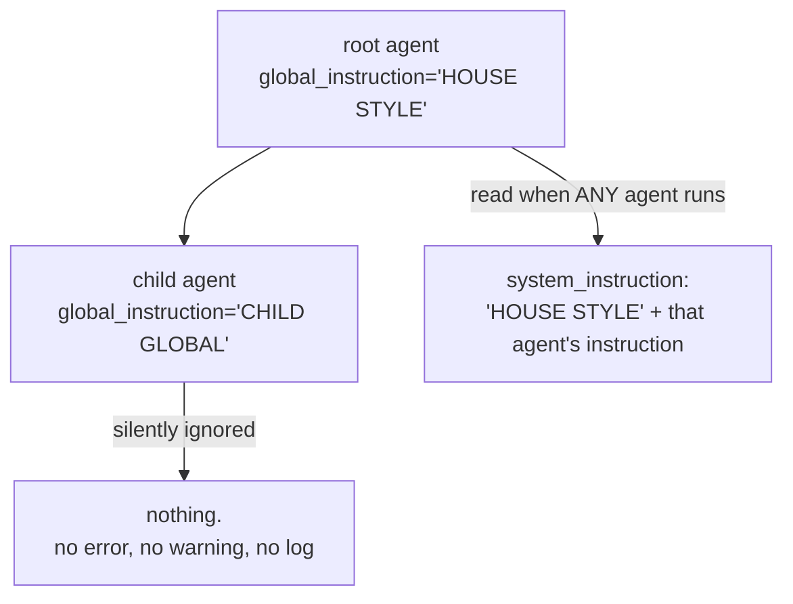

# 3.4 — The deprecated global instruction

## One-line answer

`global_instruction` still works, is deprecated in favour of `GlobalInstructionPlugin`, and has a
trap worse than its deprecation: it is read **only from the root agent**, so the same field on any
other agent is silently ignored with no warning and no error.

---

## The story

A shop has two phone numbers painted on its board. The old landline, from when the shop opened, and
below it a mobile number added a few years ago.

The landline still rings. That is the problem.

When they took the extra space at the back, the handset that used to sit by the front counter was
moved, and only one line was carried across. So the landline now rings on a phone in the back room,
where somebody sits in the mornings and nobody sits after lunch. Ring it at four in the afternoon and
it rings, and rings, and stops. Nothing tells you the call did not land. From your side it looks
exactly like a shop that is closed or busy.

The owner knows which number works. Everybody who has been there a while knows. The board still says
both, because repainting it costs money and the old number does still work — some of the time, from
one particular phone, in one particular room.

And in a drawer somewhere there is a letter from the phone company saying the landline is being
discontinued.

Three separate problems, and only the third one is honest about itself. The number will go away, and
they will get a warning first. The number works only from one place, and nobody warns you at all.

---

## The idea in plain language

An ADK agent has a field called `global_instruction`. Its purpose is text that should apply to
**every agent in a tree** — a house style, a shared identity, a compliance line that must appear
wherever the system speaks. Its own documentation in the installed package (`google-adk` 2.7.1, read
2026-08-26) puts it this way: "use global_instruction to make all agents have a stable identity or
personality."

Three facts about it, in increasing order of how much trouble they cause.

**It is deprecated.** From the same docstring: "This field is deprecated and will be removed in a
future version. Use GlobalInstructionPlugin instead, which provides the same functionality at the App
level." The adk.dev page agrees, in as many words: "To apply shared rules or a consistent personality
to *all* agents in your system, use `GlobalInstructionPlugin` instead of the deprecated
`global_instruction` parameter" (checked 2026-08-26). A deprecation is the honest kind of problem. It
is written down, it will be announced, and it breaks loudly when it finally goes.

**It appends to the same slot your instruction uses.** [Part 3.1](3.1-where-your-instruction-lands.md)
made the point that `system_instruction` is a shared slot filled by `append_instructions`, and this is
the field that proves it: when both are set, the model receives the global text and then your
handbook, joined together. So a rule you cannot see in `sutra/desk/agent.py` can be shaping every
answer.

**It is read only from the root agent, and fails silently everywhere else.** This is the one worth
the part. The docstring says it plainly — "ONLY the global_instruction in root agent will take
effect" — and the failure has no signal attached to it at all. Put `global_instruction` on a child
agent and there is no exception, no warning, no log line, and no hint in the rendered request. The
text is simply not there.

Think about what that means in practice. Somebody adds a compliance line to a sub-agent, reviews it,
merges it, and the line does nothing. **Every review of that pull request will pass, because the code
is correct — it is the position in the tree that is wrong**, and nothing in the diff shows position.

A term to define, because it arrives here for the first time. A **plugin** in ADK is an object hooked
into the runtime at the application level rather than attached to one agent, with callbacks that run
around each step — `GlobalInstructionPlugin` uses `before_model_callback`, which runs just before each
request goes to the model, and injects the shared text into it. Plugins arrive properly later in the
curriculum; what matters today is *why* the replacement is at the App level. A field on an agent
invites you to set it on any agent, and only one position works. A plugin is configured once, where
the application is assembled, and there is no wrong place to put it.

---

## Why Sutra needs it

**Phase 8, from Day 53**, is when Sutra has more than one agent and a shared line becomes a real
requirement. That is the day this choice is made, and making it with the deprecated field would be
choosing a thing already scheduled for removal.

**Day 85** puts Sutra behind a real API surface, where a compliance or identity line applied
everywhere stops being a nicety.

Today the reason is narrower and more immediate: **you will read this field in other people's code.**
ADK examples and tutorials written before the deprecation use it, and Principle 4 — build first,
compare after — means understanding a mechanism before adopting or rejecting it. Sutra does not set
`global_instruction`, and today is where that becomes a decision on record rather than an omission.

---

## The mechanism

Both facts are checkable for free with the harness from [3.1](3.1-where-your-instruction-lands.md).
Render two trees: one with the field on the root, one with it on a child.

```python
# lab/global_instruction.py - where global_instruction is read, and where it is ignored.
# Zero requests. This builds requests and never sends them.
import asyncio

from google.adk.agents import LlmAgent
from google.adk.agents.invocation_context import InvocationContext
from google.adk.flows.llm_flows.instructions import _build_instructions
from google.adk.models.llm_request import LlmRequest
from google.adk.sessions import InMemorySessionService


async def render(agent: LlmAgent) -> str:
    """The system_instruction ADK would send when THIS agent runs."""
    service = InMemorySessionService()
    session = await service.create_session(app_name="sutra", user_id="local")
    context = InvocationContext(
        session_service=service,
        invocation_id="probe",
        agent=agent,
        session=session,
    )
    request = LlmRequest()
    await _build_instructions(context, request)
    return request.config.system_instruction


async def main() -> None:
    root = LlmAgent(
        name="root_probe",
        model="gemini-3.7-flash",
        global_instruction="HOUSE STYLE",
        instruction="Be brief.",
    )
    print("on the root agent   :", repr(await render(root)))

    child = LlmAgent(
        name="child_probe",
        model="gemini-3.7-flash",
        global_instruction="CHILD GLOBAL",
        instruction="Child rules.",
    )
    LlmAgent(
        name="parent_probe",
        model="gemini-3.7-flash",
        instruction="Parent rules.",
        sub_agents=[child],
    )
    print("on a child agent    :", repr(await render(child)))


asyncio.run(main())
```

**Line by line:**

- `async def render(agent) -> str` — the same harness as [3.3](3.3-the-static-instruction-that-moves-yours.md),
  narrowed to return just the system slot, because that is the only channel this part is about.
- `global_instruction="HOUSE STYLE"` and `instruction="Be brief."` — two unmistakable strings, so the
  join between them is visible in the output rather than inferred.
- The second `LlmAgent(...)` for `parent_probe` is constructed and **not assigned to a variable**. That
  looks like a mistake and is not: constructing a parent with `sub_agents=[child]` is what sets the
  child's `parent_agent` link, so `child.root_agent` now resolves to the parent. The object exists for
  its side effect on `child`, which is exactly the kind of thing worth a comment in real code.
- `await render(child)` — rendering as though **the child were the one running**, which is the case
  that matters. A sub-agent handling a turn builds its own request, and the question is whose
  `global_instruction` gets read.
- `repr(...)` on both — so the `\n\n` join is visible as characters rather than as blank space.
- No `try`/`except` anywhere, on purpose. If a future ADK version starts raising on a child's
  `global_instruction`, **that is information and it should be allowed to surface** (Principle 10). A
  swallowed exception here would hide the very improvement you would want to know about.

Run it:

```bash
uv run python days/day-06-instructions-and-personas/lab/global_instruction.py
```

**Line by line:**

- No key needed for the render and no quota spent. The output below is what this ran on `google-adk`
  2.7.1 on 2026-08-26 — pasted from the terminal, not predicted.

```text
on the root agent   : 'HOUSE STYLE\n\nBe brief.'
on a child agent    : 'Child rules.'
```

Two things to take from those two lines. On the root, the global text and the instruction are **joined
with a blank line** — that is `append_instructions` doing exactly what its name says, and it is the
clearest available proof that the system slot has more than one contributor. On the child,
`CHILD GLOBAL` is **absent**. Not truncated, not warned about, not logged. Gone.



The replacement, for when Sutra needs it in Phase 8, is configured once where the application is
assembled rather than on any agent:

```python
# NOT for sutra/ today - this is the shape Day 53 will use.
from google.adk.plugins.global_instruction_plugin import GlobalInstructionPlugin

plugin = GlobalInstructionPlugin(
    global_instruction="Never state a fact no tool result gave you.",
)
```

**Line by line:**

- `from google.adk.plugins.global_instruction_plugin import ...` — a public path with no leading
  underscore, unlike the `_build_instructions` the lab scripts borrow. **This one is safe to depend
  on**; that one is not.
- `GlobalInstructionPlugin(global_instruction=...)` — the text is configured on the plugin, which is
  registered with the App rather than attached to an agent. **There is no wrong agent to put it on,
  because there is no agent to put it on**, and that is the entire design fix.
- The instruction it carries is Sutra's honesty rule, which is the realistic candidate for a global:
  a rule that must hold no matter which agent is speaking. Tone and scope are per-agent and belong in
  each agent's own handbook.
- It is shown and **not adopted today**. Sutra has one agent, and a plugin that applies a rule to every
  agent in a tree of one is ceremony. Principle 4 again: understand the mechanism, adopt it on the day
  there is a reason.

---

## When it breaks

**💥 The compliance line that was never sent.** The failure this part exists for, and it produces
nothing to find:

```text
on a child agent    : 'Child rules.'
```

That is the whole error message, and it is not an error message. Somebody added a required disclosure
to a sub-agent, tested the parent, saw the parent behave correctly, and shipped. The sub-agent handles
a class of request the parent does not, and for that class the line has never been present. **The
review passed, the tests passed, and the field was set exactly as documented on the page somebody
read.** The only way to catch it is to render the request for the agent that actually runs.

**💥 The deprecation with no warning attached.** Run the script above and watch what does *not* happen.
There is no `DeprecationWarning` at construction and none at render — the field is documented as
deprecated in its docstring and on the page, and the code says nothing. So `python -W error` will not
find it, a linter will not find it, and a codebase can accumulate uses of a field scheduled for removal
with no automated signal at all. **A deprecation you can only learn about by reading is a deprecation
most teams learn about from a failed upgrade.**

**💥 The global that fought the local.** The slower failure, and a direct case of
[1.4](../01-writing-the-handbook/1.4-contradictions-are-randomised-behaviour.md). A global line says
"always offer to escalate to a human", a particular agent's handbook says "never mention escalation,
this agent is internal-only", and both are in `system_instruction`, joined by a blank line. Neither
author saw the other's text. The model picks one per turn, and the resulting inconsistency gets
reported against the agent — where the contradicting line is nowhere to be found, because it lives in
a different file.

---

## In production

**What a professional writes instead** is very little that is global. The instinct to make a rule apply
everywhere is strong and usually wrong: most rules are per-agent, and a global rule is one that must
hold no matter which agent is speaking — a legal disclosure, a safety refusal, an identity line. Three
or four sentences is a lot. The reason for restraint is the failure above: **a global rule is invisible
from the file where its effects appear**, so every one you add makes every agent slightly harder to
reason about.

**What degrades at scale is attribution.** With one agent and no globals, "why did it say that?" is
answered by opening one file. Add a global, a plugin, a framework default and a `static_instruction`
([3.3](3.3-the-static-instruction-that-moves-yours.md)) and the answer requires knowing all four exist
and in what order they are appended. Teams that keep this manageable do the same thing recommended in
[3.1](3.1-where-your-instruction-lands.md): they log or test the **rendered** system instruction, so
the assembled truth is inspectable without a mental model of the assembly.

**The failure that only shows with real traffic** is the sub-agent path. Your global rule is verified
against the root agent, because that is the one you test — and the root handles the common case. The
sub-agents handle the unusual requests: the escalations, the edge cases, the ones that get routed away
from the main path. So the rule holds precisely where it was least needed and is absent precisely
where the unusual thing is happening, and the gap is invisible until an unusual request goes wrong in a
way somebody cares about.

**The review comment a senior engineer leaves:** *"`global_instruction` on a sub-agent does nothing —
it's only read from the root, and there's no warning for that. Move it to the root, or use
`GlobalInstructionPlugin`, which is the supported route now anyway. And add a test that renders the
child's request and asserts the line is present, or the next person will make the same change."*

**The interview question:** *"how do you apply a rule to every agent in a multi-agent system?"* The
answer that shows you have done it: "At the app level, not on an agent. In ADK the modern route is a
plugin that hooks `before_model_callback` and injects the text into each request; the older
`global_instruction` field on the agent is deprecated. The reason the field is worth knowing about
isn't the deprecation — it's that it's only read from the root agent, and setting it on a sub-agent
does nothing, with no warning and no error. That's the kind of failure I'd flag in review, because the
code is correct and the position in the tree is wrong, and a diff doesn't show position. I'd also say I
keep globals to a minimum: a rule applied everywhere is invisible from the file where its effects show
up, so every global makes debugging any single agent harder."

---

## Check yourself

```bash
uv run python days/day-06-instructions-and-personas/lab/global_instruction.py
uv run python -c "
from sutra.desk.agent import root_agent
print('sutra sets global_instruction:', bool(root_agent.global_instruction))
"
```

The second command should print `False` — Sutra deliberately sets nothing global today. Now try the
experiment the script does not do: set `global_instruction` on the root **and** give the child a
different `instruction`, then render the child. Predict first whether the root's global text appears.

**Answer out loud, without scrolling up:**

> Give the two separate problems with `global_instruction` and say which one has no warning attached.
> Then say why moving the feature from an agent field to an app-level plugin fixes the second problem
> rather than merely relocating it.

---

**Next:** [4.1 — The instruction is a template](../04-state-templating/4.1-the-instruction-is-a-template.md)
