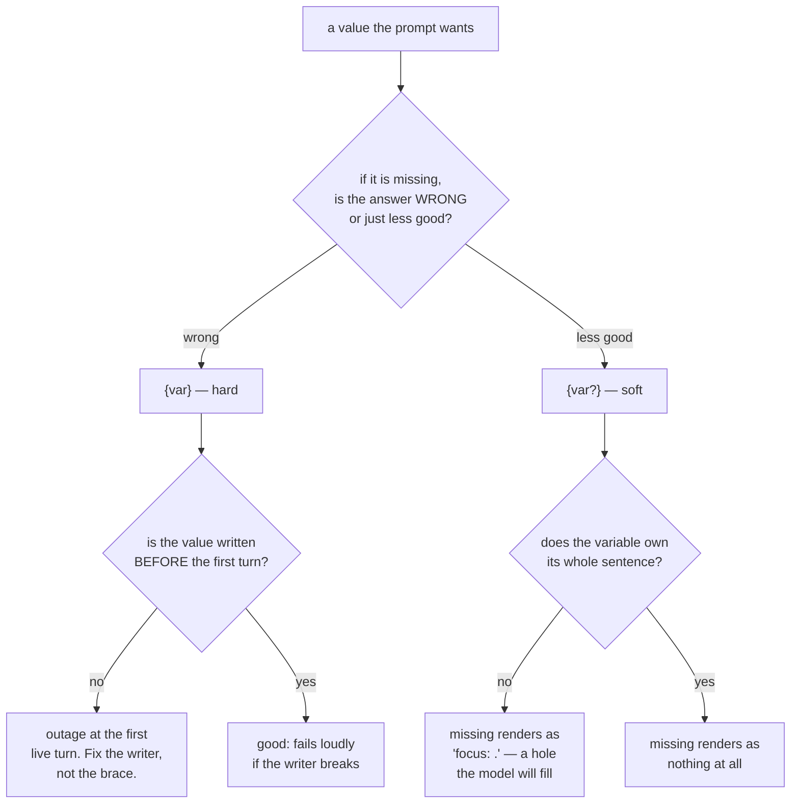

# 4.2 — Hard and soft contracts: `{var}` and `{var?}`

## One-line answer

`{var}` says *this agent cannot function without this value* and fails the whole turn when it is
missing; `{var?}` says *use it if you have it* and quietly renders nothing — so the question mark is
not a safety switch you add everywhere, it is a decision about whether the value is load-bearing.

---

## The story

Booking a hall for a wedding involves a long form, and two of the boxes on it are not the same kind of
box at all.

One says **advance payment**. Leave it blank and there is no booking. Not a smaller booking, not a
booking with something missing — no booking. The hall stays available, somebody else takes the date,
and the family finds out when they call to confirm. That box is the whole arrangement.

Another says **flower decoration preference**. Leave it blank and the wedding happens. There are no
flowers, or there are whatever flowers the hall usually puts out, and on the day almost nobody
notices. The blank cost something small and nothing structural.

Now imagine the manager, tired of chasing people for half-filled forms, decides to make every box
optional. Kind, reasonable, and it means a family can now "book" a hall without paying an advance —
which is not a booking at all, and everybody involved discovers this at the worst possible moment, on
the day, with two hundred guests.

And imagine the opposite manager, who makes every box compulsory. Now a family who has not decided
about flowers cannot book the hall.

The form is not improved by making all the boxes the same. It is improved by somebody sitting down
once and deciding, box by box, which ones the event cannot happen without.

---

## The idea in plain language

[Part 4.1](4.1-the-instruction-is-a-template.md) showed that `{var}` is a blank filled from session
state. The question mark chooses what happens when the blank cannot be filled:

| Written | Key present | Key missing | What you are saying |
| --- | --- | --- | --- |
| `{tier}` | the value | **`KeyError`, the turn dies** | the agent is wrong without this |
| `{tier?}` | the value | empty string, silently | this is a nice-to-have |

That is the whole syntax. The interesting part is which one to choose, and the honest way to frame it
is as a question about the *agent*, not about the *code*:

> **If this value is missing, would the agent's answer be wrong — or merely less good?**

Wrong means hard. `{customer_tier}` in a line that says "enterprise customers get a callback offer" is
hard, because rendering it empty produces *"customers get a callback offer"*, which is a policy the
company does not have, applied to everybody. **A soft contract on a load-bearing value does not
degrade gracefully. It changes the meaning of the sentence.**

Less good means soft. `{engineer_name?}` in a greeting is soft. Missing it produces a slightly
impersonal reply and nothing else.

There is a strong pull towards making everything soft, and it should be resisted for a reason worth
stating carefully. A hard contract fails **loudly, immediately, and in one place**. A soft contract on
a value that mattered fails **quietly, later, and in the answer** — the agent says something subtly
wrong to a real person and nothing anywhere records that a value was missing. Between an exception you
can see and a wrong answer you cannot, the exception is the better outcome nearly every time. That is
Principle 10, **fail honestly**, applied to a question mark.

But the hard contract has a cost, and it is the one that makes this a design decision rather than a
rule. The failure arrives at the **first live turn**, not at import and not at startup. Your tests
construct the agent and pass. Your linter is happy. The application boots. And then a real
conversation begins and the turn raises. **A hard contract is a promise checked at the worst possible
moment**, which is why part of the answer is not in the question mark at all — it is in making sure
the value is actually written before the agent runs, and in testing the render against an empty state
([4.1](4.1-the-instruction-is-a-template.md)'s production section).

Which gives the rule for today:

> **Choose per line, on purpose. And never leave a hard contract standing on a promise to set the
> value later — later is where outages live.**

---

## Why Sutra needs it

**Day 17** is session state, and it is when Sutra first has values worth templating: a triage focus, a
queue, a product area. Every one of those arrives with this decision attached, and a day spent
deciding it in the abstract is a day when Day 17 can be about the state design rather than about
brace syntax.

**Day 11** is the sharper one. Tools can write state, so a value can appear *during* a conversation —
which means a key that is missing on turn one is present on turn three. A hard contract on such a key
makes the agent fail exactly once, at the start, in a way that looks intermittent.

And **Day 8**, two days from now, is sessions and services. A session restored from a store may not
carry the keys a fresh session had, and a hard contract is what turns that difference into an
exception rather than a mystery.

---

## The mechanism

Both behaviours, rendered side by side, using the harness from
[4.1](4.1-the-instruction-is-a-template.md):

```python
# lab/contracts.py - the same missing key, hard and soft.
# Zero requests. The point is that BOTH results are produced without a network call.
import asyncio

from templating import render  # the helper from 4.1, in this same lab/ folder


async def main() -> None:
    for label, instruction in [
        ("hard  {focus} ", "Today's triage focus: {focus}."),
        ("soft  {focus?}", "Today's triage focus: {focus?}."),
    ]:
        try:
            result = await render(instruction, state={})
            print(f"{label} -> {result!r}")
        except KeyError as exc:
            print(f"{label} -> KeyError: {exc}")


asyncio.run(main())
```

**Line by line:**

- `from templating import render` — reusing [4.1](4.1-the-instruction-is-a-template.md)'s helper rather
  than copying it, because both files sit in the same `lab/` folder. **Copying it would let the two
  drift**, and then a difference between the parts would be a difference in the harness rather than in
  ADK.
- `state={}` — an **empty** session, which is the only state that makes this comparison meaningful. A
  populated one would render both identically and prove nothing.
- `except KeyError as exc` — catching **only** `KeyError`, not `Exception`. That is the exception this
  experiment expects, and letting anything else propagate is the honest choice: if a future ADK version
  raises something different, you want to see it rather than have it printed as though it were the
  expected result. `CLAUDE.md` bans the bare catch for exactly this reason.
- The `try` sits around one case and not the other, and both go through the same loop — so the
  asymmetry in the output comes from ADK, not from the script treating the two differently.
- `f"{label} -> {result!r}"` with `repr` again, because the soft result contains an empty string in the
  middle of a sentence and you need to see the space it leaves behind.

Run it:

```bash
uv run python days/day-06-instructions-and-personas/lab/contracts.py
```

**Line by line:**

- Run from the repository root; `templating.py` resolves because Python puts the **script's own
  directory** on the path, and both files live in `lab/`. This is why the lab is a folder of scripts
  and not a package — nothing here should ever become importable from `sutra/`.
- No key needed for the render, no quota. The output below is from `google-adk` 2.7.1 on 2026-08-26.

```text
hard  {focus}  -> KeyError: 'Context variable not found: `focus`.'
soft  {focus?} -> "Today's triage focus: ."
```

Both lines deserve a moment. The hard one names the missing key, which is genuinely helpful — you get
the variable's name, not just a failure. And look closely at the soft one: `focus: .` The value
vanished and **the punctuation around it did not.** The model receives a sentence with a hole in it,
and a cooperative model will interpret that hole. This is the cost of soft that nobody mentions: an
optional variable leaves damaged prose behind, so the text around it has to be written to survive the
absence.

Which is the actual craft here — writing the sentence so that empty is a sentence:

```python
# Both forms of soft, and only one of them reads properly when the key is missing.
BAD = "Today's triage focus: {focus?}."  # -> "Today's triage focus: ."
GOOD = "{focus?}"  # -> "" : the whole line disappears, leaving nothing broken
```

**Line by line:**

- `BAD` keeps its label and its full stop, so an absent value produces a labelled blank. The model sees
  a heading with nothing under it and may well invent something to put there, which is the failure this
  whole day is about.
- `GOOD` puts the variable **on a line of its own with no surrounding prose**, so the missing case
  renders as an empty line and the instruction reads as though the line was never written. The
  sentence, including its label, goes in the state value: `state["focus"] = "Today's triage focus:
  login issues."`
- The rule generalises: **a soft variable should own its whole sentence.** If it is embedded in prose,
  the prose is written for the present case and has to survive the absent one, and it usually does not.



---

## When it breaks

**💥 The hard contract that was going to be filled in later.** The exact scene, and it is
[6.1](../06-failure-lab/6.1-the-handbook-that-promised-equipment.md)'s neighbour. Somebody adds a
personalisation line, plans to write the state key "on Day 17, when we do state properly", and ships:

```text
Traceback (most recent call last):
  File ".../google/adk/flows/llm_flows/instructions.py", line 112, in _build_instructions
    si = await _process_agent_instruction(agent, invocation_context)
  File ".../google/adk/utils/instructions_utils.py", line 174, in _replace_match
    raise KeyError(f'Context variable not found: `{var_name}`.')
KeyError: 'Context variable not found: `triage_focus`.'
```

Every turn fails. The agent is completely down, and the change that did it was one line of prose in a
string. There is one mercy in it: the failure is total and immediate, so it cannot reach production
past any smoke test. **A hard contract's failure mode is the least dangerous thing in this part.**

**💥 The typo that looks like a missing value.** The same traceback, from a different cause, and this
one *can* reach production. The state key is `triage_focus` and the prompt says `{triage_focu}`. The
writer works, the key exists, the value is right, and the agent is down — because the reference does
not match. The error message names the variable, which is the thing that saves you, and it is one more
reason to prefer the exception to the silent empty string.

**💥 The soft contract on a value that mattered.** No traceback, no log line, and a wrong answer sent
to a real person:

```text
system_instruction: 'Customers on the  plan get a priority callback offer.'
```

`{plan?}` was empty, and the sentence now offers a priority callback to **everybody**. Nothing failed.
Nothing was recorded. The agent behaved exactly as instructed, and the instruction it was given was
not the instruction anybody wrote. This is the failure that argues against making everything soft, and
it is worth re-reading the rendered line above until it is uncomfortable — because there is no
alerting, no error rate and no test that would have caught it after the fact.

---

## In production

**What a professional writes instead** is hard contracts for anything load-bearing plus a guarantee
that the value exists — the key is written when the session is created, not opportunistically during
the conversation, so the hard contract can never be unsatisfied at turn one. The brace is then a
**check on the invariant** rather than a hope. Soft contracts get used sparingly, and always on a
variable that owns its own line, so the missing case renders as absence rather than as damaged prose.

**What degrades at scale is that soft becomes the default by accident.** The first hard contract that
causes an incident teaches the team a lesson, and the lesson they learn is "add the question mark".
Within a year every variable is soft, and the class of failure has changed from a loud exception to a
family of quietly wrong sentences that nobody is measuring. The better lesson from that first incident
is: **the bug was that a load-bearing value was not guaranteed, and the question mark hides the bug
rather than fixing it.**

**The failure that only shows with real traffic** is partial state. Every session in your test data was
created by the same code path, so every session has every key. Production has sessions created by an
older version of the app, sessions restored from a store written before a key existed, sessions
started from a different channel. Some fraction of them are missing one key. A hard contract turns that
into a visible error rate on a specific variable, which is diagnosable in an afternoon. A soft contract
turns it into a slightly different answer for a slightly different population, which is not diagnosable
at all — nobody is comparing the answers of two cohorts of users.

**The review comment a senior engineer leaves:** *"`{plan?}` is soft on a line that grants an
entitlement — if it's empty we're offering the callback to everyone. Make it hard and guarantee the
key at session creation. And if you keep any soft variable, give it its own line: right now a missing
value leaves 'on the  plan' in the middle of a sentence."*

**The interview question:** *"how do you handle optional values in a templated prompt?"* The answer that
shows you have done it: "I decide per variable, and the question I ask is whether a missing value makes
the answer *wrong* or merely *less good*. Wrong means it stays hard and fails the turn — an exception I
can see beats a subtly incorrect sentence I can't. Less good means optional, and then the variable has
to own its whole line, because an optional value embedded in prose leaves a hole like 'on the plan'
that the model will happily interpret. The mistake I've seen teams make is reacting to one hard-contract
outage by making everything optional, which converts a loud failure into a population of quietly wrong
answers nobody is measuring. The real fix for that outage is guaranteeing the value at session
creation, so the hard contract is checking an invariant instead of hoping."

---

## Check yourself

```bash
uv run python days/day-06-instructions-and-personas/lab/contracts.py
```

Then run the decision, not the code. For each line you might template into Sutra's handbook on Day 17
— a triage focus, an engineer name, a product area — write down hard or soft, and the sentence that
would be produced if the value were missing. Read those sentences out loud. At least one of them will
change your answer.

**Answer out loud, without scrolling up:**

> State the question that decides between `{var}` and `{var?}`. Then say why "make everything optional"
> is the wrong lesson to take from a hard-contract outage, and what the right fix is.

---

**Next:** [4.3 — A callable turns templating off](4.3-a-callable-turns-templating-off.md)
