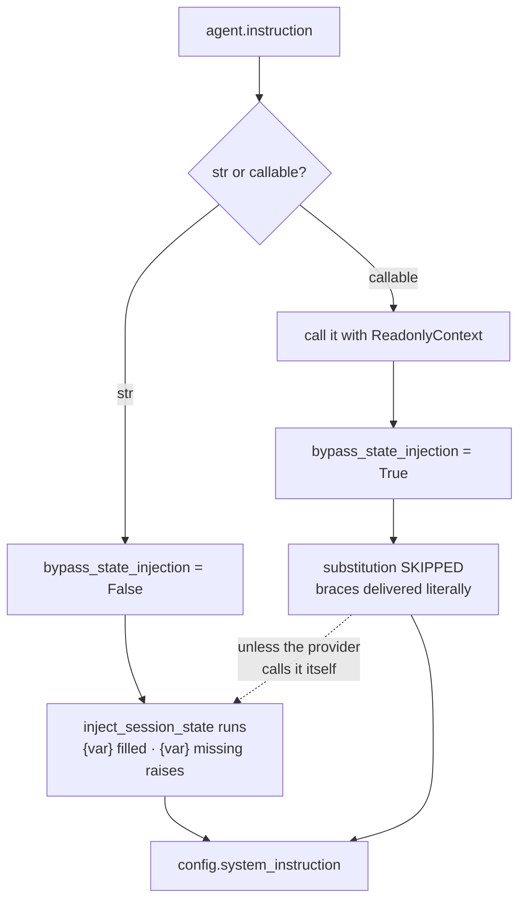

# 4.3 — A callable turns templating off

## One-line answer

`instruction` accepts a function as well as a string, and the moment you pass a function ADK **stops
substituting state into the result** — so a `{var}` in the returned text is delivered to the model as
the literal characters `{var}` unless your function does the substitution itself.

---

## The story

There are two ways to make chai for a house full of people.

The first is the packet from the shop. Tear it, add water and milk, boil. The tea, the sugar, the
cardamom and the ginger are already in there in the right proportions, because somebody worked them
out once and the machine does it the same way every time. You cannot change the amount of ginger, and
you do not have to think about it either.

The second is from scratch. You control everything. More ginger for the person with a cold, less sugar
for the one who asked, a second boil because the milk was fresh. It is better tea, when you know what
you are doing.

And there is one particular way it goes wrong, and everybody who has learned to cook has done it. You
make it from scratch, you taste it, and something is missing. Not obviously wrong — just flat. You
forgot the sugar, or you forgot the salt in whatever you were cooking, because in the packet version
it was never a step. It was in the packet. Nobody ever forgets a step that somebody else was doing for
them, right up until they take over the job.

Taking over the job means taking over **all** of it, including the parts you never had to know about.

---

## The idea in plain language

The `instruction` field accepts two types. From the installed package (`google-adk` 2.7.1, read
2026-08-26) the type is `Union[str, InstructionProvider]`, and the adk.dev page for `LlmAgent` puts it
in words: the instruction is "a string (or a function returning a string)" (checked 2026-08-26).

An **InstructionProvider** is a function that takes a `ReadonlyContext` — a read-only view of the
current turn, including session state — and returns the instruction text. It may be synchronous or
`async`. Why you would want one: the handbook can now be **computed**. Different text for an
enterprise customer, a section included only when a certain tool is available, a rule that applies
only during business hours. None of that is expressible in a template.

Now the part that catches people, and it is not documented on the page. When ADK resolves the
instruction it also decides whether to run the template step from
[4.1](4.1-the-instruction-is-a-template.md), and the rule is:

> **A string gets state substituted into it. A function's return value does not.**

The mechanism has a name in the source: `canonical_instruction` returns the text along with a flag
called `bypass_state_injection`, and that flag is `False` for a string and `True` for a callable. The
substitution step is skipped entirely.

This is a deliberate design and a sensible one. Your function already has the context. It can read
state directly, it can branch on it, it can format however it likes — so running a second, cruder
substitution pass over its output would be both redundant and surprising. **The framework steps back
because you have taken over.**

The trouble is that nothing tells you it stepped back. The field is the same field. The agent is
constructed the same way. And a template that worked yesterday as a string keeps its braces when
somebody wraps it in a function to add one conditional. There is no warning, no error, and no
difference visible anywhere except in the rendered request.

ADK does give you the missing step as a public function. `inject_session_state` lives in
`google.adk.utils.instructions_utils` and is one of exactly two names that module exports, which is
the library saying plainly: **if you write a provider, this is the thing you now have to call.**

---

## Why Sutra needs it

**Day 16** brings search grounding with a free-allowance check, and that is the first place Sutra's
instruction genuinely has to be conditional: the text that describes how to cite sources should only
be present when search is actually available. A template cannot express "include this section only
if". A provider can.

**Phase 8, from Day 53**, has agents whose instructions depend on what they were delegated, which is
the same requirement again with more moving parts.

The near-term reason is that this is a **trap you can only fall into once you know the feature
exists** — and [4.1](4.1-the-instruction-is-a-template.md) just taught you the feature. The most likely
version of this bug in Sutra is somebody wrapping the handbook in a function to add one `if`, keeping
the `{focus?}` line, and shipping a prompt with visible braces in it.

---

## The mechanism

Three agents, one instruction text, three different results:

```python
# lab/provider.py - a string, a callable, and a callable that does its own job.
import asyncio

from google.adk.agents.readonly_context import ReadonlyContext
from google.adk.utils.instructions_utils import inject_session_state

from templating import render  # the helper from 4.1, same lab/ folder

TEXT = "Today's triage focus: {focus}."
STATE = {"focus": "login issues"}


def plain_provider(context: ReadonlyContext) -> str:
    """A provider that returns the template and assumes ADK will fill it. It will not."""
    return TEXT


async def correct_provider(context: ReadonlyContext) -> str:
    """A provider that does the substitution itself, which is now its job."""
    return await inject_session_state(TEXT, context)


async def main() -> None:
    print("string          ->", repr(await render(TEXT, STATE)))
    print("plain provider  ->", repr(await render(plain_provider, STATE)))
    print("correct provider->", repr(await render(correct_provider, STATE)))


asyncio.run(main())
```

**Line by line:**

- `TEXT` is defined **once** and used by all three. That is what makes this an experiment rather than
  three demonstrations: the only thing that varies is how the text reaches the agent.
- `def plain_provider(context)` — synchronous, and it takes exactly one argument. That signature is the
  contract: ADK calls it with a `ReadonlyContext` and nothing else. Getting the arity wrong is a
  `TypeError` at the first turn, not at construction.
- `context: ReadonlyContext` — a **read-only** view. The name is the API telling you something: an
  instruction provider may look at state but must not write to it, because it runs while the request is
  being assembled and a write there would be a side effect in the middle of a render.
- `return TEXT` — the bug, written as plainly as possible. It looks completely correct, and it is what
  anybody wraps a working template in when they want to add one condition.
- `async def correct_provider(...)` — **async**, because `inject_session_state` is a coroutine. ADK
  awaits the result if the provider returns an awaitable, so both forms are supported and the async one
  is what you need the moment you do the substitution yourself.
- `await inject_session_state(TEXT, context)` — the step ADK skipped, called explicitly. It is a public
  name from `google.adk.utils.instructions_utils`, unlike the `_build_instructions` the lab harness
  borrows, so **this one is safe to depend on from real code**.
- `render(plain_provider, STATE)` — passing the **function object**, not a call to it. `render` from
  [4.1](4.1-the-instruction-is-a-template.md) hands whatever it is given to `LlmAgent(instruction=...)`,
  and the field accepts both types, which is exactly the point being tested.

Run it:

```bash
uv run python days/day-06-instructions-and-personas/lab/provider.py
```

**Line by line:**

- Run from the repository root, like the other lab scripts; `templating` resolves because it sits
  beside this file.
- No key needed for the render, no quota spent. The output below is from `google-adk` 2.7.1 on
  2026-08-26, pasted from the terminal.

```text
string          -> "Today's triage focus: login issues."
plain provider  -> "Today's triage focus: {focus}."
correct provider-> "Today's triage focus: login issues."
```

The middle line is the finding. Same text, same state, same field — and the braces went to the model
as characters. Note also what did **not** happen: no `KeyError`. The hard contract from
[4.2](4.2-hard-and-soft-contracts.md) did not fire, because the substitution step that raises it never
ran. **Wrapping a template in a function disables both the feature and its safety check at once.**



---

## When it breaks

**💥 The braces the model was asked to interpret.** There is no exception, which is the entire problem.
What reaches the model is:

```text
system_instruction: "Today's triage focus: {focus}."
```

A cooperative model does something with that. Sometimes it ignores the placeholder. Sometimes it
answers as though the focus were literally the word "focus". Sometimes — and this is the one that
reaches a customer — it decides the braces are a form it is meant to fill and invents a plausible
focus. **You have handed the model a blank and asked it to complete the instruction it was being
given**, which is close to the worst possible thing to be uncertain about.

**💥 The provider with the wrong signature.** The mechanical failure, and it waits for the first live
turn like everything else in this section:

```text
TypeError: plain_provider() takes 0 positional arguments but 1 was given
```

The agent constructed fine. Pydantic accepted the field, because the type is `Union[str,
InstructionProvider]` and a callable satisfies it at construction time. The arity is only checked when
ADK calls it, which is during a real request. **A field that accepts any callable will accept the
wrong callable.**

**💥 The refactor that silently removed a safety net.** The slow version, and the most likely to
actually happen. The instruction is a string with `{tier}` in it, hard by design
([4.2](4.2-hard-and-soft-contracts.md)) because an empty tier would change the meaning of a sentence.
Somebody wraps it in a provider to add an unrelated conditional section. Now:

- when `tier` is present, nothing changes — the braces are just not filled, and the reply is subtly
  odd rather than obviously broken;
- when `tier` is **missing**, the `KeyError` that used to protect you does not fire either.

So the change removed a loud failure and replaced it with a quiet one, in a diff whose stated purpose
was something else entirely. Nothing in review looks wrong, because the reviewer is reading the new
conditional.

---

## In production

**What a professional writes instead** is a provider that calls `inject_session_state` on its way out,
every time, as a matter of habit — even when today's text has no braces in it, because the text will
have braces in it eventually and the person who adds them will not be thinking about this part. One
`await` at the return statement makes the provider behave like the string it replaced, plus the
conditional logic that justified writing it.

**What degrades at scale is that the prompt stops being greppable.** A string instruction can be read.
A provider that assembles text from four fragments, two conditionals and a state lookup cannot be read
— it has to be executed to be known. That is a real loss, and it is why the discipline that saves you
is the one from [3.1](../03-the-instruction-fields/3.1-where-your-instruction-lands.md): **test the
rendered output, not the source.** A provider without a render test is a prompt nobody can review, and
prompts nobody can review are how personas drift.

**The failure that only shows with real traffic** is the conditional branch nobody exercised. A
provider exists to produce different text in different situations, and your tests cover the situations
you thought of. The branch that fires for the enterprise customer with search disabled outside business
hours has never been rendered by anybody, and it is the branch where the missing
`inject_session_state` shows up, or where two sections that were never meant to co-occur contradict
each other ([1.4](../01-writing-the-handbook/1.4-contradictions-are-randomised-behaviour.md)). **A
provider multiplies the number of possible prompts, and each one is a prompt that deserved a probe.**

**The review comment a senior engineer leaves:** *"Once `instruction` is a callable, ADK stops
substituting state — your `{focus}` is going to the model as literal braces and the KeyError that used
to catch a missing key is gone too. Call `inject_session_state` before you return. And add a render
test per branch: this function can produce four different prompts and we've only ever seen one."*

**The interview question:** *"when would you compute a system prompt instead of writing one?"* The
answer that shows you have done it: "When the text genuinely has to branch — a section that should only
exist when a tool is available, or different rules for different customer tiers. What I'd flag is the
trap: in ADK, passing a callable turns off the state-templating pass, so any `{var}` in what you return
goes to the model as literal braces, and the exception that normally catches a missing key doesn't
fire either. So wrapping an existing template in a function to add one conditional silently removes
both the feature and its safety check, in a diff that looks like it's about something else. The fix is
one line — call `inject_session_state` yourself before returning. The bigger cost is that a computed
prompt can't be read, only executed, so it needs a render test per branch or nobody can review the
persona at all."

---

## Check yourself

```bash
uv run python days/day-06-instructions-and-personas/lab/provider.py
```

Then change one thing: remove `focus` from `STATE` and run it again. Predict all three lines first.
The string case and the correct provider should behave one way; the plain provider should behave in
the way that explains why this part exists.

**Answer out loud, without scrolling up:**

> What happens to `{var}` when `instruction` is a function instead of a string, and what is the name of
> the function you have to call to get the behaviour back? Then say why this refactor is dangerous even
> when every state key is present.

---

**Next:** [5.1 — The glass engine](../05-the-dev-ui/5.1-the-glass-engine.md)
