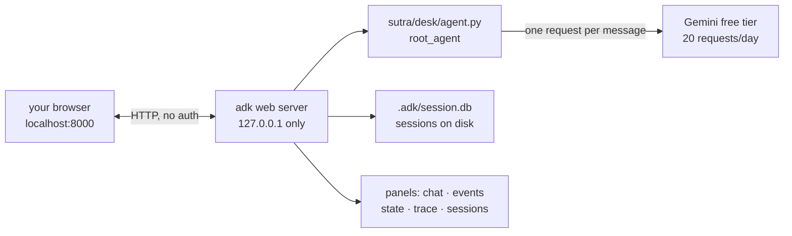

# 5.1 — The glass engine: `adk web`

## One-line answer

`adk web sutra/desk` serves a local developer UI that shows you a turn's **events, state and timings**
instead of just its answer — which turns "it feels wrong" into "event three shows this", and that is
the only kind of bug report worth making.

---

## The story

You go to the doctor because your shoulder hurts.

You describe it as well as you can. It hurts when you lift things. It is worse in the morning. It
started maybe a month ago, or maybe longer, you did not really notice at first. The doctor listens,
presses a few places, asks whether it hurts *here* or *here*. All of this is real information and none
of it is direct.

Then they send you for an X-ray, and the conversation changes completely. Now there is a picture. The
argument about whether it is muscle or bone is over, because you can both look at the same thing. The
doctor stops asking you to describe the inside of your shoulder — a thing you were never in a position
to know — and starts reading it.

Notice what the X-ray did not do. It did not fix anything, it did not make the doctor better at their
job, and it did not tell you what to do next. What it did was replace a description with an
observation, and every conversation after it is a different kind of conversation.

---

## The idea in plain language

So far, everything you know about Sutra's behaviour has come from reading its answers. That is the
patient describing the shoulder. It works, up to a point, and the point is close.

`adk web` is a command that starts a small web server on your own machine and serves a developer
interface for the agents in a folder. You open it in a browser, chat to the agent, and — this is the
part that matters — **look at the machinery of each turn** rather than only its output.

What it gives you, from the page at adk.dev/runtime/web-interface/ (checked 2026-08-26):

| Panel | What you see | What you had before |
| --- | --- | --- |
| Chat | "Send messages to your agents and view responses in real-time" | your `print()` in `run_once.py` |
| **Events** | "Inspect all events generated during agent execution" | the `[event]` lines from Day 5's `say()` |
| **State** | "View and modify session state during development" | nothing — [4.1](../04-state-templating/4.1-the-instruction-is-a-template.md) had to build a session by hand |
| Trace | per-event timings | nothing |
| Sessions | "Create and switch between sessions" | a new process per conversation |

Two of those rows change what you can do today rather than merely making it prettier.

**State is editable.** You spent [section 4](../04-state-templating/4.1-the-instruction-is-a-template.md)
rendering templates against session state you constructed in a script. The State panel lets you set a
key on a live session and send the next message, so you can watch `{focus?}` fill in without writing
any code at all. That is the fastest available way to feel what session state does before Day 17
formalises it.

**Events are the request, not just the reply.** Clicking into an event shows what was sent, which
means the instruction you have been rendering by hand in
[3.1](../03-the-instruction-fields/3.1-where-your-instruction-lands.md) is visible in the UI too — for
a *real* turn, with real state, instead of a hand-built context. [Part 5.2](5.2-reading-a-turns-anatomy.md)
is about reading it.

One boundary, stated plainly because the docs state it plainly: this is a **development tool**. "ADK
Web is *not meant for use in production deployments*. You should use ADK Web for development and
debugging purposes only" (same page, same date). Sutra's real API surface arrives on Day 85.
[Part 5.3](5.3-an-unauthenticated-server.md) is about why that warning is stronger than it sounds.

And one warning that is not about safety at all. **The UI makes model calls feel free, and they are
not.** Every message you type is a request against the same 20-per-day free tier
(`docs/PACKAGES.md`, 2026-08-25). A terminal makes you type a command and think; a chat box invites
you to keep talking. The discipline for today: **one message, then go and read its events.** Reading
costs nothing.

---

## Why Sutra needs it

**Day 7** is events in earnest — the 2.x event model, and two of the four 1.x→2.x traps live there.
Reading events in a UI first, where they are laid out and clickable, makes reading them in code the
next day a matter of naming what you have already seen.

**Day 17** is session state, and the State panel is where it stops being abstract.

**Days 79 to 83** are evaluation, and ADK's evaluation tooling is reachable from this same interface.
The probes you ran by hand in [2.2](../02-testing-a-persona/2.2-the-three-probes.md) will eventually be
run from here.

The reason for today specifically is Principle 12: **everything is a trace; if it is not observable,
it did not happen.** From today on, "the agent seems to be ignoring the tone rule" is not a bug report
in this project. "The rendered instruction in event 2 has the tone section, and the reply is six
sentences" is.

---

## The mechanism

Day 5 parked this command; today you run it. The path matters, and
[Day 5, part 7.1](../../../day-05-first-adk-agent/parts/07-the-dev-ui/7.1-adk-run-and-adk-web.md)
explains why `adk run` refuses the same path that `adk web` accepts.

```bash
uv run adk web sutra/desk
```

**Line by line:**

- `uv run` — the project's environment, so the pinned `google-adk` 2.7.1 is the one that serves. A bare
  `adk` might resolve to a different install and give you a different UI.
- `adk web` — starts a FastAPI server. Its own help text describes the argument as "The directory of
  agents (where each subdirectory is a single agent containing `agent.py`, `__init__.py`, or
  `root_agent.yaml`) or a path pointing directly to a single agent folder."
- `sutra/desk` — **the path is not optional in this repository**, and that is a decision from Day 5. A
  bare `adk web` treats every subdirectory of the root as an agent candidate, so `docs`, `legacy` and
  `tests` appear in the dropdown. Discovery answers "what could be an agent?"; only a path answers
  "what is one?"
- It prints a URL. The default port is **8000** (read from the CLI's own `--port` default in
  `google-adk` 2.7.1 on 2026-08-26), and the default host is **127.0.0.1** — which is
  [5.3](5.3-an-unauthenticated-server.md)'s subject and is the most important default in the whole
  command.
- Leave it running. It is an instrument for the rest of the day, and restarting it costs you the
  sessions you have accumulated.

If port 8000 is taken, or you want to know what else the command will do to your working directory:

```bash
uv run adk web --port 8080 sutra/desk
uv run adk web --help | head -20
```

**Line by line:**

- `--port 8080` — the usual escape when something else already owns 8000. Nothing else changes.
- `--help | head -20` — worth running once, today, for a reason beyond the flags: the first paragraph
  of that help is the security notice quoted in [5.3](5.3-an-unauthenticated-server.md), and reading it
  off your own terminal lands differently from reading it here.
- Two flags are worth knowing now because they are easy to confuse. `--reload/--no-reload` controls
  **server** auto-reload. `--reload_agents` is a separate flag that enables "live reload for agents
  changes". They are not the same switch, and assuming the first one reloads your edited handbook is
  the trap in *When it breaks*.

What the command actually stands up:



Then, in the browser: pick `desk` in the agent dropdown, send **one** message, and stop.

```text
A user says: "the app logs me out every hour, started yesterday, about 40 users
affected." Triage it.
```

That is the happy-path probe from [2.2](../02-testing-a-persona/2.2-the-three-probes.md), reused on
purpose — you already know what a passing answer looks like, so your attention is free for the panels
rather than the reply. [Part 5.2](5.2-reading-a-turns-anatomy.md) is what to do with them.

---

## When it breaks

**💥 The edit that the UI kept ignoring.** The most common frustration of the day. You change
`INSTRUCTION`, send another message, and the old persona answers. It is not a caching mystery: the
server imported your module at startup and is still holding it.

```text
INFO:     Uvicorn running on http://127.0.0.1:8000 (Press CTRL+C to quit)
```

That line was printed once, when the process started, and the agent was loaded then. `--reload`
governs the **server**, and `--reload_agents` is the separate flag for picking up agent changes. If
you are unsure which you have, the reliable move is to stop the process and start it again — and the
faster move is not to use the UI for this at all, because
[3.1](../03-the-instruction-fields/3.1-where-your-instruction-lands.md)'s render script answers "did my
edit land?" in one command with no server and no quota.

**💥 The dropdown full of things that are not agents.** Run `adk web` with no path in this repository
and you get candidates called `docs`, `legacy`, `scripts` and `tests`. Pick one and it fails, because
they are directories that happen to exist. This is the same discovery behaviour that makes `adk run
sutra/desk` refuse, described in
[Day 5, part 7.1](../../../day-05-first-adk-agent/parts/07-the-dev-ui/7.1-adk-run-and-adk-web.md):
**adopting a convention rewrites the meaning of files you already have.** Always pass the path.

**💥 The 429 in a chat box.** The failure the UI actively encourages, because typing is cheap:

```text
google.genai.errors.ClientError: 429 RESOURCE_EXHAUSTED. {'error': {'code': 429,
'message': 'You exceeded your current quota, please check your plan and billing
details.', 'status': 'RESOURCE_EXHAUSTED'}}
```

The limit is per **day** on this tier, so waiting will not give the rest of your afternoon back
([Day 2, part 1.5](../../../day-02-llm-mechanics/parts/01-first-contact/1.5-the-only-door-429.md)).
The good news is that everything the UI is *for* — reading events, reading state, reading timings —
works perfectly on the turns you have already spent. **A used-up quota does not stop you inspecting
what you already have**, and inspection is the skill this section is teaching.

---

## In production

**What a professional writes instead** is nothing — this is the tool you use, not the tool you ship.
The real production analogue is a tracing backend receiving the same event stream, where turns are
searchable by user, by error, and by latency across everybody's traffic rather than one conversation
at a time. `adk web` teaches you what to look for; the production system is where you look for it at
scale. The `--trace_to_cloud` and `--otel_to_cloud` flags on this same command are the seam between
the two, and they are Phase 13's subject.

**What degrades at scale is that a single conversation stops being the unit.** The UI answers "what
happened in this turn?" beautifully and cannot answer "what happened in the four percent of turns that
went wrong yesterday?" That second question is the one production asks, and it needs aggregation.
Teams that only ever learn the single-turn view end up debugging production by trying to reproduce
issues in a dev UI, which works for the reproducible half and consumes enormous time on the other half.

**The failure that only shows with real traffic** is that everything here is one user, one session,
one machine. Concurrency bugs, session-store contention, and the cross-user leak that
`USER_ID = "local"` would become behind an HTTP handler
([Day 5, part 4.2](../../../day-05-first-adk-agent/parts/04-the-runner/4.2-sessions-and-the-transcript.md))
are all invisible here by construction. The dev UI is a single-user instrument, and its cleanliness is
partly an artefact of that.

**The review comment a senior engineer leaves:** *"'It behaved oddly in adk web' isn't a bug report —
give me the event. And if you're iterating on the prompt, don't do it through the UI: each message is
a request against a shared quota and you can render the instruction locally for free."*

**The interview question:** *"how do you debug an agent that's behaving strangely?"* The answer that
shows you have done it: "I stop reading the answer and start reading the turn. The framework's dev UI
gives me the events — what was actually sent, what the model returned, what the timings were — so the
first question I settle is whether the request was what I thought it was, which is free and is usually
where the bug is. Then state, because most surprising behaviour on turn six is a state value nobody
expected. I'd also say what the UI isn't: it's a single-user local tool, explicitly not for
production, so it teaches me what to look for but the same events have to go somewhere aggregatable
before any of this works on real traffic."

---

## Check yourself

```bash
uv run adk web sutra/desk
```

Send **one** message. Then, without sending another, find three things in the UI: the events for that
turn, the session's state (empty), and the timing for the model call. Write down where each one lives,
because [5.2](5.2-reading-a-turns-anatomy.md) assumes you can find them.

**Answer out loud, without scrolling up:**

> Name the three panels that show you something you could not see before today, and say which one lets
> you change something rather than only look. Then say why passing the agent path is not optional in
> this repository.

---

**Next:** [5.2 — Reading a turn's anatomy](5.2-reading-a-turns-anatomy.md)
