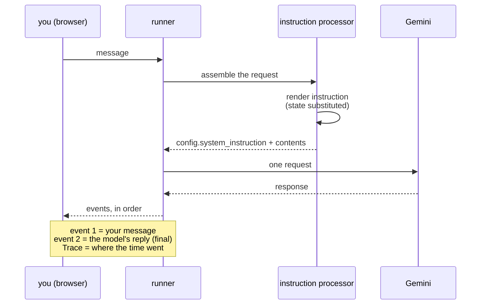

# 5.2 — Reading a turn's anatomy

## One-line answer

A turn in the Events panel answers three questions in order — **what was sent, what came back, and
where the time went** — and settling the first one before theorising about the second is the habit
that separates debugging from guessing.

---

## The story

The electricity bill for the month says ₹4,180 and it is roughly double the last one.

The first reaction is always the same: an argument about the total. Somebody says the meter must be
faulty. Somebody says the rates went up. Somebody blames whoever leaves the geyser on. All of this is
a conversation about one number, and it can go on all evening without anybody learning anything,
because a total does not contain the information anybody is arguing about.

Then somebody turns the page.

There is an itemised section. Units consumed, this month against last. The fixed charge, which did not
move. The slab rates, which did move — and the line showing that consumption crossed into a higher
slab, so the extra units cost more than the earlier ones did. Two lines explain the whole increase.

The bill did not change. The total was always the sum of those lines. But nobody could see the shape
of the problem while looking at the total, and everybody could see it in about ten seconds once the
lines were in front of them.

The useful skill was not arithmetic. It was knowing that the page has a second side.

---

## The idea in plain language

An **event** in ADK is a structured record of one thing that happened during a turn: a user message, a
model response, a tool call, a state change. Day 7 is the day you handle them in code — the 2.x event
model, its field names, and two of the four framework traps. Today you only have to *read* them,
laid out for you in the UI from [5.1](5.1-the-glass-engine.md).

Reading a turn means answering three questions, and **the order is the technique**:

**1. What was sent?** Not what you think you sent. The request carries the rendered
`system_instruction` — the handbook after templating
([4.1](../04-state-templating/4.1-the-instruction-is-a-template.md)), after any append from another
contributor ([3.1](../03-the-instruction-fields/3.1-where-your-instruction-lands.md)) — plus the
conversation so far. Most surprising behaviour is explained here, and this is the cheap question, so
it goes first. **Never form a theory about the model before you have read the request.**

**2. What came back?** The model's response, with the final response event marked as such. Today that
is one block of text. From Day 10 it may be a tool call instead of an answer, and the shape of the
event tells you which — which is why learning to read the reply *as an event* rather than as a string
is worth doing now, while there is only one kind.

**3. Where did the time go?** The Trace view attributes the turn's duration across its steps. Today
the answer is boring and worth seeing anyway: essentially all of it is the model call. Boring baselines
are how you notice interesting ones later, and the day a tool call or a retrieval starts dominating a
turn, you will only recognise it because you once saw what normal looked like.

The thing to take from this part is a habit rather than a fact:

> **Settle "was the request what I thought?" before you say anything about the model.**

That question is free, local, and answers itself in seconds. The alternative — reasoning about why a
model behaved oddly, when the actual cause was an instruction that did not render, an edit that never
loaded, or a state key that was empty — costs an evening and often a few requests you did not have to
spare.

And the discipline this makes possible is the one Principle 12 asks for. From today, a claim about
Sutra's behaviour comes with an event attached. *"It ignored the tone rule"* becomes *"the rendered
instruction in the request has the Tone section, the reply is six sentences, so the rule was present
and not followed"* — which is a completely different investigation from *"the Tone section wasn't in
the request at all"*, and you cannot tell those apart by reading the answer.

---

## Why Sutra needs it

**Day 7** is the direct sequel: the same events, handled in code, with the 2.x field names and the trap
that custom agents **yield** events rather than appending them. Having seen the objects laid out makes
that day about names rather than about concepts.

**Day 10** is when a turn stops being one request. A tool call means model → tool → model, and the
events are the only place that sequence is visible. An engineer who cannot read a turn cannot debug a
tool loop at all.

**Phase 13** industrialises this into real tracing, and **Days 79 to 83** mine transcripts for eval
cases — which is the loop [2.3](../02-testing-a-persona/2.3-when-probes-become-an-evalset.md) said was
the fix for coverage bias. **Real transcripts become probes**, and this is where you learn to read one.

---

## The mechanism

Send one message in the UI from [5.1](5.1-the-glass-engine.md), then work down the turn.

```text
A user says: "the app logs me out every hour, started yesterday, about 40 users
affected." Triage it.
```

Open the **Events** panel. You are looking for three things, in this order:

| Look for | Where | What it settles |
| --- | --- | --- |
| the request's system instruction | click into the model request | is the rendered handbook the one you wrote? |
| the final response event | the event marked as final | what the model actually returned |
| the timing breakdown | the Trace view for the turn | where the turn's duration went |

The first one is the one to linger on, because you have a way to check it that does not involve the
browser at all. You have been rendering the instruction locally since
[3.1](../03-the-instruction-fields/3.1-where-your-instruction-lands.md), and the two should agree:

```bash
uv run python days/day-06-instructions-and-personas/lab/show_instruction.py
```

**Line by line:**

- Run this in a second terminal while the UI is still serving. **The point is the comparison**: the
  script renders against a fresh, empty session, and the UI renders against the live one. Today those
  are identical because Sutra's handbook has no template variables. The moment it has one, they will
  differ, and that difference is exactly what the State panel is for.
- It costs nothing and needs no server, which is why it stays the first thing you reach for even after
  the UI exists. **The UI is better for reading a turn; the script is better for answering "did my edit
  land?"**

Now the part of the anatomy the UI shows and the script cannot: what a turn is made of.



Then open the **State** panel, which is empty, and do the experiment that makes
[section 4](../04-state-templating/4.1-the-instruction-is-a-template.md) real without writing a line of
code:

1. Add `{focus?}` on a line of its own at the end of `INSTRUCTION` in `sutra/desk/agent.py`, restart
   the server, and send a message. The rendered instruction in the event has an empty line where the
   variable was — the soft contract from [4.2](4.2-hard-and-soft-contracts.md), seen in a real request.
2. In the State panel, set `focus` to `Today's triage focus: login issues.` and send another message.
   Now the same line in the request carries the value, and **the instruction changed without the code
   changing.**
3. Take the line out again. It was an experiment, and experiments do not live in `sutra/`
   ([Day 5, §4](../../../day-05-first-adk-agent/LESSON.md)) — or keep it with a comment saying why, but
   make that a decision rather than a leftover.

That is two requests, and it is the best two requests of the day: you have watched a template
variable go from empty to filled by a value you typed into a panel, which is the entire mechanism of
Day 17 shown ahead of time.

---

## When it breaks

**💥 The turn with no final response.** You send a message and the chat shows nothing, or shows an
error, while the Events panel has entries in it. The reply text lives on the event marked final, and
if no event is final there is nothing to display. Day 5's `say()` guarded against exactly this:

```python
answer = "(no final response)"
```

That pre-bound default exists so a run producing no final event returns a readable string instead of
raising `UnboundLocalError`
([Day 5, part 4.1](../../../day-05-first-adk-agent/parts/04-the-runner/4.1-the-runner-is-your-run-loop.md)).
Seeing the same situation in the UI is what makes that defensive line make sense: **an empty answer is
a turn that happened, not a turn that did not.**

**💥 The instruction in the event that is not the one in your file.** The finding that saves the most
time, and it looks like a contradiction until you know the causes. The request shows the old handbook
while your editor shows the new one. Three usual reasons, in order of likelihood: the server is holding
the module it imported at startup ([5.1](5.1-the-glass-engine.md)); you edited `sutra/agent.py`
instead of `sutra/desk/agent.py`; or a `static_instruction` moved your text out of the system slot
entirely and it is sitting in `contents` where you were not looking
([3.3](../03-the-instruction-fields/3.3-the-static-instruction-that-moves-yours.md)). **All three are
visible in the event, and none is visible in the reply.**

**💥 The render that failed, so there is no turn at all.** Add a hard `{focus}` with no state and the
Events panel does not show a failed model call. It shows **nothing for that turn**, because the failure
happened while assembling the request:

```text
KeyError: 'Context variable not found: `focus`.'
```

That error appears in the terminal running `adk web`, not in the browser. It is worth causing on
purpose once, because the mental model it installs is durable: **a turn that fails before the request
is built leaves no events, and the place to look is the server's own output.** Day 7 will make this
precise.

---

## In production

**What a professional writes instead** is the same three questions asked of a stored trace rather than
a live UI, keyed by a request id that appears in the user-facing error message. When somebody reports
"it gave me a wrong answer at 3pm", the reply is not "can you reproduce it" — it is a lookup. The
`invocation_id` you have been passing as the constant `"probe"` in every lab script since
[3.1](../03-the-instruction-fields/3.1-where-your-instruction-lands.md) is the real system's version of
that key, and it exists precisely so every event of one turn can be found together.

**What degrades at scale is that reading turns is a per-turn skill and production has too many.** The
technique here does not stop working, it stops being sufficient: you need aggregation to *find* the
turn worth reading, and then this skill to read it. Teams that invest only in dashboards can tell you
that four percent of turns are bad and not why; teams that invest only in trace-reading can explain
any single turn and cannot find the four percent. Both halves are needed, and this is the half that
has to come first, because you cannot decide what to aggregate until you know what a turn contains.

**The failure that only shows with real traffic** is that the rendered instruction is per-user once it
is a template. The system prompt you inspect in your own session is not the system prompt a customer
got, because their state was different. Any debugging process that assumes one prompt is wrong from the
day the first variable is added, and the correction is to log or store the **rendered** instruction per
turn — redacted, because it now contains that customer's state
([3.1](../03-the-instruction-fields/3.1-where-your-instruction-lands.md)'s production section).

**The review comment a senior engineer leaves:** *"You've described what the model did. Paste the
request. Half the time the instruction didn't render the way you think, and that's a five-second check
that would change what we're both looking at."*

**The interview question:** *"an agent gave a wrong answer in production. Walk me through your first ten
minutes."* The answer that shows you have done it: "Find the turn, then read it in a fixed order. First,
what was actually sent — the rendered system prompt for that specific user, because once the prompt is
templated it's per-user and the one I see locally isn't theirs, plus the conversation as it stood.
That's where most of these end, because the request wasn't what anyone assumed. Second, what came back
and in what shape — a tool call, a final response, an empty turn. Third, the timings, mostly to spot
the case where something upstream timed out and the model was working from less than it should have
had. The reason for that order is cost: the first question is free and local, and reasoning about model
behaviour before settling it is how people lose an afternoon."

---

## Check yourself

Run the two-request experiment above: add `{focus?}` on its own line, look at the rendered instruction
in the event, then set `focus` in the State panel and look again.

```bash
uv run python days/day-06-instructions-and-personas/lab/show_instruction.py
```

Run this alongside it and compare the two renderings. They should differ in exactly one line, and you
should be able to say why — the script has a fresh session with no state, the UI has the session you
just edited.

**Answer out loud, without scrolling up:**

> Give the three questions a turn answers, in order, and say why the first one comes first. Then say
> what you would see in the Events panel for a turn whose instruction failed to render.

---

**Next:** [5.3 — An unauthenticated server on your machine](5.3-an-unauthenticated-server.md)
