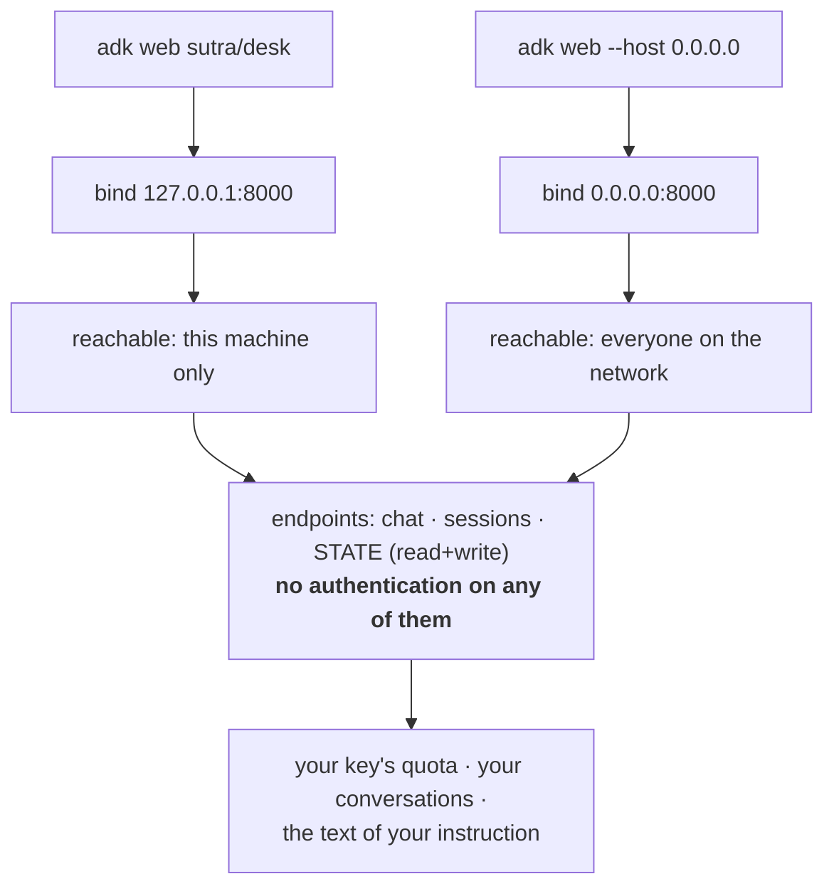

# 5.3 — An unauthenticated server on your machine

## One-line answer

`adk web` starts a server with **no login on any of its endpoints**, and the only thing standing
between that and everyone on your network is a default host of `127.0.0.1` — one flag away from being
gone.

---

## The story

You are expecting a delivery, and you are in the shower.

So you put the door on the latch. It is a completely ordinary thing to do. The delivery person can
push it open, leave the parcel inside, and you do not have to run out dripping. It solves a real
problem and it will be fine, because it will be five minutes.

The parcel arrives. You take it. And then the day happens — a phone call, lunch, somebody asking about
something — and at nine in the evening you notice the door has been on the latch since morning.

Nothing happened. Almost certainly nothing was ever going to happen. But think about what the latch
actually was: it was not a door that opens for the delivery person. It was a door that opens for
**anybody**, and it stayed that way for eleven hours, and at no point during those eleven hours did
anything tell you.

That is the shape of the risk. Not that the convenience was wrong — it was a sensible thing to do for
five minutes. It is that a temporary opening has no built-in expiry, and nothing in the house makes a
sound when it has been left.

---

## The idea in plain language

Principle 13 says **blast radius before capability**: every new power arrives with its containment
story. Yesterday's power was an agent that runs. Today's is a server, and this is its containment
story.

Read what `adk web` says about itself, in the help text it prints on your own machine (`google-adk`
2.7.1, read 2026-08-26):

> This server is intended for local development. Its endpoints are unauthenticated, so run it on a
> trusted network only and do not expose it to untrusted or public networks.

And the docs page, more bluntly (adk.dev/runtime/web-interface/, checked 2026-08-26):

> ADK Web is **not meant for use in production deployments**. You should use ADK Web for development
> and debugging purposes only.

Take "unauthenticated" literally, because it is meant literally. There is no login. There is no token.
Anyone who can reach the port can do everything the UI can do — and the UI can chat with your agent,
create sessions, read them, and **modify session state**. So reaching the port means:

- **spending your quota.** Every message is a request on your key. Twenty per day, gone.
- **reading your conversations.** Sessions are listed and readable, including whatever a real ticket
  paste contained.
- **editing session state**, which — after [section 4](../04-state-templating/4.1-the-instruction-is-a-template.md)
  — you now know means editing the text of the instruction itself. A `{tier}` in the handbook is a
  value someone can set from outside your process. **The State panel is a prompt-editing interface
  with a friendly name.**

The only thing preventing all of that is the default host, `127.0.0.1`, which means the server accepts
connections **from this machine only**. That default is the containment. It is good, it is on by
default, and it is one flag from being removed:

| Command | Who can reach it |
| --- | --- |
| `adk web sutra/desk` | you, on this machine |
| `adk web --host 0.0.0.0 sutra/desk` | **everyone on the network you are attached to** |

`0.0.0.0` means "all interfaces". On a home network that is your household. On a café or an airport
network it is everyone there. On a cloud instance with a public address it is the internet, and the
port will be found within the day — indiscriminate scanning is constant and automatic, and it does not
need to know your project exists.

There are two entirely legitimate reasons people type that flag: testing the UI from a phone, and
running the server inside a container where `127.0.0.1` would mean the container itself. **Both are
real.** The rule is not "never use it". The rule is:

> **The moment you widen the host, something else has to become the door**: an SSH tunnel, a firewall
> rule, a reverse proxy that asks for a password. `--host 0.0.0.0` on its own is a door on the latch.

One more thing the command does to your working directory, quietly, and it is worth knowing rather
than fearing. `adk web` defaults to `--use_local_storage`, which writes sessions to a SQLite file at
`.adk/session.db` inside the agent folder. That is why `sutra/desk/.adk/session.db` exists after you
have used the UI. **Conversations you have with your agent are now on disk**, and this repository goes
public in Phase 14. Day 0 already handled it — `.gitignore` has carried `.adk/` since before there was
anything to ignore — but the habit worth forming is checking rather than assuming.

---

## Why Sutra needs it

**Day 85** is Sutra behind a real API surface, and that day is entirely about the things this server
does not have: authentication, a user identity that is not the constant `"local"`, and a session store
that is not a file beside the code.

**Days 39 to 45** are the MCP production phase, where Sutra runs servers other things connect to, and
"which interface is it bound to, and who is allowed to speak to it" becomes a standing question rather
than a footnote.

Today's reason is narrower and it is Principle 13 as a habit rather than a slogan: **the first time you
start a server in this project is the moment to look at what it exposes.** A binding you inspect on day
one is a binding you notice on day four hundred, and the failure mode this part describes is not an
attack, it is a flag typed for a good reason and left there.

---

## The mechanism

Check what you have actually started, rather than trusting the default:

```bash
uv run adk web sutra/desk
```

**Line by line:**

- No `--host`, so the default `127.0.0.1` applies — verified from the command's own `--help` output on
  `google-adk` 2.7.1, 2026-08-26, which lists it as `[default: 127.0.0.1]`. **The safe thing here is the
  default, which is the right way round**, and it means the risk in this part only arrives when
  somebody deliberately changes it.
- The startup banner names the address it bound to. Read it every time. It is the one line of output
  that tells you the blast radius of the thing you just started.

Then confirm it from outside the process, because a banner is what the program believes:

```bash
netstat -ano | grep 8000
```

**Line by line:**

- `netstat -ano` — every listening socket, with the owning process id. Works in Git Bash on Windows,
  which is this project's shell; `days/README.md` carries the PowerShell equivalent.
- `grep 8000` — narrows to the port `adk web` used.
- **What you are reading is the local address column.** `127.0.0.1:8000` is bound to loopback only —
  the door is shut. `0.0.0.0:8000` is bound to everything — the door is on the latch. Those two strings
  are the entire finding, and telling them apart is the skill.

And check that today's conversations did not become a public artefact:

```bash
git check-ignore -v sutra/desk/.adk/session.db
git status --short
```

**Line by line:**

- `git check-ignore -v` prints the rule that ignores a path, or nothing at all if the path is **not**
  ignored. Silence here is the alarm. Day 0's `.gitignore` carries `.adk/`, so this should print a rule
  and a line number.
- `git status --short` is the ritual glance from
  [Day 1](../../../day-01-bootstrap-and-map/LESSON.md): nothing you did not intend, and nothing
  containing a conversation.
- Doing both is not paranoia about this specific file. It is the habit that catches the *next* tool
  that writes something into the working directory without telling you, and there will be one.

The two doors, and what sits behind them:



Note where the `no authentication` box sits. **It is the same box for both doors.** Widening the host
does not weaken the authentication, because there was never any; it only changes who arrives at it.

---

## When it breaks

**💥 The flag that was added for a phone and never removed.** The realistic failure, and it produces no
error at all. Somebody wants to check the chat UI from their phone, adds `--host 0.0.0.0`, it works,
and the command goes into a shell history, then into a note, then into a README as "how to run the dev
UI". Six months later it is what everybody types. The output looks like success:

```text
INFO:     Uvicorn running on http://0.0.0.0:8000 (Press CTRL+C to quit)
```

That line is the whole warning, and it looks exactly like the safe one unless you are reading the
address. **Nothing escalates, nothing alerts, and the only signal is four characters in a log line
people have stopped reading.**

**💥 The container that made it necessary and nobody revisited.** Inside a container, `127.0.0.1` means
the container's own loopback, so the port is unreachable from your machine and you get a refused
connection:

```text
curl: (7) Failed to connect to localhost port 8000 after 2 ms: Could not connect to server
```

The fix genuinely is to bind wider, and now the containment has to come from somewhere else — a
published port bound to `127.0.0.1` on the host, or a network the container is not exposed on. **The
flag is correct and incomplete**, and the incomplete half is invisible because the visible half now
works.

**💥 The state panel used as an editor by someone else.** No error text, because nothing failed. If the
port is reachable and your handbook has a `{tier}` in it, another person on that network can set
`tier` and change what your agent is instructed to do, then chat to it. To the agent this is
indistinguishable from you doing it. This is the concrete reason "unauthenticated" is worth reading
twice: the exposure is not only *reading* your work, it is **writing the prompt**, and
[section 4](../04-state-templating/4.1-the-instruction-is-a-template.md) is what made that possible.

---

## In production

**What a professional writes instead** is not this server at all. The production path is an
authenticated API in front of the runner, with a real user identity replacing the `USER_ID = "local"`
constant from
[Day 5, part 4.2](../../../day-05-first-adk-agent/parts/04-the-runner/4.2-sessions-and-the-transcript.md),
a session store that is not a file next to the code, and state that no client can write directly.
`adk web` is a workshop instrument. The mistake to avoid is not "using it" — it is letting it become
the thing a demo runs on, because a demo that works is the strongest possible argument for shipping
what it runs on.

**What degrades at scale is that binding decisions get inherited.** One person's convenience flag
becomes a `Makefile` target, then a container entrypoint, then a Helm chart, and by then nobody
remembers that the value was chosen to test something from a phone. The defence is to write the reason
next to the flag wherever it is committed, so the next person can tell a deliberate choice from a
copied one. **An unexplained `0.0.0.0` in a repository is indistinguishable from a mistake, and it will
be copied by someone who assumes it was considered.**

**The failure that only shows with real traffic** is that a dev server has none of production's
defences and all of its access. No rate limiting, so one person can drain the day's quota. No tenancy,
so every session is visible to whoever reaches the port. No audit, so afterwards there is no record of
who did what. Individually each of those is fine on a laptop for an afternoon; together they are the
reason the docs say "development and debugging purposes only" rather than "prefer not to".

**The review comment a senior engineer leaves:** *"Why `--host 0.0.0.0` in the run script? If it's for
the container, say so in a comment and bind the published port to loopback on the host. If it's not,
take it out — these endpoints have no auth and the state panel can rewrite the prompt."*

**The interview question:** *"what would you check before running a framework's dev server?"* The answer
that shows you have done it: "What it binds to and what it exposes. ADK's dev UI is explicitly
unauthenticated — it says so in its own help text — so the only containment is the default host of
`127.0.0.1`, and one flag removes it. What's behind that door isn't just a chat window: it lists and
reads sessions, and it can write session state, which in ADK is substituted into the system
instruction — so an exposed dev UI is a prompt-editing interface for anyone on the network. I'd also
check what it writes to disk. It defaults to a local SQLite session store inside the agent folder, so
real conversations end up in the working tree, which matters a lot if the repository is going public."

---

## Check yourself

```bash
uv run adk web sutra/desk
netstat -ano | grep 8000
git check-ignore -v sutra/desk/.adk/session.db
```

The second command must show `127.0.0.1:8000` and not `0.0.0.0:8000`. The third must print a rule; if
it prints nothing, stop and fix `.gitignore` before doing anything else — you have conversation
transcripts in a repository that goes public in Phase 14.

**Answer out loud, without scrolling up:**

> What is the only thing containing `adk web`, and what one change removes it? Then say what an
> attacker on the same network could do beyond reading your chats, and name the ADK feature that makes
> that possible.

---

**Next:** [6.1 — 💥 The handbook that promised equipment](../06-failure-lab/6.1-the-handbook-that-promised-equipment.md)
