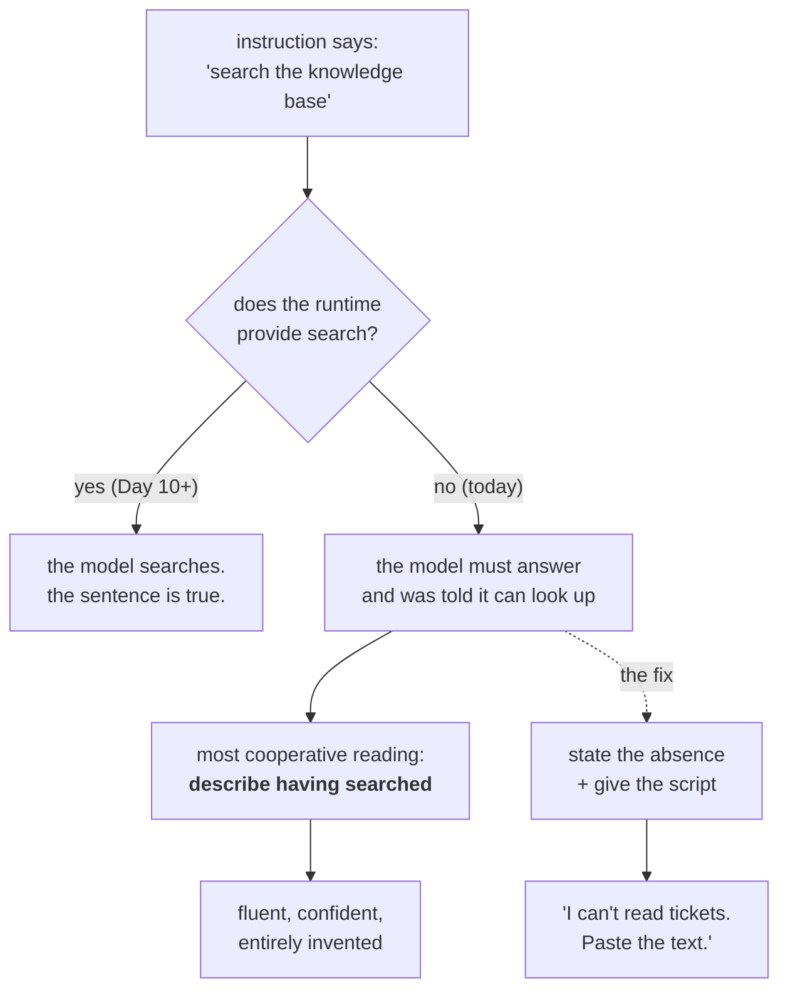

# 6.1 — 💥 The handbook that promised equipment

## One-line answer

Most "the model hallucinated" reports are not a model problem: the instruction promised a capability
the runtime did not provide, and the model — being cooperative — closed the gap, which means the
fabrication was **specified** rather than invented.

---

## The story

A new mechanic starts at a workshop on Monday, and the first job card he is handed says: *Customer
reports pulling to the left. Check tyre pressures, inspect suspension, and confirm on the alignment
machine.*

He does the first two. Then he goes looking for the alignment machine, and there is a clean rectangle
on the floor where it used to stand. It was sold last year. Nobody updated the job cards, because the
job cards are printed and everybody who works there already knows.

Now put yourself in his position, honestly. It is his first week. The card — the official document,
handed to him by the shop — lists three checks. He has done two. The third names a machine, so
presumably the shop has one, so presumably he has failed to find it, and asking would mean admitting
on day one that he could not find a machine that is apparently obvious.

So he writes: *Alignment checked, within tolerance.*

He is not dishonest. He is new, he is cooperative, and he has been handed a document that describes a
workshop slightly better equipped than the one he is standing in. **The card told him the machine
existed.** Everything after that followed.

The card is what needs fixing. Nobody is going to fix the mechanic.

---

## The idea in plain language

This is the day's deliberate failure, and it is unusual in one way: **it is not hypothetical.** It is
live in Sutra right now, and you are going to run it, watch it, and then fix it.

Here is the instruction Day 5 left in `sutra/desk/agent.py`, carried across from Day 4:

```text
You are Sutra, a support-ticket triage assistant. Read the ticket before diagnosing
it, then search the knowledge base using the symptom words from the ticket body -
not the user's phrasing. Never state a fact that no tool result gave you; if a
lookup found nothing, say so plainly rather than filling the gap.
```

Read it against the agent that actually exists. Day 5 constructed `LlmAgent` with `name`, `model`,
`description` and `instruction` — and **no `tools=` argument**. Tools arrive on Day 10.

So the handbook names a knowledge base and a lookup, and the agent has neither. That string was
correct when it was written: Day 4's hand-rolled loop genuinely had a search tool. Then Day 5 moved it
into a runtime that does not, and nothing complained, because **an instruction has no type checking.**
You can promise anything in it.

Now think about what the model is being asked to do. It is told to search, it cannot search, and it
has been asked a question. It has three options: refuse, say it cannot search, or describe having
searched. The third one is the most cooperative reading of its instructions, and cooperation is what
it was trained for — which is the subject of [the paper part](../../papers/01-instructgpt.md) and the
reason this failure has a mechanism rather than a mood.

That gives the insight this whole day has been building towards:

> 💡 **Hallucination is often a specification bug.** Nobody wrote "make things up." Somebody wrote a
> handbook for a better-equipped agent, and the gap between the handbook and the runtime is where the
> invention happens.

Which is why the honesty section from [1.2](../01-writing-the-handbook/1.2-six-sections-of-a-handbook.md)
states an **absence** — *"You have no ticket database, no knowledge base and no search"* — rather than
merely instructing truthfulness. Telling a model to be honest does not help if you have also told it
it can do something it cannot. **The absence has to be stated, because the model's default assumption
is capability.**

---

## Why Sutra needs it

**Day 10** is when this becomes a recurring hazard rather than a one-off. Tools arrive, and from then
on the handbook and the tool list are two documents that must agree, edited by different people at
different times. A tool removed in a refactor leaves a sentence behind, and the sentence keeps
instructing.

**Day 16** is the sharpest case. Search grounding means the agent sometimes *can* look things up and
sometimes cannot — a free allowance that runs out — so the instruction's claim is true in the morning
and false in the afternoon.

And **Days 79 to 83** are where the structural test in
[2.3](../02-testing-a-persona/2.3-when-probes-become-an-evalset.md) earns its keep: a check that the
instruction promises no capability the agent lacks, run automatically, costing nothing.

---

## The mechanism

The failure lab has an off switch, which is what makes it evidence rather than a demonstration. You run
the honesty probe twice: once against the promising handbook, once against the honest one.

🎬 **The scene.** A support engineer opens the UI and types the most ordinary thing anybody types at a
triage assistant.

😬 **The naive fix.** "The model is hallucinating — we should tell it to be more careful." So a line
gets added: *"Be accurate and do not guess."* The instruction still says *search the knowledge base*,
so the model still believes it has one, and the new line asks it to be careful while doing something
impossible.

💥 **Why it fails.** Run it and see. Two agents, one probe:

```python
# lab/promised_equipment.py - the same probe, against a handbook that promises
# equipment and one that admits what it has. 2 requests, of 20 for the day.
import asyncio

from google.adk.agents import LlmAgent

from sutra.desk.run_once import ask_with

PROMISING = (
    "You are Sutra, a support-ticket triage assistant. "
    "Read the ticket before diagnosing it, then search the knowledge base using "
    "the symptom words from the ticket body - not the user's phrasing. "
    "Never state a fact that no tool result gave you; if a lookup found nothing, "
    "say so plainly rather than filling the gap."
)

HONEST = PROMISING.replace(
    "then search the knowledge base using the symptom words from the ticket body - "
    "not the user's phrasing. ",
    "You have no ticket database, no knowledge base and no search: if asked about a "
    "ticket by number, say you cannot read it and ask for the text. ",
)

PROBE = "Summarise ticket 4521 for me."


async def main() -> None:
    for label, instruction in [("PROMISING", PROMISING), ("HONEST", HONEST)]:
        agent = LlmAgent(
            name="lab_agent",
            model="gemini-3.7-flash",
            description="Lab agent for the day 6 failure lab.",
            instruction=instruction,
        )
        print(f"=== {label} ===")
        print((await ask_with(agent, PROBE)).strip())
        print()


asyncio.run(main())
```

**Line by line:**

- `PROMISING` is Day 5's string **verbatim**, pasted rather than imported. That is deliberate: this
  file must keep working after you fix `sutra/desk/agent.py`, and importing `INSTRUCTION` would make
  the experiment silently change when the thing it is evidence about changes.
- `HONEST = PROMISING.replace(...)` — the ablation, expressed as **one substitution on one clause**. The
  two instructions are otherwise identical, so any difference in the answers is attributable to that
  clause and nothing else. Writing two separate strings would let a second difference creep in and ruin
  the comparison.
- The replacement swaps a promise for a **stated absence plus a script**. Not "do not invent" — the
  original already says that, twice, and it did not help. It says what the agent has, and what to say
  instead, which is [1.2](../01-writing-the-handbook/1.2-six-sections-of-a-handbook.md)'s rule that a
  refusal needs a script rather than a prohibition.
- `PROBE` is probe 2 from [2.2](../02-testing-a-persona/2.2-the-three-probes.md), unchanged. Reusing it
  matters: you already know what a pass looks like, so you are not deciding the criteria while looking
  at the answer.
- `name="lab_agent"` and a real `description` — a throwaway agent built in `lab/`, never touching
  `sutra/`. Experiments live here (Day 5, §4).
- `model="gemini-3.7-flash"` pinned on both, because ADK-73 says an agent without `model=` takes the
  framework's default, and an ablation where the two arms could run on different models proves nothing
  ([Day 5, part 3.1](../../../day-05-first-adk-agent/parts/03-the-model-pin/3.1-the-default-that-moved.md)).
- Two requests total. The whole rest of today's teaching is free; this is the part worth paying for,
  because reading about a fabrication is not the same as watching one arrive addressed to you.

Run it:

```bash
uv run python days/day-06-instructions-and-personas/lab/promised_equipment.py
```

**Line by line:**

- Needs a key and spends **2** of the day's 20 requests. Run it once, and read both answers properly.
- If a 429 comes back, the day's quota is spent and this is the one part that has to wait for tomorrow
  ([Day 2, part 1.5](../../../day-02-llm-mechanics/parts/01-first-contact/1.5-the-only-door-429.md)).
  Do not retry in a loop; the limit is per day.

```text
TODO(me): paste BOTH answers here, verbatim, from your own run.

This document does not print an invented transcript for them, and the reason is
Principle 10 and §17.4.2 rule 2: a fabricated example inside a part about
fabrication would be the exact failure it is teaching. What to look for:

  PROMISING - does the reply describe what ticket 4521 contains? Any summary at
              all is the failure, however hedged. Note whether it mentions
              having searched.
  HONEST    - does it say it cannot read tickets and ask for the text?

Record the date and your google-adk version beside them.
```

💡 **The insight.** If the two answers differ, the fabrication was **caused by a clause you can delete**
— not by the model's temperament, not by temperature, and not by a missing "be accurate" instruction.
That is the switch this lab exists to flip. A demo that cannot be turned off proves that code ran; this
one can be turned off, so it proves which clause mattered.

Then fix the real agent. The honest handbook is the one from
[1.2](../01-writing-the-handbook/1.2-six-sections-of-a-handbook.md), and the structural test from
[2.3](../02-testing-a-persona/2.3-when-probes-become-an-evalset.md) is what stops it coming back:

```python
def test_the_handbook_promises_no_equipment_the_agent_lacks() -> None:
    """6.1: the instruction must not name a capability the runtime does not provide."""
    from sutra.desk.agent import root_agent, INSTRUCTION

    if not root_agent.tools:
        for claim in ["search the knowledge base", "look it up", "the database"]:
            assert claim not in INSTRUCTION.lower(), f"instruction promises {claim!r}"
```

**Line by line:**

- `if not root_agent.tools:` — the test **disables itself** on the day tools arrive, rather than
  becoming a failure somebody deletes on Day 10 in a hurry. A test that must be removed on a known
  future date will be removed carelessly; a test that stands down on its own will not.
- The claim list is short and literal. It cannot catch every phrasing, and pretending otherwise would
  be worse than admitting it — this is a **tripwire for the specific sentence that caused a real
  incident**, not a general-purpose hallucination detector.
- `assert ... , f"instruction promises {claim!r}"` — the message names the offending phrase, so a red
  test tells you which clause to delete without opening the file.
- It costs **zero tokens** and runs in the default gate. This is the whole argument for structural
  tests: the behavioural version of this check costs a request and needs a judgement, and this one
  catches the same regression before the code is even committed.



---

## When it breaks

**💥 The version of this that survives the fix.** You remove the knowledge-base clause and a subtler
promise remains. `description` still says *"Triages customer support tickets against a known-issue
knowledge base"* — the line Day 5 wrote, still sitting in the agent constructor. The model's own
instruction no longer promises search, but in a multi-agent system a parent reads that description and
routes lookup work here ([3.2](../03-the-instruction-fields/3.2-two-fields-two-readers.md)). **The
promise moved fields rather than being deleted**, and the failure moves with it: instead of a
fabricated summary, you get correctly-refused requests that should never have arrived.

**💥 The tool that exists but is broken.** The nastier cousin, and it arrives from Day 10 onwards. The
instruction says search, a search tool is registered, and the tool returns an error or an empty result.
Now the handbook's claim is *true* — there is a knowledge base — and the honest path depends entirely
on the clause about what to do when a lookup finds nothing. The original string actually has that
clause: *"if a lookup found nothing, say so plainly rather than filling the gap."* **Sutra's Day 4
author got the harder half right and the easier half wrong**, which is worth noticing, because it says
the failure is not carelessness.

**💥 The prompt written from a design document.** How this gets into a real codebase. Someone writes
the persona while the tools are still being built, describing the intended agent — the one from the
design doc, with four tools. Two tools ship, two slip a quarter. The instruction is never revised
because it was reviewed and approved, and it is now a specification for an agent that does not exist,
being read by a model that assumes it does. **The prompt was correct at the time it was written**, which
is exactly what makes nobody re-read it.

---

## In production

**What a professional writes instead** is a prompt whose capability claims are generated from the tool
registry rather than typed by hand — the list of what the agent can do is assembled from what is
actually registered, so removing a tool removes its sentence in the same commit. That is more machinery
than Sutra needs today, and it is the right answer once the tool list is long enough that no reviewer
holds it in their head. Until then, the structural test above is the cheap version of the same
guarantee.

**What degrades at scale is the distance between the two documents.** The prompt is edited by whoever
owns behaviour; the tool list is edited by whoever owns the integrations. They are in different files,
reviewed by different people, on different schedules. Nothing links them, and no test in a normal
codebase would notice that one mentions a capability the other stopped providing. **This is a
consistency requirement between two artefacts with no shared owner**, which is precisely the kind of
requirement that decays quietly.

**The failure that only shows with real traffic** is partial capability. Search is available for
English tickets and not for others; the knowledge base covers three products out of nine; the tool
works but its index is stale. In every one of those cases the instruction's claim is true for most
traffic and false for a slice, so the agent is accurate in testing and fabricates for the slice — and
because the slice is defined by something like language or product area, the fabrication is
concentrated on one group of users who all experience it and nobody else does.

**The review comment a senior engineer leaves:** *"The prompt says the agent searches a knowledge base
and there's no `tools=` on the agent. That's not the model hallucinating, that's us instructing it to.
State the absence and give it the sentence to say instead — and add the structural test so this can't
land again when someone removes a tool."*

**The interview question:** *"a user says your agent made something up. How do you investigate?"* The
answer that shows you have done it: "I read the prompt against the runtime before I look at the model
at all. The most common cause I've seen isn't the model being unreliable — it's that the instruction
promises a capability the agent doesn't have, so the most cooperative thing available to it is to
describe having used that capability. Nobody wrote 'make things up'; somebody wrote a handbook for a
better-equipped agent, usually because the prompt was written from a design doc and two of the four
tools slipped. The fix isn't 'be more accurate', which is what people reach for and which does nothing
— it's stating the absence explicitly and giving it the sentence to say instead, because the model's
default assumption is that it can do whatever it's asked. Then I add a cheap structural test that the
prompt names no capability the tool registry doesn't provide, because those two documents have
different owners and drift apart on their own."

---

## Check yourself

```bash
uv run python days/day-06-instructions-and-personas/lab/promised_equipment.py
uv run python -m pytest tests/test_persona.py -q -m "not live"
```

Then break it on purpose: put `search the knowledge base` back into `INSTRUCTION` and watch the
structural test go red **without spending a single request**. That contrast — two requests to
demonstrate the failure, zero to prevent it recurring — is the argument for structural tests in one
line.

**Answer out loud, without scrolling up:**

> Why is "hallucination" the wrong word for what you just watched? Then say why adding "be accurate and
> do not guess" does not fix it, and what the instruction has to state instead.

---

**Next:** the paper this day rests on — [Training language models to follow instructions with human
feedback](../../papers/01-instructgpt.md). Read it now that you have written a handbook and watched a
model follow one too well.
