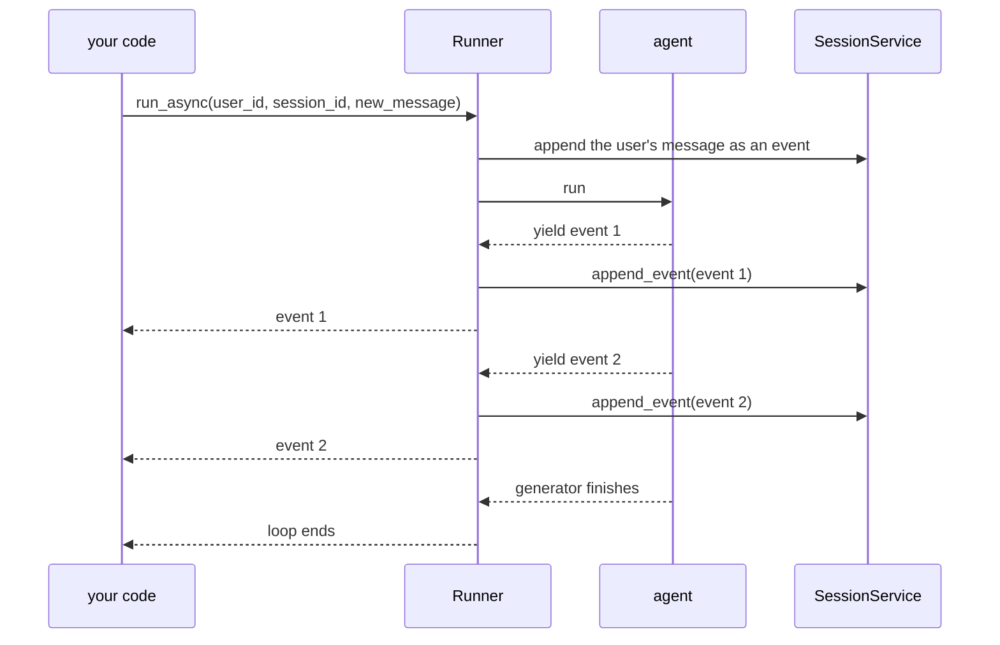

# 1.1 — An event is a line in a ledger, not a message

## One-line answer

An ADK **event** is one append-only record of something that happened during a run — a message, a
tool call, a state change or an error — and an agent's whole behaviour is the ordered list of them,
which is why you read events instead of reading a return value.

---

## The story

Before internet banking, a bank gave you a small book. You took it to the counter, the clerk put it
into a machine, and the machine printed one line for every thing that had happened to your money
since the last time you came.

Each line had a date, a short description, an amount, and the balance afterwards.

Two things about that book are worth stopping on, because everyone who has held one already knows
them and nobody ever says them out loud.

The first: **nothing is ever rubbed out.** If the clerk put two thousand rupees into the wrong
account on Tuesday, Wednesday does not show a corrected Tuesday. Wednesday shows a *new line* taking
the two thousand back out. The book only grows downwards. You can always see that the mistake
happened, and you can always see that somebody fixed it.

The second: **the balance is not really stored.** It is printed at the end of each line, but it is
not a fact of its own. It is just what you get if you add up every line above it. Lose the balance
column and you could rebuild it with a pencil. Lose the lines and the balance means nothing, because
you have no way to tell whether it is right.

Now think about what you actually wanted from the bank. You wanted to know how much money you have.
What they gave you was the *history*, and the amount fell out of it. That is a deliberate trade. It
costs more paper. In exchange, every question you might ask later — when did that come in, who took
that out, why is this month different — has an answer sitting in the book, and nobody had to plan
for those questions in advance.

Yesterday you asked an agent a question and got a string back. Today you find out that the string
was the balance, and there was a book underneath it the whole time.

---

## The idea in plain language

On [Day 5, part 4.1](../../../day-05-first-adk-agent/parts/04-the-runner/4.1-the-runner-is-your-run-loop.md)
you wrote this line and moved on:

> `async for event in runner.run_async(...)`

That line is the whole subject of today. `run_async` is not a function that returns an answer. It is
an **asynchronous generator**: a function that hands you one item at a time, pausing in between,
until it has no more to give. Each item it hands you is an **`Event`**.

An `Event` is a **record of one thing that happened**, made at the moment it happened, and never
edited afterwards. While answering a single question, an agent produces several of them:

- the model said some text;
- the model asked for a tool to be run;
- the tool came back with a result;
- some stored value changed;
- something failed.

Each of those is one event. The runner takes each one as the agent produces it, does whatever the
event asks for, saves it, and passes it on to you.

Two words that get used all day, defined here:

- A **run**, which ADK also calls an **invocation**, is everything that happens between one user
  message and the agent being finished with it. One question in, one run. Day 8 gives the run its own
  part.
- The **session** is the book: the ordered list of every event so far in this conversation, plus a
  small dictionary of stored values. You met it on
  [Day 5, part 4.2](../../../day-05-first-adk-agent/parts/04-the-runner/4.2-sessions-and-the-transcript.md)
  as "the transcript". Day 8 opens it properly.

So the shape is: a run produces events, and the session accumulates them.

**Why a list of records instead of a return value?** For exactly the passbook's two reasons.

*Nothing is rubbed out*, so the sequence can be audited. When an agent gives a strange answer late at
night, you do not need to have predicted that and added logging beforehand. The evidence is already
there, because the evidence *is* how the thing runs.

*The result falls out of the history*, so anything that can read events can work out what it needs.
The dev UI reads them and draws a conversation. Day 22's logger will read them and write lines. Day
84's tracing will read them and draw a timeline. None of those three had to be designed into the
agent, because none of them is asking the agent for anything. They are reading the book.

There is a third reason that only matters later. Because an event is produced the moment the thing
happens rather than at the end, whoever is reading can act on it immediately. That is what makes
streaming possible at all, and it is [section 2](../02-the-stream/2.1-the-number-read-out-loud.md).

**What an event is not:** it is not a chat message. One turn of conversation is usually several
events, and most of them are things you would never show a user. Treating "event" and "message" as
the same word is the mistake that makes the rest of this day confusing.

---

## Why Sutra needs it

Everything downstream of today reads events, so an event you cannot read is a system you cannot
operate.

**Day 13** adds callbacks that fire before and after each model and tool call. What they fire around
is the production of these events.

**Day 22** builds Sutra's structured logging, and a log line is written from an event. If you cannot
say what fields an event has, you cannot say what a log line should contain.

**Day 84** wires OpenTelemetry through the whole system. A trace span is almost exactly an event with
a start and an end time, so the mapping is short — because the shapes already match.

**Day 60 onwards** leans on the append-only property hardest. A run that was killed halfway can be
resumed because the events up to the kill are still on disk and still true. That only works because
nothing ever edited them.

And immediately: today's build brief asks you to write `sutra/desk/events.py`, one function that
turns an event into a single readable line. Every later day that debugs anything will use it.

---

## The mechanism

An event is a Pydantic model — a Python class that declares its fields and checks them. You can build
one by hand with no agent, no runner and no network, which is the cheapest possible way to learn its
shape:

```python
# lab/first_event.py - an event, made by hand, costing nothing.
from google.adk.events import Event
from google.genai import types

spoken = Event(
    author="sutra_desk",
    invocation_id="run-1",
    content=types.Content(
        role="model",
        parts=[types.Part(text="Ticket 4521 looks like a session bug.")],
    ),
)

print("author       :", spoken.author)
print("invocation_id:", spoken.invocation_id)
print("id           :", spoken.id)
print("timestamp    :", spoken.timestamp)
print("partial      :", spoken.partial)
print("is_final     :", spoken.is_final_response())
print("text         :", spoken.content.parts[0].text)
```

**Line by line:**

- `from google.adk.events import Event` — the public import path. The class is really defined in
  `google.adk.events.event`, so import from the package and not the module: a file move inside ADK
  then cannot break you.
- `author="sutra_desk"` — **who appended this line**, not who it is addressed to. It is either the
  literal string `"user"` or the `name` you gave your agent on
  [Day 5, part 2.2](../../../day-05-first-adk-agent/parts/02-the-agent-object/2.2-name-and-description.md).
  That is the first time `name` has been load-bearing rather than decorative: once more than one
  agent is running, it is the only thing telling you which of them said what.
- `invocation_id="run-1"` — **which run this line belongs to.** One user question produces many
  events sharing one `invocation_id`, so grouping by it is how you separate "this turn" from "the
  whole conversation". ADK's own source says it "should be non-empty before appending to a session",
  which is why you set it when building one by hand.
- `content=types.Content(role="model", parts=[...])` — the payload, and it is the *same*
  `google.genai.types.Content` you assembled by hand on
  [Day 4, part 2.1](../../../day-04-tools-by-hand/parts/02-the-round-trip/2.1-two-channels-not-one.md).
  ADK did not invent a message type. `role` is `"user"` or `"model"`; `parts` is a list because one
  turn can carry text and a tool call at the same time.
- `spoken.id` — printed, never assigned. An event mints its own unique id when it is constructed, so
  two events are never confused even when their contents are identical. ADK's source carries the
  comment *"Do not assign the ID."*
- `spoken.timestamp` — a `float`, seconds since the epoch, also filled in at construction. Not a
  `datetime`: a number survives being written to JSON and read back on another machine without a
  timezone argument coming into it.
- `spoken.partial` — `None`, not `False`. Three-valued on purpose, and part 2.2 is where the
  difference bites. `None` means "this was never a streaming chunk"; `False` means "this is the
  finished version of something that was streamed".
- `spoken.is_final_response()` — a **method**, not a field. It answers "is this the thing you would
  show a user as the answer?", and [1.3](1.3-is-final-response-is-not-the-last-one.md) is entirely
  about how badly its name reads.

Run it, and one line of the book is on your screen:

```text
author       : sutra_desk
invocation_id: run-1
id           : de4356f6-019c-4a85-ac66-7ce9b6a52ecb
timestamp    : 1787767520.3535328
partial      : None
is_final     : True
text         : Ticket 4521 looks like a session bug.
```

Now where events come from and where they go. Read the diagram as the passbook: the agent is the
clerk making entries, the runner is the machine that stamps and files them, and the session is the
book.



The important detail there is the **order**: the runner saves each event *before* handing it to you,
and the agent does not continue until the runner has finished with it. That ordering is not an
implementation accident. It is a promise, and
[3.1](../03-the-yield-contract/3.1-one-paper-at-a-time.md) is about what it buys you.

---

## When it breaks

**💥 Reading `event.content.parts[0].text` on an event that has no text.**

Not every event carries a message. A tool-call event carries a `function_call` instead, a
state-change event may carry nothing at all, and both of those land in the middle of your loop the
moment Day 10 adds a tool.

```text
Traceback (most recent call last):
  File "lab/first_event.py", line 12, in <module>
    print(event.content.parts[0].text)
          ^^^^^^^^^^^^^^^^^^^^
AttributeError: 'NoneType' object has no attribute 'parts'
```

`content` is declared `Optional[types.Content]` — the type is telling you it can be `None`, and the
day you add a tool is the day it is. The smallest fix is to ask before you read, and to write the
guard once instead of at every call site:

```python
def text_of(event: Event) -> str | None:
    """The event's text, or None when it carries something that is not text."""
    if not event.content or not event.content.parts:
        return None
    return "".join(part.text or "" for part in event.content.parts)
```

**Line by line:**

- `if not event.content` — catches `None` and also an empty `Content`, which is why it is written
  `not event.content` rather than `event.content is None`.
- `not event.content.parts` — a `Content` can exist with `parts=None`. Two separate ways to be empty,
  so two checks.
- `"".join(...)` over **all** the parts rather than `parts[0]` — taking the first part is the bug
  that silently hides half an answer, and it stays invisible until a model returns two text parts,
  which it does as soon as reasoning output is switched on.
- `part.text or ""` — a part holding a `function_call` has `text=None`, and `"".join` refuses to join
  `None`. The `or ""` skips it rather than crashing.
- Returning `None` rather than `""` — an event with no text and an event with empty text are
  different things, and collapsing them means you can no longer count how many events actually spoke.

**💥 Treating `is_final_response()` as a field.**

```python
if event.is_final_response:  # no parentheses
    print("final")
```

**Line by line:**

- `event.is_final_response` without `()` evaluates to a **bound method object**, and every object
  that does not define otherwise is truthy. So the condition is always true.
- There is no error, no warning and no traceback. Every event looks final, your loop prints
  everything, and you conclude that streaming is broken.
- `print("final")` therefore runs once per event, which is the symptom you will actually see. Search
  the file for `is_final_response` without a following `(` before debugging anything else.

---

## In production

**What a professional writes instead of the teaching version** is a single reader function, kept in
the product package and imported everywhere, so that "what happened in that run" has exactly one
implementation. Today's build brief asks for `sutra/desk/events.py` for that reason. The version that
survives contact with a real system returns a **structured record** — author, kind, ids, sizes —
rather than a formatted string, because the same record then serialises into a log line on Day 22, a
span attribute on Day 84, and a test assertion today. Formatting last is what lets one function serve
three consumers.

**What degrades at scale** is the assumption that a session's events fit comfortably in memory. They
do here: one conversation, a handful of events. In a support desk that has been running for six
months, one long-lived session can hold thousands, each carrying its full content, and `get_session`
will hand you all of them without complaint. ADK's answer is `GetSessionConfig(num_recent_events=...)`,
which you meet on Day 8 — but the habit that saves you comes earlier than the API: **never write code
that loads a whole session in order to look at the last thing in it.**

**The failure that only shows with real traffic** is ordering under concurrency. A `timestamp` is a
float taken from the machine that made the event. Two events made in the same millisecond can compare
equal, and two processes on two machines can disagree about the time outright. Sorting a merged event
stream by timestamp therefore usually works and occasionally produces a transcript in which the
answer precedes the question. **The list order inside one session is authoritative; the timestamp is
metadata.** Teams learn this by finding one impossible transcript in a support ticket and being
unable to reproduce it.

**The review comment a senior engineer leaves:** *"You're reading `parts[0].text` in four places. Two
of those events can be function calls, so this throws the first time we add a tool. Pull it into one
accessor that returns `None` for non-text events and use it everywhere — including in the tests, so
the tests break when the accessor does."*

**The interview question:** *"why do agent frameworks hand you an event stream instead of just
returning the answer?"* The answer that shows you have used one: "Because the answer is a fold over
the history, and the history is worth more than the answer. If the framework only returned the final
string, then tracing, streaming, resuming after a crash and any UI that shows tool calls would each
have to be bolted on separately, and every one of them would need the agent to cooperate. If it hands
you records as they happen, you get all four without the agent knowing anyone is watching. The cost
is that one turn is now several events and you have to know which ones matter — that is a real cost,
and it's where people get confused first, usually by assuming one event equals one message."

---

## Check yourself

```bash
uv run python days/day-07-events-and-streaming/lab/first_event.py
```

**Answer out loud, without scrolling up:**

> Name the two properties a bank passbook and an ADK event list share, and say what each one buys
> you. Then say why an agent's final answer is *derived* from the events rather than stored anywhere.

---

**Next:** [1.2 — The fields that were renamed](1.2-the-fields-that-were-renamed.md)
