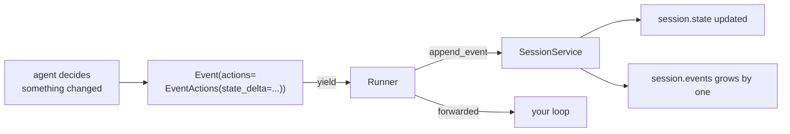

# 1.4 — The half of an event that is not text

## One-line answer

An event's `actions` field carries the things the event **does** rather than the things it says —
change a stored value, hand over to another agent, stop a loop — and the runner, not the agent, is
what carries them out.

---

## The story

Go into a small shop and buy two packets of biscuits. The shopkeeper writes a bill: two items, the
prices, the total. You pay, take the bill, and leave. That is the transaction as you experienced it.

But watch what the shopkeeper does next, when there is no queue. They open a second book — the stock
register — and write "biscuits: −2". Nobody asked them to. It was not printed on your bill. You never
saw it happen and it makes no difference to you at all.

It makes a very large difference to them. At the end of the month, the stock register is what tells
them what to reorder. If they wrote the bill and forgot the register, the shop looks fully stocked on
paper and empty on the shelf, and they find out on the day a customer asks for biscuits and there are
none.

So one action — selling two packets — has two halves. There is the part the customer sees, which is
the bill, and there is the part that changes the shop, which is the register entry. They happen
together, they describe the same event, and only one of them is a piece of paper anybody reads aloud.

An ADK event is exactly this. `content` is the bill. `actions` is the register entry.

---

## The idea in plain language

Part [1.1](1.1-an-event-is-a-line-in-a-ledger.md) said an event is a record of something that
happened. That is true and it is only half the story, because some events do not just *record*
something — they **ask for something to be done**.

The place they ask is `event.actions`, which is an object of its own called `EventActions`. Where
`content` says *"here is what was said"*, `actions` says *"and here is what should change as a
result"*.

The five that matter across this curriculum, in the order you meet them:

| Field | What it asks for | You meet it properly on |
| --- | --- | --- |
| `state_delta` | Store these key/value pairs on the session | Day 17 |
| `artifact_delta` | A file was saved; here is its name and version | Day 18 |
| `transfer_to_agent` | Hand this conversation to that agent | Day 53 |
| `escalate` | Stop the loop this agent is inside | Day 56 |
| `skip_summarization` | Show this tool result as-is; do not ask the model to write it up | Day 13 |

Today's job is not to use them. It is to know they exist, to know **who executes them**, and to have
seen a state change actually travel inside an event rather than being told that it does.

Because that is the part that surprises people. When an agent changes a stored value, the agent does
not write to a database. It puts the change into `actions.state_delta` on the event it is about to
hand over, and then **the runner applies it** — after receiving the event, before letting the agent
continue. The agent asks; the runtime does.

Two consequences fall straight out of that, and both of them are why this design was chosen:

**Every change is attributable.** The change is inside an event, and the event has an `author`, an
`invocation_id` and a `timestamp`. "Who set `ticket_id` to 4521, and during which run?" is a question
you can answer by reading the session, because the answer is stored in the same place as the change.
Compare that with an agent writing directly to a dictionary, where the value is there and the reason
is gone.

**Replaying the events reproduces the state.** Start from an empty dictionary, apply every
`state_delta` in order, and you have the state. That is the passbook property from
[1.1](1.1-an-event-is-a-line-in-a-ledger.md) applied to something other than text, and it is what
makes Phase 9's "kill it mid-run and resume" possible at all.

One term, since it appears in every row above: a **delta** is a *change*, not a *value*. A
`state_delta` of `{"ticket_id": "4521"}` does not mean the state is now only that key. It means that
key now has that value and everything else is untouched. Reading a delta as a whole state is the
mistake that makes people think ADK is deleting their data.

---

## Why Sutra needs it

**Day 17** is the state deep dive — prefixes, scopes, lifetimes — and every one of those mechanisms
travels through `state_delta`. A day about where state lives goes much faster when you already know
how it moves.

**Day 21** is error handling, trap #4, *surface, don't swallow*. The reason a swallowed tool error is
so damaging in ADK specifically is that errors travel as events too, so swallowing one does not just
hide a message — it removes a record from the book, and Day 84's tracing then shows a run where
nothing went wrong.

**Day 53** turns `transfer_to_agent` into Sutra's triage routing. When you saw it on
[Day 6, part 3.2](../../../day-06-instructions-and-personas/parts/03-the-instruction-fields/3.2-two-fields-two-readers.md)
as evidence of a routing decision, it was already this field.

**Day 64** brings human-in-the-loop resumption: a run pauses, waits for a person to approve
something, and continues. It works because a pause is an event, an approval is an event, and the
state that survives between them travelled in a delta.

---

## The mechanism

Build an event that changes something, and watch who applies it. This needs a session service — the
thing that holds the book — but no model, so it costs nothing:

```python
# lab/actions.py - a change travels inside an event, and the runner applies it.
import asyncio

from google.adk.events import Event, EventActions
from google.adk.sessions import InMemorySessionService


async def main() -> None:
    service = InMemorySessionService()
    session = await service.create_session(app_name="sutra", user_id="local")
    print("state at the start :", session.state)

    change = Event(
        author="sutra_desk",
        invocation_id="run-1",
        actions=EventActions(state_delta={"ticket_id": "4521", "priority": "high"}),
    )
    print("the event's content:", change.content)
    print("the event's delta  :", change.actions.state_delta)

    await service.append_event(session, change)
    print("state after append :", session.state)

    later = Event(
        author="sutra_desk",
        invocation_id="run-2",
        actions=EventActions(state_delta={"priority": "urgent"}),
    )
    await service.append_event(session, later)
    print("state after second :", session.state)
    print("events in the book :", len(session.events))


asyncio.run(main())
```

**Line by line:**

- `InMemorySessionService()` — the simplest thing that holds sessions: three nested dictionaries in
  this process. Day 8 is entirely about it and about what "in memory" costs you. Here it is a stand-in
  for the book.
- `await service.create_session(app_name="sutra", user_id="local")` — keyword-only arguments, awaited,
  exactly as [Day 5, part 4.3](../../../day-05-first-adk-agent/parts/04-the-runner/4.3-read-the-signature-not-the-tutorial.md)
  established by reading the signature rather than a tutorial. No `session_id` is passed, so the
  service mints one.
- `change.content` — printed to make the point visible: it is `None`. **This event says nothing.** It
  is a pure instruction, and it is a perfectly ordinary event.
- `EventActions(state_delta={...})` — two keys in one delta, because a delta is a dictionary and one
  event can change several things atomically. That "atomically" is doing work: either the event is
  appended and both changes land, or it is not and neither does.
- `await service.append_event(session, change)` — **this** is the line that applies the delta. Not
  the `Event(...)` constructor. Building the event changed nothing anywhere; handing it to the
  service did. In a real run you never call this yourself — the runner does, which is what the
  diagram in [1.1](1.1-an-event-is-a-line-in-a-ledger.md) showed.
- The second event setting only `priority` — the whole point of the word *delta*. `ticket_id` is
  untouched and survives.
- `len(session.events)` — two, because both events were appended to the book as well as applied.
  **The instruction and the record are the same object**, which is why the state can always be
  rebuilt from the history.

The output:

```text
state at the start : {}
the event's content: None
the event's delta  : {'ticket_id': '4521', 'priority': 'high'}
state after append : {'ticket_id': '4521', 'priority': 'high'}
state after second : {'ticket_id': '4521', 'priority': 'urgent'}
events in the book : 2
```

The route a change takes, drawn out:



Note that the agent has no arrow to `session.state`. It cannot reach it and does not try. **Everything
goes through the event**, which is the design property this part exists to make concrete.

---

## When it breaks

**💥 Setting `session.state` directly.**

The obvious thing to try, and it appears to work:

```python
session = await service.get_session(app_name="sutra", user_id="local", session_id=sid)
session.state["priority"] = "urgent"
```

No error. The dictionary in front of you now has the key. With `InMemorySessionService` you may even
find it is still there next time you look, because the object you mutated is the one being kept.

Then you move to a real store on Day 86 and the value is gone, every time, silently — because a
database-backed service persists what arrives through `append_event` and nothing else. adk.dev's own
state page is blunt about it: changes made that way *"will likely NOT be saved by
DatabaseSessionService or VertexAiSessionService"* (checked 2026-08-26). You also lost the audit
trail: no author, no invocation, no timestamp, no line in the book.

**💥 Expecting a delta to be a replacement.**

```text
state after second : {'ticket_id': '4521', 'priority': 'urgent'}
```

People send `{"priority": "urgent"}` intending "the state is now just this", and are then confused
that `ticket_id` is still there. It is a delta. If you want a key gone, the mechanism is not an empty
delta — it is a delta that sets the key to a value meaning absent, and *deciding what that value is*
is a design question Day 17 makes you answer.

**💥 Putting something unserialisable in a delta.**

State is written out as JSON, so it holds strings, numbers, booleans, and lists or dictionaries of
those. Put a function or a class instance in and ADK will not crash — it warns and stores a string
version of the object:

```text
WARNING:google_adk.google.adk.events.event_actions:Failed to serialize `state_delta`; some
values are not JSON-serializable (e.g. callables) and will be replaced with a string
representation in the persisted event.
```

Which is worse than crashing, in the specific sense that matters at 11pm: the run continues, the
state contains something that looks like your object, and the failure surfaces days later as a
`TypeError` in code that read it back expecting the real thing.

---

## In production

**What a professional writes instead of the teaching version** is: nothing. In real ADK code you very
rarely construct an `EventActions` by hand — you set state through the context object a tool or
callback is handed, and the framework packs it into the delta for you. Building one directly, as this
part does, is a teaching device and a testing device. The reason to know the mechanism anyway is that
**every bug in this area is a bug about the delta**, and you cannot debug a layer you have never
seen.

**What degrades at scale** is delta size. A delta is written into the event, and the event is stored
forever. Put a 200 KB search result into state on every turn and you have not built a cache, you have
built a session that grows by 200 KB a turn and a `get_session` call that gets slower every day. The
rule teams converge on is that **state holds identifiers and decisions, not payloads** — the ticket
id, not the ticket; the chosen route, not the document that justified it. Day 18's artifacts exist
for the payloads.

**The failure that only shows with real traffic** is two agents writing the same key in one run. In a
sequential workflow this is fine and last-writer-wins is what you wanted. In a parallel one — Phase 8
— two branches can both set `priority`, both events get appended, and the value you end up with
depends on which branch finished first. Nothing errors, the state is valid, and the answer is
non-deterministic in a way that only appears under load, because at low load one branch is reliably
faster. This is why Phase 8 spends a day on branches rather than treating them as an optimisation.

**The review comment a senior engineer leaves:** *"You're mutating `session.state` after
`get_session`. That works in memory and silently drops on the database service, and it also means
there's no event saying who changed it. Put the change in the event, or use the tool context so the
framework does. And this delta has the whole API response in it — put the response in an artifact and
keep the id."*

**The interview question:** *"how does an agent change state, and why is it done that way rather than
just writing to a store?"* The answer that shows you have operated one: "The change travels inside
the event as a delta, and the runtime applies it when the event is committed. Two things fall out of
that. Every change is attributable, because it's carried by an event that has an author, a run id and
a timestamp — so 'who set this and when' is a query, not an investigation. And the state is
reconstructible by replaying the deltas, which is what makes resuming a killed run possible. The cost
is that you can't just assign to the dictionary; if you do, it works in memory and vanishes on a real
store, which is a genuinely nasty way to learn the rule."

---

## Check yourself

```bash
uv run python days/day-07-events-and-streaming/lab/actions.py
```

Then add a third event that sets `priority` to `None` and look at what the state holds afterwards.
Write down whether that is what you wanted "delete the key" to mean.

**Answer out loud, without scrolling up:**

> An agent decides a ticket's priority is now urgent. Trace the change from the agent to the stored
> session, naming each object it passes through and saying which one actually applies it. Then say
> what two things you lose by assigning to `session.state` directly.

---

**Next:** [1.5 — Which run, which agent, which branch](1.5-which-run-which-agent-which-branch.md)
