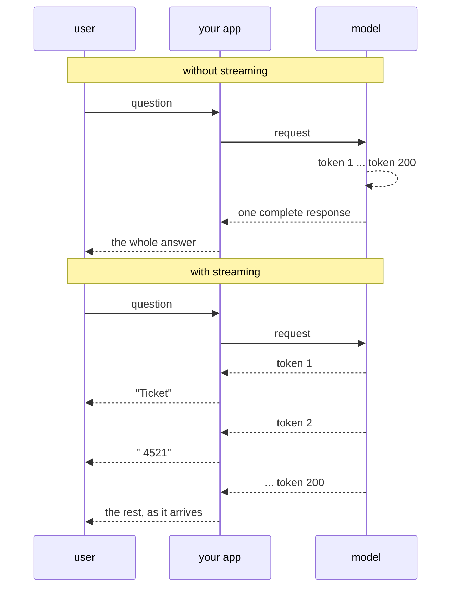

# 2.1 — The number read out loud

## One-line answer

Streaming exists because a model produces its answer **one token at a time anyway**, so the choice is
only whether you are shown the pieces as they appear or made to wait for the last one — and that
choice changes how long the answer *feels*, never how long it *takes*.

---

## The story

Somebody is giving you a phone number over the phone.

The normal way: they say "nine, eight, four, five…" and you write as they speak. By the time they
finish the last digit, you have finished writing it. If they misspeak halfway you catch it there and
say "sorry, again?" — you have lost two digits, not ten.

Now the other way. Imagine they said: "hold on, let me get the whole thing straight first." Silence.
You wait, pen in hand, hearing nothing. Then, after a while, all ten digits in a single fast burst,
and you scramble to keep up.

Two things are worth noticing, and they pull in opposite directions.

The first is that the *total* time is almost identical. They read the digits at the same speed either
way. Nothing about the second version got the number to you faster.

The second is that the two experiences are nothing alike. In the first, you were busy the whole time
and the number arrived without any sense of waiting. In the second, you sat through a silence with no
idea whether it would last two seconds or twenty, and silence with no end in sight is the thing
people actually hate. You would also, in the second version, have found out about the misspoken digit
only at the very end.

Nobody in that scene made the phone faster. Somebody made the *waiting* different. That is streaming,
completely, and the rest of this section is the machinery.

---

## The idea in plain language

On [Day 2, part 4.1](../../../day-02-llm-mechanics/parts/04-sampling-the-dial/4.1-the-probability-list.md)
you learned what a model actually produces: not a sentence, but a score for every possible next
**token** — a chunk of text, usually a fragment of a word, defined in
[Day 2, part 2.1](../../../day-02-llm-mechanics/parts/02-tokens-the-meter/2.1-what-a-token-is.md).
Something picks one from that list, appends it, and the model runs again with the longer text as its
input. That repeats until it stops.

Say the consequence out loud, because it is the foundation of this whole section: **the model already
generates the answer piece by piece.** A two-hundred-token answer is two hundred passes. The first
token is ready long before the last one.

So when the model's server has the first token in hand, it has a choice. It can hold everything and
send one complete response at the end, or it can send each piece down the wire as it is produced.
Both are ordinary HTTP; the second just does not close the connection until it is done.

Two numbers describe the difference, and keeping them apart is most of the skill here:

- **Time to first token** — how long from your request until the first piece of the answer exists. It
  is mostly the model reading your prompt, and it barely depends on how long the answer will be.
- **Total time** — until the last piece. This grows with the length of the answer, because each token
  is another pass.

Streaming does not change either number. It changes **what you are allowed to do in between them.**

Without streaming: the user sees nothing for the whole total time, then everything at once.
With streaming: the user sees something after the time to first token, then a steady trickle.

The total is the same. The felt duration is not remotely the same, and this is not a soft
psychological point — a person watching a blank screen cannot tell "working" from "broken", so they
retry, and a retry is a second request against a quota where you had twenty a day.

Two honest limits, stated now so no later part has to walk them back:

1. **Streaming costs you the ability to check before showing.** A guardrail that reads the whole
   answer and refuses it cannot run on text a user has already seen. Day 68's guardrails and
   streaming are in genuine tension, and the resolution is a design decision, not a setting.
2. **Streaming makes your code harder.** One string becomes many events, some of which are pieces of
   others, and [2.3](2.3-the-board-and-the-printed-sheet.md) is an entire part about the way that
   goes wrong.

So the honest summary is: streaming is a user-experience feature with an engineering cost, and it is
worth it exactly when a human is waiting. Day 73's nightly job has no human waiting and should not
stream. The dev UI has a human waiting and should.

---

## Why Sutra needs it

**Day 74 to 78** is the ambient and live phase, including a voice standup agent. Voice has no
non-streaming option at all: a spoken answer that arrives complete, all at once, at the end, is not a
conversation. Everything about how a partial event behaves is groundwork for that week.

**Day 62 onwards** is where evals meet latency. "Was it fast?" is two questions once you know about
time to first token, and an eval that measures only total time will tell you a streaming change made
no difference — which is true and completely misses the point of having made it.

**Day 24** is token accounting. Streaming complicates it in a specific way you should see coming: the
usage numbers arrive on one particular event, not on the chunks, and code that sums them across
events double-counts.

And today: the dev UI you opened on
[Day 6, part 5.1](../../../day-06-instructions-and-personas/parts/05-the-dev-ui/5.1-the-glass-engine.md)
was streaming at you the whole time. The typewriter effect you watched was these events. Today you
find out what they were.

---

## The mechanism

There is no ADK code in this part on purpose — [2.2](2.2-the-partial-flag.md) has it. What this part
owes you is the shape of the two timelines, so the flag in 2.2 has something to hang on.



The dashed self-arrow in the first half is the silence. The model is doing exactly the same work in
both halves — two hundred passes either way — and the only difference is where the pieces go while it
happens.

You can watch the same asymmetry without a model at all, which is worth doing because it makes the
two numbers concrete rather than theoretical:

```python
# lab/felt_time.py - the same total work, two experiences. No model, no network, no quota.
import sys
import time

PIECES = ["Ticket ", "4521 ", "looks ", "like ", "a ", "session ", "bug."]
PER_PIECE = 0.25
THINKING = 1.0


def batched() -> None:
    """Everything at the end - what a non-streaming call feels like."""
    started = time.perf_counter()
    time.sleep(THINKING + PER_PIECE * len(PIECES))
    print("".join(PIECES))
    print(f"  first output after {time.perf_counter() - started:.2f}s")


def streamed() -> None:
    """Each piece as it is ready - what a streaming call feels like."""
    started = time.perf_counter()
    time.sleep(THINKING)
    first = None
    for piece in PIECES:
        sys.stdout.write(piece)
        sys.stdout.flush()
        first = first if first is not None else time.perf_counter() - started
        time.sleep(PER_PIECE)
    print()
    print(
        f"  first output after {first:.2f}s, all of it after {time.perf_counter() - started:.2f}s"
    )


batched()
streamed()
```

**Line by line:**

- `PIECES` — seven strings standing in for tokens. Seven rather than two hundred so the demonstration
  fits on your screen; the arithmetic is the same.
- `THINKING = 1.0` — a stand-in for the time before the first token exists: the model reading your
  prompt. It is charged in **both** functions, because streaming does not remove it. If this constant
  were only in one of them the demo would be lying.
- `PER_PIECE = 0.25` — the per-token generation cost, also charged in both.
- `time.perf_counter()` rather than `time.time()` — a monotonic clock meant for measuring durations.
  `time.time()` can jump backwards when the machine syncs its clock, which turns a measurement into a
  negative number at the worst moment.
- `batched()` sleeps for the **whole** duration before printing anything — that single `sleep` call
  is the design of a non-streaming API in one line.
- `sys.stdout.write(piece)` with `sys.stdout.flush()` — `print` adds a newline and Python buffers
  output when it is not a terminal, so without the explicit flush the "streaming" version would
  batch itself and prove the opposite of the point.
- `first = first if first is not None else ...` — records the moment of first output once and then
  leaves it alone. Recording it before the loop would be wrong; recording it every iteration would
  overwrite the number you care about.
- `:.2f` on both — two decimal places, because the comparison is between roughly one second and
  roughly three, and more precision than that is noise.

Running it prints something close to:

```text
Ticket 4521 looks like a session bug.
  first output after 2.75s
Ticket 4521 looks like a session bug.
  first output after 1.00s, all of it after 2.75s
```

Identical totals. The first number moved from 2.75 to 1.00, and that number is the one a user
experiences as "did this thing hear me?"

---

## When it breaks

**💥 Claiming streaming made it faster.**

The failure here is not a traceback, it is a sentence in a status update: *"switching to streaming
cut response time by 60%."* It did not. The measurement that produced that claim timed the first
output, and the comparison timed the last one. Total time is unchanged, and somebody will eventually
measure it properly and stop trusting your numbers.

State it the way it is true: *time to first token dropped from 2.75s to 1.00s; total time is
unchanged.* That sentence is both more impressive and defensible, which is usually how honest numbers
go.

**💥 The buffered "stream" that arrives all at once.**

```text
Ticket 4521 looks like a session bug.
  first output after 2.74s, all of it after 2.75s
```

That is `streamed()` with the `flush()` removed, or the same program with its output piped into a
file. Python buffers writes when it is not talking to a terminal, so every piece is held until the
buffer fills or the program ends. Your code streamed perfectly and the user saw a batch. The lesson
generalises well beyond this script: **anything between you and the reader can un-stream you** —
Python's buffer, a reverse proxy that buffers responses, a CDN, a logging layer that collects lines
before writing them.

**💥 Streaming into something that cannot take it.**

An answer written into a file, a database column or a queue message gains nothing from arriving in
pieces, and now has to be reassembled by the code that receives it. This is the shape of a real
mistake: streaming gets enabled globally because it is better for the chat window, and Day 73's
nightly batch job inherits it and grows a reassembly loop it never needed. The flag belongs to the
call, not to the system.

---

## In production

**What a professional writes instead of the teaching version** is two measurements, not one. Every
serious agent service records time to first token and total time separately, per call, and alerts on
them separately, because they fail for different reasons: a slow first token usually means a long
prompt or a cold provider, while a slow total usually means a long answer or a rate-limited lane.
Collapsing them into "latency" throws away the diagnosis.

**What degrades at scale** is the connection, not the model. A streaming response holds a connection
open for the whole generation. One user, irrelevant. Five hundred concurrent users on a server with a
worker-per-connection model, and you run out of workers while almost every one of them is idle,
waiting on a token. This is the single most common way a streaming rollout goes wrong in production,
and it has nothing to do with the model at all — it is why async servers exist and why
`Runner.run_async` is async rather than a convenience.

**The failure that only shows with real traffic** is the disconnect. A user closes the tab halfway
through a streamed answer. The model keeps generating, because nobody told it to stop, and you keep
paying for tokens nobody will read — in quota, here, which is the currency that runs out. Handling
cancellation properly is Phase 9's work, and the reason it is a whole phase is that "stop cleanly"
turns out to involve the tool that is mid-flight and the state that was half-written.

**The review comment a senior engineer leaves:** *"This says streaming made us faster. It didn't —
you've compared first-token time against total time. Report both, and while you're in there: are we
streaming the nightly job too? Nothing is watching it, and all it does is give us a reassembly loop
and a connection held open for an hour."*

**The interview question:** *"why do LLM products stream, and what does it cost you?"* The answer
that shows you have built one: "Because generation is autoregressive — the model produces a token at
a time, so the first one is ready long before the last. Streaming doesn't make the answer faster, it
just stops hiding the pieces, so time-to-first-token drops and total time doesn't move. What it costs
is real: you can't run a guardrail over an answer the user has already seen, your client code has to
handle partial and aggregated events without double-printing, and every streamed response pins a
connection for the whole generation — which is a capacity problem long before it's a model problem."

---

## Check yourself

```bash
uv run python days/day-07-events-and-streaming/lab/felt_time.py
cd days/day-07-events-and-streaming/lab && uv run python felt_time.py > out.txt && cat out.txt
```

The second command is the interesting one: run the same program with its output redirected and look
at what the timings become.

**Answer out loud, without scrolling up:**

> Give the two latency numbers by name, say which one streaming changes, and say which one it does
> not. Then name one thing that can silently un-stream a perfectly correct streaming implementation.

---

**Next:** [2.2 — The `partial` flag](2.2-the-partial-flag.md)
