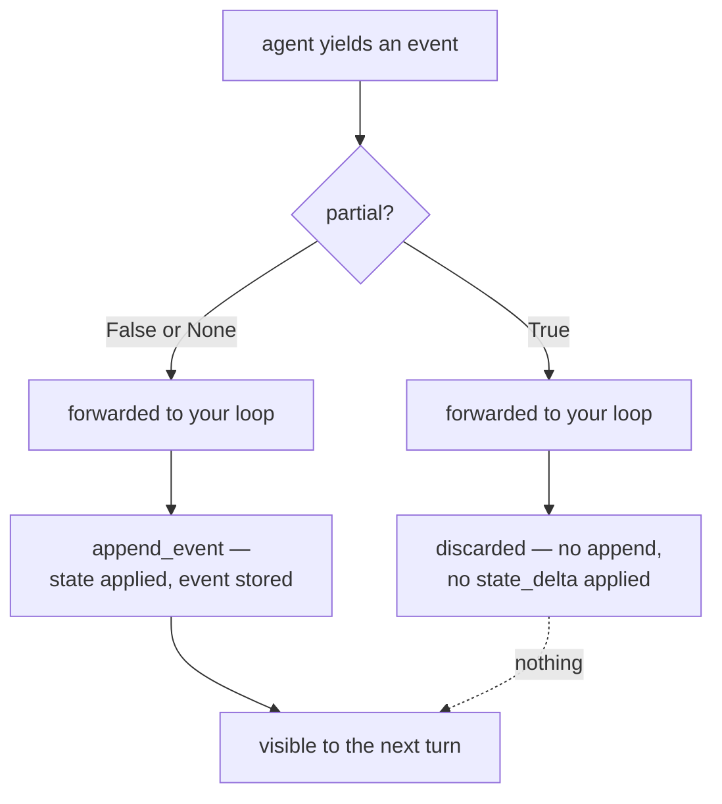

# 2.4 — A partial event changes nothing

## One-line answer

A `partial=True` event is **forwarded to you and then discarded**: it is never appended to the
session and its actions are never applied, which is why the duplicate from
[2.3](2.3-the-board-and-the-printed-sheet.md) exists and cannot simply be removed.

---

## The story

You are in an exam hall. Along with the answer booklet they have given you a rough sheet.

You use it constantly. Long division in the margin, a diagram you redraw three times, a first attempt
at an answer you then decide is wrong. By the end, the rough sheet has more writing on it than the
booklet does, and quite a lot of it is correct.

At the end, you hand in both. The invigilator takes the rough sheet and it goes into a pile that is
thrown away. Nobody reads it. Not one mark in your result came from it.

This is not carelessness, it is the design. The rough sheet exists so you can think in the open. The
booklet exists so the examiner has one clear, finished statement of what you actually claim. If both
were marked you could hedge — write every possible answer on the rough sheet and let the examiner
find the right one — and the booklet would stop meaning anything.

So the rule is worth stating plainly, because it is exactly the rule you are about to meet in code:
**you could see the working, and the working did not count.** The only thing that counted was the
finished thing, written into the place that is kept.

---

## The idea in plain language

Part [1.4](../01-the-event-object/1.4-the-half-that-is-not-text.md) established that an event carries
two things: what was said, and what should change. Part [2.2](2.2-the-partial-flag.md) established
that a streaming run produces chunks marked `partial=True` and then one assembled event marked
`partial=False`.

Put those together and there is an obvious question that nobody asks until it bites: **when a chunk
goes past, does it change anything?**

No. A partial event is handed to your loop and then dropped.

Two independent sources say so. ADK's own event-loop page states it about the actions:

> *"Streaming events: Marked `partial=True`; Runner forwards them upstream immediately but skips
> processing `actions` like `state_delta`."*  (adk.dev/runtime/event-loop/, checked 2026-08-26)

And the base session service says it about the storage, in three lines you can read yourself:

```python
async def append_event(self, session: Session, event: Event) -> Event:
    if event.partial:
        return event
    ...
```

**Line by line:**

- `async def append_event(self, session, event)` — the one method every session service implements,
  and the only route by which anything enters the book. This is the method the runner calls for you.
- `if event.partial: return event` — the whole rule. A partial event is returned unchanged and the
  rest of the method — applying the state delta, appending to `session.events` — never runs.
- `return event` rather than `return None` — the caller gets its event back, so the runner's code
  does not need a special case; it forwards whatever it is given. A small design detail worth
  noticing, because it is why the discarding is invisible from above.

So the shape is: **the chunks are for looking at, the assembled event is for keeping.** Rough sheet
and answer booklet.

And now [2.3](2.3-the-board-and-the-printed-sheet.md)'s duplicate makes sense rather than looking
like an oversight. ADK cannot stop sending the assembled event, because the assembled event is *the
only one that gets committed*. Without it, a streaming run would produce a beautiful typewriter
effect and an empty session, and the next turn of the conversation would have no idea what the agent
had just said. The duplicate is not sloppiness. It is the price of having both a live view and a
durable record, and the choice ADK made was to give you both and let you decide what to display.

Three consequences worth holding on to:

1. **A stream that dies halfway leaves nothing behind.** The connection drops after forty chunks;
   the assembled event never arrives; the session has no record of any of it. From the conversation's
   point of view, the agent said nothing. That is unpleasant and it is *correct* — a half-sentence in
   the transcript would be worse.
2. **You cannot count tokens off the chunks.** Usage metadata rides on the assembled event, and
   summing across partials either double-counts or counts nothing. Day 24's accounting depends on
   knowing this.
3. **A guardrail can inspect the assembled event.** It is the only place the complete text exists as
   one string, which is what makes Day 68's conversation a design problem rather than an impossible
   one.

---

## Why Sutra needs it

**Day 17** is the state deep dive, and this is the rule that stops a very natural piece of code from
working: setting state during a streamed response and expecting it to stick. It sticks only when it
rides on a non-partial event, which is not something you can see by reading your own code.

**Day 24** is token accounting in RPM and RPD. Getting the usage numbers off the wrong event is the
difference between a budget that tracks reality and one that quietly reports zero.

**Day 62 onwards** is evals, which score the answer. The answer they should score is the committed
one, because that is what the next turn of the conversation will see. An eval that reassembles
chunks is scoring the rough sheet.

**Phase 9** is durability: kill it mid-run, watch it resume. Resumption reads the session. Everything
that was only ever partial is not in the session, so it is not in the resumed run either — which is
the property that makes resumption *safe*, since a resumed run cannot inherit half a sentence.

---

## The mechanism

Prove it with no model at all. Two events, one partial, one not, both carrying a state change:

```python
# lab/partial_changes_nothing.py - the rough sheet and the answer booklet, in ten lines.
import asyncio

from google.adk.events import Event, EventActions
from google.adk.sessions import InMemorySessionService
from google.genai import types


def change(text: str, key: str, value: str, *, partial: bool | None = None) -> Event:
    """One event that both says something and asks for a state change."""
    return Event(
        author="sutra_desk",
        invocation_id="run-1",
        partial=partial,
        content=types.Content(role="model", parts=[types.Part(text=text)]),
        actions=EventActions(state_delta={key: value}),
    )


async def main() -> None:
    service = InMemorySessionService()
    session = await service.create_session(app_name="sutra", user_id="local")

    await service.append_event(session, change("Ticket 45", "seen", "chunk", partial=True))
    print("after the chunk    :", len(session.events), "events,", session.state)

    await service.append_event(session, change("Ticket 4521.", "seen", "final", partial=False))
    print("after the aggregate:", len(session.events), "events,", session.state)


asyncio.run(main())
```

**Line by line:**

- `def change(...)` — one helper producing an event that does **both** things, so the discarding can
  be seen in the text and in the state at once. If the helper only carried text you would prove half
  the rule.
- `partial: bool | None = None` — three-valued, matching the field, so the same helper can build all
  three kinds. Defaulting to `None` means the helper produces an ordinary non-streaming event unless
  you say otherwise, which is the behaviour you want from a default.
- `state_delta={key: value}` — the same key in both events, with different values. Using the same key
  is deliberate: if the chunk were applied and then overwritten you would see `"final"` either way
  and learn nothing. Using one key means the *count* of events is what distinguishes the two
  outcomes.
- `await service.append_event(session, ...)` called directly — in a real run the runner does this,
  and this script is standing in for the runner precisely so you can watch one call at a time.
- Printing `len(session.events)` **and** `session.state` on the same line — the two things the
  partial event failed to change, side by side.

The output:

```text
after the chunk    : 0 events, {}
after the aggregate: 1 events, {'seen': 'final'}
```

Zero events and an empty state after the chunk. The event went in, came back out, and left no trace —
which is exactly what the three lines of `append_event` said it would do, now watched rather than
read.

Where the two paths diverge, drawn:



The dotted line is the point of the diagram: there is no path from a partial event to anything the
next turn can see.

---

## When it breaks

**💥 The state that was set and then was not there.**

A tool sets a value during a streamed run, and the next turn cannot find it:

```text
>>> session.state
{}
```

No error, no warning, nothing in the log — an empty dictionary where you expected a key. It happens
when the change rides on an event that was marked partial, and it is genuinely difficult to debug
from the code, because the code that sets the value looks perfectly correct and *is* perfectly
correct. The diagnosis is to print `event.partial` alongside the delta and see which event the change
was travelling on.

**💥 Usage counted off the chunks.**

```python
total = sum(e.usage_metadata.total_token_count for e in events if e.usage_metadata)
```

On a streaming run this either throws, because `usage_metadata` is `None` on the chunks, or returns
something implausible when a provider populates it on every chunk with a running total, in which case
you have summed a cumulative counter and produced a number several times too large. Both failures are
silent as far as the run is concerned; you find out when the budget you built on Day 24 disagrees
with the provider's own dashboard.

**💥 Expecting a dropped stream to leave a partial record.**

The connection dies mid-answer. You go looking in the session for what the agent managed to say, and
the session has nothing:

```text
events in session : 1        # just the user's question
```

This is the correct behaviour and it is still a surprise the first time. If you need a record of
incomplete generations — and for a support desk you probably do, because "the agent was answering and
died" is a thing you want to see — you have to write it yourself, from what your loop received, and
mark it as incomplete so nothing downstream mistakes it for an answer.

---

## In production

**What a professional writes instead of the teaching version** is a consumer that keeps its own
accumulated string *and* knows it is not the record. When a stream ends without an assembled event,
the accumulated text is logged as an incomplete generation, with the run identifier, and is never
written into the session as though it were an answer. That distinction — *I have text, and the system
has no record* — is the thing to get right, and it is one boolean.

**What degrades at scale** is the gap between what users saw and what the system remembers. At low
volume, dropped streams are rare enough that nobody notices they leave no trace. At real volume you
will have users referring to an answer that is genuinely not in the transcript, and support cannot
find it because it was never there. Teams that hit this add the incomplete-generation log entry
afterwards, having spent a week believing they had a session-storage bug.

**The failure that only shows with real traffic** is the interaction between this rule and retries. A
client that reconnects and retries a dropped streamed request produces a second full run. Because the
first left no committed events, the second has no idea it is a repeat — so a tool with a side effect
runs twice. This is why Phase 9 spends real time on idempotency, and the root of it is here: the
partial events that would have told you the first attempt happened were discarded by design.

**The review comment a senior engineer leaves:** *"This sets state inside the streaming path and
assumes it lands. It won't if the delta rides a partial event. And if the stream drops, we currently
write nothing anywhere — add the incomplete-generation log line, because right now a user can quote
an answer at us that doesn't exist in our own transcript."*

**The interview question:** *"in a streaming agent run, what is actually persisted?"* The answer that
shows you have operated one: "Only the non-partial events. The chunks are forwarded to the client and
then dropped — they're not appended to the session and their state deltas aren't applied. That's why
you get the answer twice on a streaming run: the aggregated event is the one that gets committed, so
the framework can't stop sending it. The practical consequences are that a dropped stream leaves no
record at all, so a retry looks like a first attempt, and that token usage has to come off the
aggregated event rather than being summed across chunks."

---

## Check yourself

```bash
uv run python days/day-07-events-and-streaming/lab/partial_changes_nothing.py
```

**Answer out loud, without scrolling up:**

> Say what happens to a `partial=True` event after your loop has seen it, in two respects. Then
> explain, using that answer, why ADK sends the complete text a second time instead of just sending
> the chunks.

---

**Next:** [3.1 — One paper at a time](../03-the-yield-contract/3.1-one-paper-at-a-time.md)
