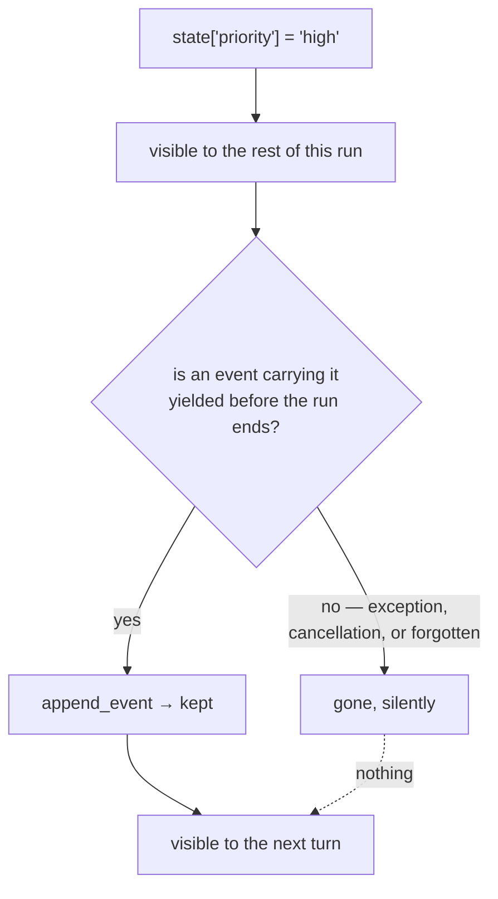

# 3.2 — Saved is not submitted

## One-line answer

Code running later in the same run can **see** a state change before the event carrying it has been
yielded, which is useful on purpose and dangerous by accident: what you can read is not yet what has
been kept.

---

## The story

You are filling in a long application on a website. Twenty fields, four of them requiring a document
number you have to go and find.

Somewhere at the top the page says **Draft saved**, and it keeps saying it, in a reassuring grey, as
you type. You go and find the document numbers, come back, and everything you had typed is still
there. Good. The draft is saved.

At the bottom of the page is a **Submit** button. You have not pressed it.

Now: is your application in? Obviously not, and everybody knows this in the abstract. But the *page*
has been telling you "saved" for twenty minutes, and there is a very real feeling that your work is
safe. It is safe from your browser crashing. It is not in the queue, not given a reference number,
and not visible to a single person on the other side.

The gap between those two things has eaten a lot of afternoons. Somebody fills in everything, closes
the laptop, and finds out a week later that the deadline passed with their application sitting in a
drafts folder, complete and untouched.

What made it dangerous was not that the draft existed. Drafts are good. It was that the word "saved"
was doing two jobs at once — *saved where I can see it* and *saved where it counts* — and only one of
them was true.

An ADK run has exactly that gap, and it is exactly that word.

---

## The idea in plain language

Part [3.1](3.1-one-paper-at-a-time.md) said: the change travels in the event, the runner applies it
at the yield, and the agent resumes afterwards with the change committed.

That is true, and it leaves a window. Between the moment your code writes the change and the moment
the event carrying it is yielded, the change **already exists locally**, in the in-memory session
object your code is holding. So code that runs in that window can read it.

adk.dev's event-loop page states this plainly and calls it a feature:

> *"While commitment happens *after* the yield, code running *later within the same invocation*, but
> *before* the state-changing event is actually yielded and processed, **can often see the local,
> uncommitted changes**."*  (adk.dev/runtime/event-loop/, checked 2026-08-26)

The word for reading a value that has been written but not committed is a **dirty read**. It is
borrowed from databases, where it names exactly the same situation: you can see somebody's
in-progress work, and if their work is rolled back, what you saw never existed.

**Why it is deliberate.** Within one turn, several things run in sequence: a before-model callback, a
tool, an after-tool callback. They frequently need to pass a value between them — a validated ticket
id, a flag saying "this one needs escalation". Forcing each of those to yield an event just to share a
value with the next one would fill the transcript with bookkeeping and slow everything down. Letting
them see each other's uncommitted writes is the sane answer, and it is why `temp:`-prefixed state
exists at all, which Day 17 covers.

**Why it bites.** If the run dies before the event is yielded — an exception in a tool, a cancelled
request, a process that is killed — the change is gone. Not rolled back with a message; simply never
persisted, because the only thing that persists it is `append_event`, and that never ran. Meanwhile
some other piece of code in the same turn read the value, believed it, and acted on it.

So the rule to carry away is short: **a value you can read is not a value that has been kept, until
an event carrying it has been yielded.** In the same run, treat state as a scratchpad. Across turns,
treat it as storage. The line between those two is a yield.

---

## Why Sutra needs it

**Day 17** introduces the `temp:` prefix, whose whole purpose is to make this window explicit:
`temp:` values are visible for the rest of the invocation and are deliberately never persisted. That
design only makes sense once you know the window exists.

**Day 21** is trap #4, *surface, don't swallow*. The two traps meet here. A tool that catches its own
exception and returns a polite string lets the run continue — and everything the failed tool had
written into state is now sitting in the local session, unwritten, being read by the code after it as
though it were real.

**Day 64** is human-in-the-loop approval, where a run genuinely stops and waits. Anything not yielded
before that pause does not survive it. "What is safe across a pause" is this part's question with the
stakes raised.

**Day 70** is the Quota-Router. A router that records "I used Groq for this call" in state and then
hits an exception before yielding has a counter that under-reports, and a quota counter that
under-reports is worse than none, because you trust it.

---

## The mechanism

The window, made visible. One agent, one state write, and a read on each side of the yield:

```python
# lab/dirty_read.py - what you can see before it is kept. No model, no cost.
import asyncio
from collections.abc import AsyncGenerator

from google.adk.agents import BaseAgent
from google.adk.agents.invocation_context import InvocationContext
from google.adk.events import Event, EventActions
from google.adk.runners import Runner
from google.adk.sessions import InMemorySessionService
from google.genai import types


class Writer(BaseAgent):
    """Writes a value into the local session, reads it, yields it, reads it again."""

    async def _run_async_impl(self, ctx: InvocationContext) -> AsyncGenerator[Event, None]:
        ctx.session.state["priority"] = "high"
        print("  before the yield, local read :", ctx.session.state.get("priority"))

        yield Event(
            author=self.name,
            actions=EventActions(state_delta={"priority": "high"}),
        )
        print("  after the yield,  local read :", ctx.session.state.get("priority"))


async def main() -> None:
    service = InMemorySessionService()
    session = await service.create_session(app_name="probe", user_id="u")
    runner = Runner(agent=Writer(name="writer"), app_name="probe", session_service=service)

    message = types.Content(role="user", parts=[types.Part(text="go")])
    async for _ in runner.run_async(user_id="u", session_id=session.id, new_message=message):
        pass

    stored = await service.get_session(app_name="probe", user_id="u", session_id=session.id)
    print("what was actually kept       :", stored.state)


asyncio.run(main())
```

**Line by line:**

- `ctx.session.state["priority"] = "high"` — a direct write to the in-memory session. This is the
  line [1.4](../01-the-event-object/1.4-the-half-that-is-not-text.md) warned about, and it is here on
  purpose: it is the clearest way to create the window, and seeing it work locally is exactly how
  people convince themselves it is fine.
- The `print` immediately after — reads back `"high"`. Nothing has been committed. The dictionary in
  front of you simply has the key, because you put it there.
- `yield Event(actions=EventActions(state_delta={"priority": "high"}))` — the **same value**, now
  travelling properly. Writing it in both places is redundant in this script and deliberate: it lets
  you delete either one and see which deletion changes the last line of output.
- The `print` after the yield — reads back `"high"` again, and this time the value has been through
  `append_event`. The two prints look identical, which is the entire problem this part is about:
  **the read gives you no way to tell which side of the yield you are on.**
- `async for _ in ...: pass` — the loop is drained and the events discarded, because this script cares
  about state rather than content. Draining it rather than breaking out matters, for the reason
  [3.1](3.1-one-paper-at-a-time.md) gave.
- `await service.get_session(...)` at the end — the only honest check. It goes back to the service
  rather than looking at the object the agent had, so what it prints is what a *later turn* would
  see.

The output:

```text
  before the yield, local read : high
  after the yield,  local read : high
what was actually kept       : {'priority': 'high'}
```

Three lines that agree, which is the misleading case, and it is the case you will always be looking
at when everything works. Now delete the `yield` block and run it again:

```text
  before the yield, local read : high
what was actually kept       : {}
```

The local read still says `high`. The store is empty. Nothing errored, nothing warned, and if
anything downstream in that same turn had read `priority`, it would have got `"high"` and been wrong
about the world.



---

## When it breaks

**💥 The value that was there and then was not.**

```text
turn 1 : setting priority = high
turn 2 : priority is None
```

Two turns, one missing value, no error anywhere in between. The write happened, the read in the same
turn confirmed it, and the event carrying it was never yielded — because a tool raised, or a
guardrail returned early, or somebody wrote directly to `session.state` and never built the event at
all. This is the single most confusing bug in this area precisely because the code that sets the
value can be *proved* to have run.

**💥 The rollback that never happens.**

An important non-error to internalise: when a run fails partway, ADK does **not** undo the events it
already committed. Everything yielded before the failure stays. So a failed run does not leave you
with "nothing happened" — it leaves you with a prefix of what should have happened.

```text
stored state : {'ticket_id': '4521'}     # committed before the failure
                                         # 'priority' was written locally and lost
```

That is the right behaviour, and it is not the behaviour people assume. Assuming a transaction is how
you end up with code that reads `ticket_id`, finds it, and concludes that the whole turn succeeded.

**💥 Two agents, one window.**

In a parallel workflow — Phase 8 — two agents run at once, and each has its own view. What one writes
locally is not visible to the other until it is committed, and after it is committed the other one may
already have read the old value and moved on. Nothing errors. The result is simply different
depending on which of them was faster, which under load is not always the same one.

---

## In production

**What a professional writes instead of the teaching version** is code that never writes to
`ctx.session.state` directly. Inside a tool or a callback you set values through the context object
ADK hands you, and it packs them into the delta on the event the framework is going to yield anyway —
so the window still exists, but you cannot forget to close it. The direct write in the script above
is a teaching device, and it is also, precisely, the shape of the bug.

**What degrades at scale** is nothing about performance and everything about reasoning. One agent,
one tool, one turn: the window is a few lines long and you can hold it in your head. A triage graph
with a classifier, a researcher and a writer, each with callbacks: "has this been committed yet"
becomes a question about a diagram, and the honest answer is that most teams stop being able to
reason about it and adopt a rule instead. The rule is: **read state at the start of your step, write
it at the end, and assume nothing between.**

**The failure that only shows with real traffic** is the crash-in-the-window. It needs an exception
at a specific point, which in testing is rare and under real traffic — timeouts, rate limits,
cancelled requests — is routine. The symptom is a small percentage of sessions with inconsistent
state: a ticket marked as triaged with no priority, a conversation that thinks it asked a question it
never sent. Because it is a percentage rather than a reproduction, it gets filed as flakiness for
months.

**The review comment a senior engineer leaves:** *"This writes to `ctx.session.state` and then does a
network call before the event gets yielded. If that call throws, the write is lost and the code after
it has already read the value. Set it through the tool context so it rides an event the framework is
going to yield anyway, and don't put anything that can fail between the write and the yield."*

**The interview question:** *"in an agent runtime, when is a state change actually durable?"* The
answer that shows you have debugged one: "When an event carrying it has been yielded and the runtime
has committed it — not when you assign to it. Before that yield, the value is visible to the rest of
the same run, which is deliberate: it's how a callback passes something to the tool after it without
polluting the transcript. But it's a dirty read, so if the run dies before the yield, the value
silently never existed, while everything downstream in that turn already believed it. There's no
rollback either — a failed run leaves the prefix it already committed. Practically, I write state
through the framework's context object rather than assigning to the session, and I don't put anything
that can throw between a write and the yield that carries it."

---

## Check yourself

```bash
uv run python days/day-07-events-and-streaming/lab/dirty_read.py
```

Then delete the `yield` block, run it again, and read the last line.

**Answer out loud, without scrolling up:**

> Define a dirty read in one sentence, and give one reason ADK allows one on purpose. Then say what
> is left in the session when a run fails halfway, and why "nothing happened" is the wrong assumption.

---

**Next:** [3.3 — Your own emitter](3.3-your-own-emitter.md)
